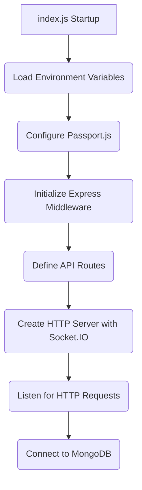
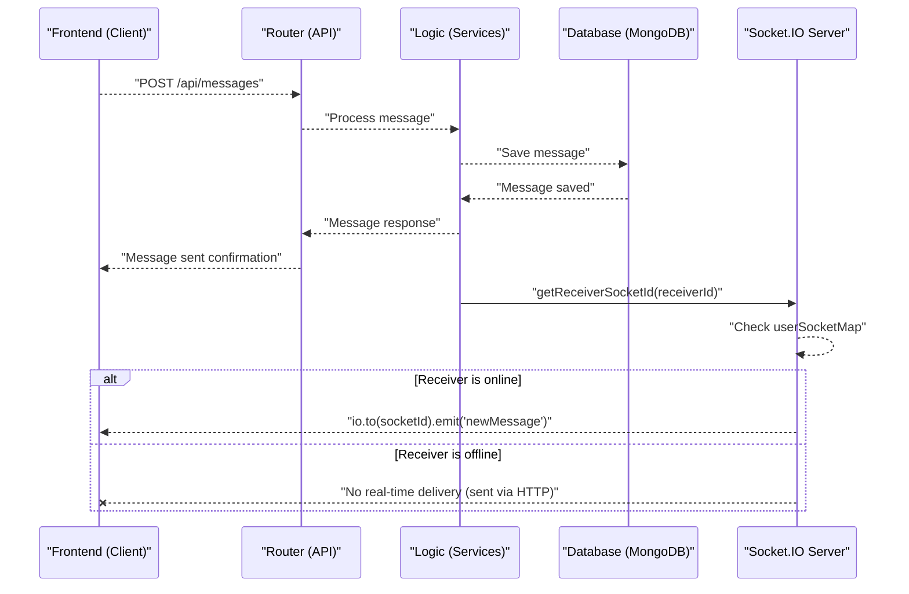

 # Backend Architecture and Services

The backend serves as the core engine for the application, handling all data processing, user authentication, messaging, and real-time communication. Built primarily with Node.js and Express.js, it integrates various services like MongoDB for data persistence, Socket.IO for real-time interactions, and Cloudinary for media storage. This document outlines the architecture, key components, and their interconnections.

## Core Backend Application (`backend/src/index.js`)

The `index.js` file is the entry point for the backend application, orchestrating the setup of the Express server, middleware, routes, and integration with other services. It's responsible for initializing the database connection, configuring authentication strategies, and setting up the real-time communication server.

### Application Setup and Middleware

The application leverages Express.js for routing and various middleware to handle concerns like CORS, request body parsing, cookie management, session handling, and authentication.

```javascript
import express from "express";
import cors from "cors";
import dotenv from "dotenv";
import cookieParser from "cookie-parser";
import session from "express-session";
import passport from "passport";

const app = express();
dotenv.config();

// Configure Passport for authentication
configurePassport();

// Middleware setup
app.use(cookieParser());
app.use(express.json({limit : '2mb'}));
app.use(express.urlencoded({ limit: '2mb', extended: true }));
app.use(cors({
    origin: "http://localhost:5173",
    credentials: true,
}));

// Session and Passport initialization
app.use(session({
    secret: process.env.SESSION_SECRET, 
    resave: false,
    saveUninitialized: false, 
    cookie: {
        secure: process.env.NODE_ENV === "production",
        httpOnly: true,
        maxAge: 7 * 24 * 60 * 60 * 1000 
    }
}));
app.use(passport.initialize());
app.use(passport.session());  
```
[View on GitHub](https://github.com/shinymack/Chat-App-MERN/blob/main/backend/src/index.js#L1-L47)

### API Routing

The backend organizes its functionalities into distinct API routes for authentication, message handling, and friend management. Each route module (`auth.route.js`, `message.route.js`, `friend.route.js`) encapsulates related endpoints.

```javascript
import authRoutes from "./routes/auth.route.js";
import messageRoutes from "./routes/message.route.js";
import friendRoutes from "./routes/friend.route.js";

app.use("/api/auth", authRoutes );
app.use("/api/messages", messageRoutes );
app.use("/api/friends", friendRoutes);
```
[View on GitHub](https://github.com/shinymack/Chat-App-MERN/blob/main/backend/src/index.js#L5-L7)
[View on GitHub](https://github.com/shinymack/Chat-App-MERN/blob/main/backend/src/index.js#L51-L53)

### Server Initialization

The server integrates with the database and Socket.IO for real-time capabilities. It also handles serving the frontend build in production environments.

```javascript
import path from "path";
import { connectDB } from "./lib/db.js";
import { app, server } from "./lib/socket.js";

const __dirname = path.resolve();

const PORT = process.env.PORT;
if(process.env.NODE_ENV === "production"){
    app.use(express.static(path.join(__dirname, "../frontend/dist")));
    
    app.get("*" , (req, res) => {
        res.sendFile(path.join(__dirname,"../frontend", "dist","index.html"));
    })
}

server.listen(PORT, () => {
    console.log("server is running on PORT: " + String(PORT));
    connectDB();
});
```
[View on GitHub](https://github.com/shinymack/Chat-App-MERN/blob/main/backend/src/index.js#L10-L11)
[View on GitHub](https://github.com/shinymack/Chat-App-MERN/blob/main/backend/src/index.js#L56-L70)

## Database Connection (`backend/src/lib/db.js`)

The `db.js` file is solely responsible for establishing a connection to the MongoDB database using Mongoose. This modular approach ensures that database concerns are isolated and easily manageable.

```javascript
import mongoose from "mongoose"

export const connectDB = async () => {
  try {
    const conn = await mongoose.connect(process.env.MONGODB_URI);
    console.log(`MongoDB connected:  ${conn.connection.host}`);
  }
  catch(error){
    console.log("MongoDB connection error: ", error);
  }
}
```
[View on GitHub](https://github.com/shinymack/Chat-App-MERN/blob/main/backend/src/lib/db.js)

## Real-time Communication (`backend/src/lib/socket.js`)

This module sets up and manages the Socket.IO server, enabling real-time functionalities like instant messaging and online user presence. It integrates directly with the main Express application.

### Socket.IO Server Initialization

A Socket.IO server is created, listening on the same HTTP server as the Express application. It's configured to allow connections from the frontend origin.

```javascript
import { Server } from "socket.io";
import http from "http";
import express from "express";

const app = express(); // Note: This `app` instance is passed to http.createServer
const server = http.createServer(app);

const io = new Server(server, {
    cors: {
        origin: ["http://localhost:5173"]
    }
})

// Export app and server to be used in index.js
export { io, app, server };
```
[View on GitHub](https://github.com/shinymack/Chat-App-MERN/blob/main/backend/src/lib/socket.js#L1-L15)

### Online User Management

The `userSocketMap` object stores a mapping of `userId` to `socketId` for all connected users, allowing the server to track who is online and to direct messages to specific users.

```javascript
const userSocketMap = {}; //{userId : socketId}

export function getReceiverSocketId(userId) {
    return userSocketMap[userId];
}

io.on("connection", (socket) => {
    console.log("A user connected", socket.id);

    const userId = socket.handshake.query.userId;
    if(userId) userSocketMap[userId] = socket.id;

    // Emit online users to all clients
    io.emit("getOnlineUsers", Object.keys(userSocketMap));

    socket.on("disconnect", ()=>{
        console.log("A user disconnected", socket.id);
        delete userSocketMap[userId]; 
        io.emit("getOnlineUsers", Object.keys(userSocketMap));
    })
})
```
[View on GitHub](https://github.com/shinymack/Chat-App-MERN/blob/main/backend/src/lib/socket.js#L17-L35)

## Cloudinary Integration (`backend/src/lib/cloudinary.js`)

This module configures the Cloudinary SDK for media upload services. It centralizes the configuration, making it easy to use Cloudinary throughout the backend for image and video storage.

```javascript
import {v2 as cloudinary} from "cloudinary"
import { config } from 'dotenv'

config();

cloudinary.config(
    {cloud_name: process.env.CLOUDINARY_CLOUD_NAME,
    api_key: process.env.CLOUDINARY_API_KEY,
    api_secret: process.env.CLOUDINARY_API_SECRET,}
);

export default cloudinary;
```
[View on GitHub](https://github.com/shinymack/Chat-App-MERN/blob/main/backend/src/lib/cloudinary.js)

## Key Integration Points

The backend architecture is designed for modularity and clear separation of concerns, with several critical integration points facilitating its functionality:

### Backend Initialization Flow

This diagram illustrates the startup sequence of the backend application, showing how various components are initialized and connected.





### Real-time Messaging Flow

The real-time messaging capabilities are powered by Socket.IO, enabling instant updates for online users and message delivery.


