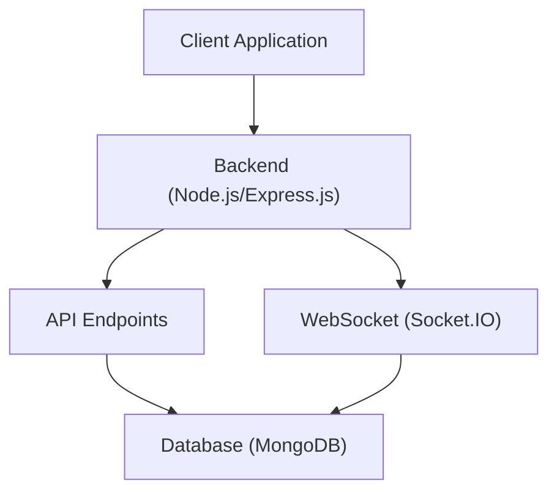

 # Backend Architecture and Services

The backend of this application is built on a Node.js ecosystem, leveraging Express.js for routing and API handling, MongoDB (via Mongoose) for data persistence, and Socket.IO for real-time communication. This section provides a detailed look into its core structure, dependencies, and how different services interact.

## Core Structure and Entry Point

The `backend` directory houses all server-side logic and configurations. The main entry point for the application is `backend/src/index.js`, which initializes the Express app, sets up middleware, defines API routes, and establishes database and WebSocket connections.





## Configuration Files and Dependencies

The `package.json` and `package-lock.json` files are crucial for managing project dependencies and scripts.

### `backend/package.json`

This file defines the project's metadata, scripts, and primary dependencies.

```json
// backend/package.json
{
  "name": "backend",
  "version": "1.0.0",
  "main": "src/index.js",
  "scripts": {
    "dev": "nodemon src/index.js",
    "start": "node src/index.js"
  },
  "author": "",
  "type": "module",
  "license": "ISC",
  "description": "",
  "dependencies": {
    "bcryptjs": "^2.4.3",
    "cloudinary": "^2.5.1",
    "cookie-parser": "^1.4.7",
    "dotenv": "^16.4.7",
    "express": "^4.21.2",
    "express-session": "^1.18.1",
    "jsonwebtoken": "^9.0.2",
    "mongoose": "^8.9.5",
    "passport": "^0.7.0",
    "passport-google-oauth20": "^2.0.0",
    "socket.io": "^4.8.1"
  },
  "devDependencies": {
    "nodemon": "^3.1.9"
  }
}
```

[View on GitHub](https://github.com/shinymack/Chat-App-MERN/blob/main/backend/package.json)

**Key Dependencies**:

*   **`express`**: The core web framework for building RESTful APIs.
*   **`mongoose`**: An ODM (Object Data Modeling) library for MongoDB, simplifying database interactions.
*   **`socket.io`**: Enables real-time, bidirectional, event-based communication between client and server.
*   **`dotenv`**: Loads environment variables from a `.env` file, crucial for sensitive configurations like database URIs and API keys.
*   **`bcryptjs`**: Used for hashing passwords securely.
*   **`jsonwebtoken`**: For implementing JWT-based authentication.
*   **`cookie-parser`**: Parses Cookie header and populates `req.cookies`.
*   **`express-session`**: Middleware for managing user sessions.
*   **`passport`**, **`passport-google-oauth20`**: Authentication middleware, specifically for Google OAuth 2.0.
*   **`cloudinary`**: Integration with Cloudinary for image and video management.

**Development Dependencies**:

*   **`nodemon`**: Automatically restarts the Node.js application when file changes are detected, enhancing the development workflow.

### `backend/package-lock.json`

This file records the exact dependency tree that was generated, ensuring consistent installs across different environments. It is automatically generated and should typically not be manually edited. It contains precise versions and integrity hashes for all packages and their sub-dependencies.

[View on GitHub](https://github.com/shinymack/Chat-App-MERN/blob/main/backend/package-lock.json)

## Main Server Initialization (`backend/src/index.js`)

The `index.js` file is the heart of the backend, orchestrating all incoming requests, routing them to the appropriate handlers, and managing global middleware.

```javascript
// backend/src/index.js
import express from "express";
import cors from "cors";
import authRoutes from "./routes/auth.route.js";
import messageRoutes from "./routes/message.route.js";
import friendRoutes from "./routes/friend.route.js";

import path from "path";

import dotenv from "dotenv";
import cookieParser from "cookie-parser";

import { connectDB } from "./lib/db.js";
import { app, server } from "./lib/socket.js";

import session from "express-session";
import passport from "passport";
import { configurePassport } from "./lib/passport.config.js";

const __dirname = path.resolve();
dotenv.config();

configurePassport();

app.use(cookieParser());
app.use(express.json({limit : '2mb'}));
app.use(express.urlencoded({ limit: '2mb', extended: true }));
app.use(cors({
    origin: "http://localhost:5173",
    credentials: true,
}));

app.use(session({
    secret: process.env.SESSION_SECRET, 
    resave: false,
    saveUninitialized: false, 
    cookie: {
        secure: process.env.NODE_ENV === "production", // true in production (HTTPS)
        httpOnly: true,
        maxAge: 7 * 24 * 60 * 60 * 1000 
        // sameSite: 'lax' // or 'none' if backend and frontend are on different domains in prod
    }
}));

app.use(passport.initialize());
app.use(passport.session());  

app.use("/api/auth", authRoutes );
app.use("/api/messages", messageRoutes );
app.use("/api/friends", friendRoutes);


const PORT = process.env.PORT;
if(process.env.NODE_ENV === "production"){
    app.use(express.static(path.join(__dirname, "../frontend/dist")));
    
    app.get("*" , (req, res) => {
        res.sendFile(path.join(__dirname,"../frontend", "dist","index.html"));
    })
}

server.listen(PORT, () => {
    console.log("server is running on PORT: " + String(PORT));
    connectDB();
});
```
[View on GitHub](https://github.com/shinymack/Chat-App-MERN/blob/main/backend/src/index.js)

**Key Aspects of `index.js`**:

*   **Middleware Setup**:
    *   `cookieParser()`: Parses incoming cookies.
    *   `express.json()` and `express.urlencoded()`: Parse incoming JSON and URL-encoded request bodies, respectively.
    *   `cors()`: Configures Cross-Origin Resource Sharing to allow requests from the frontend application (`http://localhost:5173`). Credentials are allowed.
    *   `express-session` and `passport`: Initialize session management and Passport for user authentication, including Google OAuth 2.0.
*   **Route Handling**:
    *   `authRoutes`: Manages user authentication (login, signup, logout, OAuth).
    *   `messageRoutes`: Handles message-related API calls.
    *   `friendRoutes`: Manages friend-related functionalities (adding, listing friends).
*   **Environment Variables**: `dotenv.config()` loads environment variables, making `process.env.PORT`, `process.env.SESSION_SECRET`, and `process.env.MONGODB_URI` available.
*   **Database Connection**: Calls `connectDB()` from `./lib/db.js` to establish a connection to MongoDB.
*   **Server Listen**: The Express server listens on the `PORT` defined in environment variables.

### Database Connection (`backend/src/lib/db.js`)

The `db.js` file encapsulates the logic for connecting to the MongoDB database using Mongoose.

```javascript
// backend/src/lib/db.js
import mongoose from "mongoose"

export const connectDB = async () => {
  try {
    const conn = await mongoose.connect(process.env.MONGODB_URI);
    console.log(`MongoDB connected:  ${conn.connection.host}`);
  }
  catch(error){
    console.log("MongoDB connection error: ", error);
  }
}
```
[View on GitHub](https://github.com/shinymack/Chat-App-MERN/blob/main/backend/src/lib/db.js)

This module exports an asynchronous function `connectDB` that attempts to connect to the MongoDB database using the `MONGODB_URI` environment variable. It logs a success message including the host if the connection is successful, or an error message if it fails.

## Key Integration Points

### Request Flow and Data Persistence

The backend acts as the central hub for all data interactions. When a client makes an API request (e.g., to `/api/auth/signup`), Express routes it to the corresponding handler. This handler then interacts with the MongoDB database via Mongoose models, using the `connectDB` function to ensure a persistent connection.


```mermaid
sequenceDiagram
    participant C as "Client"
    participant B as "Backend (index.js)"
    participant R as "Router (e.g., auth.route.js)"
    participant M as "Mongoose Model"
    participant D as "MongoDB"

    C->>+B: HTTP Request (e.g., signup)
    B->>R: Route to Handler
    R->>+M: Validate & Prepare Data
    M->>+D: Save/Query Data
    D ->>- M: Data/Success
    M ->>- R: Processed Data
    R ->>- B: API Response
    B->>-C: HTTP Response
```


### Real-time Communication

Socket.IO is integrated into the Express application, allowing for real-time features like instant messaging or online status updates without constant polling. The `socket.js` (not provided in the content but inferred from `import { app, server } from "./lib/socket.js";`) module likely initializes and manages the Socket.IO server, attaching it to the main HTTP server (`server`) that Express also uses.

### Authentication and Session Management

The backend utilizes `express-session` and `passport` for robust authentication. Upon successful login (either local or via Google OAuth), a session is established, and the user's information is stored in the session. Subsequent requests are authenticated using this session, providing a seamless user experience. JWT is used for token-based authentication after the initial session setup, ensuring secure API calls. Environment variables (`SESSION_SECRET`) are critical for securely signing session IDs.

This structured approach allows for a scalable and maintainable backend, clearly separating concerns and leveraging established technologies for efficient development and deployment.