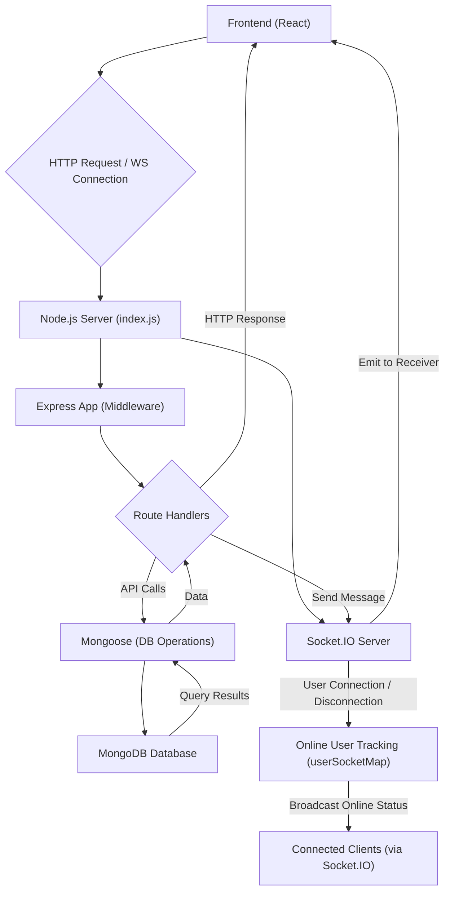

 # Backend Architecture and Services

The backend serves as the robust foundation for the application, handling all data processing, user authentication, real-time communication, and interaction with the database. It is designed with a clear separation of concerns, utilizing Express.js for HTTP routing, Socket.IO for real-time features, and MongoDB (via Mongoose) for data persistence. This document outlines the key components, their interactions, and the overall architectural design.

## Core Technologies and Dependencies

The backend is built primarily with Node.js and a set of carefully selected libraries to ensure scalability, security, and efficiency. Below are the main dependencies as defined in `backend/package.json`:

| Category        | Package             | Description                                          |
| :-------------- | :------------------ | :--------------------------------------------------- |
| **Web Framework** | `express`           | Fast, unopinionated, minimalist web framework.       |
| **Database ORM**  | `mongoose`          | MongoDB object data modeling (ODM) for Node.js.      |
| **Real-time**     | `socket.io`         | Enables real-time, bidirectional, event-based communication. |
| **Authentication**| `bcryptjs`          | Library for hashing passwords.                       |
|                   | `jsonwebtoken`      | Implements JSON Web Tokens for secure authentication. |
|                   | `passport`          | Simple, unobtrusive authentication middleware.       |
|                   | `passport-google-oauth20`| Passport strategy for authenticating with Google using the OAuth 2.0 API. |
| **Middleware**    | `cookie-parser`     | Parse Cookie header and populate `req.cookies`.      |
|                   | `cors`              | Provides Express middleware to enable CORS.          |
|                   | `express-session`   | HTTP session middleware.                             |
| **Utilities**     | `dotenv`            | Loads environment variables from a `.env` file.      |
|                   | `cloudinary`        | Image and video management for cloud storage.        |
| **Development**   | `nodemon`           | Automatically restarts the Node.js application when file changes are detected. |

## Application Entry Point

The `backend/src/index.js` file is the primary entry point for the backend application. It initializes the Express server, sets up middleware, configures routing, establishes the database connection, and starts the real-time Socket.IO server.

```javascript
// backend/src/index.js
// ... (imports and middleware setup) ...

const PORT = process.env.PORT;
if(process.env.NODE_ENV === "production"){
    app.use(express.static(path.join(__dirname, "../frontend/dist")));
    
    app.get("*" , (req, res) => {
        res.sendFile(path.join(__dirname,"../frontend", "dist","index.html"));
    })
}

server.listen(PORT, () => {
    console.log("server is running on PORT: " + String(PORT));
    connectDB();
});
```
[View on GitHub](https://github.com/shinymack/Chat-App-MERN/blob/main/backend/src/index.js#L54-L64)

This snippet demonstrates the server's readiness. It listens on a specified port, logs a message to the console, and crucially, initiates the `connectDB()` function to establish a connection to the MongoDB database. For production environments, it also serves the static frontend assets and handles all other routes by serving the main `index.html` file of the frontend.

## Core Services

### HTTP Server (Express)

The Express.js framework forms the backbone of the HTTP API. It handles incoming requests, applies middleware for various functionalities like CORS, cookie parsing, session management, and authentication, and then routes requests to appropriate handlers.

```javascript
// backend/src/index.js
// ...
app.use(cookieParser());
app.use(express.json({limit : '2mb'}));
app.use(express.urlencoded({ limit: '2mb', extended: true }));
app.use(cors({
    origin: "http://localhost:5173", // Configured for local development
    credentials: true,
}));

app.use(session({
    secret: process.env.SESSION_SECRET, 
    resave: false,
    saveUninitialized: false, 
    cookie: {
        secure: process.env.NODE_ENV === "production", // true in production (HTTPS)
        httpOnly: true,
        maxAge: 7 * 24 * 60 * 60 * 1000 
    }
}));

app.use(passport.initialize());
app.use(passport.session());  

app.use("/api/auth", authRoutes );
app.use("/api/messages", messageRoutes );
app.use("/api/friends", friendRoutes);
// ...
```
[View on GitHub](https://github.com/shinymack/Chat-App-MERN/blob/main/backend/src/index.js#L26-L51)

This section of `index.js` highlights the extensive use of middleware. `cookieParser` helps in managing HTTP cookies, `express.json` and `express.urlencoded` parse request bodies, and `cors` is configured to allow cross-origin requests from the frontend. `express-session` and `passport` are essential for managing user sessions and implementing authentication strategies, including Google OAuth 2.0. The API routes for authentication, messages, and friends are then mounted.

### Real-time Communication (Socket.IO)

Real-time features like instant messaging and online user presence are facilitated by Socket.IO. The `backend/src/lib/socket.js` file sets up the Socket.IO server, integrates it with the Express app, and manages user connections.

```javascript
// backend/src/lib/socket.js
import { Server } from "socket.io";
import http from "http";
import express from "express";

const app = express();
const server = http.createServer(app); // Express app passed to HTTP server
const io = new Server(server, {
    cors: {
        origin: ["http://localhost:5173"] // Allow CORS from frontend
    }
})

export function getReceiverSocketId(userId) {
    return userSocketMap[userId];
}

const userSocketMap = {}; //{userId : socketId}

io.on("connection", (socket) => {
    console.log("A user connected", socket.id);

    const userId = socket.handshake.query.userId;
    if(userId) userSocketMap[userId] = socket.id;

    io.emit("getOnlineUsers", Object.keys(userSocketMap));

    socket.on("disconnect", ()=>{
        console.log("A user disconnected", socket.id);
        delete userSocketMap[userId]; 
        io.emit("getOnlineUsers", Object.keys(userSocketMap));
    })
})

export { io, app, server };
```
[View on GitHub](https://github.com/shinymack/Chat-App-MERN/blob/main/backend/src/lib/socket.js)

This module initializes `socket.io` and wraps the Express `app` within an HTTP server to enable both HTTP and WebSocket connections on the same port. It maintains `userSocketMap` to track online users (mapping `userId` to `socket.id`). Upon connection or disconnection, it broadcasts an updated list of online users to all connected clients. The `getReceiverSocketId` function is crucial for sending private messages to specific users.

### Database Integration (Mongoose)

Data persistence is managed through MongoDB, with Mongoose acting as an Object Data Modeling (ODM) library. The `backend/src/lib/db.js` module handles the connection to the MongoDB database.

```javascript
// backend/src/lib/db.js
import mongoose from "mongoose"

export const connectDB = async () => {
  try {
    const conn = await mongoose.connect(process.env.MONGODB_URI);
    console.log(`MongoDB connected:  ${conn.connection.host}`);
  }
  catch(error){
    console.log("MongoDB connection error: ", error);
  }
}
```
[View on GitHub](https://github.com/shinymack/Chat-App-MERN/blob/main/backend/src/lib/db.js)

The `connectDB` function attempts to establish a connection to MongoDB using the URI provided in environment variables. It logs a success message including the connected host or an error message if the connection fails, ensuring proper feedback on the database status.

## Backend Service Interaction Flow

The following diagram illustrates how different components of the backend interact to handle a typical user request, from connection to real-time updates.





This diagram shows the dual nature of the backend: handling traditional HTTP requests via Express and real-time WebSocket communication via Socket.IO. The database acts as the central data store, accessed by Express route handlers and implicitly by Socket.IO for data related to messages or user status.

## Key Integration Points

1.  **Unified Server Initialization**: Both the Express app and the Socket.IO server share the same HTTP server instance (`server = http.createServer(app)`). This allows them to run on the same port, simplifying deployment and client-side connection logic. This integration is handled in `backend/src/lib/socket.js` but orchestrated by `backend/src/index.js`.
2.  **Authentication and Authorization**: `passport` and `express-session` middleware are central to managing user sessions and authenticating requests. This ensures that only authorized users can access protected API routes and Socket.IO functionalities. Session data, including user information, is typically stored in the MongoDB database, linking `passport` with `mongoose`.
3.  **Real-time Messaging with HTTP API**: When a user sends a message via an HTTP POST request (e.g., to `/api/messages`), the Express route handler saves the message to MongoDB. Crucially, it then uses the `socket.io` instance (via `getReceiverSocketId` from `backend/src/lib/socket.js`) to immediately emit the new message to the intended recipient's connected socket, providing an instant user experience.
4.  **Environment Variable Management**: `dotenv` is used to load environment variables from a `.env` file, isolating sensitive information like `MONGODB_URI`, `SESSION_SECRET`, and API keys (`CLOUDINARY_CLOUD_NAME`, `CLOUDINARY_API_KEY`, `CLOUDINARY_API_SECRET`) from the codebase. This is a critical security and configuration best practice.
5.  **CORS Configuration**: The `cors` middleware is carefully configured to allow requests only from the specified frontend origin (`http://localhost:5173` for development). This enhances security by preventing unauthorized domains from interacting with the backend API, especially important when `credentials: true` is used for cookie-based authentication.

The architecture emphasizes modularity and scalability. By separating concerns into distinct files and services, the backend remains maintainable and adaptable to future feature enhancements or changes in technology stack. The combination of RESTful APIs and real-time WebSockets provides a comprehensive solution for dynamic web applications requiring both traditional data handling and instant communication.