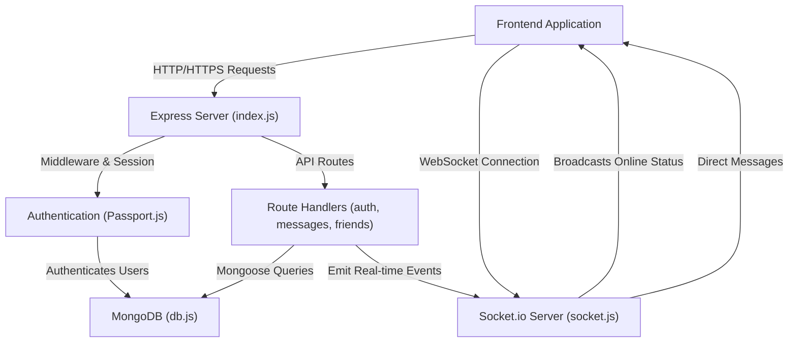
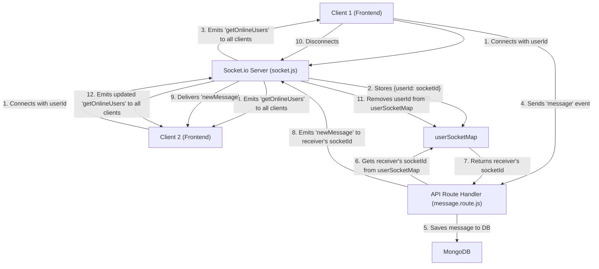

 # Backend Architecture and Services

This document provides a comprehensive overview of the backend architecture, detailing its core services, data management strategies, and real-time communication capabilities. The backend is built using Node.js with Express, leveraging MongoDB for data persistence and Socket.io for real-time interactions.

The primary goal of this architecture is to provide a robust, scalable, and secure foundation for a modern web application, handling API requests, authentication, data storage, and real-time event broadcasting efficiently.

## Core Technologies and Dependencies

The `backend/package.json` file outlines the core technologies and dependencies that power the backend. This setup highlights a robust stack for building a full-featured web application.

```json
// backend/package.json
{
  "name": "backend",
  "version": "1.0.0",
  "main": "src/index.js",
  "scripts": {
    "dev": "nodemon src/index.js",
    "start": "node src/index.js"
  },
  "type": "module",
  "dependencies": {
    "bcryptjs": "^2.4.3",
    "cloudinary": "^2.5.1",
    "cookie-parser": "^1.4.7",
    "dotenv": "^16.4.7",
    "express": "^4.21.2",
    "express-session": "^1.18.1",
    "jsonwebtoken": "^9.0.2",
    "mongoose": "^8.9.5",
    "passport": "^0.7.0",
    "passport-google-oauth20": "^2.0.0",
    "socket.io": "^4.8.1"
  },
  "devDependencies": {
    "nodemon": "^3.1.9"
  }
}
```

[View on GitHub](https://github.com/shinymack/Chat-App-MERN/blob/main/backend/package.json)

Key dependencies include:

*   **Express**: The primary web framework for handling HTTP requests and routing.
*   **Mongoose**: An ODM (Object Data Modeling) library for MongoDB, simplifying database interactions.
*   **Socket.io**: Enables real-time, bidirectional, and event-based communication between the client and server.
*   **Passport.js**: Authentication middleware, specifically configured with `passport-google-oauth20` for Google OAuth and `express-session` for session management.
*   **Bcrypt.js**: For hashing and securing user passwords.
*   **Jsonwebtoken (JWT)**: For token-based authentication, often used in conjunction with `cookie-parser`.
*   **Cloudinary**: For cloud-based image and video management, hinting at media upload capabilities.
*   **Dotenv**: Manages environment variables, keeping sensitive configuration separate from the codebase.

## Main Application Entry Point: `backend/src/index.js`

The `backend/src/index.js` file serves as the heart of the backend application, orchestrating middleware, routing, database connection, and initiating the Socket.io server. It sets up the Express application, configures CORS, session management, and integrates authentication.

```javascript
// backend/src/index.js (snippet)
import express from "express";
import cors from "cors";
import authRoutes from "./routes/auth.route.js";
// ... other imports ...
import { connectDB } from "./lib/db.js";
import { app, server } from "./lib/socket.js";
import session from "express-session";
import passport from "passport";
import { configurePassport } from "./lib/passport.config.js";

// ... dotenv.config() and __dirname setup ...

configurePassport();

app.use(cookieParser());
app.use(express.json({limit : '2mb'}));
app.use(express.urlencoded({ limit: '2mb', extended: true }));
app.use(cors({
    origin: "http://localhost:5173",
    credentials: true,
}));

app.use(session({
    secret: process.env.SESSION_SECRET, 
    resave: false,
    saveUninitialized: false, 
    cookie: {
        secure: process.env.NODE_ENV === "production",
        httpOnly: true,
        maxAge: 7 * 24 * 60 * 60 * 1000 
    }
}));

app.use(passport.initialize());
app.use(passport.session());  

app.use("/api/auth", authRoutes );
app.use("/api/messages", messageRoutes );
app.use("/api/friends", friendRoutes);

const PORT = process.env.PORT;
server.listen(PORT, () => {
    console.log("server is running on PORT: " + String(PORT));
    connectDB();
});
```

[View on GitHub](https://github.com/shinymack/Chat-App-MERN/blob/main/backend/src/index.js)

### Middleware Configuration

The application employs several key middleware:
*   **`cookieParser`**: Parses cookies attached to the client request object.
*   **`express.json`** and **`express.urlencoded`**: Body parsers for incoming JSON and URL-encoded data, with a 2MB limit to prevent large payloads.
*   **`cors`**: Configured to allow requests from `http://localhost:5173` with credentials, essential for frontend-backend communication during development.
*   **`express-session`**: Manages user sessions, using a `SESSION_SECRET` for signing the session ID cookie. Cookies are set to be `httpOnly` and `secure` in production.
*   **`passport.initialize()`** and **`passport.session()`**: Initialize Passport.js for authentication and enable session support for Passport, allowing user sessions to persist across requests.

### API Routing

The application defines distinct API routes for different functionalities:
*   `/api/auth`: Handles user authentication, registration, login, logout, and OAuth flows.
*   `/api/messages`: Manages message-related operations, such as sending, retrieving, and displaying messages.
*   `/api/friends`: Deals with friend management, including adding, removing, and listing friends.

```javascript
// backend/src/index.js (routing snippet)
app.use("/api/auth", authRoutes );
app.use("/api/messages", messageRoutes );
app.use("/api/friends", friendRoutes);
```

[View on GitHub](https://github.com/shinymack/Chat-App-MERN/blob/main/backend/src/index.js#L46-L48)

### Server Initialization

The server listens on a configurable `PORT`. Upon successful startup, it initiates a connection to the MongoDB database. For production environments, it also serves static files from the `frontend/dist` directory, integrating the frontend build directly into the backend server.

```javascript
// backend/src/index.js (server listen snippet)
const PORT = process.env.PORT;
if(process.env.NODE_ENV === "production"){
    app.use(express.static(path.join(__dirname, "../frontend/dist")));
    
    app.get("*" , (req, res) => {
        res.sendFile(path.join(__dirname,"../frontend", "dist","index.html"));
    })
}

server.listen(PORT, () => {
    console.log("server is running on PORT: " + String(PORT));
    connectDB();
});
```

[View on GitHub](https://github.com/shinymack/Chat-App-MERN/blob/main/backend/src/index.js#L51-L60)

## Data Management: `backend/src/lib/db.js`

The `backend/src/lib/db.js` file encapsulates the logic for connecting to the MongoDB database using Mongoose. This modular approach ensures that database connection concerns are separated from the main application logic, promoting cleaner code and easier maintenance.

```javascript
// backend/src/lib/db.js
import mongoose from "mongoose"

export const connectDB = async () => {
  try {
    const conn = await mongoose.connect(process.env.MONGODB_URI);
    console.log(`MongoDB connected:  ${conn.connection.host}`);
  }
  catch(error){
    console.log("MongoDB connection error: ", error);
  }
}
```

[View on GitHub](https://github.com/shinymack/Chat-App-MERN/blob/main/backend/src/lib/db.js)

The `connectDB` function attempts to establish a connection to MongoDB using the URI provided in `process.env.MONGODB_URI`. It logs success or error messages, crucial for monitoring the database status.

## Real-time Communication: `backend/src/lib/socket.js`

The `backend/src/lib/socket.js` file is dedicated to setting up and managing real-time communication using Socket.io. It integrates with the existing Express application to enable WebSocket capabilities, handling user connections, disconnections, and broadcasting online user statuses.

```javascript
// backend/src/lib/socket.js
import { Server } from "socket.io";
import http from "http";
import express from "express";

const app = express();
const server = http.createServer(app);

const io = new Server(server, {
    cors: {
        origin: ["http://localhost:5173"]
    }
});

export function getReceiverSocketId(userId) {
    return userSocketMap[userId];
}

const userSocketMap = {}; //{userId : socketId}

io.on("connection", (socket) => {
    console.log("A user connected", socket.id);

    const userId = socket.handshake.query.userId;
    if(userId) userSocketMap[userId] = socket.id;

    io.emit("getOnlineUsers", Object.keys(userSocketMap));

    socket.on("disconnect", ()=>{
        console.log("A user disconnected", socket.id);
        delete userSocketMap[userId]; 
        io.emit("getOnlineUsers", Object.keys(userSocketMap));
    });
});

export { io, app, server };
```

[View on GitHub](https://github.com/shinymack/Chat-App-MERN/blob/main/backend/src/lib/socket.js)

### Socket.io Server Setup

*   An `http` server is created using the Express `app`, which is then passed to the Socket.io `Server`.
*   CORS is configured for Socket.io to allow connections from the frontend origin (`http://localhost:5173`).

### User Online Status Management

*   **`userSocketMap`**: An object `userSocketMap` is maintained to keep track of online users, mapping `userId` to their respective `socketId`. This is crucial for sending targeted messages to specific users.
*   **`io.on("connection", ...)`**: When a new user connects via WebSocket, their `userId` (obtained from the handshake query) is stored in `userSocketMap`. The server then emits a `"getOnlineUsers"` event to all connected clients, broadcasting the updated list of online users.
*   **`socket.on("disconnect", ...)`**: When a user disconnects, their entry is removed from `userSocketMap`, and the updated list of online users is broadcasted again.
*   **`getReceiverSocketId(userId)`**: This utility function allows other parts of the application (e.g., message routes) to retrieve the `socketId` of a specific user, enabling direct messaging or targeted notifications.

## Backend Architecture Flow

The following diagram illustrates the high-level flow of the backend architecture, showing how different components interact to handle requests, manage data, and facilitate real-time communication.





## Real-time Communication Workflow

This diagram focuses on the workflow of real-time communication for user online status and message delivery, managed by Socket.io.





## Key Integration Points

The backend architecture is designed with several key integration points that ensure seamless operation and efficient data flow:

1.  **Express and Socket.io Coexistence**: The `index.js` file exports the `app` and `server` objects from `socket.js`. This allows the main Express application to handle traditional HTTP requests while simultaneously providing the HTTP server instance for Socket.io to establish WebSocket connections. This is a common and robust pattern for combining RESTful APIs with real-time capabilities.

2.  **Authentication and Session Management**: `passport.js` is deeply integrated with `express-session` to handle user authentication. Once a user logs in, a session is established, and the `userId` is stored in the session. This session information is then available across subsequent requests, allowing protected routes to verify user identity. The `configurePassport()` function ensures that strategies (like Google OAuth) are set up correctly.

3.  **Database Abstraction**: The `connectDB` function in `db.js` centralizes database connection logic. By importing and calling this function once during server startup, the application ensures that the database connection is established and ready before any API routes attempt to interact with MongoDB.

4.  **Real-time User Status**: The `userSocketMap` in `socket.js` is a critical component for real-time features. It acts as an in-memory store for currently online users, allowing the server to quickly determine if a user is online and to which `socketId` messages should be sent. This map is dynamically updated on connection and disconnection events, ensuring accurate online presence information.

5.  **API Route to Socket.io Communication**: API routes (e.g., `message.route.js`) can leverage the `getReceiverSocketId` function from `socket.js` to send real-time notifications or messages directly to a specific user's connected socket. After processing a message (e.g., saving to MongoDB), the route handler can use the `io` instance to emit events, thus bridging the gap between traditional HTTP requests and real-time WebSocket communication. This allows for instant updates without polling.

6.  **Environment Variable Management**: The consistent use of `dotenv` for `process.env` variables (like `MONGODB_URI`, `SESSION_SECRET`, `PORT`) ensures that sensitive information and configurable settings are kept out of the codebase, making the application more secure and easier to deploy across different environments (development, production).

This well-defined structure allows for clear separation of concerns, making the backend modular, maintainable, and scalable for future enhancements.