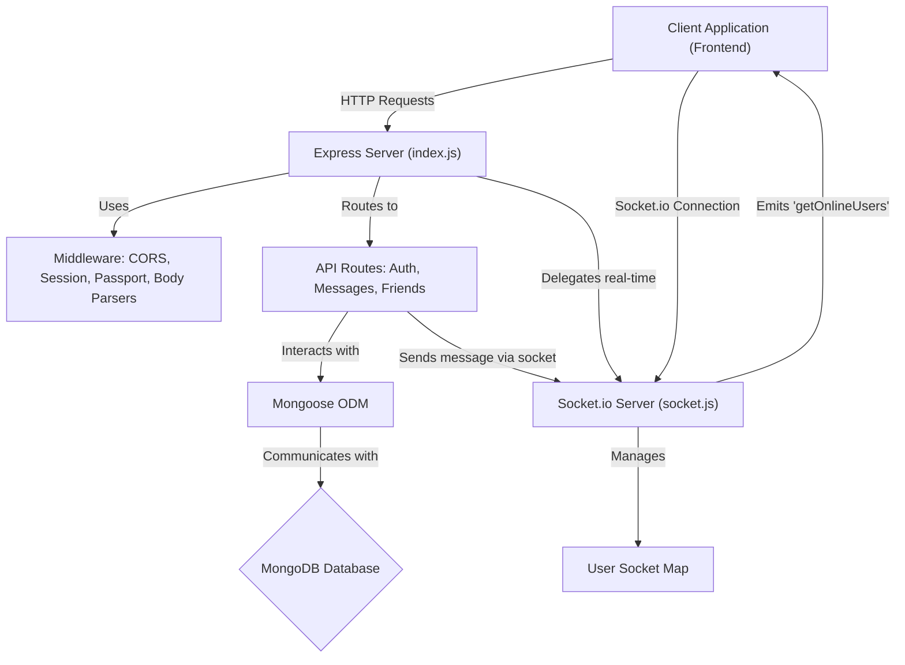
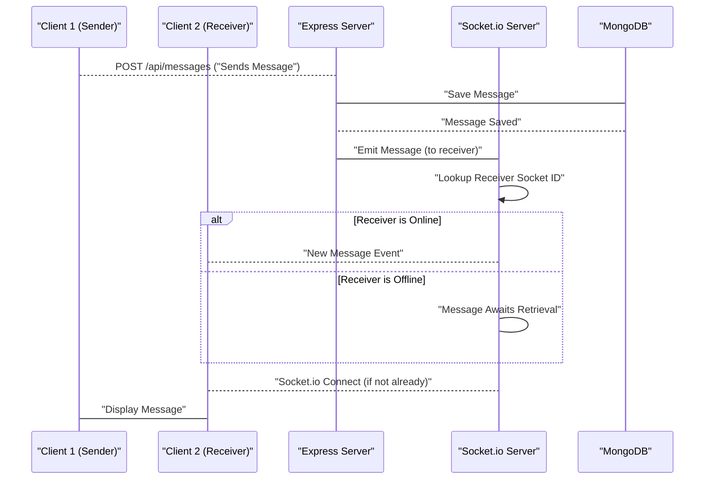

 # Backend Architecture and Core Services

The backend serves as the robust foundation of the application, managing data persistence, user authentication, real-time communication, and business logic. Built primarily with Node.js and Express, it leverages a MongoDB database for data storage and Socket.io for dynamic, real-time interactions. This document outlines the core components, their interconnections, and the essential services that power the application.

## Core Technologies and Dependencies

The application's backend is powered by a set of well-established technologies, configured for performance and scalability. The `package.json` file details all the dependencies, outlining the core libraries used for various functionalities.

### Key Dependencies

The following table summarizes the primary dependencies and their roles:

| Dependency        | Role                                                                        |
| :---------------- | :-------------------------------------------------------------------------- |
| `express`         | Web framework for handling HTTP requests, routing, and middleware.          |
| `mongoose`        | MongoDB object data modeling (ODM) for Node.js, facilitating database interactions. |
| `socket.io`       | Enables real-time, bidirectional, and event-based communication.            |
| `bcryptjs`        | Library for hashing passwords, ensuring secure user authentication.         |
| `jsonwebtoken`    | Used for creating and verifying JSON Web Tokens (JWTs) for stateless authentication. |
| `passport`        | Authentication middleware for Node.js, supporting various strategies like Google OAuth2. |
| `cloudinary`      | Cloud service for image and video management, often used for user avatars.  |
| `dotenv`          | Loads environment variables from a `.env` file, managing sensitive configurations. |
| `cookie-parser`   | Parses HTTP request cookies, making them available on `req.cookies`.        |
| `express-session` | Middleware for managing user sessions.                                      |

**Snippet: Core Dependencies (`backend/package.json`)**

```json
{
  "dependencies": {
    "bcryptjs": "^2.4.3",
    "cloudinary": "^2.5.1",
    "cookie-parser": "^1.4.7",
    "dotenv": "^16.4.7",
    "express": "^4.21.2",
    "express-session": "^1.18.1",
    "jsonwebtoken": "^9.0.2",
    "mongoose": "^8.9.5",
    "passport": "^0.7.0",
    "passport-google-oauth20": "^2.0.0",
    "socket.io": "^4.8.1"
  },
  "devDependencies": {
    "nodemon": "^3.1.9"
  }
}
```

[View `package.json` on GitHub](https://github.com/shinymack/Chat-App-MERN/blob/main/backend/package.json)

## Application Entry Point and Server Setup

The `backend/src/index.js` file is the heart of the backend application. It initializes the Express server, configures middleware, defines API routes, connects to the database, and sets up the real-time communication server. It also handles serving the static frontend assets in a production environment.

### Express Middleware Configuration

The application uses several middleware functions to process requests before they reach the route handlers. These include CORS for cross-origin resource sharing, `cookie-parser` for handling cookies, `express.json` and `express.urlencoded` for parsing request bodies, and `express-session` along with `passport` for authentication and session management.

**Snippet: Middleware Setup (`backend/src/index.js`)**

```javascript
app.use(cookieParser());
app.use(express.json({limit : '2mb'}));
app.use(express.urlencoded({ limit: '2mb', extended: true }));
app.use(cors({
    origin: "http://localhost:5173", // Frontend origin
    credentials: true,
}));

app.use(session({
    secret: process.env.SESSION_SECRET, 
    resave: false,
    saveUninitialized: false, 
    cookie: {
        secure: process.env.NODE_ENV === "production",
        httpOnly: true,
        maxAge: 7 * 24 * 60 * 60 * 1000 
    }
}));

app.use(passport.initialize());
app.use(passport.session());  
```

[View `index.js` on GitHub](https://github.com/shinymack/Chat-App-MERN/blob/main/backend/src/index.js)

### API Routing

The backend organizes its functionalities into distinct API routes for better modularity and maintainability.

*   `/api/auth`: Handles user authentication, registration, login, logout, and Google OAuth.
*   `/api/messages`: Manages message-related operations, such as sending and retrieving messages.
*   `/api/friends`: Deals with friend management, including adding, removing, and retrieving friends.

**Snippet: API Route Definitions (`backend/src/index.js`)**

```javascript
app.use("/api/auth", authRoutes );
app.use("/api/messages", messageRoutes );
app.use("/api/friends", friendRoutes);
```

[View `index.js` on GitHub](https://github.com/shinymack/Chat-App-MERN/blob/main/backend/src/index.js)

### Server Initialization

The Express server, combined with the Socket.io server, listens on a specified port. Upon successful startup, it initiates the connection to MongoDB. In production, it also serves the static build of the frontend application.

**Snippet: Server Start and DB Connection (`backend/src/index.js`)**

```javascript
server.listen(PORT, () => {
    console.log("server is running on PORT: " + String(PORT));
    connectDB();
});
```

[View `index.js` on GitHub](https://github.com/shinymack/Chat-App-MERN/blob/main/backend/src/index.js#L58-L61)

## Database Management

The `backend/src/lib/db.js` module is responsible for establishing and maintaining the connection to the MongoDB database using Mongoose. This centralized approach ensures consistent database interaction throughout the application.

**Snippet: MongoDB Connection (`backend/src/lib/db.js`)**

```javascript
import mongoose from "mongoose"

export const connectDB = async () => {
  try {
    const conn = await mongoose.connect(process.env.MONGODB_URI);
    console.log(`MongoDB connected:  ${conn.connection.host}`);
  }
  catch(error){
    console.log("MongoDB connection error: ", error);
  }
}
```

[View `db.js` on GitHub](https://github.com/shinymack/Chat-App-MERN/blob/main/backend/src/lib/db.js)

## Real-time Communication with Socket.io

The `backend/src/lib/socket.js` module sets up and manages the Socket.io server, enabling real-time features such as instant messaging and online user presence. It wraps the Express `app` within an HTTP server to allow Socket.io to share the same port.

### Online User Tracking

Socket.io tracks connected users and maintains a `userSocketMap` to associate `userId` with their active `socketId`. This map is crucial for targeting specific users for real-time messages or updates (e.g., sending a message to a particular recipient). The server emits `getOnlineUsers` events to all connected clients whenever a user connects or disconnects, allowing the frontend to display the current online status of users.

**Snippet: Socket.io Connection Handling (`backend/src/lib/socket.js`)**

```javascript
// used to store online users
const userSocketMap = {}; //{userId : socketId}

io.on("connection", (socket) => {
    console.log("A user connected", socket.id);

    const userId = socket.handshake.query.userId;
    if(userId) userSocketMap[userId] = socket.id;

    io.emit("getOnlineUsers", Object.keys(userSocketMap));

    socket.on("disconnect", ()=>{
        console.log("A user disconnected", socket.id);
        delete userSocketMap[userId]; 
        io.emit("getOnlineUsers", Object.keys(userSocketMap));
    })
})
```

[View `socket.js` on GitHub](https://github.com/shinymack/Chat-App-MERN/blob/main/backend/src/lib/socket.js)

## Backend Architecture Overview

This diagram illustrates the main components of the backend and how they interact to handle incoming requests and manage data.





## Real-time Message Flow

This sequence diagram depicts the flow of a real-time message from one client to another through the backend services.





## Key Integration Points

The backend integrates several critical components to deliver a seamless user experience:

*   **Authentication & Authorization:** `passport` and `jsonwebtoken` are integrated into the Express middleware to secure API endpoints. Google OAuth2 provides a convenient login method, while `bcryptjs` ensures password security for traditional logins. Sessions managed by `express-session` maintain user state across requests.
*   **Database Interaction:** Mongoose provides an abstraction layer over MongoDB, allowing for object-oriented data modeling and robust query capabilities. The `connectDB` function ensures a reliable connection to the database.
*   **Real-time Messaging:** Socket.io is tightly integrated with the Express server. The `userSocketMap` allows the server to identify and directly communicate with specific online users for instant message delivery and presence updates. This enables features like real-time chat, typing indicators, and online status.
*   **Environment Configuration:** `dotenv` is crucial for managing sensitive information like database URIs, API keys, and session secrets. This ensures that configurations are externalized and not hardcoded, enhancing security and deployment flexibility.
*   **CORS Handling:** `cors` middleware is configured to allow requests from the frontend application's origin, preventing cross-origin security issues while maintaining secure communication.
*   **Static File Serving:** In production, the `index.js` file is also responsible for serving the static assets of the frontend, simplifying deployment and ensuring the entire application can be served from a single backend instance.

These integrations highlight the modular design of the backend, where each service is responsible for a specific set of functionalities, contributing to a robust and scalable application.