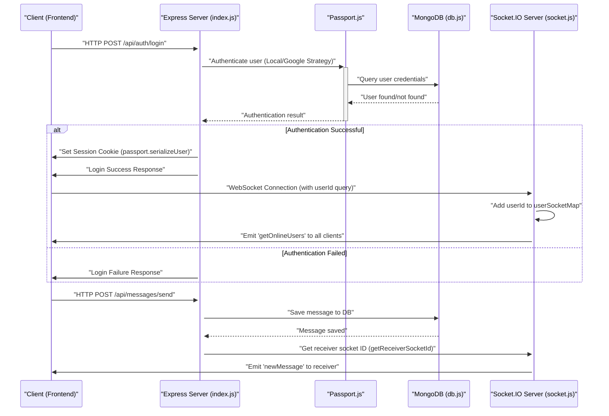

 # Backend Architecture and Services

This document provides a comprehensive overview of the backend architecture, detailing its core components, service integrations, and the foundational technologies that drive its operations. The backend is built on a robust Node.js and Express.js framework, leveraging various libraries for authentication, database management, and real-time communication.

## Core Dependencies and Project Setup

The `backend/package.json` file outlines all necessary dependencies and scripts for the project. It reveals the technological backbone, including Express for the web server, Mongoose for MongoDB interactions, Socket.IO for real-time features, and Passport.js for flexible authentication strategies.

### Key Dependencies

The following table categorizes the primary dependencies used in the backend:

| Category          | Dependencies                                                                | Description                                                                  |
| :---------------- | :-------------------------------------------------------------------------- | :--------------------------------------------------------------------------- |
| **Web Framework** | `express`, `cors`                                                           | Core web server and Cross-Origin Resource Sharing handling.                  |
| **Database**      | `mongoose`                                                                  | MongoDB object data modeling (ODM).                                          |
| **Authentication**| `bcryptjs`, `jsonwebtoken`, `passport`, `passport-google-oauth20`, `express-session`, `cookie-parser` | Hashing passwords, JWTs, various authentication strategies, session management. |
| **Real-time**     | `socket.io`                                                                 | Bidirectional, event-based communication.                                    |
| **Utilities**     | `dotenv`, `cloudinary`                                                      | Environment variable management, cloud-based image/file storage.             |
| **Development**   | `nodemon`                                                                   | Automatically restarts the Node.js application during development.           |

<details>
<summary>View `backend/package.json`</summary>

```json
{
  "name": "backend",
  "version": "1.0.0",
  "main": "src/index.js",
  "scripts": {
    "dev": "nodemon src/index.js",
    "start": "node src/index.js"
  },
  "author": "",
  "type": "module",
  "license": "ISC",
  "description": "",
  "dependencies": {
    "bcryptjs": "^2.4.3",
    "cloudinary": "^2.5.1",
    "cookie-parser": "^1.4.7",
    "dotenv": "^16.4.7",
    "express": "^4.21.2",
    "express-session": "^1.18.1",
    "jsonwebtoken": "^9.0.2",
    "mongoose": "^8.9.5",
    "passport": "^0.7.0",
    "passport-google-oauth20": "^2.0.0",
    "socket.io": "^4.8.1"
  },
  "devDependencies": {
    "nodemon": "^3.1.9"
  }
}
```
</details>

## Backend Application Entry Point

The `backend/src/index.js` file serves as the main entry point for the backend application. It initializes the Express server, configures middleware, sets up API routes, and handles the connection to the database and Socket.IO for real-time functionalities.

### Server Initialization and Middleware

The application bootstraps Express, configures CORS for client-server communication, and applies essential middleware for parsing request bodies and managing sessions. Passport.js is initialized here to handle user authentication, including session management.

```javascript showLineNumbers
import express from "express";
import cors from "cors";
import authRoutes from "./routes/auth.route.js";
import messageRoutes from "./routes/message.route.js";
import friendRoutes from "./routes/friend.route.js";

import path from "path";

import dotenv from "dotenv";
import cookieParser from "cookie-parser";

import { connectDB } from "./lib/db.js";
import { app, server } from "./lib/socket.js";

import session from "express-session";
import passport from "passport";
import { configurePassport } from "./lib/passport.config.js";

const __dirname = path.resolve();
dotenv.config();

configurePassport();

app.use(cookieParser());
app.use(express.json({limit : '2mb'}));
app.use(express.urlencoded({ limit: '2mb', extended: true }));
app.use(cors({
    origin: "http://localhost:5173",
    credentials: true,
}));

app.use(session({
    secret: process.env.SESSION_SECRET, 
    resave: false,
    saveUninitialized: false, 
    cookie: {
        secure: process.env.NODE_ENV === "production", // true in production (HTTPS)
        httpOnly: true,
        maxAge: 7 * 24 * 60 * 60 * 1000 
        // sameSite: 'lax' // or 'none' if backend and frontend are on different domains in prod
    }
}));

app.use(passport.initialize());
app.use(passport.session());  

app.use("/api/auth", authRoutes );
app.use("/api/messages", messageRoutes );
app.use("/api/friends", friendRoutes);


const PORT = process.env.PORT;
if(process.env.NODE_ENV === "production"){
    app.use(express.static(path.join(__dirname, "../frontend/dist")));
    
    app.get("*" , (req, res) => {
        res.sendFile(path.join(__dirname,"../frontend", "dist","index.html"));
    })
}

server.listen(PORT, () => {
    console.log("server is running on PORT: " + String(PORT));
    connectDB();
});
```
[View on GitHub](https://github.com/shinymack/Chat-App-MERN/blob/main/backend/src/index.js#L1-L71)

### API Routes

The backend exposes several API routes for different functionalities:

*   **`/api/auth`**: Handles user authentication, including login, logout, registration, and Google OAuth.
*   **`/api/messages`**: Manages message-related operations, such as sending, retrieving, and marking messages.
*   **`/api/friends`**: Provides functionalities for friend management, including adding, removing, and listing friends.

```javascript showLineNumbers
app.use("/api/auth", authRoutes );
app.use("/api/messages", messageRoutes );
app.use("/api/friends", friendRoutes);
```
[View on GitHub](https://github.com/shinymack/Chat-App-MERN/blob/main/backend/src/index.js#L59-L61)

## Database Connection

The `backend/src/lib/db.js` file encapsulates the logic for connecting to the MongoDB database using Mongoose. This modular approach ensures that database connection concerns are separated, promoting cleaner code and easier maintenance.

```javascript showLineNumbers
import mongoose from "mongoose"

export const connectDB = async () => {
  try {
    const conn = await mongoose.connect(process.env.MONGODB_URI);
    console.log(`MongoDB connected:  ${conn.connection.host}`);
  }
  catch(error){
    console.log("MongoDB connection error: ", error);
  }
}
```
[View on GitHub](https://github.com/shinymack/Chat-App-MERN/blob/main/backend/src/lib/db.js#L1-L10)

Upon successful connection, it logs the host, providing immediate feedback on the database status. Errors during connection are gracefully handled and logged.

## Real-time Communication with Socket.IO

The `backend/src/lib/socket.js` module sets up and manages the Socket.IO server, enabling real-time, bidirectional communication between clients and the server. This is crucial for functionalities like instant messaging, online user presence, and real-time notifications.

### Socket.IO Server Initialization

An Express application is wrapped by an HTTP server, which is then passed to Socket.IO. This allows both traditional HTTP requests and WebSocket connections to coexist on the same port.

```javascript showLineNumbers
import { Server } from "socket.io";
import http from "http";
import express from "express";

const app = express();

const server = http.createServer(app);

const io = new Server(server, {
    cors: {
        origin: ["http://localhost:5173"]
    }
})
```
[View on GitHub](https://github.com/shinymack/Chat-App-MERN/blob/main/backend/src/lib/socket.js#L1-L13)

### Online User Management

The `userSocketMap` object maintains a mapping of `userId` to `socketId` for all connected users. This allows the server to identify and send messages to specific online users.

```javascript showLineNumbers
// used to store online users
const userSocketMap = {}; //{userId : socketId}
```
[View on GitHub](https://github.com/shinymack/Chat-App-MERN/blob/main/backend/src/lib/socket.js#L21)

When a user connects, their `userId` (obtained from the handshake query) is associated with their `socket.id`. The server then broadcasts an updated list of `getOnlineUsers` to all connected clients. Upon disconnection, the user is removed from the map, and the online users list is updated again.

```javascript showLineNumbers
io.on("connection", (socket) => {
    console.log("A user connected", socket.id);

    const userId = socket.handshake.query.userId;
    if(userId) userSocketMap[userId] = socket.id;

    io.emit("getOnlineUsers", Object.keys(userSocketMap));

    socket.on("disconnect", ()=>{
        console.log("A user disconnected", socket.id);
        delete userSocketMap[userId]; 
        io.emit("getOnlineUsers", Object.keys(userSocketMap));
    })
})
```
[View on GitHub](https://github.com/shinymack/Chat-App-MERN/blob/main/backend/src/lib/socket.js#L24-L37)

The `getReceiverSocketId` function allows other modules to retrieve the socket ID of a specific user, facilitating targeted real-time communication.

```javascript showLineNumbers
export function getReceiverSocketId(userId) {
    return userSocketMap[userId];
}
```
[View on GitHub](https://github.com/shinymack/Chat-App-MERN/blob/main/backend/src/lib/socket.js#L16-L18)

## Key Integration Points

The backend integrates various services to provide a comprehensive chat application experience. This section illustrates the main data and control flows.

### Backend Service Flow

The following diagram illustrates how different components and services within the backend interact to process requests and manage real-time communication.


```mermaid
graph TD
    A["Client Request (HTTP/WebSocket)"] -->|"/api/auth", "/api/messages", "/api/friends"| B["Express App (index.js)"]
    B --> C["Middleware (CORS, JSON, Session, Passport)"]
    C --> D{"Authentication & Authorization"}
    D -- "User Authenticated" --> E["API Routes (auth, message, friend)"]
    E --> F["Mongoose (Database Operations)"]
    F -- "Data Read/Write" --> G["MongoDB"]
    E --> H["Socket.IO Server (socket.js)"]
    H -- "Real-time Event" --> I["Online User Map (userSocketMap)"]
    I -- "Broadcast/Emit" --> J["Connected Clients"]
    D -- "User Not Authenticated" --> K["Error / Redirect"]
```


### Authentication and Real-time Messaging Flow

This diagram details the flow for user authentication, session management, and how it ties into the real-time messaging system via Socket.IO.


