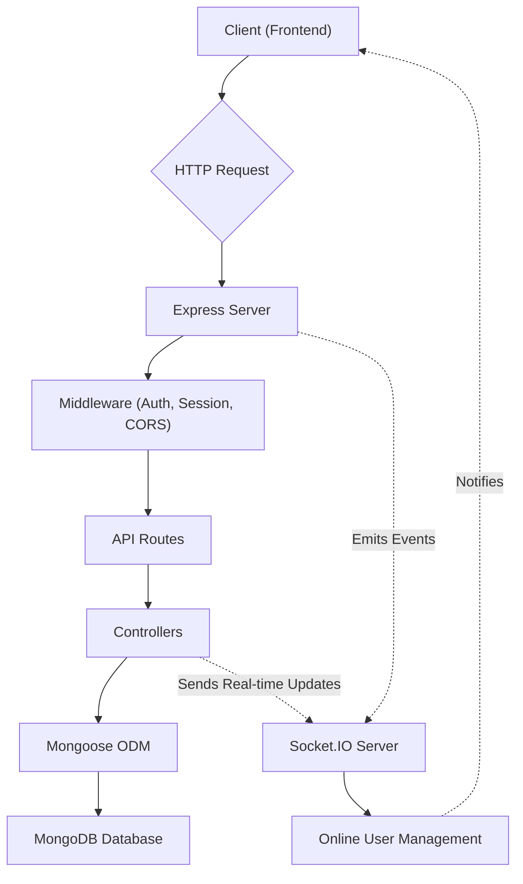
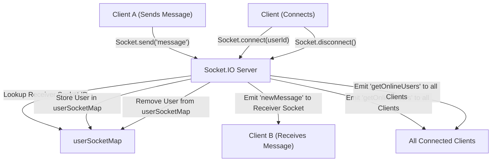

 # Backend Architecture

The backend of the application serves as the central hub for data management, user authentication, real-time communication, and API services. Built primarily with Node.js and Express, it leverages a MongoDB database for persistence and Socket.IO for real-time interactions. This document provides a deep dive into its core components and their interdependencies.

## Core Technologies and Dependencies

The application's backend is a robust Node.js application. Its dependencies, as defined in `backend/package.json`, highlight the key technologies employed:

*   **Express.js**: The web framework for handling HTTP requests and routing.
*   **Mongoose**: An ODM (Object Data Modeling) library for MongoDB, simplifying database interactions.
*   **Socket.IO**: Enables real-time, bidirectional, event-based communication.
*   **Passport.js**: Authentication middleware, specifically configured for local and Google OAuth2 strategies.
*   **JWT & bcryptjs**: For secure token-based authentication and password hashing.
*   **Cloudinary**: Integration for cloud-based media storage.
*   **dotenv**: Environment variable management.
*   **cookie-parser & express-session**: Middleware for handling cookies and session management.

<details>
<summary>View package.json dependencies</summary>

```json
{
  "name": "backend",
  "version": "1.0.0",
  "main": "src/index.js",
  "scripts": {
    "dev": "nodemon src/index.js",
    "start": "node src/index.js"
  },
  "author": "",
  "type": "module",
  "license": "ISC",
  "description": "",
  "dependencies": {
    "bcryptjs": "^2.4.3",
    "cloudinary": "^2.5.1",
    "cookie-parser": "^1.4.7",
    "dotenv": "^16.4.7",
    "express": "^4.21.2",
    "express-session": "^1.18.1",
    "jsonwebtoken": "^9.0.2",
    "mongoose": "^8.9.5",
    "passport": "^0.7.0",
    "passport-google-oauth20": "^2.0.0",
    "socket.io": "^4.8.1"
  },
  "devDependencies": {
    "nodemon": "^3.1.9"
  }
}
```
[View on GitHub](https://github.com/shinymack/Chat-App-MERN/blob/main/backend/package.json)
</details>

## Application Entry Point and Configuration

The primary entry point for the backend application is `backend/src/index.js`. This file is responsible for initializing the Express application, configuring middleware, defining routes, and starting the server.

The server setup includes:
*   Loading environment variables using `dotenv`.
*   Configuring `passport.js` for authentication.
*   Applying middleware such as `cookie-parser`, `express.json`, `express.urlencoded`, `cors`, `express-session`, `passport.initialize`, and `passport.session`.
*   Mounting API routes for authentication, messages, and friends.
*   Serving static files for the frontend in production.
*   Connecting to MongoDB and listening for incoming requests.

```javascript
// backend/src/index.js
import express from "express";
import cors from "cors";
import authRoutes from "./routes/auth.route.js";
// ... other imports ...

import { connectDB } from "./lib/db.js";
import { app, server } from "./lib/socket.js";
// ... session and passport imports ...

dotenv.config();
configurePassport();

app.use(cookieParser());
app.use(express.json({limit : '2mb'}));
// ... other app.use middleware ...

app.use("/api/auth", authRoutes );
app.use("/api/messages", messageRoutes );
app.use("/api/friends", friendRoutes);

// ... production static file serving ...

server.listen(PORT, () => {
    console.log("server is running on PORT: " + String(PORT));
    connectDB();
});
```
[View on GitHub](https://github.com/shinymack/Chat-App-MERN/blob/main/backend/src/index.js#L1-L60)

## Database Integration

The backend connects to a MongoDB database, facilitated by Mongoose. The `connectDB` function in `backend/src/lib/db.js` handles the connection logic, ensuring that the application can interact with the database.

```javascript
// backend/src/lib/db.js
import mongoose from "mongoose"

export const connectDB = async () => {
  try {
    const conn = await mongoose.connect(process.env.MONGODB_URI);
    console.log(`MongoDB connected:  ${conn.connection.host}`);
  }
  catch(error){
    console.log("MongoDB connection error: ", error);
  }
}
```
[View on GitHub](https://github.com/shinymack/Chat-App-MERN/blob/main/backend/src/lib/db.js)

This function is called once the server starts, ensuring database connectivity before handling API requests. The `MONGODB_URI` is sourced from environment variables, promoting secure and flexible deployment.

## Real-time Communication with Socket.IO

Real-time features, such as online user presence and instant messaging, are handled by Socket.IO. The `backend/src/lib/socket.js` file sets up the Socket.IO server, integrates it with the Express application, and manages online users.

The `userSocketMap` object stores `userId` to `socketId` mappings, allowing the server to track which users are currently online and to send messages to specific users.

```javascript
// backend/src/lib/socket.js
import { Server } from "socket.io";
import http from "http";
import express from "express";

const app = express();
const server = http.createServer(app);

const io = new Server(server, {
    cors: {
        origin: ["http://localhost:5173"]
    }
})

export function getReceiverSocketId(userId) {
    return userSocketMap[userId];
}

const userSocketMap = {}; //{userId : socketId}

io.on("connection", (socket) => {
    console.log("A user connected", socket.id);

    const userId = socket.handshake.query.userId;
    if(userId) userSocketMap[userId] = socket.id;

    io.emit("getOnlineUsers", Object.keys(userSocketMap));

    socket.on("disconnect", ()=>{
        console.log("A user disconnected", socket.id);
        delete userSocketMap[userId]; 
        io.emit("getOnlineUsers", Object.keys(userSocketMap));
    })
})

export { io, app, server };
```
[View on GitHub](https://github.com/shinymack/Chat-App-MERN/blob/main/backend/src/lib/socket.js)

When a user connects, their `userId` is extracted from the socket's handshake query and stored in `userSocketMap`. On disconnection, the user is removed. The `getOnlineUsers` event is emitted to all connected clients, keeping the online user list updated across the application.

## Backend Service Flow

The following diagram illustrates the high-level flow of requests and data within the backend:





## Real-time Messaging and User Presence Flow

This diagram details the flow for real-time interactions, particularly how messages are handled and how user presence is managed through Socket.IO.





## Key Integration Points

The backend integrates several crucial components to deliver its functionality:

*   **Express & Socket.IO**: Both leverage the same `http` server instance, `server` (created in `socket.js` and imported in `index.js`), allowing them to coexist and share the same port. This is a common pattern for applications requiring both traditional REST APIs and real-time capabilities.
*   **Passport.js & Express-Session**: `passport` relies on `express-session` to maintain user login state across requests. The session cookie ensures that authenticated users don't need to re-authenticate on every page refresh.
*   **Controllers & Mongoose**: Each API route handler (controller) interacts directly with Mongoose models to perform CRUD operations on the MongoDB database. This separation of concerns keeps the route logic clean and focused on data manipulation.
*   **Socket.IO & Database**: While Socket.IO primarily handles real-time event dissemination, messages themselves are typically persisted in the MongoDB database via Mongoose, ensuring data durability and history. The real-time aspect simply pushes these persisted messages to the relevant clients immediately.
*   **CORS Configuration**: The `cors` middleware is crucial for allowing the frontend (typically running on a different port during development, e.g., `http://localhost:5173`) to make requests to the backend API. It's configured to accept credentials, which is necessary for cookie-based authentication.

Next: [API Endpoints and Controllers](./2.1_api-endpoints-and-controllers.mdx)