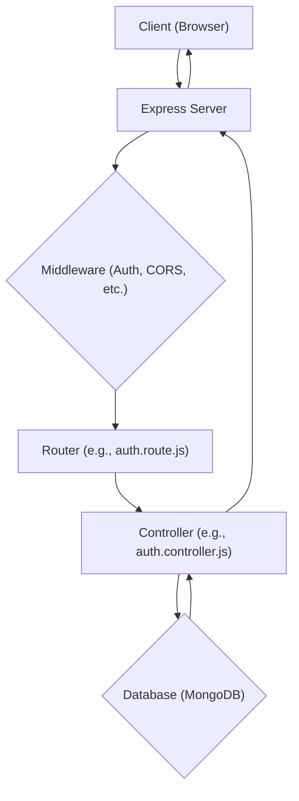

# Backend Architecture

This section details the server-side structure and core components of the Chat App MERN backend, outlining its setup, dependencies, and key functionalities.

## Core Components and Setup

The backend is built using Node.js and Express.js, leveraging modern JavaScript features. It's configured to handle API requests, manage user authentication, interact with a MongoDB database, and facilitate real-time communication via WebSockets.

The application starts by configuring environment variables using `dotenv`, setting up the Express server, and establishing a connection to the MongoDB database. It also initializes Passport.js for authentication strategies and configures Socket.IO for real-time features.

```javascript
// backend/src/index.js
import express from "express";
import cors from "cors";
import authRoutes from "./routes/auth.route.js";
import messageRoutes from "./routes/message.route.js";
import friendRoutes from "./routes/friend.route.js";

import path from "path";

import dotenv from "dotenv";
import cookieParser from "cookie-parser";

import { connectDB } from "./lib/db.js";
import { app, server } from "./lib/socket.js"; // Assuming socket.js exports app and server

import session from "express-session";
import passport from "passport";
import { configurePassport } from "./lib/passport.config.js";

const __dirname = path.resolve();
dotenv.config();

configurePassport(); // Configure Passport strategies

// ... middleware setup ...

app.use("/api/auth", authRoutes );
app.use("/api/messages", messageRoutes );
app.use("/api/friends", friendRoutes);

// ... production static file serving ...

server.listen(PORT, () => {
    console.log("server is running on PORT: " + String(PORT));
    connectDB();
});
```

## Database Integration

The backend utilizes Mongoose to interact with a MongoDB database. The `connectDB` function, defined in `backend/src/lib/db.js`, establishes the connection using a MongoDB URI provided via environment variables.

```javascript
// backend/src/lib/db.js
import mongoose from "mongoose"

export const connectDB = async () => {
  try {
    const conn = await mongoose.connect(process.env.MONGODB_URI);
    console.log(`MongoDB connected:  ${conn.connection.host}`);
  }
  catch(error){
    console.log("MongoDB connection error: ", error);
  }
}
```

## Authentication and Routing

The authentication module handles user signup, login, logout, profile updates, and checks for username availability. It integrates with Passport.js for Google OAuth 2.0 authentication. Middleware like `protectRoute` ensures that only authenticated users can access certain API endpoints.

```javascript
// backend/src/routes/auth.route.js
import express from "express"
import passport from 'passport';
import { login, logout, signup, updateProfile, checkAuth, googleAuthCallback, checkUsernameAvailability} from  "../controllers/auth.controller.js"
import { protectRoute } from "../middleware/auth.middleware.js"
const router = express.Router();

router.post("/signup", signup);
router.post("/login", login);
router.post("/logout", logout);
router.put("/update-profile", protectRoute ,updateProfile)
router.get("/username/check/:username", protectRoute, checkUsernameAvailability);
router.get("/check", protectRoute, checkAuth)

// Google OAuth routes
router.get(
    '/google',
    passport.authenticate('google', { scope: ['profile', 'email'] })
);
router.get(
    '/google/callback',
    passport.authenticate('google', {
        failureRedirect: 'http://localhost:5173/login',
        failureMessage: true
    }),
    googleAuthCallback
);
export default router;
```

## Dependencies

The `package.json` file lists the essential dependencies required for the backend to function, including:

*   **Express**: For building the web server and API.
*   **Mongoose**: For MongoDB object modeling.
*   **Passport.js**: For authentication, including Google OAuth.
*   **Socket.IO**: For real-time communication.
*   **bcryptjs**: For password hashing.
*   **jsonwebtoken**: For creating and verifying JSON Web Tokens.
*   **dotenv**: For managing environment variables.
*   **cookie-parser**: For parsing cookies.
*   **express-session**: For managing user sessions.
*   **cloudinary**: For image uploads.
*   **nodemon**: For development, enabling automatic server restarts.

```json
// backend/package.json
{
  "name": "backend",
  "version": "1.0.0",
  "main": "src/index.js",
  "scripts": {
    "dev": "nodemon src/index.js",
    "start": "node src/index.js"
  },
  // ... other fields ...
  "dependencies": {
    "bcryptjs": "^2.4.3",
    "cloudinary": "^2.5.1",
    "cookie-parser": "^1.4.7",
    "dotenv": "^16.4.7",
    "express": "^4.21.2",
    "express-session": "^1.18.1",
    "jsonwebtoken": "^9.0.2",
    "mongoose": "^8.9.5",
    "passport": "^0.7.0",
    "passport-google-oauth20": "^2.0.0",
    "socket.io": "^4.8.1"
  },
  "devDependencies": {
    "nodemon": "^3.1.9"
  }
}
```

## Architectural Flow (Simplified)

The diagram below illustrates a simplified flow for handling an API request, from the client to the backend and its interaction with the database.





## Key Takeaways

The backend is designed with modularity and security in mind, utilizing industry-standard libraries for a robust and scalable chat application. Key aspects include a clear separation of concerns through routing and controllers, secure handling of user data with password hashing and session management, and flexible authentication options including social logins. The integration of Socket.IO is crucial for enabling real-time messaging capabilities.