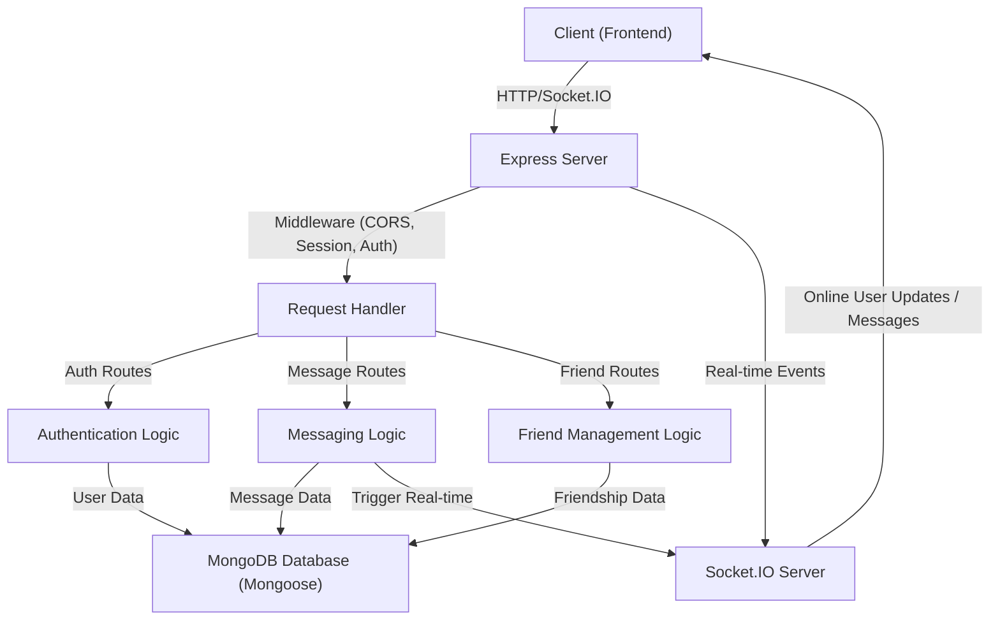

 
---
title: "Backend Architecture"
description: "Details the server-side structure, technologies, and overall organization of the backend."
---

# Backend Architecture

The backend serves as the robust server-side foundation for the application, handling all data processing, user authentication, real-time communication, and persistent storage. It is built primarily with Node.js and Express, leveraging a MongoDB database for data persistence and Socket.IO for enabling real-time features. This document outlines the key components, technologies, and structural organization of the backend.

## Core Technologies

The backend utilizes a modern JavaScript ecosystem, integrating various libraries and frameworks to provide a comprehensive and scalable solution.

*   **Node.js & Express.js**: The primary runtime and web framework, providing a flexible and efficient way to build RESTful APIs.
*   **MongoDB & Mongoose**: A NoSQL database for flexible data storage, managed through Mongoose, an ODM (Object Data Modeling) library, which simplifies interaction and schema definition.
*   **Socket.IO**: Enables real-time, bidirectional, event-based communication between the server and clients, crucial for features like instant messaging and online user status.
*   **Passport.js**: A flexible authentication middleware for Node.js, used here for Google OAuth2.0 integration and session management.
*   **JSON Web Tokens (JWT)**: Used for secure, stateless user authentication after initial login.
*   **BcryptJS**: A library for hashing passwords, ensuring user credentials are securely stored.
*   **Cloudinary**: An external service integrated for cloud-based image and video management, likely used for user avatars or media sharing.
*   **Dotenv**: Manages environment variables, keeping sensitive configurations separate from the codebase.
*   **Cookie-parser & Express-session**: Middleware for handling HTTP cookies and managing user sessions, essential for authentication flows.
*   **Nodemon**: A development dependency for automatically restarting the Node.js application when file changes are detected.

### Dependencies Overview

The `package.json` file provides a clear overview of the project's dependencies:

```json
{
  "name": "backend",
  "version": "1.0.0",
  "main": "src/index.js",
  "scripts": {
    "dev": "nodemon src/index.js",
    "start": "node src/index.js"
  },
  "author": "",
  "type": "module",
  "license": "ISC",
  "description": "",
  "dependencies": {
    "bcryptjs": "^2.4.3",
    "cloudinary": "^2.5.1",
    "cookie-parser": "^1.4.7",
    "dotenv": "^16.4.7",
    "express": "^4.21.2",
    "express-session": "^1.18.1",
    "jsonwebtoken": "^9.0.2",
    "mongoose": "^8.9.5",
    "passport": "^0.7.0",
    "passport-google-oauth20": "^2.0.0",
    "socket.io": "^4.8.1"
  },
  "devDependencies": {
    "nodemon": "^3.1.9"
  }
}
```
[View on GitHub](https://github.com/shinymack/Chat-App-MERN/blob/main/backend/package.json)

## Application Entry Point (`index.js`)

The `index.js` file located in `backend/src/` is the main entry point for the Express application. It's responsible for setting up the server, configuring middleware, defining API routes, connecting to the database, and initializing the Socket.IO server.

### Middleware Configuration

The application configures several essential middleware components to handle requests, sessions, and authentication:

```javascript
app.use(cookieParser());
app.use(express.json({limit : '2mb'}));
app.use(express.urlencoded({ limit: '2mb', extended: true }));
app.use(cors({
    origin: "http://localhost:5173",
    credentials: true,
}));

app.use(session({
    secret: process.env.SESSION_SECRET, 
    resave: false,
    saveUninitialized: false, 
    cookie: {
        secure: process.env.NODE_ENV === "production", // true in production (HTTPS)
        httpOnly: true,
        maxAge: 7 * 24 * 60 * 60 * 1000 
    }
}));

app.use(passport.initialize());
app.use(passport.session());
```
[View on GitHub](https://github.com/shinymack/Chat-App-MERN/blob/main/backend/src/index.js#L26-L49)

This block sets up:
*   **`cookieParser`**: Parses cookies attached to the client request object.
*   **`express.json` & `express.urlencoded`**: Body parsers to handle incoming JSON and URL-encoded data.
*   **`cors`**: Enables Cross-Origin Resource Sharing, allowing the frontend (on `http://localhost:5173` in development) to make requests.
*   **`express-session`**: Manages user sessions, storing session data server-side and using a cookie to identify the session.
*   **`passport.initialize()` & `passport.session()`**: Initializes Passport.js for authentication and links it with Express sessions.

### API Route Registration

The backend defines distinct route modules for authentication, messaging, and friend management, making the API organized and maintainable:

```javascript
app.use("/api/auth", authRoutes );
app.use("/api/messages", messageRoutes );
app.use("/api/friends", friendRoutes);
```
[View on GitHub](https://github.com/shinymack/Chat-App-MERN/blob/main/backend/src/index.js#L51-L53)

These lines map specific URL paths to their respective route handlers, ensuring requests are directed to the correct logic for processing.

### Production Static File Serving

For production deployments, `index.js` is also configured to serve the static frontend assets, enabling a single server to handle both API requests and the client-side application:

```javascript
if(process.env.NODE_ENV === "production"){
    app.use(express.static(path.join(__dirname, "../frontend/dist")));
    
    app.get("*" , (req, res) => {
        res.sendFile(path.join(__dirname,"../frontend", "dist","index.html"));
    })
}
```
[View on GitHub](https://github.com/shinymack/Chat-App-MERN/blob/main/backend/src/index.js#L57-L62)

This ensures that in a production environment, any request not matching an API route will serve the `index.html` file from the built frontend, allowing client-side routing to take over.

## Database Management (`lib/db.js`)

The `backend/src/lib/db.js` file is dedicated to establishing and managing the connection to the MongoDB database using Mongoose.

```javascript
import mongoose from "mongoose"

export const connectDB = async () => {
  try {
    const conn = await mongoose.connect(process.env.MONGODB_URI);
    console.log(`MongoDB connected:  ${conn.connection.host}`);
  }
  catch(error){
    console.log("MongoDB connection error: ", error);
  }
}
```
[View on GitHub](https://github.com/shinymack/Chat-App-MERN/blob/main/backend/src/lib/db.js)

The `connectDB` function asynchronously connects to the MongoDB instance specified by the `MONGODB_URI` environment variable. This centralized approach ensures consistent database connectivity and error handling.

## Real-time Communication (`lib/socket.js`)

The `backend/src/lib/socket.js` file is critical for enabling real-time features through Socket.IO. It initializes the Socket.IO server, integrates it with the Express HTTP server, and manages online user status.

```javascript
io.on("connection", (socket) => {
    console.log("A user connected", socket.id);

    const userId = socket.handshake.query.userId;
    if(userId) userSocketMap[userId] = socket.id;

    io.emit("getOnlineUsers", Object.keys(userSocketMap));

    socket.on("disconnect", ()=>{
        console.log("A user disconnected", socket.id);
        delete userSocketMap[userId]; 
        io.emit("getOnlineUsers", Object.keys(userSocketMap));
    })
})
```
[View on GitHub](https://github.com/shinymack/Chat-App-MERN/blob/main/backend/src/lib/socket.js#L20-L33)

This snippet demonstrates the core logic for managing connections:
*   When a user connects, their `userId` is extracted, and a mapping between `userId` and `socket.id` is stored in `userSocketMap`.
*   The server then broadcasts the updated list of `getOnlineUsers` to all connected clients.
*   On disconnection, the user is removed from `userSocketMap`, and the updated online user list is broadcast again. This ensures all clients have an up-to-date view of who is online.

## API Endpoints

The backend exposes several API endpoints categorized by functionality:

*   **`/api/auth`**: Handles all authentication-related requests, including user registration, login, logout, and Google OAuth.
*   **`/api/messages`**: Manages the sending, retrieving, and possibly deleting of messages between users.
*   **`/api/friends`**: Facilitates friend management functionalities such as adding, removing, or listing friends.

## Authentication and Authorization

The backend implements a robust authentication and authorization system combining multiple technologies:

*   **Passport.js with Google OAuth2.0**: Allows users to log in using their Google accounts.
*   **Express Sessions**: Maintains user login state across requests.
*   **JSON Web Tokens (JWT)**: Potentially used for API authorization after a user is authenticated, allowing stateless validation.
*   **BcryptJS**: Ensures that if local password-based authentication were implemented, passwords would be stored securely as hashes.
*   **Cookie-parser**: Used to parse and access cookies, which often carry session IDs.

This layered approach ensures that user data is protected and access to resources is appropriately controlled.

## Architectural Flow

The following diagram illustrates the high-level data flow and component interaction within the backend architecture.





This diagram shows that client requests first hit the Express server, passing through various middleware before being routed to specific handlers. These handlers interact with the MongoDB database for persistent storage and, for real-time features, communicate with the Socket.IO server, which then pushes updates back to clients.

## Real-time Interaction Flow

This sequence diagram details the process of a client connecting and the Socket.IO server updating online user status.


```mermaid
sequenceDiagram
    participant C as "Client"
    participant ES as "Express Server"
    participant SIS as "Socket.IO Server"
    participant USM as "User Socket Map"

    C->>+ES: "HTTP Request (Initial Load)"
    ES->>-C: "Frontend Assets"
    C->>+SIS: "Socket.IO Connect (userId in query)"
    SIS ->> USM: "Store: userId -> socketId"
    activate USM
    USM ->>- SIS: "Confirmation"
    SIS ->> C: "Emit 'getOnlineUsers' (All online users)"
    SIS ->> SIS: "Internal: Update all connected clients"
    deactivate USM
    C->>-SIS: "Connection Established"

    alt User Disconnects
        C ->> SIS: "Socket.IO Disconnect"
        SIS ->> USM: "Delete: userId"
        activate USM
        USM ->>- SIS: "Confirmation"
        SIS ->> SIS: "Emit 'getOnlineUsers' to all clients"
        SIS ->> C: "Disconnected"
        deactivate USM
    end
```


This sequence illustrates how a client's connection triggers a series of events: the Socket.IO server registers the user, updates an internal map of online users, and broadcasts this information to all active clients, ensuring real-time awareness of user presence.

## Key Integration Points

The backend architecture is designed with clear separation of concerns, yet its components are tightly integrated to deliver a seamless user experience:

*   **Express and Socket.IO**: Both HTTP and WebSocket servers run concurrently on the same port (`server.listen(PORT, ...)` in `index.js`), using `http.createServer(app)` to ensure a unified entry point for client communication. This allows the backend to serve both traditional RESTful API requests and real-time WebSocket events.
*   **Database and API Logic**: Mongoose directly interfaces with MongoDB, abstracting database operations. API routes (e.g., `/api/messages`) directly leverage Mongoose models to interact with the database, ensuring data persistence and integrity for actions like sending messages or managing friends.
*   **Authentication and Session Management**: `express-session` and `passport.js` work in tandem. `express-session` manages the user's session state, while `passport.js` handles the authentication strategy (e.g., Google OAuth2.0). Middleware in `index.js` ensures that every incoming request passes through these authentication layers before reaching protected routes.
*   **Real-time Updates and API Interaction**: While messages are persisted via API routes (e.g., POST to `/api/messages`), the `socket.io` server is designed to broadcast real-time updates. This means that after a message is saved to the database through an API call, a corresponding Socket.IO event can be emitted to instantly notify relevant users without them having to poll the server. The `getReceiverSocketId` function (`lib/socket.js`) is crucial for enabling targeted real-time communication, allowing messages to be sent only to the intended recipient.
*   **Environment Configuration**: `dotenv` is universally integrated across the backend. Critical configurations like `MONGODB_URI`, `SESSION_SECRET`, and `PORT` are loaded from environment variables, enhancing security and flexibility for deployment across different environments (development, production).

This architecture provides a scalable and maintainable foundation, allowing for further expansion of features while maintaining a clear and robust internal structure.
```