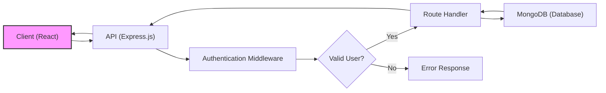
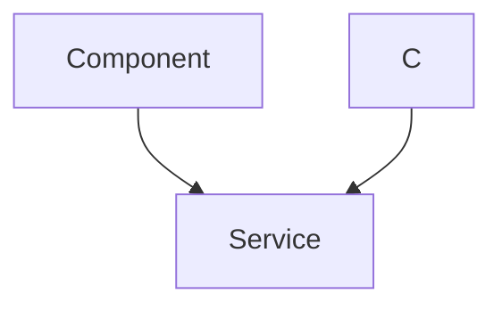

# Backend Architecture

This section details the backend architecture of the chat application, highlighting the key technologies, structure, and integration points. The backend is built using the MERN stack (MongoDB, Express.js, React.js, Node.js), focusing on providing a robust and scalable API for real-time communication and user management.

## Backend Stack

The backend leverages the following technologies:

| Technology    | Description                                                        |
| :------------ | :----------------------------------------------------------------- |
| Node.js       | JavaScript runtime environment for executing server-side code.       |
| Express.js    | Web application framework for building APIs and handling routing. |
| MongoDB       | NoSQL database for storing user data, messages, and conversations. |
| Mongoose      | MongoDB object modeling tool designed to work in an asynchronous environment. |
| Socket.IO     | Library for enabling real-time, bidirectional communication.        |
| JSON Web Token | Method for representing claims securely between two parties. |
| bcryptjs      | Library for hashing passwords.                                     |
| Cloudinary    | Cloud-based image and video management platform.                   |

## Core Components

*   **API Endpoints:** RESTful API endpoints for user authentication, profile management, and chat operations.
*   **Real-time Communication:** Socket.IO integration for handling real-time messaging between users.
*   **Database Interaction:** Mongoose models for interacting with the MongoDB database.
*   **Authentication and Authorization:** JSON Web Tokens (JWT) and Passport.js for secure user authentication and authorization.
*   **Middleware:** Custom middleware for handling authentication, authorization, and error handling.

## File Structure

The backend project structure is organized as follows:

*   `backend/`: Root directory for the backend application.
    *   `package.json`: Defines the project dependencies and scripts.
    *   `index.js`: Entry point for the backend application.
    *   `src/`: Source code directory.
        *   `controllers/`: Contains route handlers.
        *   `middleware/`: Contains middleware functions.
        *   `models/`: Defines Mongoose models for database interaction.
        *   `routes/`: Defines API routes.
        *   `lib/`: Contains utility functions, such as database connection logic.
        *   `config/`: Contains configuration files.

## Code Snippets and Explanations

### 1. `package.json` - Dependencies

The `package.json` file defines the project dependencies. This file lists all the npm packages required for the backend application to function correctly.

```json
{
  "name": "backend",
  "version": "1.0.0",
  "main": "src/index.js",
  "scripts": {
    "dev": "nodemon src/index.js",
    "start": "node src/index.js"
  },
  "author": "",
  "type": "module",
  "license": "ISC",
  "description": "",
  "dependencies": {
    "bcryptjs": "^2.4.3",
    "cloudinary": "^2.5.1",
    "cookie-parser": "^1.4.7",
    "dotenv": "^16.4.7",
    "express": "^4.21.2",
    "express-session": "^1.18.1",
    "jsonwebtoken": "^9.0.2",
    "mongoose": "^8.9.5",
    "passport": "^0.7.0",
    "passport-google-oauth20": "^2.0.0",
    "socket.io": "^4.8.1"
  },
  "devDependencies": {
    "nodemon": "^3.1.9"
  }
}
```

*   **Dependencies:** Includes essential packages like `express`, `mongoose`, `socket.io`, `jsonwebtoken`, and `bcryptjs`.
*   **DevDependencies:** Includes `nodemon` for automatic server restarts during development.
*   **Scripts:** Defines scripts for running the application in development (`dev`) and production (`start`) environments.

[View on GitHub](https://github.com/shinymack/Chat-App-MERN/blob/main/backend/package.json)

### 2. `src/lib/db.js` - Database Connection

This file establishes the connection to the MongoDB database using Mongoose. It retrieves the MongoDB connection URI from the environment variables and handles any connection errors.

```javascript
import mongoose from "mongoose"

export const connectDB = async () => {
  try {
    const conn = await mongoose.connect(process.env.MONGODB_URI);
    console.log(`MongoDB connected:  ${conn.connection.host}`);
  }
  catch(error){
    console.log("MongoDB connection error: ", error);
  }
}
```

*   **`mongoose.connect()`:** Connects to the MongoDB database using the URI from `process.env.MONGODB_URI`.
*   **Error Handling:** Catches any errors that occur during the connection process and logs them to the console.

[View on GitHub](https://github.com/shinymack/Chat-App-MERN/blob/main/backend/src/lib/db.js)

### 3. `index.js` - Entry Point

The `index.js` file serves as the entry point for the backend application. It initializes the Express server, connects to the database, sets up middleware, defines routes, and starts listening for incoming requests.

```javascript
import express from 'express';
import dotenv from 'dotenv';
import { connectDB } from './src/lib/db.js';

dotenv.config();

const app = express();
const port = process.env.PORT || 5000;

// Connect to database
connectDB();

app.get('/', (req, res) => {
  res.send('API is running...');
});

app.listen(port, () => {
  console.log(`Server running on port ${port}`);
});
```

*   **Express Initialization:** Creates an instance of the Express application.
*   **Environment Configuration:** Loads environment variables from a `.env` file using `dotenv.config()`.
*   **Database Connection:** Calls the `connectDB()` function to establish a connection to the MongoDB database.
*   **Route Handling:** Defines a simple route for the root endpoint (`/`).
*   **Server Start:** Starts the Express server and listens for incoming requests on the specified port.

[View on GitHub](https://github.com/shinymack/Chat-App-MERN/blob/main/backend/index.js)

## Data Flow Diagram





## Sequence Diagram: User Authentication





## Key Integration Points

*   **Frontend-Backend Communication:** The frontend communicates with the backend via HTTP requests to the API endpoints.  Data is typically exchanged in JSON format.
*   **Real-time Messaging:** Socket.IO facilitates real-time communication between the frontend and backend, allowing for instant message delivery.
*   **Database Interaction:** Mongoose models provide an abstraction layer for interacting with the MongoDB database, simplifying data retrieval and manipulation.

## Best Practices

*   **Environment Variables:** Store sensitive information like database URIs and API keys in environment variables to prevent them from being exposed in the code.
*   **Error Handling:** Implement robust error handling throughout the backend to gracefully handle unexpected errors and provide informative error messages to the client.
*   **Security:** Use secure authentication and authorization mechanisms to protect user data and prevent unauthorized access to the API.  Always hash passwords using a strong hashing algorithm like bcrypt.
*   **Validation:** Validate all incoming data to prevent injection attacks and ensure data integrity.
```