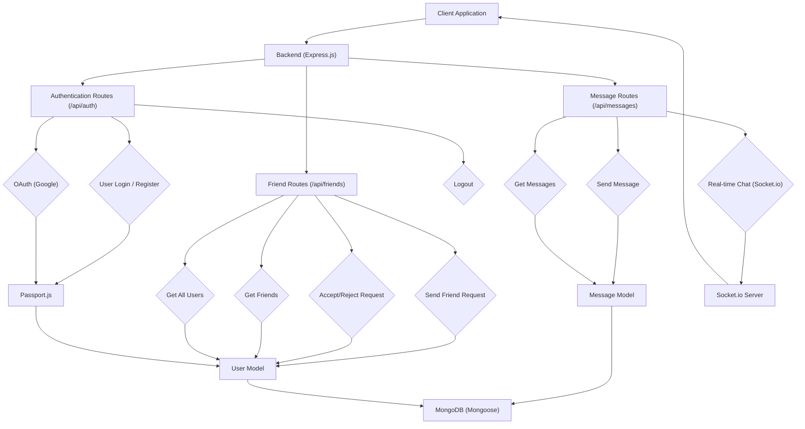

 # Backend Architecture

The backend of this application serves as the central hub for all data processing, user authentication, real-time communication, and persistent storage. Built on a robust Node.js and Express framework, it provides a RESTful API for client-side interactions and leverages WebSockets for instant messaging capabilities. This document delves into the core components, data models, and the overall architectural design that powers the application.

## Core Technologies and Dependencies

The backend is constructed using a modern JavaScript stack, leveraging various npm packages to handle different aspects of the application, from database interactions to authentication and real-time features.

Key dependencies include:
*   **Express.js:** A fast, unopinionated, minimalist web framework for Node.js, forming the backbone of the API.
*   **Mongoose:** An ODM (Object Data Modeling) library for MongoDB and Node.js, simplifying database interactions and schema definition.
*   **Socket.io:** A library that enables real-time, bidirectional, event-based communication between the server and clients, crucial for chat functionality.
*   **Passport.js:** Authentication middleware for Node.js, supporting various authentication strategies, including local (email/password) and OAuth (Google).
*   **jsonwebtoken (JWT):** For creating and verifying secure tokens, used for session management and protecting API routes.
*   **bcryptjs:** A library for hashing passwords, ensuring user data security.
*   **cloudinary:** For managing and serving images, specifically user profile pictures and message attachments.
*   **cookie-parser & express-session:** Middleware for handling cookies and managing user sessions.
*   **cors:** Middleware to enable Cross-Origin Resource Sharing, allowing the frontend to communicate with the backend.
*   **dotenv:** For loading environment variables from a `.env` file.

The `package.json` file outlines all these dependencies:

```json
{
  "name": "backend",
  "version": "1.0.0",
  "main": "src/index.js",
  "scripts": {
    "dev": "nodemon src/index.js",
    "start": "node src/index.js"
  },
  "author": "",
  "type": "module",
  "license": "ISC",
  "description": "",
  "dependencies": {
    "bcryptjs": "^2.4.3",
    "cloudinary": "^2.5.1",
    "cookie-parser": "^1.4.7",
    "dotenv": "^16.4.7",
    "express": "^4.21.2",
    "express-session": "^1.18.1",
    "jsonwebtoken": "^9.0.2",
    "mongoose": "^8.9.5",
    "passport": "^0.7.0",
    "passport-google-oauth20": "^2.0.0",
    "socket.io": "^4.8.1"
  },
  "devDependencies": {
    "nodemon": "^3.1.9"
  }
}
```
[View on GitHub](https://github.com/shinymack/Chat-App-MERN/blob/main/backend/package.json)

## Application Entry Point (`index.js`)

The `src/index.js` file serves as the main entry point for the backend application. It is responsible for initializing the Express server, setting up middleware, defining API routes, configuring Passport.js for authentication, establishing a database connection, and starting the WebSocket server.

Key actions performed in `index.js`:
*   **Middleware Setup:** Integrates `cookie-parser`, `express.json`, `express.urlencoded`, `cors`, `express-session`, `passport.initialize()`, and `passport.session()`. These handle parsing request bodies, enabling cross-origin requests, managing cookies, and facilitating user authentication.
*   **Authentication Configuration:** Initializes Passport.js using `configurePassport()` from `lib/passport.config.js`, which sets up local and Google OAuth strategies.
*   **Route Handling:** Imports and mounts API routes for authentication (`/api/auth`), messages (`/api/messages`), and friends (`/api/friends`).
*   **Database Connection:** Calls `connectDB()` from `lib/db.js` to establish a connection to MongoDB.
*   **Real-time Communication:** Utilizes the `app` and `server` instances from `lib/socket.js` to integrate Socket.io, allowing real-time features to run alongside the Express app.
*   **Production Deployment:** Configures static file serving for the frontend's build artifacts when the application is running in production mode.

Below is a snippet demonstrating the setup of middleware and routes:

```javascript
import express from "express";
import cors from "cors";
import authRoutes from "./routes/auth.route.js";
import messageRoutes from "./routes/message.route.js";
import friendRoutes from "./routes/friend.route.js";
// ... (other imports)

const __dirname = path.resolve();
dotenv.config();

configurePassport(); // Configure Passport.js authentication strategies

app.use(cookieParser());
app.use(express.json({limit : '2mb'})); // Parse JSON request bodies
app.use(express.urlencoded({ limit: '2mb', extended: true })); // Parse URL-encoded request bodies
app.use(cors({
    origin: "http://localhost:5173", // Allow requests from frontend origin
    credentials: true,
}));

app.use(session({
    secret: process.env.SESSION_SECRET, 
    resave: false,
    saveUninitialized: false, 
    cookie: {
        secure: process.env.NODE_ENV === "production", 
        httpOnly: true,
        maxAge: 7 * 24 * 60 * 60 * 1000 
    }
}));

app.use(passport.initialize()); // Initialize Passport
app.use(passport.session());  // Enable Passport session support

// Define API routes
app.use("/api/auth", authRoutes );
app.use("/api/messages", messageRoutes );
app.use("/api/friends", friendRoutes);

// ... (production static file serving & server listen)
```
[View on GitHub](https://github.com/shinymack/Chat-App-MERN/blob/main/backend/src/index.js#L26-L59)

## Data Models

The application uses MongoDB as its primary database, with Mongoose providing schema definitions and validation for the data. The core entities are `User` and `Message`.

### User Model (`user.model.js`)

The `User` schema defines the structure for storing user information, including authentication details, profile data, and social connections.

Key fields in the `User` schema:
*   `email`: User's email, required and unique.
*   `username`: Display name, required, unique, trimmed, with length constraints.
*   `password`: Hashed password, present only for email-based accounts, with a minimum length.
*   `profilePic`: URL to the user's profile picture.
*   `friends`: An array of `ObjectId`s referencing other `User` documents, representing established friendships.
*   `friendRequests`: An array of `ObjectId`s for incoming friend requests.
*   `sentRequests`: An array of `ObjectId`s for outgoing friend requests.
*   `authProvider`: Specifies the authentication method (`'email'` or `'google'`).
*   `googleId`: Unique ID from Google for OAuth users, sparse and unique.

A `pre('save')` hook is implemented to handle password requirements based on the `authProvider`. For Google-authenticated users, the password field is removed before saving if it hasn't been modified.

```javascript
import mongoose from "mongoose"

const  userSchema = new mongoose.Schema(
    {
        email: { 
            type: String,
            required: true,
            unique: true
        },
        username: {
            type: String,
            required: [true, "Username is required"],
            unique: true,
            trim: true,
            minlength: [3, "Username must be at least 3 characters long"],
            maxlength: [20, "Username cannot be more than 20 characters long"]
        },
        password: {
            type: String,
            minlength: 6,
        },
        profilePic: {
            type: String,
            default: "",
        },
        friends: [{
            type: mongoose.Schema.Types.ObjectId,
            ref: "User",
            default: [] 
        }],
        friendRequests: [{ // Incoming friend requests
            type: mongoose.Schema.Types.ObjectId,
            ref: "User",
            default: []
        }],
        sentRequests: [{ // Outgoing friend requests
            type: mongoose.Schema.Types.ObjectId,
            ref: "User",
            default: []
        }],
        authProvider: {
            type: String,
            enum: ['email', 'google'],
            default: 'email'
        },
        googleId: {
            type: String,
            unique: true,
            sparse: true
        },
    },
    { 
        timestamps: true // Adds createdAt and updatedAt fields
    } 
);

userSchema.pre('save', async function(next) {
    if (this.authProvider === 'google' && !this.isModified('password')) {
        this.password = undefined; // Google users don't need a password field
    }
    if (this.authProvider === 'email' && !this.password && this.isNew) {
        return next(new Error('Password is required for email signup.'));
    }
    next();
});

const User = mongoose.model("User", userSchema);

export default User;
```
[View on GitHub](https://github.com/shinymack/Chat-App-MERN/blob/main/backend/src/models/user.model.js)

### Message Model (`message.model.js`)

The `Message` schema defines the structure for individual chat messages.

Key fields in the `Message` schema:
*   `senderId`: `ObjectId` referencing the `User` who sent the message, required.
*   `receiverId`: `ObjectId` referencing the `User` who is the intended recipient, required.
*   `text`: The textual content of the message.
*   `image`: URL to an image attached to the message.

```javascript
import express from "express";
import mongoose from "mongoose";

const messageSchema = new mongoose.Schema(
    {
     senderId: {
        type: mongoose.Schema.Types.ObjectId,
        ref: "User",
        required: true,
     },
     receiverId: {
        type: mongoose.Schema.Types.ObjectId,
        ref: "User",
        required: true,
     },
     text: {
        type: String,
     },
     image: {
        type: String,
     },
    },
    {timestamps: true} // Adds createdAt and updatedAt fields
);

export default mongoose.model("Message", messageSchema);
```
[View on GitHub](https://github.com/shinymack/Chat-App-MERN/blob/main/backend/src/models/message.model.js)

## Backend API Architecture

The backend exposes a RESTful API organized into logical routes.





### Key Integration Points

**1. User Authentication Flow (Local Strategy)**
This sequence diagram illustrates a user logging in with an email and password. Passport.js handles the authentication, and upon success, a session is established.


```mermaid
sequenceDiagram
    participant C as "Client"
    participant B as "Backend (Express)"
    participant P as "Passport.js"
    participant U as "User Model"
    participant DB as "MongoDB"

    C->>+B: "POST /api/auth/login with credentials"
    B->>+P: "Authenticate User"
    P->>+U: "Find user by email"
    U->>DB: "Query User Collection"
    DB->>-U: "User data"
    U->>P: "User data"
    P->>P: "Compare password (bcrypt)"
    alt Successful Authentication
        P->>B: "Authentication Success"
        B->>B: "Establish session (express-session)"
        B->>-C: "Login Success (Set cookie)"
    else Failed Authentication
        P->>B: "Authentication Failed"
        B->>-C: "Login Failed (401 Unauthorized)"
    end
```


**2. Real-time Messaging Flow**
When a user sends a message, it is first saved to the database via the API and then immediately broadcasted to the relevant recipient(s) using Socket.io for a real-time experience.


```mermaid
sequenceDiagram
    participant Sender as "Client (Sender)"
    participant Backend as "Backend (Express/Socket.io)"
    participant Receiver as "Client (Receiver)"
    participant MessageModel as "Message Model"
    participant MongoDB as "MongoDB"

    Sender->>+Backend: "POST /api/messages/send"
    Backend->>+MessageModel: "Create new message"
    MessageModel->>MongoDB: "Save message data"
    MongoDB->>-MessageModel: "Message saved confirmation"
    MessageModel->>-Backend: "Message document"
    Backend->>Backend: "Emit 'newMessage' via Socket.io"
    Backend->>+Receiver: "Socket.io: 'newMessage' event"
    Receiver->>-Sender: "API Response: Message sent confirmation"
```


### Best Practices & Considerations

*   **Security:** Passwords are hashed using `bcryptjs`. JWTs and sessions are used for authentication. HTTPS should be enforced in production for secure communication (handled by `secure: true` in session cookies).
*   **Scalability:** The architecture separates concerns into different modules and routes, allowing for easier maintenance and potential scaling. MongoDB's flexible schema also aids in adapting to evolving data requirements.
*   **Real-time Performance:** Socket.io is optimized for low-latency, real-time communication, which is critical for a chat application.
*   **Error Handling:** Robust error handling should be implemented across all API routes to provide meaningful feedback to the client and log server-side issues.
*   **Environment Variables:** Sensitive information like database credentials, API keys, and session secrets are managed using `dotenv`, keeping them out of the codebase.
*   **Code Organization:** The backend follows a modular structure with separate files for routes, models, database connection, and authentication configuration, promoting maintainability and readability.