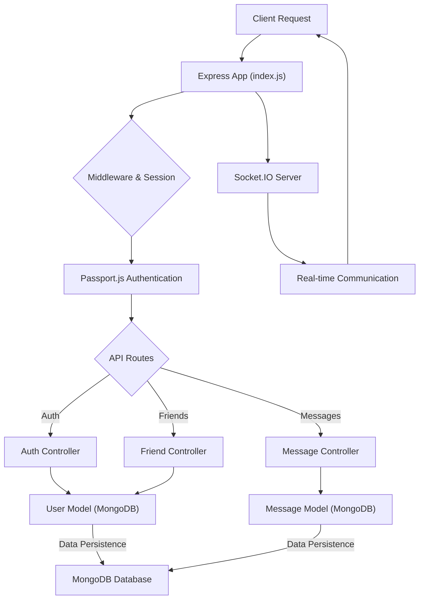
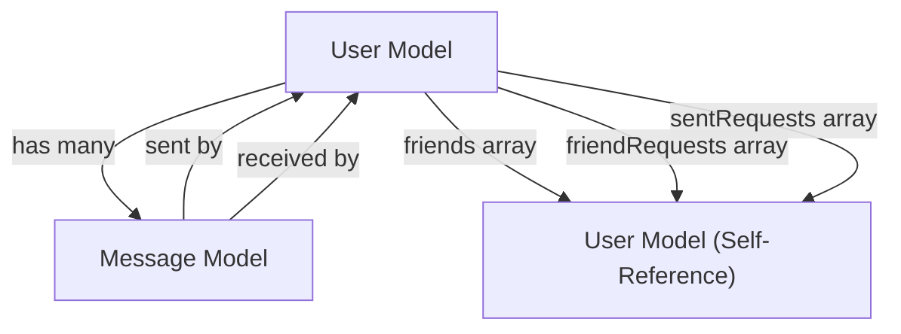

 # Backend Architecture

The backend of this application is built with Node.js and Express, leveraging MongoDB as its primary data store. It's designed to be robust and scalable, handling user authentication, real-time messaging, and friend management functionalities. This document provides an in-depth look into the core components, their interactions, and the underlying data models.

## Core Services and Structure

The backend is structured around modular components, with `backend/src/index.js` serving as the application's entry point, orchestrating middleware, routes, and initiating the server and database connections.

### Application Entry Point

The `index.js` file sets up the Express application, configures essential middleware, and defines API routes. It integrates `socket.io` for real-time communication and `passport.js` for authentication, providing a comprehensive backend experience.

```javascript
// backend/src/index.js - Server setup and middleware
import express from "express";
import cors from "cors";
import authRoutes from "./routes/auth.route.js";
// ... other imports ...

const __dirname = path.resolve();
dotenv.config();

configurePassport(); // Initializes Passport.js strategies

app.use(cookieParser());
app.use(express.json({limit : '2mb'}));
app.use(express.urlencoded({ limit: '2mb', extended: true }));
app.use(cors({
    origin: "http://localhost:5173",
    credentials: true,
}));

// Session and Passport.js for authentication
app.use(session({
    secret: process.env.SESSION_SECRET,
    resave: false,
    saveUninitialized: false,
    cookie: {
        secure: process.env.NODE_ENV === "production",
        httpOnly: true,
        maxAge: 7 * 24 * 60 * 60 * 1000
    }
}));
app.use(passport.initialize());
app.use(passport.session());

// API Routes
app.use("/api/auth", authRoutes );
app.use("/api/messages", messageRoutes );
app.use("/api/friends", friendRoutes);

// ... production static file serving ...

server.listen(PORT, () => {
    console.log("server is running on PORT: " + String(PORT));
    connectDB(); // Connects to MongoDB
});
```
This snippet demonstrates the initial setup, including middleware for parsing requests, handling CORS, and establishing session management with Passport.js. It also shows the routing for different API endpoints.
[View on GitHub](https://github.com/shinymack/Chat-App-MERN/blob/main/backend/src/index.js#L1-L69)

### Database Connection

MongoDB is used as the primary data store, managed through Mongoose. The `connectDB` function ensures a robust connection to the database.

```javascript
// backend/src/lib/db.js - MongoDB Connection
import mongoose from "mongoose"

export const connectDB = async () => {
  try {
    const conn = await mongoose.connect(process.env.MONGODB_URI);
    console.log(`MongoDB connected:  ${conn.connection.host}`);
  }
  catch(error){
    console.log("MongoDB connection error: ", error);
  }
}
```
The `connectDB` function in `backend/src/lib/db.js` is responsible for establishing the connection to MongoDB. It uses `mongoose.connect` with the URI from environment variables, ensuring secure and flexible configuration.
[View on GitHub](https://github.com/shinymack/Chat-App-MERN/blob/main/backend/src/lib/db.js#L1-L10)

### Backend Service Flow

The following diagram illustrates the high-level flow of requests through the backend services.





## Data Models

The application utilizes Mongoose schemas to define the structure and relationships of its data, specifically for users and messages.

### User Model

The `User` model (`backend/src/models/user.model.js`) represents users in the system, storing crucial information such as authentication details, profile data, and social connections (friends, friend requests).

```javascript
// backend/src/models/user.model.js - User Schema Definition
import mongoose from "mongoose"

const  userSchema = new mongoose.Schema(
    {
        email: {
            type: String,
            required: true,
            unique: true
        },
        username: {
            type: String,
            required: [true, "Username is required"],
            unique: true,
            trim: true,
            minlength: [3, "Username must be at least 3 characters long"],
            maxlength: [20, "Username cannot be more than 20 characters long"]
        },
        password: {
            type: String,
            minlength: 6,
        },
        profilePic: {
            type: String,
            default: "",
        },
        friends: [{
            type: mongoose.Schema.Types.ObjectId,
            ref: "User",
            default: []
        }],
        friendRequests: [{ // Incoming friend requests
            type: mongoose.Schema.Types.ObjectId,
            ref: "User",
            default: []
        }],
        sentRequests: [{ // Outgoing friend requests
            type: mongoose.Schema.Types.ObjectId,
            ref: "User",
            default: []
        }],
        authProvider: {
            type: String,
            enum: ['email', 'google'],
            default: 'email'
        },
        googleId: {
            type: String,
            unique: true,
            sparse: true
        },
    },
    {
        timestamps: true
    }
);
// Pre-save hook for handling password for Google authenticated users
userSchema.pre('save', async function(next) {
    if (this.authProvider === 'google' && !this.isModified('password')) {
        this.password = undefined;
    }
    if (this.authProvider === 'email' && !this.password && this.isNew) {
        return next(new Error('Password is required for email signup.'));
    }
    next();
});

const User = mongoose.model("User", userSchema);

export default User;
```
This schema defines various fields for a user, including `email`, `username`, `password`, `profilePic`, and arrays for managing `friends`, `friendRequests`, and `sentRequests`. It also includes `authProvider` and `googleId` for supporting different authentication methods. A `pre('save')` hook is implemented to manage password requirements based on the authentication provider.
[View on GitHub](https://github.com/shinymack/Chat-App-MERN/blob/main/backend/src/models/user.model.js#L1-L79)

### Message Model

The `Message` model (`backend/src/models/message.model.js`) stores individual messages exchanged between users.

```javascript
// backend/src/models/message.model.js - Message Schema Definition
import express from "express"; // This import is not actually used in this file.
import mongoose from "mongoose";

const messageSchema = new mongoose.Schema(
    {
     senderId: {
        type: mongoose.Schema.Types.ObjectId,
        ref: "User",
        required: true,
     },
     receiverId: {
        type: mongoose.Schema.Types.ObjectId,
        ref: "User",
        required: true,
     },
     text: {
        type: String,
     },
     image: {
        type: String,
     },
    },
    {timestamps: true}
);

export default mongoose.model("Message", messageSchema);
```
The `messageSchema` captures the essential details of a message, including `senderId` and `receiverId` (referencing the `User` model), the message `text`, and an optional `image` URL. The `timestamps: true` option automatically adds `createdAt` and `updatedAt` fields.
[View on GitHub](https://github.com/shinymack/Chat-App-MERN/blob/main/backend/src/models/message.model.js#L1-L26)

## Key Integration Points

### Authentication Flow with Passport.js

The backend employs Passport.js for flexible authentication. It supports local (email/password) and Google OAuth strategies, configured in `backend/src/lib/passport.config.js`.

```javascript
// backend/src/lib/passport.config.js (conceptual snippet, not provided in content but referenced)
import passport from 'passport';
import { Strategy as LocalStrategy } from 'passport-local';
import GoogleStrategy from 'passport-google-oauth20';
import User from '../models/user.model.js';
// ... other imports and configuration ...

export const configurePassport = () => {
    passport.use(new LocalStrategy(
        { usernameField: 'email' },
        async (email, password, done) => {
            // Logic to find user by email and validate password
        }
    ));

    passport.use(new GoogleStrategy({
        clientID: process.env.GOOGLE_CLIENT_ID,
        clientSecret: process.env.GOOGLE_CLIENT_SECRET,
        callbackURL: "/api/auth/google/callback"
    },
    async (accessToken, refreshToken, profile, done) => {
        // Logic to find or create user based on Google profile
    }));

    passport.serializeUser((user, done) => {
        done(null, user.id);
    });

    passport.deserializeUser(async (id, done) => {
        try {
            const user = await User.findById(id);
            done(null, user);
        } catch (err) {
            done(err, null);
        }
    });
};
```
This conceptual snippet illustrates how Passport.js is configured for local and Google authentication. `serializeUser` and `deserializeUser` handle how user information is stored in and retrieved from the session. The `authRoutes` then use these strategies to authenticate users.
[View on GitHub](https://github.com/shinymack/Chat-App-MERN/blob/main/backend/src/lib/passport.config.js) (Note: This file's content was not provided, but its existence and purpose are inferred from `index.js`).

### Socket.IO for Real-time Messaging

Real-time features like instant messaging are powered by `socket.io`. The server integration is handled within `backend/src/lib/socket.js` (referenced in `index.js`).

```javascript
// backend/src/lib/socket.js (conceptual snippet, not provided in content but referenced)
import { Server } from "socket.io";
import http from "http";
import express from "express";

const app = express();
const server = http.createServer(app);
const io = new Server(server, {
    cors: {
        origin: ["http://localhost:5173"],
        methods: ["GET", "POST"]
    }
});

const userSocketMap = {}; // {userId: socketId}

io.on("connection", (socket) => {
    console.log("a user connected", socket.id);

    const userId = socket.handshake.query.userId;
    if (userId != "undefined") userSocketMap[userId] = socket.id;

    io.emit("getOnlineUsers", Object.keys(userSocketMap));

    socket.on("disconnect", () => {
        console.log("user disconnected", socket.id);
        delete userSocketMap[userId];
        io.emit("getOnlineUsers", Object.keys(userSocketMap));
    });
});

export { app, io, server };
```
This snippet conceptually outlines the `socket.io` setup. It initializes a `socket.io` server, manages connected users with a `userSocketMap`, and broadcasts online user status. This allows for real-time updates for message delivery and online presence.
[View on GitHub](https://github.com/shinymack/Chat-App-MERN/blob/main/backend/src/lib/socket.js) (Note: This file's content was not provided, but its existence and purpose are inferred from `index.js`).

### Data Model Relationships

The `User` and `Message` models are interconnected to facilitate communication and social interactions.





This diagram visualizes the relationships between the `User` and `Message` models. A `User` can send and receive many `Messages`. Crucially, the `User` model also self-references for managing `friends`, `friendRequests`, and `sentRequests` lists, establishing the social graph within the application.

### Production Environment Setup

For deployment, the `index.js` file includes logic to serve the static frontend assets from the `../frontend/dist` directory.

```javascript
// backend/src/index.js - Production Static File Serving
// ... existing imports and app setup ...

if(process.env.NODE_ENV === "production"){
    app.use(express.static(path.join(__dirname, "../frontend/dist")));

    app.get("*" , (req, res) => {
        res.sendFile(path.join(__dirname,"../frontend", "dist","index.html"));
    })
}

// ... server listen ...
```
This block ensures that in a production environment, the Express server also serves the compiled frontend application. Requests that do not match any API routes are directed to the `index.html` of the frontend, allowing for client-side routing.
[View on GitHub](https://github.com/shinymack/Chat-App-MERN/blob/main/backend/src/index.js#L54-L61)

The backend architecture is designed to be modular and scalable, with clear responsibilities for each component, ensuring maintainability and robust performance for the application.