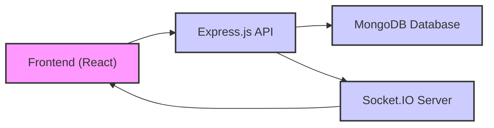

# Backend Architecture

This document details the backend architecture of the Chat-App-MERN project. The backend is built using Node.js, Express.js, and MongoDB, following the MERN stack principles. It handles user authentication, real-time messaging, and friend management.

## Core Technologies

*   **Node.js:** The runtime environment for executing JavaScript server-side.
*   **Express.js:** A web application framework providing a robust set of features for building web applications and APIs.
*   **MongoDB:** A NoSQL database used to store application data. Mongoose is used as the ODM (Object Data Modeling) library to interact with MongoDB.
*   **Socket.IO:** A library that enables real-time, bidirectional communication between web clients and servers.
*   **JSON Web Tokens (JWT):** Used for secure authentication and authorization.
*   **bcryptjs:** Used for hashing passwords for secure storage.
*   **Cloudinary:** For cloud based media management.
*   **Passport:** Authentication middleware for Node.js.

The following table summarizes the key technologies used in the backend:

| Technology    | Purpose                                       |
|---------------|-----------------------------------------------|
| Node.js       | Server-side runtime environment                |
| Express.js    | Web application framework                      |
| MongoDB       | NoSQL database                                |
| Mongoose      | MongoDB ODM                                   |
| Socket.IO     | Real-time communication                       |
| JWT           | Authentication and authorization             |
| bcryptjs      | Password hashing                              |
| Cloudinary    | Media management                              |
| Passport      | Authentication Middleware                     |

## Key Components

The backend is structured into several key components, each responsible for a specific aspect of the application's functionality:

*   **Authentication:** Manages user registration, login, and session management.
*   **Messaging:** Handles the sending, receiving, and storage of messages.
*   **Friend Management:** Allows users to add, remove, and manage their friends.
*   **Database:** Stores all application data, including user information, messages, and friend lists.
*   **Socket Server:** Handles real-time communication between clients.

## Backend Structure

The backend directory structure is organized as follows:

```
backend/
├── src/
│   ├── index.js          # Main entry point of the application
│   ├── lib/
│   │   ├── db.js           # Database connection setup
│   │   └── socket.js       # Socket.IO configuration
│   ├── middlewares/
│   │   └── protectRoute.js # Middleware for route protection
│   ├── models/
│   │   ├── user.model.js    # User model
│   │   └── message.model.js # Message model
│   ├── controllers/
│   │   ├── auth.controller.js  # Authentication controllers
│   │   └── message.controller.js # Message controllers
│   ├── routes/
│   │   ├── auth.route.js     # Authentication routes
│   │   ├── message.route.js  # Message routes
│   │   └── friend.route.js   # Friend routes
│   └── utils/
│       └── generateToken.js # Utility for generating JWT tokens
├── package.json      # Project dependencies and scripts
└── .env              # Environment variables
```

### Main Entry Point (`backend/src/index.js`)

This file is the main entry point of the backend application. It initializes the Express.js server, connects to the database, configures middleware, defines routes, and starts the server.

```javascript
import express from "express";
import cors from "cors";
import authRoutes from "./routes/auth.route.js";
import messageRoutes from "./routes/message.route.js";
import friendRoutes from "./routes/friend.route.js";
import path from "path";
import dotenv from "dotenv";
import cookieParser from "cookie-parser";
import { connectDB } from "./lib/db.js";
import { app, server } from "./lib/socket.js";
import session from "express-session";
import passport from "passport";
import { configurePassport } from "./lib/passport.config.js";

const __dirname = path.resolve();
dotenv.config();
configurePassport();

app.use(cookieParser());
app.use(express.json({limit : '2mb'}));
app.use(express.urlencoded({ limit: '2mb', extended: true }));
app.use(cors({
    origin: "http://localhost:5173",
    credentials: true,
}));

app.use(session({
    secret: process.env.SESSION_SECRET, 
    resave: false,
    saveUninitialized: false, 
    cookie: {
        secure: process.env.NODE_ENV === "production", // true in production (HTTPS)
        httpOnly: true,
        maxAge: 7 * 24 * 60 * 60 * 1000 
    }
}));

app.use(passport.initialize());
app.use(passport.session());  

app.use("/api/auth", authRoutes );
app.use("/api/messages", messageRoutes );
app.use("/api/friends", friendRoutes);


const PORT = process.env.PORT;
if(process.env.NODE_ENV === "production"){
    app.use(express.static(path.join(__dirname, "../frontend/dist")));
    
    app.get("*" , (req, res) => {
        res.sendFile(path.join(__dirname,"../frontend", "dist","index.html"));
    })
}

server.listen(PORT, () => {
    console.log("server is running on PORT: " + String(PORT));
    connectDB();
});
```

[View on GitHub](https://github.com/shinymack/Chat-App-MERN/blob/main/backend/src/index.js)

### Database Connection (`backend/src/lib/db.js`)

This file establishes the connection to the MongoDB database using Mongoose.

```javascript
import mongoose from "mongoose"

export const connectDB = async () => {
  try {
    const conn = await mongoose.connect(process.env.MONGODB_URI);
    console.log(`MongoDB connected:  ${conn.connection.host}`);
  }
  catch(error){
    console.log("MongoDB connection error: ", error);
  }
}
```

[View on GitHub](https://github.com/shinymack/Chat-App-MERN/blob/main/backend/src/lib/db.js)

### Authentication Routes (`backend/src/routes/auth.route.js`)

This file defines the routes for user authentication, including registration, login, and logout.

```javascript
import express from 'express';
import { login, logout, signup, googleAuth, getAuthURL } from "../controllers/auth.controller.js";
import passport from 'passport';

const router = express.Router();

router.post("/signup", signup);
router.post("/login", login);
router.post("/logout", logout);

router.get('/google/url', getAuthURL);
router.get('/google/callback', passport.authenticate('google', {
    successRedirect: 'http://localhost:5173', // Replace with your actual success redirect URL
    failureRedirect: '/login'  // Redirect to login page or handle failure as needed
}));

export default router;
```

[View on GitHub](https://github.com/shinymack/Chat-App-MERN/blob/main/backend/src/routes/auth.route.js)

### Message Routes (`backend/src/routes/message.route.js`)

This file defines the routes for handling messages, including sending and retrieving messages.

```javascript
import express from "express";
import { getMessages, sendMessage } from "../controllers/message.controller.js";
import { protectRoute } from "../middlewares/protectRoute.js";

const router = express.Router();

router.get("/:id", protectRoute, getMessages);
router.post("/send/:id", protectRoute, sendMessage);

export default router;
```

[View on GitHub](https://github.com/shinymack/Chat-App-MERN/blob/main/backend/src/routes/message.route.js)

### Message Controller (`backend/src/controllers/message.controller.js`)
This file contains the logic for managing messages.

```javascript
import Message from "../models/message.model.js";

export const sendMessage = async (req, res) => {
    try {
        const { message } = req.body;
        const { id: receiverId } = req.params;
        const senderId = req.user._id;

        let newMessage = new Message({
            senderId,
            receiverId,
            message,
        });

        if (newMessage) {
            await newMessage.save();
            res.status(201).json(newMessage);
        } else {
            res.status(400).json({ error: "Invalid data" });
        }
    } catch (error) {
        console.log("Error in sendMessage controller: ", error.message);
        res.status(500).json({ error: "Internal server error" });
    }
};

export const getMessages = async (req, res) => {
    try {
        const { id: userToChatId } = req.params;
        const senderId = req.user._id;

        const messages = await Message.find({
            $or: [
                { senderId: senderId, receiverId: userToChatId },
                { senderId: userToChatId, receiverId: senderId },
            ],
        }).sort({ createdAt: 1 });

        res.status(200).json(messages);
    } catch (error) {
        console.log("Error in getMessages controller: ", error.message);
        res.status(500).json({ error: "Internal server error" });
    }
};
```

[View on GitHub](https://github.com/shinymack/Chat-App-MERN/blob/main/backend/src/controllers/message.controller.js)

### Socket.IO Integration (`backend/src/lib/socket.js`)

The backend uses Socket.IO for real-time communication. The `socket.js` file configures the Socket.IO server and handles socket connections.

```javascript
import { Server } from "socket.io";
import http from 'http';
import express from 'express';

const app = express();
const server = http.createServer(app);
const io = new Server(server, {
    cors: {
        origin: "http://localhost:5173",
        methods: ["GET", "POST"]
    }
});

io.on("connection", (socket) => {
    console.log("User connected", socket.id);

    socket.on("disconnect", () => {
        console.log("User disconnected", socket.id);
    });
});

export { io, app, server };
```

[View on GitHub](https://github.com/shinymack/Chat-App-MERN/blob/main/backend/src/lib/socket.js)

## Data Flow





## Key Integration Points

*   **Frontend-Backend Communication:** The frontend communicates with the backend using HTTP requests for authentication and data retrieval. Socket.IO is used for real-time messaging.
*   **Authentication Flow:** When a user logs in, the backend authenticates the user and returns a JWT. The frontend stores this token and uses it for subsequent requests to protected routes.
*   **Real-time Messaging:** When a user sends a message, the frontend sends the message to the backend via an HTTP request. The backend saves the message to the database and emits a Socket.IO event to notify the recipient. The recipient's client receives the event and displays the new message.

## Best Practices

*   **Secure Authentication:** Use strong password hashing algorithms (e.g., bcryptjs) and JWTs to protect user credentials.
*   **Input Validation:** Validate all user input to prevent security vulnerabilities such as SQL injection and cross-site scripting (XSS).
*   **Error Handling:** Implement comprehensive error handling to gracefully handle unexpected errors and prevent application crashes.
*   **Code Organization:** Follow a consistent code style and directory structure to improve code readability and maintainability.
*   **Environment Variables:** Use environment variables to store sensitive information such as database credentials and API keys.
```