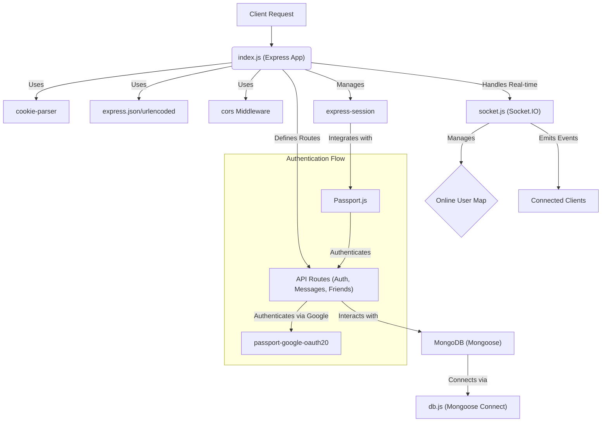
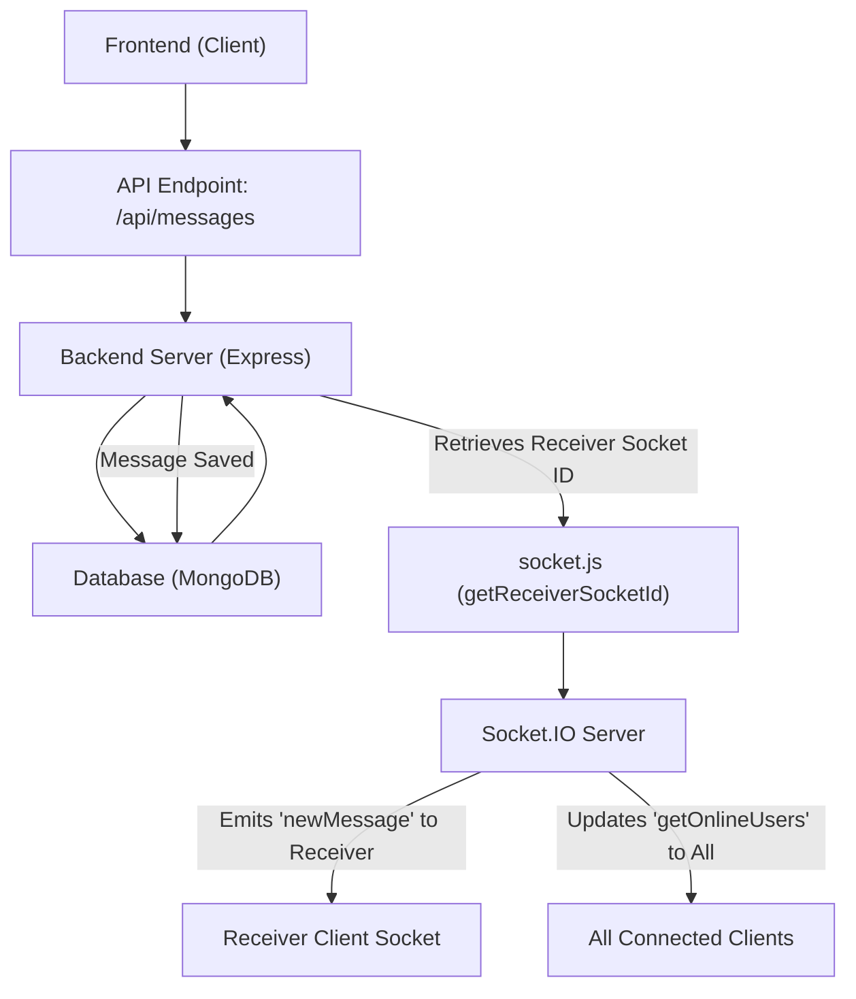

 # Backend Architecture

The backend of this chat application is designed to provide robust, real-time communication capabilities, secure user management, and efficient message handling. Built on Node.js and Express, it leverages MongoDB for data persistence and Socket.IO for real-time bidirectional communication. This section details the core components, technology stack, and key services that enable the application's server-side operations.

## Core Technology Stack

The `backend/package.json` file reveals the primary technologies powering the server. These choices reflect a modern, scalable, and efficient approach to web service development.

### Dependencies

Here's a breakdown of the key dependencies and their roles:

| Dependency            | Version | Description                                                                                                                                                                                                                                |
| :-------------------- | :------ | :----------------------------------------------------------------------------------------------------------------------------------------------------------------------------------------------------------------------------------------- |
| `express`             | `~4.21` | Fast, unopinionated, minimalist web framework for Node.js, forming the backbone of the API.                                                                                                                                                  |
| `mongoose`            | `~8.9`  | MongoDB object data modeling (ODM) for Node.js, simplifying database interactions and schema definition.                                                                                                                                      |
| `socket.io`           | `~4.8`  | Enables real-time, bidirectional, event-based communication between clients and the server, crucial for chat functionality.                                                                                                                  |
| `bcryptjs`            | `~2.4`  | Library for hashing passwords, ensuring secure storage of user credentials.                                                                                                                                                                  |
| `jsonwebtoken`        | `~9.0`  | Used for creating, signing, and verifying JSON Web Tokens, facilitating secure API authentication and authorization.                                                                                                                         |
| `cookie-parser`       | `~1.4`  | Parses incoming request cookies into a `req.cookies` object, essential for session management and token handling.                                                                                                                            |
| `dotenv`              | `~16.4` | Loads environment variables from a `.env` file into `process.env`, managing sensitive configurations like database URIs and JWT secrets.                                                                                                     |
| `express-session`     | `~1.18` | Middleware for handling sessions, allowing for persistent user data across requests.                                                                                                                                                         |
| `passport`            | `~0.7`  | Authentication middleware for Node.js, providing comprehensive authentication strategies.                                                                                                                                                    |
| `passport-google-oauth20`| `~2.0` | Passport strategy for authenticating with Google using the OAuth 2.0 API, enabling social login.                                                                                                                                             |
| `cloudinary`          | `~2.5`  | Cloud-based image and video management service, likely used for handling user profile pictures or media attachments in chats.                                                                                                                |
| `cors`                | `~2.8`  | Provides a Connect/Express middleware that can be used to enable Cross-Origin Resource Sharing (CORS) with various options.                                                                                                                  |

<details>
<summary>View `backend/package.json`</summary>

```json
{
  "name": "backend",
  "version": "1.0.0",
  "main": "src/index.js",
  "scripts": {
    "dev": "nodemon src/index.js",
    "start": "node src/index.js"
  },
  "author": "",
  "type": "module",
  "license": "ISC",
  "description": "",
  "dependencies": {
    "bcryptjs": "^2.4.3",
    "cloudinary": "^2.5.1",
    "cookie-parser": "^1.4.7",
    "dotenv": "^16.4.7",
    "express": "^4.21.2",
    "express-session": "^1.18.1",
    "jsonwebtoken": "^9.0.2",
    "mongoose": "^8.9.5",
    "passport": "^0.7.0",
    "passport-google-oauth20": "^2.0.0",
    "socket.io": "^4.8.1"
  },
  "devDependencies": {
    "nodemon": "^3.1.9"
  }
}
```
[View on GitHub](https://github.com/shinymack/Chat-App-MERN/blob/main/backend/package.json)
</details>

## Application Entry Point (`backend/src/index.js`)

The `index.js` file is the heart of the backend, responsible for initializing the Express application, configuring middleware, defining API routes, and establishing connections to the database and Socket.IO server.

### Server Initialization and Middleware

The application sets up various middleware for essential functionalities:

*   **`dotenv.config()`**: Loads environment variables, ensuring sensitive data is handled securely.
*   **`cookieParser()`**: Parses cookies attached to the client request object.
*   **`express.json()` and `express.urlencoded()`**: Parse incoming JSON and URL-encoded payloads, respectively, with a limit of 2MB to prevent large data attacks.
*   **`cors()`**: Configures Cross-Origin Resource Sharing to allow requests from the frontend application (`http://localhost:5173` in development).
*   **`express-session()`**: Manages user sessions, integrating with Passport.js for stateful authentication.
*   **`passport.initialize()` and `passport.session()`**: Initialize Passport for authentication and ensure session support.

```javascript
// From backend/src/index.js
import express from "express";
import cors from "cors";
// ... other imports ...
import { app, server } from "./lib/socket.js";
import session from "express-session";
import passport from "passport";
import { configurePassport } from "./lib/passport.config.js";

const __dirname = path.resolve();
dotenv.config();

configurePassport();

app.use(cookieParser());
app.use(express.json({limit : '2mb'}));
app.use(express.urlencoded({ limit: '2mb', extended: true }));
app.use(cors({
    origin: "http://localhost:5173",
    credentials: true,
}));

app.use(session({
    secret: process.env.SESSION_SECRET, 
    resave: false,
    saveUninitialized: false, 
    cookie: {
        secure: process.env.NODE_ENV === "production", // true in production (HTTPS)
        httpOnly: true,
        maxAge: 7 * 24 * 60 * 60 * 1000 
    }
}));

app.use(passport.initialize());
app.use(passport.session());  
```
[View on GitHub](https://github.com/shinymack/Chat-App-MERN/blob/main/backend/src/index.js#L14-L44)

### API Routes

The backend defines modular routes for different application concerns:

*   `/api/auth`: Handles user authentication, registration, login, logout, and potentially Google OAuth.
*   `/api/messages`: Manages sending, receiving, and retrieving chat messages.
*   `/api/friends`: Deals with friend-related operations like adding, removing, or listing friends.

```javascript
// From backend/src/index.js
app.use("/api/auth", authRoutes );
app.use("/api/messages", messageRoutes );
app.use("/api/friends", friendRoutes);
```
[View on GitHub](https://github.com/shinymack/Chat-App-MERN/blob/main/backend/src/index.js#L46-L48)

### Production Deployment Setup

For production environments, the backend also serves the static frontend assets. This approach simplifies deployment by allowing a single server to host both the API and the client-side application.

```javascript
// From backend/src/index.js
const PORT = process.env.PORT;
if(process.env.NODE_ENV === "production"){
    app.use(express.static(path.join(__dirname, "../frontend/dist")));
    
    app.get("*" , (req, res) => {
        res.sendFile(path.join(__dirname,"../frontend", "dist","index.html"));
    })
}
```
[View on GitHub](https://github.com/shinymack/Chat-App-MERN/blob/main/backend/src/index.js#L50-L56)

Finally, the server starts listening on the configured port, and the MongoDB connection is initiated.

## Database Connection (`backend/src/lib/db.js`)

The `db.js` file establishes and manages the connection to MongoDB using Mongoose. The `connectDB` function attempts to connect to the database specified by `process.env.MONGODB_URI` and logs the connection status or any errors encountered.

```javascript
// From backend/src/lib/db.js
import mongoose from "mongoose"

export const connectDB = async () => {
  try {
    const conn = await mongoose.connect(process.env.MONGODB_URI);
    console.log(`MongoDB connected:  ${conn.connection.host}`);
  }
  catch(error){
    console.log("MongoDB connection error: ", error);
  }
}
```
[View on GitHub](https://github.com/shinymack/Chat-App-MERN/blob/main/backend/src/lib/db.js)

## Real-time Communication (`backend/src/lib/socket.js`)

The `socket.js` file is crucial for the real-time chat features, leveraging Socket.IO. It initializes the Socket.IO server, manages online users, and handles connections and disconnections.

### Socket.IO Server Setup

An HTTP server is created using the Express `app` instance, and the Socket.IO server is then attached to this HTTP server. CORS is configured specifically for Socket.IO to allow connections from the frontend.

```javascript
// From backend/src/lib/socket.js
import { Server } from "socket.io";
import http from "http";
import express from "express";

const app = express();

const server = http.createServer(app);

const io = new Server(server, {
    cors: {
        origin: ["http://localhost:5173"]
    }
})
```
[View on GitHub](https://github.com/shinymack/Chat-App-MERN/blob/main/backend/src/lib/socket.js#L1-L12)

### Online User Management

A `userSocketMap` object keeps track of which `userId` is connected via which `socket.id`. This map is used to efficiently determine online users and to send messages to specific users.

*   When a user connects, their `userId` (obtained from the handshake query) is mapped to their `socket.id`.
*   The `getOnlineUsers` event is emitted to all connected clients, updating the list of online users.
*   When a user disconnects, their entry is removed from the map, and the `getOnlineUsers` event is re-emitted.

```javascript
// From backend/src/lib/socket.js
// used to store online users
const userSocketMap = {}; //{userId : socketId}

io.on("connection", (socket) => {
    console.log("A user connected", socket.id);

    const userId = socket.handshake.query.userId;
    if(userId) userSocketMap[userId] = socket.id;

    io.emit("getOnlineUsers", Object.keys(userSocketMap));

    socket.on("disconnect", ()=>{
        console.log("A user disconnected", socket.id);
        delete userSocketMap[userId]; 
        io.emit("getOnlineUsers", Object.keys(userSocketMap));
    })
})

export function getReceiverSocketId(userId) {
    return userSocketMap[userId];
}
```
[View on GitHub](https://github.com/shinymack/Chat-App-MERN/blob/main/backend/src/lib/socket.js#L19-L35)

## Backend Component Interaction Diagram

This diagram illustrates how different backend components interact, from the entry point to database and real-time services.





## Key Integration Points

The backend architecture is designed around several key integration points to ensure seamless functionality:

### Express and Socket.IO Coexistence

The `socket.js` file exports `app`, `server`, and `io`, allowing `index.js` to start the HTTP server (which serves both Express routes and Socket.IO connections) on a single port. This is a common and efficient pattern for MERN stack applications that require both RESTful APIs and real-time features.

### Authentication Flow with Passport.js

The integration of `express-session` with `passport.initialize()` and `passport.session()` creates a robust authentication system. `passport-google-oauth20` extends this to support social logins, abstracting away the complexities of OAuth 2.0. Upon successful authentication, user sessions are managed securely using cookies.

### Real-time Messaging and User Status

The `userSocketMap` in `socket.js` is critical for enabling direct messaging and broadcasting online user status. When a message is sent via the `/api/messages` route, the backend can use `getReceiverSocketId()` to find the recipient's socket and emit the message in real-time. Similarly, the `getOnlineUsers` event keeps the frontend updated on who is currently active.





This comprehensive backend structure supports the dynamic nature of a chat application, providing both reliable API services and responsive real-time communication.