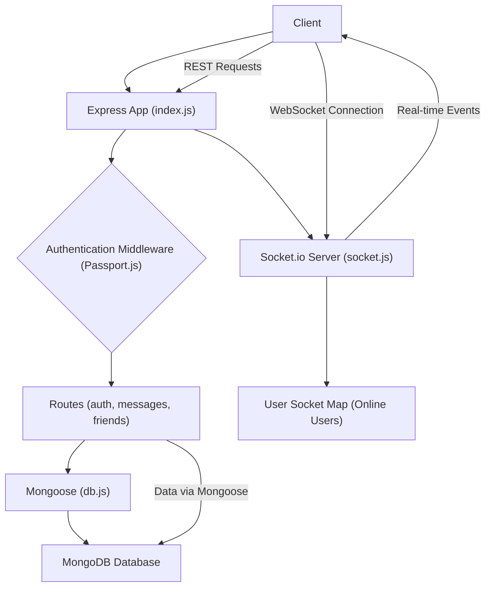

 # Backend Architecture

The backend of this application is engineered to provide a robust, scalable, and real-time communication platform. It handles user authentication, message processing, friend management, and live updates via WebSockets. Built primarily with Node.js and Express, it leverages MongoDB as its database and Socket.io for interactive features.

## Technology Stack

The server-side uses a modern JavaScript stack, emphasizing performance and ease of development. Key technologies and dependencies identified from `backend/package.json` include:

*   **Node.js & Express.js**: The foundation for building RESTful APIs.
*   **MongoDB & Mongoose**: A NoSQL database for flexible data storage, managed by Mongoose ORM.
*   **Socket.io**: Enables real-time, bidirectional communication between clients and the server for features like live chat and online user status.
*   **Passport.js**: A flexible authentication middleware for Node.js, integrated with strategies for local (JWT/bcryptjs) and Google OAuth.
*   **JWT & bcryptjs**: For secure user authentication and password hashing.
*   **Cookie-parser & express-session**: Middleware for managing HTTP cookies and user sessions.
*   **Cloudinary**: For cloud-based image and video management (though not explicitly used in provided snippets, it's a dependency).
*   **Dotenv**: For managing environment variables securely.

## Core Components and Structure

The backend is organized into a clear structure, separating concerns and enhancing maintainability.

### Entry Point: `backend/src/index.js`

This file serves as the main entry point for the backend application. It's responsible for:
*   Initializing the Express application.
*   Configuring essential middleware (CORS, JSON parsing, cookie parsing, session management).
*   Setting up authentication using Passport.js.
*   Defining API routes for authentication, messages, and friends.
*   Connecting to the MongoDB database.
*   Starting the HTTP server, which also hosts the Socket.io server.
*   Serving static frontend assets in production.

Below is a snippet demonstrating the middleware and route setup:

```javascript
// backend/src/index.js (lines 28-56)
import express from "express";
import cors from "cors";
import authRoutes from "./routes/auth.route.js";
import messageRoutes from "./routes/message.route.js";
import friendRoutes from "./routes/friend.route.js";
// ... other imports ...

app.use(cookieParser());
app.use(express.json({limit : '2mb'}));
app.use(express.urlencoded({ limit: '2mb', extended: true }));
app.use(cors({
    origin: "http://localhost:5173",
    credentials: true,
}));

app.use(session({
    secret: process.env.SESSION_SECRET, 
    resave: false,
    saveUninitialized: false, 
    cookie: {
        secure: process.env.NODE_ENV === "production", // true in production (HTTPS)
        httpOnly: true,
        maxAge: 7 * 24 * 60 * 60 * 1000 
    }
}));

app.use(passport.initialize());
app.use(passport.session());  

app.use("/api/auth", authRoutes );
app.use("/api/messages", messageRoutes );
app.use("/api/friends", friendRoutes);
```
This section highlights the Express application's configuration, including middleware for parsing requests, handling CORS, and setting up session management with `express-session` and `passport.js`. The API routes are mounted, directing requests to their respective handlers.
[View on GitHub](https://github.com/shinymack/Chat-App-MERN/blob/main/backend/src/index.js#L28-L56)

### Database Connection: `backend/src/lib/db.js`

This utility file is dedicated to establishing and managing the connection to MongoDB using Mongoose. It exports a `connectDB` function that initializes the database connection, logging success or failure.

```javascript
// backend/src/lib/db.js (lines 1-10)
import mongoose from "mongoose"

export const connectDB = async () => {
  try {
    const conn = await mongoose.connect(process.env.MONGODB_URI);
    console.log(`MongoDB connected:  ${conn.connection.host}`);
  }
  catch(error){
    console.log("MongoDB connection error: ", error);
  }
}
```
The `connectDB` function provides a robust way to connect to MongoDB, including error handling. It uses environment variables for the connection URI, ensuring sensitive data is not hardcoded.
[View on GitHub](https://github.com/shinymack/Chat-App-MERN/blob/main/backend/src/lib/db.js#L1-L10)

### Real-time Communication: `backend/src/lib/socket.js`

This module sets up and manages the Socket.io server, enabling real-time features such as live chat and online user presence. It integrates with the main Express application and HTTP server from `index.js`.

```javascript
// backend/src/lib/socket.js (lines 10-33)
const io = new Server(server, {
    cors: {
        origin: ["http://localhost:5173"]
    }
})

export function getReceiverSocketId(userId) {
    return userSocketMap[userId];
}

// used to store online users
const userSocketMap = {}; //{userId : socketId}

io.on("connection", (socket) => {
    console.log("A user connected", socket.id);

    const userId = socket.handshake.query.userId;
    if(userId) userSocketMap[userId] = socket.id;

    io.emit("getOnlineUsers", Object.keys(userSocketMap));

    socket.on("disconnect", ()=>{
        console.log("A user disconnected", socket.id);
        delete userSocketMap[userId]; 
        io.emit("getOnlineUsers", Object.keys(userSocketMap));
    })
})
```
This snippet details the Socket.io server initialization, including CORS configuration. It also shows the `userSocketMap` which tracks online users by mapping `userId` to `socketId`, and the event listeners for `connection` and `disconnect` that update and broadcast online user status. The `getReceiverSocketId` function allows specific messages to be sent to individual users.
[View on GitHub](https://github.shinymack/Chat-App-MERN/blob/main/backend/src/lib/socket.js#L10-L33)

### Server Initialization

The main server is started in `backend/src/index.js`, listening on a specified port and ensuring the database connection is established.

```javascript
// backend/src/index.js (lines 66-70)
const PORT = process.env.PORT;
if(process.env.NODE_ENV === "production"){
    // ... static file serving ...
}

server.listen(PORT, () => {
    console.log("server is running on PORT: " + String(PORT));
    connectDB();
});
```
This block shows the server activation. Crucially, `connectDB()` is called *after* the server starts listening, ensuring that the application can serve requests while the database connection is being established. In a production environment, it also configures Express to serve the static frontend build.
[View on GitHub](https://github.com/shinymack/Chat-App-MERN/blob/main/backend/src/index.js#L66-L70)

## Backend Component Interaction

The diagram below illustrates how the main components of the backend interact with each other and external services.





This graph provides a high-level overview of the backend's data flow. The client interacts with the Express application for RESTful requests, which go through authentication middleware and then to specific routes. These routes interact with Mongoose for database operations. Simultaneously, the client establishes a WebSocket connection with the Socket.io server for real-time communication, which manages online users and sends events back to connected clients.

## Key Integration Points

### User Authentication Flow

The authentication process involves several layers, ensuring secure access and session management.


```mermaid
sequenceDiagram
    participant C as "Client"
    participant E as "Express App (index.js)"
    participant P as "Passport.js"
    participant D as "Database (MongoDB)"
    C->>+E: "Login Request (username, password)"
    E->>P: "Authenticate User"
    P->>D: "Verify Credentials"
    D-->>P: "User Found / Not Found"
    P->>-E: "Authentication Result"
    alt Authentication Success
        E->>C: "Set Session Cookie & JWT Token"
    else Authentication Failure
        E->>C: "Error: Unauthorized"
    end
    C->>+E: "Subsequent API Request (with cookie/token)"
    E->>P: "Validate Session/Token"
    P->>-E: "User Context"
    E->>D: "Access Protected Resource"
    D-->>E: "Resource Data"
    E-->>C: "API Response"
```


This sequence diagram details a typical user login and subsequent authenticated request. The client initiates a login request to the Express application. Passport.js handles the authentication logic, verifying credentials against the MongoDB database. Upon successful authentication, the server sets a session cookie (and possibly a JWT token) in the client's browser. Subsequent requests include this cookie/token, allowing Passport.js to validate the user and provide user context to the application, enabling access to protected resources. This flow ensures secure state management across requests.