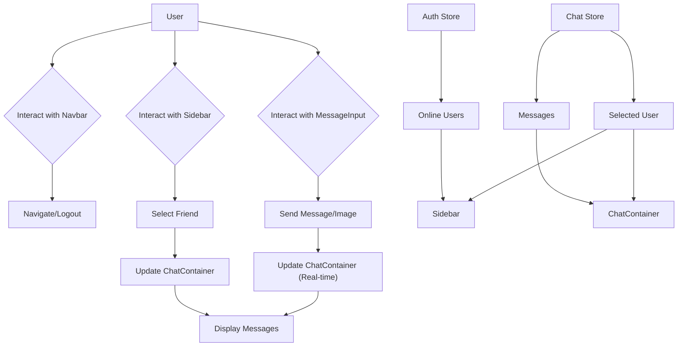

# Component Library

This section details the reusable UI components that form the frontend of the Chat App. These components are designed to be modular, maintainable, and enhance the user experience.

## Navbar

The `Navbar` component provides the application's global navigation. It displays the app logo, name, and links to core sections like Friends, Settings, and User Profile. It also includes a logout button, visible only when a user is authenticated.

```jsx
import { Link } from "react-router-dom";
import { useAuthStore } from "../store/useAuthStore";
import { LogOut, MessageSquare, Settings, User, Users } from "lucide-react";
import { useChatStore } from "../store/useChatStore";

const Navbar = () => {
  const { logout, authUser } = useAuthStore();
  const { toggleFriendsBox } = useChatStore(); 

  return (
    <header
      className=" bg-base-100 border-b border-base-300 fixed w-full top-0 z-40
        backdrop-blur-lg bg-base-100/80"
    >
      <div className="container mx-auto px-4 h-16">
        <div className="flex items-center justify-between h-full">
          <div className="flex items-center gap-8">
            <Link
              to="/"
              className="flex items-center gap-2.5 hover:opacity-80 transition-all"
            >
              <div className="size-9 rounded-lg bg-primary/10 flex items-center justify-center">
                <MessageSquare className="size-5 text-primary"></MessageSquare>
              </div>
              <h1 className="text-lg font-bold">ShinyChat</h1>
            </Link>
          </div>
          <div className="flex items-center gap-4">
            <button className="btn btn-sm gap-2" onClick={toggleFriendsBox}>
              <Users className="size-5" />
              <span className="hidden sm:inline">Friends</span>
            </button>
            <Link to={"/settings"}
            className={`btn btn-sm gap-2 transition-colors`}>
            <Settings className="size-4"/>
            <span className="hidden sm:inline">Settings</span>

            </Link>
            {authUser && (
              <>
                <Link to={"/profile"} className={`btn btn-sm gap-2`}>
                  <User className="size-5" />
                  <span className="hidden sm:inline">Profile</span>
                </Link>

                <button className="btn btn-sm flex gap-2 items-center" onClick={logout}>
                  <LogOut className="size-5" />
                  <span className="hidden sm:inline">Logout</span>
                </button>
              </>
            )}
          </div>
        </div>
      </div>
    </header>
  );
};

export default Navbar;
```

## Sidebar

The `Sidebar` component displays the list of friends or users. It allows users to filter for online friends and selects a user to initiate a chat. It also shows the online status of each user.

```jsx
import { useEffect, useState } from "react";
import { useChatStore } from "../store/useChatStore";
import SidebarSkeleton from "./skeletons/SidebarSkeleton";
import { Users } from "lucide-react";
import { useAuthStore } from "../store/useAuthStore";

const Sidebar = () => {
    const { getFriends, users, selectedUser, setSelectedUser, isUsersLoading } =
        useChatStore();

    const { onlineUsers } = useAuthStore();
    const [showOnlineOnly, setShowOnlineOnly] = useState(false);
    useEffect(() => {
        getFriends();
    }, [getFriends]);
    const filteredUsers = showOnlineOnly
        ? users.filter((user) => onlineUsers.includes(user._id))
        : users;
    if (isUsersLoading) return <SidebarSkeleton />;
    return (
        <div className={`h-full sm:w-72 sm:border-r border-base-300  flex-col transition-all duration-200 ${selectedUser ?
                                    "hidden sm:flex w-[100vw] "
                                    : ""}`}>
            <div className="border-b border-base-300  p-5">
                <div className="flex items-center gap-2">
                    <Users className="size-6"></Users>
                    <span className="font-medium  lg:block">
                        Friends
                    </span>
                </div>
                <div className="mt-3 lg:flex items-center gap-2">
                    <label className="cursor-pointer flex items-center gap-2">
                        <input
                            type="checkbox"
                            checked={showOnlineOnly}
                            onChange={(e) =>
                                setShowOnlineOnly(e.target.checked)
                            }
                            className="checkbox checkbox-sm"
                        />
                        <span className="text-sm">Show online only</span>
                    </label>
                    <span className="text-xs text-zinc-500">
                          ({users.filter(friend => onlineUsers.includes(friend._id)).length} online)
                    </span>
                </div>
                <div className="overflow-y-scroll h-[calc(100vh-14rem)] w-full flex flex-col py-3">
                    {filteredUsers.map((user) => (
                        <button
                            key={user._id}
                            onClick={() => setSelectedUser(user)}
                            className={`sm:w-full w-[88vw] p-3 flex items-center gap-3 hover:bg-base-300 transition-colors
                            ${
                                selectedUser?._id === user._id
                                    ? "bg-base-300 ring-1 ring-base-300"
                                    : ""
                            }`}
                        >
                            <div className="relative mx-0">
                                
                                {onlineUsers.includes(user._id) && (
                                    <span className="absolute bottom-0 right-0 size-3 bg-green-500 rounded-full ring-2 ring-zinc-900" />
                                )}
                            </div>
                            <div className=" block text-left min-w-0">
                                <div className=" font-medium truncate">
                                    {user.username}
                                </div>
                                <div className="text-sm text-zinc-400">
                                    {onlineUsers.includes(user._id)
                                        ? "Online"
                                        : "Offline"}
                                </div>
                            </div>
                        </button>
                    ))}
                </div>
                {filteredUsers.length == 0 && (
                    <div className="text-center text-zinc-500 py-4">No online friends</div>
                )}
            </div>
        </div>
    );
};

export default Sidebar;
```

## ChatContainer

The `ChatContainer` component is responsible for displaying the conversation between the current user and the selected friend. It fetches messages, subscribes to new messages in real-time, and handles message rendering, including images. It also includes loading skeletons and ensures new messages are scrolled into view.

```jsx
import { useEffect } from "react";
import { useChatStore } from "../store/useChatStore";
import ChatHeader from "./ChatHeader";
import MessageInput from "./MessageInput";
import MessageSkeleton from "./skeletons/MessageSkeleton";
import { useAuthStore } from "../store/useAuthStore";
import { formatMessageTime } from "../lib/utils";
import { useRef } from "react";

const ChatContainer = () => {
    const { messages, getMessages, isMessagesLoading, selectedUser, subscribeToMessages, unsubscribeFromMessages } =
        useChatStore();
    const { authUser } = useAuthStore();
    const messageEndRef = useRef(null);


    useEffect(() => {
        getMessages(selectedUser._id);
        subscribeToMessages();

        return () => unsubscribeFromMessages();
    }, [selectedUser._id, getMessages, subscribeToMessages, unsubscribeFromMessages]);
    
    useEffect(() => {
        if(messageEndRef.current && messages){
            messageEndRef.current.scrollIntoView({behaviour : "smooth"})
        }
    }, [messages])

    if (isMessagesLoading)
        return (
            <div className="flex-1 flex flex-col overflow-auto">
                <ChatHeader />
                <MessageSkeleton />
                <MessageInput />
            </div>
        );
    return (
        <div className="flex-1 flex flex-col overflow-auto">
            <ChatHeader />
            <div className="flex-1 overflow-y-auto p-4 space-y-4">
                {messages.map((message) => (
                    <div
                        key={message._id}
                        className={`chat ${message.senderId == authUser._id ? "chat-end": "chat-start"} `}
                        ref={messageEndRef}
                    >
                        <div className="chat-image avatar">
                            <div className="size-9 rounded-full border">
                                
                            </div>
                        </div>
                        <div className="chat-header mb-1">
                            <time className="text-xs opacity-50 ml-1">{formatMessageTime(message.createdAt)}</time>
                        </div>
                        <div className="chat-bubble flex flex-col">
                            {message.image && (
                                
                            )}
                            {message.text && <p>{message.text}</p>}
                        </div>
                    </div>
                ))}
            </div>
            <MessageInput />
        </div>
    );
};

export default ChatContainer;
```

## MessageInput

The `MessageInput` component provides the interface for users to type messages and send attachments. It supports text input and image uploads, with a preview functionality before sending.

```jsx
import { useRef, useState } from "react";
import { useChatStore } from "../store/useChatStore";
import { Image, Send, X } from "lucide-react";
import toast from "react-hot-toast";

const MessageInput = () => {
    const [text, setText] = useState("");
    const [imagePreview, setImagePreview] = useState(null);
    const fileInputRef = useRef(null);
    const { sendMessage } = useChatStore();

    const handleImageChange = (e) => {
        const file = e.target.files[0];
        if (!file.type.startsWith("image/")) {
            toast.error("Please select an image file");
            return;
        }

        const reader = new FileReader();
        reader.onloadend = () => {
            setImagePreview(reader.result);
        };
        reader.readAsDataURL(file);
    };

    const removeImage = () => {
        setImagePreview(null);
        if (fileInputRef.current) fileInputRef.current.value = "";
    };

    const handleSendMessage = async (e) => {
        e.preventDefault();
        if (!text.trim() && !imagePreview) return;

        try {
            await sendMessage({
                text: text.trim(),
                image: imagePreview,
            });

            setText("");
            setImagePreview(null);
            if (fileInputRef.current) fileInputRef.current = "";
        } catch (error) {
            console.error("Failed to send message", error);
        }
    };

    return (
        <div className="p-4 w-full">
            {imagePreview && (
                <div className="mb-3 flex items-center gap-2">
                    <div className="relative">
                        
                        <button
                            onClick={removeImage}
                            className="absolute -top-1.5 -right-1.5 w-5 h-5 rounded-full bg-base-300
              flex items-center justify-center"
                            type="button"
                        >
                            <X className="size-3" />
                        </button>
                    </div>
                </div>
            )}

            <form
                onSubmit={handleSendMessage}
                className="flex items-center gap-2"
            >
                <div className="flex flex-1 gap-2">
                    <input
                        type="text"
                        className="w-full input input-bordered rounded-lg input-sm sm:input-md"
                        placeholder="Type a message..."
                        value={text}
                        onChange={(e) => setText(e.target.value)}
                    />
                    <input
                        type="file"
                        accept="image/*"
                        className="hidden"
                        ref={fileInputRef}
                        onChange={handleImageChange}
                    />

                    <button
                        type="button"
                        className={`hidden sm:flex btn btn-circle
                            ${
                                imagePreview
                                    ? "text-emerald-500"
                                    : "text-zinc-400"
                            }`}
                        onClick={
                            () => {
                                if (fileInputRef.current) {
                                    fileInputRef.current.click();
                                } else {
                                    console.error("fileInputRef is not attached");
                                }
                        }
                        }
                    >
                        <Image size={20} />
                    </button>
                </div>

                <button
                    type="submit"
                    className="btn btn-sm btn-circle"
                    disabled={!text.trim() && !imagePreview}
                >
                    <Send size={22} />
                </button>
            </form>
        </div>
    );
};

export default MessageInput;
```

## Component Interaction Flow

The following diagram illustrates the basic flow of user interaction with the primary chat components.





## Key Takeaways

*   **State Management**: Zustand stores (`useAuthStore`, `useChatStore`) are central to managing application state, including authentication details, user lists, selected conversations, and messages.
*   **Real-time Updates**: The `ChatContainer` component utilizes `useEffect` to subscribe to and unsubscribe from real-time message updates, ensuring conversations are always current.
*   **UI Responsiveness**: Components are designed with responsiveness in mind, adapting to different screen sizes (e.g., `Navbar` hiding text labels on smaller screens, `Sidebar` collapsing).
*   **File Handling**: The `MessageInput` component demonstrates effective handling of file uploads, including preview and removal functionalities.
*   **Error Handling & Loading States**: Components like `ChatContainer` and `Sidebar` include loading skeletons and conditional rendering to provide a better user experience during data fetching.