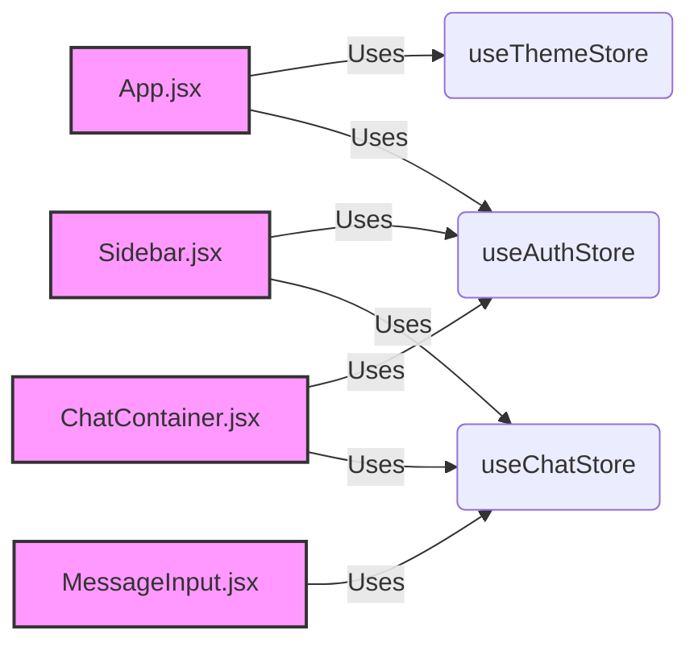
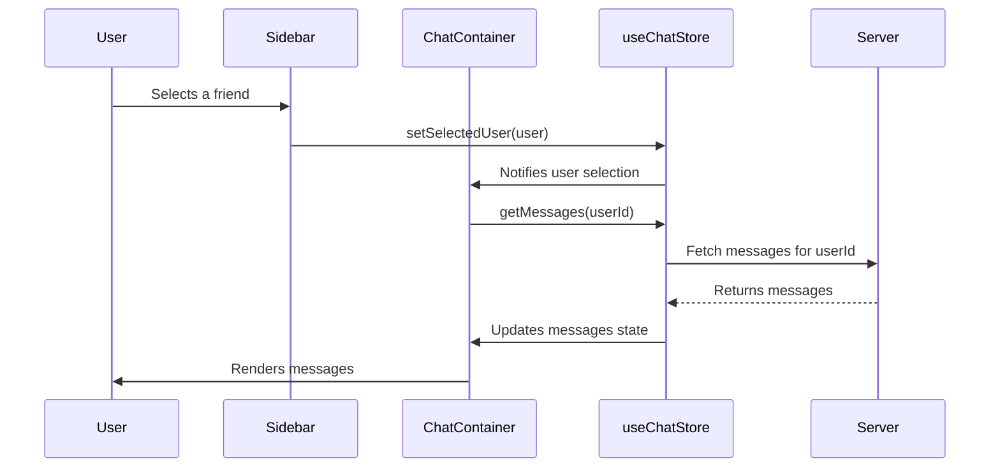

# Component Structure

This document outlines the structure and purpose of the frontend components in the `shinymack/Chat-App-MERN` project. Understanding the component architecture is crucial for contributing to the project and maintaining its functionality.

## Overview

The frontend, built with React, is organized into several key components, each responsible for a specific part of the user interface and application logic. These components include:

-   `App.jsx`: The main application component that handles routing and authentication.
-   `ChatContainer.jsx`: Manages the display of messages and user interaction within a chat.
-   `Sidebar.jsx`: Provides a list of friends/users and allows navigation between conversations.
-   `MessageInput.jsx`: Enables users to type and send messages, including image attachments.

## `App.jsx`

The `App.jsx` component serves as the entry point for the React application. It manages user authentication, theme settings, and routing using `react-router-dom`.

**Key Features:**

-   **Authentication:** Checks if the user is authenticated using `useAuthStore` and redirects to the login page if not.
-   **Routing:** Defines routes for different pages such as the homepage, signup, login, settings, and profile.
-   **Theme Management:** Applies the selected theme using `useThemeStore`.
-   **Loading:** Displays a loader while the authentication state is being checked.

```javascript
// File: frontend/src/App.jsx
import React from 'react'
import Navbar from './components/Navbar'
import { Routes, Route, Navigate } from 'react-router-dom'
import { useEffect } from 'react'
import HomePage from './pages/HomePage'
import SignUpPage from './pages/SignUpPage' 
import LoginPage from './pages/LoginPage' 
import SettingsPage from './pages/SettingsPage' 
import ProfilePage from './pages/ProfilePage'


import { useThemeStore } from './store/useThemeStore'
import { useAuthStore } from './store/useAuthStore'; 
import { Loader } from 'lucide-react'
import { Toaster } from 'react-hot-toast'

const App = () => {
  const { authUser, checkAuth, isCheckingAuth, onlineUsers } = useAuthStore();
  const { theme } = useThemeStore();
  useEffect(() => {
    checkAuth();
  }, [checkAuth]);

  console.log("authUser: ", {authUser});

  console.log({onlineUsers})

  if(isCheckingAuth && !authUser) return (
      <div className='flex items-center justify-center h-screen'>
        <Loader className='size-10 animate-spin' />
      </div>
  )

  return (
    <div className='' data-theme={theme}>

      <Navbar />

      <Toaster />
      <Routes>
        <Route path='/' element={authUser ? <HomePage />: <Navigate to='/login' />} />
        <Route path='/signup' element={ !authUser ? <SignUpPage />: <Navigate to='/' />} />
        <Route path='/login' element={!authUser ? <LoginPage />: <Navigate to='/' />} />
        <Route path='/settings' element={<SettingsPage />} />
        <Route path='/profile' element={authUser ? <ProfilePage />: <Navigate to='/login' />} />

      </Routes>

    </div> 
  )
}

export default App
```

[View on GitHub](https://github.com/shinymack/Chat-App-MERN/blob/main/frontend/src/App.jsx)

## `ChatContainer.jsx`

The `ChatContainer.jsx` component is responsible for displaying the chat interface, including messages, chat header, and message input. It fetches messages from the server and manages the display of these messages.

**Key Features:**

-   **Message Display:** Renders a list of messages using the `messages` array from `useChatStore`.
-   **Real-time Updates:** Subscribes to real-time message updates using `subscribeToMessages` and unsubscribes when the component unmounts.
-   **Loading State:** Displays a skeleton loader while messages are being fetched.
-   **Scroll Management:** Scrolls to the bottom of the message list when new messages are added.

```javascript
// File: frontend/src/components/ChatContainer.jsx
import { useEffect } from "react";
import { useChatStore } from "../store/useChatStore";
import ChatHeader from "./ChatHeader";
import MessageInput from "./MessageInput";
import MessageSkeleton from "./skeletons/MessageSkeleton";
import { useAuthStore } from "../store/useAuthStore";
import { formatMessageTime } from "../lib/utils";
import { useRef } from "react";

const ChatContainer = () => {
    const { messages, getMessages, isMessagesLoading, selectedUser, subscribeToMessages, unsubscribeFromMessages } =
        useChatStore();
    const { authUser } = useAuthStore();
    const messageEndRef = useRef(null);


    useEffect(() => {
        getMessages(selectedUser._id);
        subscribeToMessages();

        return () => unsubscribeFromMessages();
    }, [selectedUser._id, getMessages, subscribeToMessages, unsubscribeFromMessages]);
    
    useEffect(() => {
        if(messageEndRef.current && messages){
            messageEndRef.current.scrollIntoView({behaviour : "smooth"})
        }
    }, [messages])

    if (isMessagesLoading)
        return (
            <div className="flex-1 flex flex-col overflow-auto">
                <ChatHeader />
                <MessageSkeleton />
                <MessageInput />
            </div>
        );
    return (
        <div className="flex-1 flex flex-col overflow-auto">
            <ChatHeader />
            <div className="flex-1 overflow-y-auto p-4 space-y-4">
                {messages.map((message) => (
                    <div
                        key={message._id}
                        className={`chat ${message.senderId == authUser._id ? "chat-end": "chat-start"} `}
                        ref={messageEndRef}
                    >
                        <div className="chat-image avatar">
                            <div className="size-9 rounded-full border">
                                
                            </div>
                        </div>
                        <div className="chat-header mb-1">
                            <time className="text-xs opacity-50 ml-1">{formatMessageTime(message.createdAt)}</time>
                        </div>
                        <div className="chat-bubble flex flex-col">
                            {message.image && (
                                
                            )}
                            {message.text && <p>{message.text}</p>}
                        </div>
                    </div>
                ))}
            </div>
            <MessageInput />
        </div>
    );
};

export default ChatContainer;
```

[View on GitHub](https://github.com/shinymack/Chat-App-MERN/blob/main/frontend/src/components/ChatContainer.jsx)

## `MessageInput.jsx`

The `MessageInput.jsx` component provides an interface for users to type and send messages, as well as attach images. It handles the input and sends messages to the server using the `useChatStore`.

**Key Features:**

-   **Text Input:** Allows users to type messages.
-   **Image Attachment:** Allows users to attach images to their messages.
-   **Image Preview:** Displays a preview of the attached image.
-   **Message Sending:** Sends the message (text and/or image) to the server using `sendMessage` from `useChatStore`.

```javascript
// File: frontend/src/components/MessageInput.jsx
import { useRef, useState } from "react";
import { useChatStore } from "../store/useChatStore";
import { Image, Send, X } from "lucide-react";
import toast from "react-hot-toast";

const MessageInput = () => {
    const [text, setText] = useState("");
    const [imagePreview, setImagePreview] = useState(null);
    const fileInputRef = useRef(null);
    const { sendMessage } = useChatStore();

    const handleImageChange = (e) => {
        const file = e.target.files[0];
        if (!file.type.startsWith("image/")) {
            toast.error("Please select an image file");
            return;
        }

        const reader = new FileReader();
        reader.onloadend = () => {
            setImagePreview(reader.result);
        };
        reader.readAsDataURL(file);
    };

    const removeImage = () => {
        setImagePreview(null);
        if (fileInputRef.current) fileInputRef.current.value = "";
    };

    const handleSendMessage = async (e) => {
        e.preventDefault();
        if (!text.trim() && !imagePreview) return;

        try {
            await sendMessage({
                text: text.trim(),
                image: imagePreview,
            });

            setText("");
            setImagePreview(null);
            if (fileInputRef.current) fileInputRef.current = "";
        } catch (error) {
            console.error("Failed to send message", error);
        }
    };

    return (
        <div className="p-4 w-full">
            {imagePreview && (
                <div className="mb-3 flex items-center gap-2">
                    <div className="relative">
                        
                        <button
                            onClick={removeImage}
                            className="absolute -top-1.5 -right-1.5 w-5 h-5 rounded-full bg-base-300
              flex items-center justify-center"
                            type="button"
                        >
                            <X className="size-3" />
                        </button>
                    </div>
                </div>
            )}

            <form
                onSubmit={handleSendMessage}
                className="flex items-center gap-2"
            >
                <div className="flex flex-1 gap-2">
                    <input
                        type="text"
                        className="w-full input input-bordered rounded-lg input-sm sm:input-md"
                        placeholder="Type a message..."
                        value={text}
                        onChange={(e) => setText(e.target.value)}
                    />
                    <input
                        type="file"
                        accept="image/*"
                        className="hidden"
                        ref={fileInputRef}
                        onChange={handleImageChange}
                    />

                    <button
                        type="button"
                        className={`hidden sm:flex btn btn-circle
                            ${
                                imagePreview
                                    ? "text-emerald-500"
                                    : "text-zinc-400"
                            }`}
                        onClick={
                            () => {
                                if (fileInputRef.current) {
                                    fileInputRef.current.click();
                                } else {
                                    console.error("fileInputRef is not attached");
                                }
                        }
                        }
                    >
                        <Image size={20} />
                    </button>
                </div>

                <button
                    type="submit"
                    className="btn btn-sm btn-circle"
                    disabled={!text.trim() && !imagePreview}
                >
                    <Send size={22} />
                </button>
            </form>
        </div>
    );
};

export default MessageInput;
```

[View on GitHub](https://github.com/shinymack/Chat-App-MERN/blob/main/frontend/src/components/MessageInput.jsx)

## `Sidebar.jsx`

The `Sidebar.jsx` component displays a list of friends and their online status. It allows users to select a friend to start a chat with.

**Key Features:**

-   **Friend List:** Fetches and displays a list of friends using `getFriends` from `useChatStore`.
-   **Online Status:** Indicates whether a friend is online or offline.
-   **User Selection:** Allows users to select a friend to chat with, updating the `selectedUser` state in `useChatStore`.
-   **Online Filter:** Allows filtering to show only online friends.

```javascript
// File: frontend/src/components/Sidebar.jsx
import { useEffect, useState } from "react";
import { useChatStore } from "../store/useChatStore";
import SidebarSkeleton from "./skeletons/SidebarSkeleton";
import { Users } from "lucide-react";
import { useAuthStore } from "../store/useAuthStore";

const Sidebar = () => {
    const { getFriends, users, selectedUser, setSelectedUser, isUsersLoading } =
        useChatStore();

    const { onlineUsers } = useAuthStore();
    const [showOnlineOnly, setShowOnlineOnly] = useState(false);
    useEffect(() => {
        getFriends();
    }, [getFriends]);
    const filteredUsers = showOnlineOnly
        ? users.filter((user) => onlineUsers.includes(user._id))
        : users;
    if (isUsersLoading) return <SidebarSkeleton />;
    return (
        <div className={`h-full sm:w-72 sm:border-r border-base-300  flex-col transition-all duration-200 ${selectedUser ?
                                    "hidden sm:flex w-[100vw] "
                                    : ""}`}>
            <div className="border-b border-base-300  p-5">
                <div className="flex items-center gap-2">
                    <Users className="size-6"></Users>
                    <span className="font-medium  lg:block">
                        Friends
                    </span>
                </div>
                {/* Online toggle filter remaining */}
                <div className="mt-3 lg:flex items-center gap-2">
                    <label className="cursor-pointer flex items-center gap-2">
                        <input
                            type="checkbox"
                            checked={showOnlineOnly}
                            onChange={(e) =>
                                setShowOnlineOnly(e.target.checked)
                            }
                            className="checkbox checkbox-sm"
                        />
                        <span className="text-sm">Show online only</span>
                    </label>
                    <span className="text-xs text-zinc-500">
                          ({users.filter(friend => onlineUsers.includes(friend._id)).length} online)
                    </span>
                </div>
                <div className="overflow-y-scroll h-[calc(100vh-14rem)] w-full flex flex-col py-3">
                    {filteredUsers.map((user) => (
                        <button
                            key={user._id}
                            onClick={() => setSelectedUser(user)}
                            className={`sm:w-full w-[88vw] p-3 flex items-center gap-3 hover:bg-base-300 transition-colors
                            ${
                                selectedUser?._id === user._id
                                    ? "bg-base-300 ring-1 ring-base-300"
                                    : ""
                            }`}
                        >
                            <div className="relative mx-0">
                                
                                {onlineUsers.includes(user._id) && (
                                    <span className="absolute bottom-0 right-0 size-3 bg-green-500 rounded-full ring-2 ring-zinc-900" />
                                )}
                            </div>
                            <div className=" block text-left min-w-0">
                                <div className=" font-medium truncate">
                                    {user.username}
                                </div>
                                <div className="text-sm text-zinc-400">
                                    {onlineUsers.includes(user._id)
                                        ? "Online"
                                        : "Offline"}
                                </div>
                            </div>
                        </button>
                    ))}
                </div>
                {filteredUsers.length == 0 && (
                    <div className="text-center text-zinc-500 py-4">No online friends</div>
                )}
            </div>
        </div>
    );
};

export default Sidebar;
```

[View on GitHub](https://github.com/shinymack/Chat-App-MERN/blob/main/frontend/src/components/Sidebar.jsx)

## Component Communication

The components communicate with each other primarily through the use of Zustand stores (`useAuthStore`, `useThemeStore`, and `useChatStore`). This allows components to share state and trigger actions without having to pass props directly.





## Key Integration Points

-   **Authentication Flow:** The `App.jsx` component uses the `useAuthStore` to manage the authentication state.  When the `checkAuth()` method completes, `authUser` becomes available, which is then used to conditionally render the Login or Signup page, or allow the user to access the rest of the app.

-   **Message Handling:** The `ChatContainer.jsx` and `MessageInput.jsx` components work together to display and send messages. The `ChatContainer` fetches and displays messages, while the `MessageInput` allows users to create and send new messages.  The `useChatStore` manages the state of messages and provides the `sendMessage` function.

-   **User Selection:** The `Sidebar.jsx` component allows users to select a friend to chat with. When a user is selected, the `selectedUser` state in the `useChatStore` is updated, triggering the `ChatContainer` to fetch messages for the selected user.





## Best Practices

-   **Component Reusability:** Design components to be reusable across the application. For example, the `Message` component could be extracted from `ChatContainer` to be used in other parts of the application.
-   **State Management:** Use Zustand stores effectively to manage application state and ensure that components are updated correctly when the state changes.
-   **Error Handling:** Implement proper error handling in components to gracefully handle errors and provide informative messages to the user.
-   **Asynchronous Operations:**  When performing asynchronous operations, such as fetching data from the server, use loading states to provide feedback to the user.

By following these best practices, you can ensure that the frontend components are well-structured, maintainable, and provide a good user experience.
```