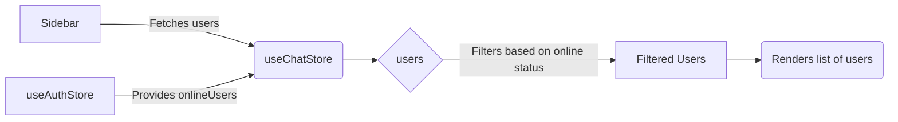

# Components

This section provides a description of the main components used within the frontend application of the Chat-App-MERN project. Understanding these components is crucial for grasping the architecture and functionality of the user interface.

## ChatContainer.jsx

This component is responsible for displaying the chat interface, including the messages, chat header, and message input area. It fetches messages from the backend and subscribes to real-time updates.

```javascript title="frontend/src/components/ChatContainer.jsx"
import { useEffect } from "react";
import { useChatStore } from "../store/useChatStore";
import ChatHeader from "./ChatHeader";
import MessageInput from "./MessageInput";

const ChatContainer = () => {
    const { messages, getMessages, isMessagesLoading, selectedUser, subscribeToMessages, unsubscribeFromMessages } =
        useChatStore();

    useEffect(() => {
        getMessages(selectedUser._id);
        subscribeToMessages();

        return () => unsubscribeFromMessages();
    }, [selectedUser._id, getMessages, subscribeToMessages, unsubscribeFromMessages]);

    // ... rendering logic ...
};

export default ChatContainer;
```

This snippet shows the basic structure of the `ChatContainer` component, including the `useEffect` hook that fetches messages when a new user is selected and subscribes to real-time message updates. [View on GitHub](https://github.com/shinymack/Chat-App-MERN/blob/main/frontend/src/components/ChatContainer.jsx)

```javascript title="frontend/src/components/ChatContainer.jsx"
 useEffect(() => {
        if(messageEndRef.current && messages){
            messageEndRef.current.scrollIntoView({behaviour : "smooth"})
        }
    }, [messages])
```

This `useEffect` hook ensures that the chat window scrolls to the bottom whenever new messages are added, providing a seamless user experience. The `messageEndRef` is a reference to the last message in the chat. [View on GitHub](https://github.com/shinymack/Chat-App-MERN/blob/main/frontend/src/components/ChatContainer.jsx)

## MessageInput.jsx

The `MessageInput` component handles user input for sending messages, including text and image attachments. It manages the input field, image preview, and the submission logic.

```javascript title="frontend/src/components/MessageInput.jsx"
import { useRef, useState } from "react";
import { useChatStore } from "../store/useChatStore";
import { Image, Send, X } from "lucide-react";
import toast from "react-hot-toast";

const MessageInput = () => {
    const [text, setText] = useState("");
    const [imagePreview, setImagePreview] = useState(null);
    const fileInputRef = useRef(null);
    const { sendMessage } = useChatStore();

    const handleSendMessage = async (e) => {
        e.preventDefault();
        if (!text.trim() && !imagePreview) return;

        try {
            await sendMessage({
                text: text.trim(),
                image: imagePreview,
            });

            setText("");
            setImagePreview(null);
            if (fileInputRef.current) fileInputRef.current = "";
        } catch (error) {
            console.error("Failed to send message", error);
        }
    };

    return (
        <div className="p-4 w-full">
            {/* ... JSX for input field and image preview ... */}
        </div>
    );
};

export default MessageInput;
```

This code block demonstrates the core functionality of the `MessageInput` component. It shows how the component manages state for text input and image preview, and how it calls the `sendMessage` function from the `useChatStore`. [View on GitHub](https://github.com/shinymack/Chat-App-MERN/blob/main/frontend/src/components/MessageInput.jsx)

```javascript title="frontend/src/components/MessageInput.jsx"
    const handleImageChange = (e) => {
        const file = e.target.files[0];
        if (!file.type.startsWith("image/")) {
            toast.error("Please select an image file");
            return;
        }

        const reader = new FileReader();
        reader.onloadend = () => {
            setImagePreview(reader.result);
        };
        reader.readAsDataURL(file);
    };
```
This function handles image selection and preview. It checks if the selected file is an image and reads it as a data URL to display a preview. It also uses `react-hot-toast` to show an error message if the selected file is not an image. [View on GitHub](https://github.com/shinymack/Chat-App-MERN/blob/main/frontend/src/components/MessageInput.jsx)

## Sidebar.jsx

The `Sidebar` component displays the list of friends and allows the user to select a friend to start a chat. It also includes a toggle to show only online users.

```javascript title="frontend/src/components/Sidebar.jsx"
import { useEffect, useState } from "react";
import { useChatStore } from "../store/useChatStore";
import SidebarSkeleton from "./skeletons/SidebarSkeleton";
import { Users } from "lucide-react";
import { useAuthStore } from "../store/useAuthStore";

const Sidebar = () => {
    const { getFriends, users, selectedUser, setSelectedUser, isUsersLoading } =
        useChatStore();

    const { onlineUsers } = useAuthStore();
    const [showOnlineOnly, setShowOnlineOnly] = useState(false);
    useEffect(() => {
        getFriends();
    }, [getFriends]);

    // ... rendering logic ...
};

export default Sidebar;
```

This snippet showcases the fundamental structure of the `Sidebar` component, highlighting the use of `useEffect` to fetch the list of friends and the `useChatStore` hook to manage the selected user. [View on GitHub](https://github.com/shinymack/Chat-App-MERN/blob/main/frontend/src/components/Sidebar.jsx)

```javascript title="frontend/src/components/Sidebar.jsx"
 const filteredUsers = showOnlineOnly
        ? users.filter((user) => onlineUsers.includes(user._id))
        : users;
```

This code filters the list of users to show only online users if the `showOnlineOnly` state is true. It uses the `onlineUsers` array from the `useAuthStore` to determine which users are online. [View on GitHub](https://github.com/shinymack/Chat-App-MERN/blob/main/frontend/src/components/Sidebar.jsx)





This diagram illustrates the data flow in the `Sidebar` component. It shows how the component fetches users from the `useChatStore`, filters them based on their online status using data from `useAuthStore`, and renders the filtered list.

## Key Integration Points

The components described above are tightly integrated to provide a seamless chat experience. The `ChatContainer` relies on the `MessageInput` for sending messages and the `Sidebar` for selecting a user to chat with. The `useChatStore` and `useAuthStore` hooks play a central role in managing the application state and providing data to these components.

**Best Practices**:

*   **State Management**: Utilize Zustand effectively for managing global application state, ensuring data consistency across components.
*   **Real-time Updates**: Implement efficient real-time updates using Socket.IO to provide a responsive and engaging user experience.
*   **Component Composition**: Design components with a clear separation of concerns, making them reusable and maintainable.
```