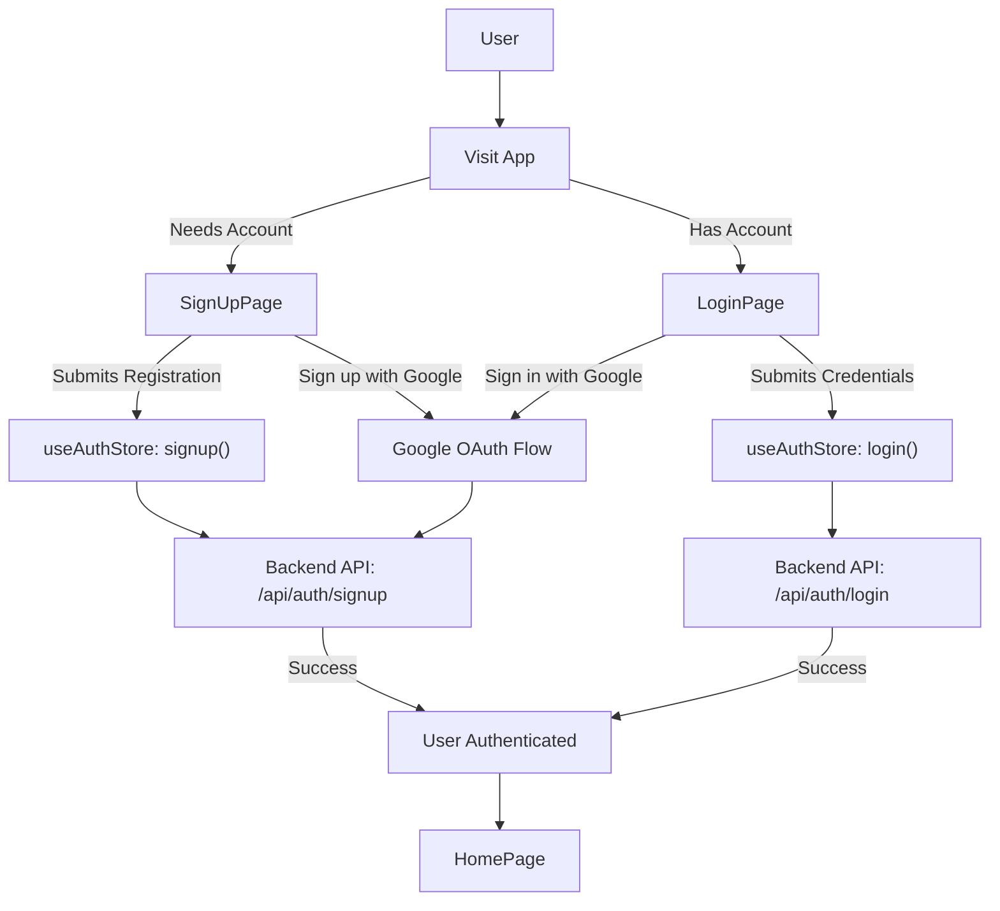
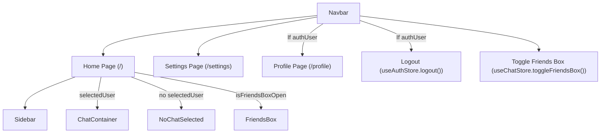

 # Core Pages and Navigation

This section details the primary user-facing pages and the central navigation component within the application. It covers the entry points for authentication (Login and Signup), the main application dashboard (Home), and the global navigation bar that provides access to various features and user-specific sections.

The design ensures a clear user flow from authentication to the core messaging functionality, while providing intuitive navigation for profile management, settings, and friend interaction.

## Authentication Flows

The application provides dedicated pages for user authentication, enabling both new user registration and existing user sign-in. These pages are crucial entry points into the system and integrate with the global authentication store.

### Login Page (`frontend/src/pages/LoginPage.jsx`)

The `LoginPage.jsx` component facilitates user login, allowing users to authenticate using their email and password or through Google OAuth. It manages form state, handles submission, and provides visual feedback during the login process.

```jsx
// frontend/src/pages/LoginPage.jsx
// ... (imports)
import { useAuthStore } from "../store/useAuthStore";
// ...

const LoginPage = () => {
  const [showPassword, setShowPassword] = useState(false);
  const [formData, setFormData] = useState({
    email: "",
    password: "",
  })
  const { login, isLoggingIn } = useAuthStore(); // Accessing login function and loading state

  const handleSubmit = async (e) => {
    e.preventDefault();
    login(formData); // Calls the login action from the auth store
  }
  const backendDomain = import.meta.env.VITE_BACKEND_URL;
  const googleAuthUrl = `${backendDomain}/api/auth/google`; // Constructing Google OAuth URL
  return (
    // ... (JSX for login form)
    <form onSubmit={handleSubmit} className="space-y-6">
      {/* ... (email and password inputs) */}
      <button type="submit" className="btn btn-primary w-full" disabled={isLoggingIn}>
        {isLoggingIn ? (
          <>
            <Loader2 className="h-5 w-5 animate-spin" />
            Loading...
          </>
        ) : (
          "Sign in"
        )}
      </button>
    </form>
    <a
      href={googleAuthUrl} // Link to your backend Google auth route
      className="btn btn-primary btn-outline w-full"
    >
      <FcGoogle className="size-5 mr-2" />
      Sign in with Google
    </a>
    // ...
  )
}

export default LoginPage
```
[View on GitHub](https://github.com/shinymack/Chat-App-MERN/blob/main/frontend/src/pages/LoginPage.jsx#L20-L84)

The login process leverages the `useAuthStore` for managing authentication state and actions. The Google OAuth link redirects the user to the backend's Google authentication endpoint.

### Signup Page (`frontend/src/pages/SignUpPage.jsx`)

The `SignUpPage.jsx` component allows new users to register an account. It collects username, email, and password, includes client-side validation, and integrates with the authentication store for registration. Similar to the login page, it also offers Google OAuth for quick registration.

```jsx
// frontend/src/pages/SignUpPage.jsx
// ... (imports)
import { useAuthStore } from "../store/useAuthStore";
import toast from "react-hot-toast";
// ...

const SignUpPage = () => {
  // ... (state for password visibility, formData)
  const { signup, IsSigningUp } = useAuthStore(); // Accessing signup function and loading state

  const validateForm = () => {
    if(!formData.username.trim()) return toast.error("Username is required");
    if(!formData.email.trim()) return toast.error("Email is required");
    if (!/\S+@\S+\.\S+/.test(formData.email)) return toast.error("Invalid email format");
    if (!formData.password) return toast.error("Password is required");
    if (formData.password.length < 6) return toast.error("Password must be at least 6 characters");
    return true;
  };

  const handleSubmit = (e) => {
    e.preventDefault();
    const success = validateForm();
    if(success===true) signup(formData); // Calls the signup action from the auth store
  };

  const backendDomain = import.meta.env.VITE_BACKEND_URL;
  const googleAuthUrl = `${backendDomain}/api/auth/google`;
  return (
    // ... (JSX for signup form)
    <button type="submit" className="btn btn-primary w-full" disabled={IsSigningUp}>
      {IsSigningUp ? (
        <>
          <Loader2 className="size-5 animate-spin" />
          Loading...
        </>
      ) : (
        "Create Account"
      )}
    </button>
    // ... (Google OAuth link)
  );
};
export default SignUpPage;
```
[View on GitHub](https://github.com/shinymack/Chat-App-MERN/blob/main/frontend/src/pages/SignUpPage.jsx#L20-L88)

The `validateForm` function provides immediate feedback to the user regarding input requirements, improving the user experience during registration.

### Authentication Flow Diagram

The following diagram illustrates the high-level authentication flow.





## Main Application Page

### Home Page (`frontend/src/pages/HomePage.jsx`)

The `HomePage.jsx` component serves as the primary dashboard after a user successfully logs in. It orchestrates the display of various chat-related components: a `Sidebar` for user and chat selection, either a `ChatContainer` for active conversations or `NoChatSelected` when no chat is open, and a `FriendsBox` for managing connections.

```jsx
// frontend/src/pages/HomePage.jsx
// ... (imports)
import { useChatStore } from "../store/useChatStore"

const HomePage = () => {
  const { selectedUser } = useChatStore();
  const { isFriendsBoxOpen } = useChatStore();
  return (
      <div className="h-screen bg-base-200">
      <div className="flex items-center justify-center pt-20 px-4 w-full">
        <div className="bg-base-100 rounded-lg shadow-xl w-full max-w-6xl h-[calc(100vh-8rem)]">
          <div className="flex h-full rounded-lg overflow-hidden w-full">
            <Sidebar /> {/* Always present */}
            {!selectedUser ? <NoChatSelected /> : <ChatContainer />} {/* Conditional based on selected chat */}
            {isFriendsBoxOpen && <FriendsBox />} {/* Conditional based on FriendsBox state */}
          </div>
        </div>
      </div>
    </div>
  )
}

export default HomePage
```
[View on GitHub](https://github.com/shinymack/Chat-App-MERN/blob/main/frontend/src/pages/HomePage.jsx#L8-L24)

This structure allows for a dynamic and responsive chat interface where components are rendered based on the user's interaction and selection. The `useChatStore` manages the state of the currently selected chat and the visibility of the friends list.

## Global Navigation

### Navbar Component (`frontend/src/components/Navbar.jsx`)

The `Navbar.jsx` component is a persistent header that provides global navigation and access to key features across the authenticated sections of the application. It dynamically renders links based on the user's authentication status and integrates with both the authentication and chat stores for user-specific actions.

```jsx
// frontend/src/components/Navbar.jsx
// ... (imports)
import { Link } from "react-router-dom";
import { useAuthStore } from "../store/useAuthStore";
import { LogOut, MessageSquare, Settings, User, Users } from "lucide-react";
import { useChatStore } from "../store/useChatStore";

const Navbar = () => {
  const { logout, authUser } = useAuthStore(); // Get logout function and authenticated user
  const { toggleFriendsBox } = useChatStore(); // Get function to toggle friends box visibility

  return (
    <header
      className=" bg-base-100 border-b border-base-300 fixed w-full top-0 z-40
        backdrop-blur-lg bg-base-100/80"
    >
      <div className="container mx-auto px-4 h-16">
        <div className="flex items-center justify-between h-full">
          <div className="flex items-center gap-8">
            <Link to="/" className="flex items-center gap-2.5 hover:opacity-80 transition-all">
              {/* ... (Logo and App Name) */}
            </Link>
          </div>
          <div className="flex items-center gap-4">
            <button className="btn btn-sm gap-2" onClick={toggleFriendsBox}>
              <Users className="size-5" />
              <span className="hidden sm:inline">Friends</span>
            </button>
            <Link to={"/settings"} className={`btn btn-sm gap-2 transition-colors`}>
              <Settings className="size-4"/>
              <span className="hidden sm:inline">Settings</span>
            </Link>
            {authUser && ( // Conditionally render profile and logout for authenticated users
              <>
                <Link to={"/profile"} className={`btn btn-sm gap-2`}>
                  <User className="size-5" />
                  <span className="hidden sm:inline">Profile</span>
                </Link>
                <button className="btn btn-sm flex gap-2 items-center" onClick={logout}>
                  <LogOut className="size-5" />
                  <span className="hidden sm:inline">Logout</span>
                </button>
              </>
            )}
          </div>
        </div>
      </div>
    </header>
  );
};

export default Navbar;
```
[View on GitHub](https://github.com/shinymack/Chat-App-MERN/blob/main/frontend/src/components/Navbar.jsx#L9-L63)

The `Navbar` uses `Link` components from `react-router-dom` for client-side navigation. The `authUser` state from `useAuthStore` determines whether profile and logout options are displayed. The `toggleFriendsBox` action from `useChatStore` provides direct access to the friends list functionality.

### Core Pages Navigation Diagram

This diagram outlines how the `Navbar` facilitates navigation between the main application pages and triggers specific actions.





## Key Integration Points

*   **Centralized State Management:** Both `useAuthStore` and `useChatStore` are fundamental to managing global application state, including user authentication status, selected chat, and UI element visibility. The `Navbar` and `HomePage` consume this state to render content and provide functionality dynamically.
*   **Protected Routes:** While not explicitly shown in the provided code snippets, the application routes (e.g., `/`, `/profile`, `/settings`) would typically be protected, ensuring that `HomePage` and related components are only accessible to authenticated users. The authentication flow handles redirecting unauthenticated users to `/login` or `/signup`.
*   **Component Composition:** `HomePage` effectively composes several smaller, focused components (`Sidebar`, `ChatContainer`, `FriendsBox`, `NoChatSelected`) to build a complex UI. This modular approach enhances maintainability and reusability.
*   **User Experience (UX) Considerations:** Features like password visibility toggles (`LoginPage`, `SignUpPage`), form validation (`SignUpPage`), and loading indicators (`LoginPage`, `SignUpPage`) contribute to a more robust and user-friendly experience.
*   **Environment Variables for API Endpoints:** The use of `import.meta.env.VITE_BACKEND_URL` for constructing Google OAuth URLs ensures flexibility and ease of configuration across different deployment environments.