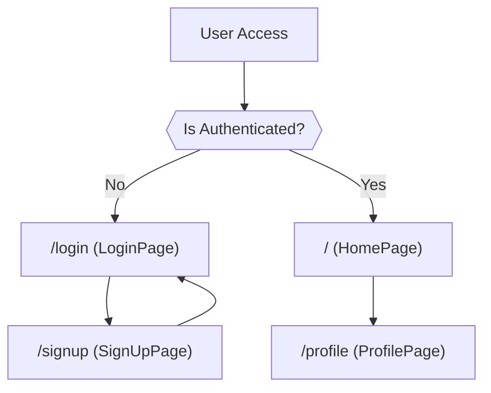

 # Frontend Pages and Routing

This section outlines the primary frontend pages of the application, their responsibilities, and how client-side routing is managed to navigate between them. The application utilizes [React Router DOM](https://reactrouter.com/en/main) for declarative routing, ensuring a smooth single-page application experience.

## Application Pages Overview

The application is structured around a few core pages, each serving a distinct purpose:

*   **HomePage:** The central hub for authenticated users, displaying the chat interface.
*   **LoginPage:** Allows existing users to sign in.
*   **SignUpPage:** Enables new users to create an account.
*   **ProfilePage:** Displays and allows authenticated users to update their profile information.

Client-side routing ensures that users can navigate between these pages without full page reloads, enhancing performance and user experience. Authentication guards are typically in place to protect routes like `/` (HomePage) and `/profile` (ProfilePage), redirecting unauthenticated users to the `/login` page.





## HomePage (`frontend/src/pages/HomePage.jsx`)

The `HomePage` component serves as the main dashboard for authenticated users. It is responsible for orchestrating the display of different chat-related components based on the user's interaction and state.

**Key Features:**

*   **Conditional Chat Display:** It dynamically renders either a `ChatContainer` when a user is selected for chat or a `NoChatSelected` component if no conversation is active.
*   **Sidebar Integration:** The `Sidebar` component is consistently displayed, providing navigation and user interaction elements.
*   **Friends Box:** Conditionally displays a `FriendsBox` component, likely for managing or viewing contacts, based on application state.
*   **Global State Management:** Leverages the `useChatStore` for managing the selected chat user and the visibility of the friends box, demonstrating effective state propagation across related components.

The layout is designed to provide a cohesive chat experience, with the sidebar on the left and the main chat area (or a placeholder) taking up the majority of the screen.

```jsx
// frontend/src/pages/HomePage.jsx
import ChatContainer from "../components/ChatContainer";
import FriendsBox from "../components/FriendsBox";
import NoChatSelected from "../components/NoChatSelected";
import Sidebar from "../components/Sidebar";
import { useChatStore } from "../store/useChatStore"

const HomePage = () => {
  const { selectedUser } = useChatStore();
  const { isFriendsBoxOpen } = useChatStore();
  return (
      <div className="h-screen bg-base-200">
      <div className="flex items-center justify-center pt-20 px-4 w-full">
        <div className="bg-base-100 rounded-lg shadow-xl w-full max-w-6xl h-[calc(100vh-8rem)]">
          <div className="flex h-full rounded-lg overflow-hidden w-full">
            <Sidebar />
            {/* Renders ChatContainer if a user is selected, otherwise NoChatSelected */}
            {!selectedUser ? <NoChatSelected /> : <ChatContainer />}
            {/* Conditionally renders FriendsBox */}
            {isFriendsBoxOpen && <FriendsBox />}

          </div>

        </div>
      </div>
    </div>
  )
}
```
This snippet from [HomePage.jsx](https://github.com/shinymack/Chat-App-MERN/blob/main/frontend/src/pages/HomePage.jsx#L10-L28) illustrates the main structural rendering logic. The use of `!selectedUser ? <NoChatSelected /> : <ChatContainer />` is a clear example of conditional rendering based on the global chat state, optimizing the UI for different user states. The `isFriendsBoxOpen && <FriendsBox />` pattern provides similar conditional display for the friends list.

## LoginPage (`frontend/src/pages/LoginPage.jsx`)

The `LoginPage` component provides the interface for users to authenticate and access the application. It supports both traditional email/password login and Google OAuth.

**Key Features:**

*   **Form-Based Authentication:** Collects user email and password for submission.
*   **Password Visibility Toggle:** Includes a UI element to show/hide the password input for user convenience.
*   **Google OAuth Integration:** Provides a "Sign in with Google" option, linking to the backend's Google authentication route.
*   **Loading State Feedback:** Displays a loading spinner and disables the submit button during login attempts, preventing duplicate submissions.
*   **Navigation to SignUp:** Contains a link to the `/signup` page for new users.
*   **Authentication State Management:** Utilizes `useAuthStore` to manage login logic and display loading states.

```jsx
// frontend/src/pages/LoginPage.jsx
import { useState } from "react"
import { useAuthStore } from "../store/useAuthStore";
import { Eye, EyeOff, Loader2, Lock, Mail, MessageSquare } from "lucide-react";
import { Link } from "react-router-dom";
import AuthImagePattern from "../components/AuthImagePattern";
import { FcGoogle } from "react-icons/fc";

const LoginPage = () => {
  const [showPassword, setShowPassword] = useState(false);
  const [formData, setFormData] = useState({
    email: "",
    password: "",
  })
  const { login, isLoggingIn } = useAuthStore();

  const handleSubmit = async (e) => {
    e.preventDefault();
    login(formData); // Calls the login function from the auth store
  }
  const backendDomain = import.meta.env.VITE_BACKEND_URL;
  const googleAuthUrl = `${backendDomain}/api/auth/google`;
  return (
    <div className="h-screen grid lg:grid-cols-2">
      {/* ... (rest of the form UI) ... */}
      <form onSubmit={handleSubmit} className="space-y-6">
        {/* Email input */}
        {/* Password input with toggle */}
        <button type="submit" className="btn btn-primary w-full" disabled={isLoggingIn}>
          {isLoggingIn ? (
            <>
              <Loader2 className="h-5 w-5 animate-spin" />
              Loading...
            </>
          ) : (
            "Sign in"
          )}
        </button>
      </form>
      <div className="divider text-base-content/60 my-4">OR</div>
      <a
        href={googleAuthUrl} // Link to your backend Google auth route
        className="btn btn-primary btn-outline w-full"
      >
        <FcGoogle className="size-5 mr-2" />
        Sign in with Google
      </a>
      {/* ... (Link to signup page) ... */}
    </div>
  )
}
```
This excerpt from [LoginPage.jsx](https://github.com/shinymack/Chat-App-MERN/blob/main/frontend/src/pages/LoginPage.jsx#L17-L109) highlights the core login form and the Google OAuth integration. The `handleSubmit` function triggers the `login` action from the authentication store, and the `disabled={isLoggingIn}` prop on the submit button effectively manages the UI state during asynchronous operations.

## SignUpPage (`frontend/src/pages/SignUpPage.jsx`)

The `SignUpPage` facilitates the creation of new user accounts. It shares a similar UI structure and authentication mechanisms with the `LoginPage`, adapted for registration.

**Key Features:**

*   **Registration Form:** Collects username, email, and password from the user.
*   **Form Validation:** Includes client-side validation for required fields, email format, and password length, providing immediate feedback to the user.
*   **Password Visibility Toggle:** Allows users to reveal their password input.
*   **Google OAuth:** Offers an alternative "Sign up with Google" option, leveraging the same backend integration as login.
*   **Loading State:** Displays loading indicators and disables the submit button during the registration process.
*   **Navigation to Login:** Provides a link to the `/login` page for users who already have an account.
*   **Authentication State Management:** Uses `useAuthStore` for handling signup logic and associated states.

```jsx
// frontend/src/pages/SignUpPage.jsx
import { useState } from "react";
import { useAuthStore } from "../store/useAuthStore";
import { MessageSquare, User, Mail, Lock, EyeOff, Eye, Loader2 } from "lucide-react";
import { Link } from "react-router-dom";
import AuthImagePattern from "../components/AuthImagePattern";
import toast from "react-hot-toast"; // Used for displaying validation errors

const SignUpPage = () => {
  const [showPassword, setShowPassword] = useState(false);
  const [formData, setFormData] = useState({
    username: "",
    email: "",
    password: "",
  });

  const { signup, IsSigningUp } = useAuthStore();

  const validateForm = () => {
    if(!formData.username.trim()) return toast.error("Username is required");
    if(!formData.email.trim()) return toast.error("Email is required");
    if (!/\S+@\S+\.\S+/.test(formData.email)) return toast.error("Invalid email format");
    if (!formData.password) return toast.error("Password is required");
    if (formData.password.length < 6) return toast.error("Password must be at least 6 characters");
    return true; // Form is valid
  };

  const handleSubmit = (e) => {
    e.preventDefault();
    const success = validateForm();
    if(success===true) signup(formData); // Calls signup function if validation passes
  };
  
  const backendDomain = import.meta.env.VITE_BACKEND_URL;
  const googleAuthUrl = `${backendDomain}/api/auth/google`;
  return (
    <div className="min-h-screen grid lg:grid-cols-2">
      {/* ... (rest of the form UI) ... */}
      <form onSubmit={handleSubmit} className="space-y-6">
        {/* Username input */}
        {/* Email input */}
        {/* Password input with toggle */}
        <button type="submit" className="btn btn-primary w-full" disabled={IsSigningUp}>
          {IsSigningUp ? (
            <>
              <Loader2 className="size-5 animate-spin" />
              Loading...
            </>
          ) : (
            "Create Account"
          )}
        </button>
      </form>
      <div className="divider text-base-content/60 my-4">OR</div>
      <a
        href={googleAuthUrl} // Link to your backend Google auth route
        className="btn btn-primary btn-outline w-full" 
      >
        <FcGoogle className="size-5 mr-2" /> 
        Sign up with Google
      </a>
      {/* ... (Link to login page) ... */}
    </div>
  );
};
```
The snippet from [SignUpPage.jsx](https://github.com/shinymack/Chat-App-MERN/blob/main/frontend/src/pages/SignUpPage.jsx#L15-L113) demonstrates the form validation logic (`validateForm`) and the submission handler. The integration of `react-hot-toast` for user feedback on validation errors is a good practice for user experience.

## ProfilePage (`frontend/src/pages/ProfilePage.jsx`)

The `ProfilePage` allows authenticated users to view and update their personal information, specifically their profile picture and username.

**Key Features:**

*   **Profile Picture Upload:** Users can upload a new profile picture, with immediate preview and an animated loading state during upload.
*   **Editable Username:** The username field can be toggled into an edit mode, allowing users to modify their username.
*   **Debounced Username Availability Check:** When editing the username, an API call is made to check username availability with a debounce mechanism, preventing excessive requests.
*   **Save/Cancel Edit Actions:** Buttons are provided to save or cancel username changes, with appropriate loading and disabled states.
*   **Display User Details:** Shows the user's email, membership date, and account status.
*   **Authentication State Management:** Relies on `useAuthStore` to access user data and trigger profile update actions.

```jsx
// frontend/src/pages/ProfilePage.jsx
import { useState, useEffect, useRef } from "react";
import { useAuthStore } from "../store/useAuthStore";
import { Camera, Mail, User, Edit, Save, X, Loader2 } from "lucide-react";
import toast from "react-hot-toast";
import { axiosInstance } from "../lib/axios"; // Assuming you have this configured instance

const ProfilePage = () => {
	const { authUser, isUpdatingProfile, updateProfile } = useAuthStore();
	const [selectedImg, setSelectedImg] = useState(null);
	const [isEditingUsername, setIsEditingUsername] = useState(false);
	const [newUsername, setNewUsername] = useState(authUser?.username || "");
	const [usernameStatus, setUsernameStatus] = useState({
		checking: false,
		available: true,
		message: "",
	});
	const debounceTimeout = useRef(null);

	const handleImageUpload = async (e) => {
		const file = e.target.files[0];
		if (!file) return;

		const reader = new FileReader();
		reader.readAsDataURL(file);

		reader.onload = async () => {
			const base64Image = reader.result;
			setSelectedImg(base64Image);
			await updateProfile({ profilePic: base64Image });
		};
	};

	// Debounced Username Check
	useEffect(() => {
		clearTimeout(debounceTimeout.current);
		if (!newUsername.trim() || newUsername.trim().length < 3) {
			setUsernameStatus({ checking: false, available: false, message: "Must be 3+ characters." });
			return;
		}
		if (newUsername === authUser.username) {
			setUsernameStatus({ checking: false, available: true, message: "" });
			return;
		}
		setUsernameStatus((prev) => ({ ...prev, checking: true, message: "Checking..." }));
		debounceTimeout.current = setTimeout(async () => {
			try {
				const res = await axiosInstance.get(`/auth/username/check/${newUsername}`);
				setUsernameStatus({
					checking: false,
					available: res.data.available,
					message: res.data.message,
				});
			} catch (error) {
				const message = error.response?.data?.message || "Error checking username.";
				setUsernameStatus({ checking: false, available: false, message });
			}
		}, 500); // 500ms debounce delay
		return () => clearTimeout(debounceTimeout.current);
	}, [newUsername, authUser.username]);

	const handleSaveUsername = async () => {
		if (!usernameStatus.available || newUsername === authUser.username) {
			toast.error("Cannot save. Username is either unavailable or unchanged.");
			return;
		}
		await updateProfile({ username: newUsername });
		setIsEditingUsername(false);
	};

	const handleCancelEdit = () => {
		setIsEditingUsername(false);
		setNewUsername(authUser.username);
		setUsernameStatus({ checking: false, available: true, message: "" });
	};

	return (
		<div className="h-screen pt-20">
			{/* ... (profile UI) ... */}
            <p className="text-sm text-zinc-400">
				{isUpdatingProfile ? "Updating profile..." : "Click the camera icon to update your photo"}
			</p>
			{/* --- Conditional Username Display/Edit --- */}
			{!isEditingUsername ? (
				<div className="flex items-center gap-2">
					<p className="px-4 py-2.5 bg-base-200 rounded-lg border flex-grow">
						{authUser?.username}
					</p>
					<button onClick={() => setIsEditingUsername(true)} className="btn btn-ghost btn-sm">
						<Edit className="w-4 h-4" />
					</button>
				</div>
			) : (
				<div className="space-y-2">
					<div className="flex items-center gap-2">
						<input
							type="text"
							value={newUsername}
							onChange={(e) => setNewUsername(e.target.value.toLowerCase())}
							className="input input-bordered w-full"
						/>
						<button onClick={handleSaveUsername} className="btn btn-success btn-sm" disabled={!usernameStatus.available || usernameStatus.checking || isUpdatingProfile}>
							{isUpdatingProfile ? <Loader2 className="w-4 h-4 animate-spin" /> : <Save className="w-4 h-4" />}
						</button>
						<button onClick={handleCancelEdit} className="btn btn-error btn-sm">
							<X className="w-4 h-4" />
						</button>
					</div>
					<div className={`text-xs h-4 ${usernameStatus.available ? 'text-green-500' : 'text-error'}`}>
						{usernameStatus.checking ? <Loader2 className="w-3 h-3 animate-spin inline-block mr-1" /> : null}
						{usernameStatus.message}
					</div>
				</div>
			)}
			{/* ------------------------------------------- */}
			{/* ... (email and account info) ... */}
		</div>
	);
};
```
This comprehensive snippet from [ProfilePage.jsx](https://github.com/shinymack/Chat-App-MERN/blob/main/frontend/src/pages/ProfilePage.jsx#L34-L188) showcases the `useEffect` hook for implementing a debounced username check, a crucial feature for user experience when interacting with real-time availability checks. The conditional rendering for editing the username field (`!isEditingUsername ? ... : ...`) is another excellent example of dynamic UI based on component state.

## Key Integration Points

The frontend pages are tightly integrated with the application's authentication system and global state management.

1.  **Authentication Flow:**
    *   `LoginPage` and `SignUpPage` are the entry points for authentication. They interact with the `useAuthStore` to perform login and registration requests to the backend.
    *   Upon successful authentication, `useAuthStore` updates the global `authUser` state and typically redirects the user to the `HomePage`.
    *   Protected routes (like `/` and `/profile`) check for the `authUser` state. If it's missing, users are redirected to `/login`, ensuring unauthorized access is prevented.
    *   Google OAuth provides an alternative, streamlined authentication path, redirecting users through the backend's Google authentication endpoint.

    


```mermaid
    sequenceDiagram
        actor U as User
        participant B as Browser/Frontend
        participant S as Server/Backend API

        U->>B: Accesses protected route (/ or /profile)
        B->>B: Checks for authenticated user in state/localStorage
        alt Not Authenticated
            B->>B: Redirects to /login
            U->>B: Enters credentials or clicks "Sign in with Google" (LoginPage)
            alt Traditional Login
                B->>S: POST /api/auth/login (credentials)
                S-->>S: Validates credentials, generates JWT/session
                S-->>B: Sends JWT/session (on success)
            else Google Login
                B->>S: GET /api/auth/google (redirect)
                S->>U: Redirect to Google Auth
                U->>S: Authenticates with Google, Google redirects to server callback
                S-->>S: Verifies Google token, creates/logs in user, generates JWT/session
                S-->>B: Sends JWT/session (on success)
            end
            B->>B: Stores JWT/session, updates global auth state
            B->>B: Redirects to / (HomePage)
        else Authenticated
            B->>B: Renders requested page
        end
    ```


2.  **Global State Management (Zustand):**
    *   `useAuthStore` manages the `authUser` object, authentication status (`isLoggingIn`, `IsSigningUp`, `isUpdatingProfile`), and the `login`, `signup`, `logout`, and `updateProfile` actions. This centralizes authentication logic and ensures consistency across components.
    *   `useChatStore` manages states specific to the chat interface, such as `selectedUser` and `isFriendsBoxOpen`, influencing the dynamic rendering on the `HomePage`.
    *   This pattern ensures that UI components only subscribe to the necessary pieces of state, leading to efficient re-renders and a scalable architecture.

3.  **API Interaction:**
    *   All authentication-related actions in `LoginPage`, `SignUpPage`, and `ProfilePage` dispatch asynchronous operations that interact with the backend API.
    *   The `ProfilePage`'s username availability check further exemplifies direct interaction with the backend, albeit with a debounced mechanism to optimize network requests.
    *   Error handling for API calls often involves displaying toast notifications (`react-hot-toast`) to provide immediate feedback to the user.

These frontend pages, combined with robust routing and state management, form the user-facing core of the application, providing both functional utility and a responsive user experience.