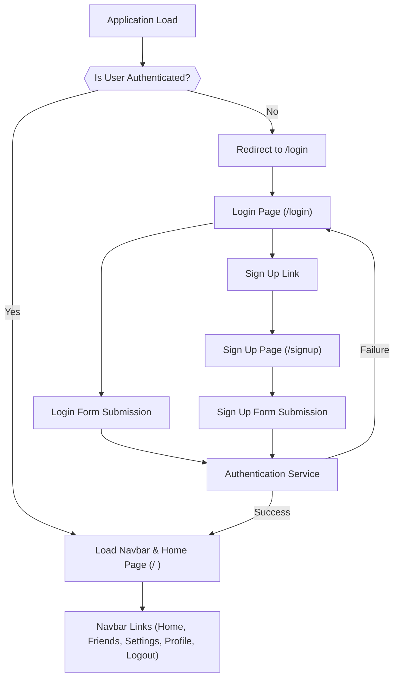
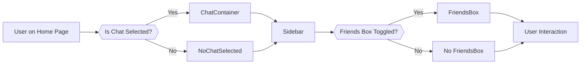

 # Pages and Navigation

This document outlines the primary pages within the ShinyChat application, detailing their purpose, routing mechanisms, and how users navigate through the interface. The frontend application leverages `react-router-dom` for client-side routing and Zustand for state management, particularly for authentication and chat-related states.

## Core Application Pages

ShinyChat is structured around a few key pages that handle user interaction, authentication, and the core chat functionality.

### Home Page (`HomePage.jsx`)

The `HomePage` serves as the central hub for authenticated users, providing access to chat conversations and contact management.

This page conditionally renders various components based on the user's interaction:

*   **`Sidebar`**: Displays a list of recent conversations or contacts.
*   **`ChatContainer`**: Shown when a specific chat is selected, displaying messages and input for new messages.
*   **`NoChatSelected`**: Displayed when no chat is active, prompting the user to select one.
*   **`FriendsBox`**: A dynamically toggled component for managing friends and contacts.

The selection of a chat and the visibility of the friends box are managed via the `useChatStore`.

```jsx
// frontend/src/pages/HomePage.jsx
import ChatContainer from "../components/ChatContainer";
import FriendsBox from "../components/FriendsBox";
import NoChatSelected from "../components/NoChatSelected";
import Sidebar from "../components/Sidebar";
import { useChatStore } from "../store/useChatStore"

const HomePage = () => {
  const { selectedUser } = useChatStore(); // Determines if a chat is active
  const { isFriendsBoxOpen } = useChatStore(); // Controls FriendsBox visibility
  return (
      <div className="h-screen bg-base-200">
      <div className="flex items-center justify-center pt-20 px-4 w-full">
        <div className="bg-base-100 rounded-lg shadow-xl w-full max-w-6xl h-[calc(100vh-8rem)]">
          <div className="flex h-full rounded-lg overflow-hidden w-full">
            <Sidebar />
            {!selectedUser ? <NoChatSelected /> : <ChatContainer />} {/* Conditional rendering based on selectedUser */}
            {isFriendsBoxOpen && <FriendsBox />} {/* Conditional rendering of FriendsBox */}
          </div>
        </div>
      </div>
    </div>
  )
}

export default HomePage
```

[View on GitHub](https://github.com/shinymack/Chat-App-MERN/blob/main/frontend/src/pages/HomePage.jsx#L1-L24)

### Login Page (`LoginPage.jsx`)

The `LoginPage` provides the interface for existing users to authenticate and gain access to the application. It includes standard email/password login and a Google OAuth option.

```jsx
// frontend/src/pages/LoginPage.jsx
import { useState } from "react"
import { useAuthStore } from "../store/useAuthStore";
import { Eye, EyeOff, Loader2, Lock, Mail, MessageSquare } from "lucide-react";
import { Link } from "react-router-dom"; // Used for navigation to SignUp page
import AuthImagePattern from "../components/AuthImagePattern";
import { FcGoogle } from "react-icons/fc";

const LoginPage = () => {
  const [showPassword, setShowPassword] = useState(false);
  const [formData, setFormData] = useState({
    email: "",
    password: "",
  })
  const { login, isLoggingIn } = useAuthStore(); // State and function from authentication store

  const handleSubmit = async (e) => {
    e.preventDefault();
    login(formData); // Calls the login function
  }
  const backendDomain = import.meta.env.VITE_BACKEND_URL;
  const googleAuthUrl = `${backendDomain}/api/auth/google`;
  return (
    <div className="h-screen grid lg:grid-cols-2">
      <div className="flex flex-col justify-center items-center p-6 sm:p-12">
        <div className="w-full max-w-md space-y-8">
          <div className="text-center mb-8">
            <div className="flex flex-col items-center gap-2 group">
              <div
                className="w-12 h-12 rounded-xl bg-primary/10 flex items-center justify-center group-hover:bg-primary/20
              transition-colors"
              >
                <MessageSquare className="w-6 h-6 text-primary" />
              </div>
              <h1 className="text-2xl font-bold mt-2">Welcome Back</h1>
              <p className="text-base-content/60">Sign in to your account</p>
            </div>
          </div>

          <form onSubmit={handleSubmit} className="space-y-6"> {/* Form submission */}
            {/* ... email and password input fields ... */}
            <button type="submit" className="btn btn-primary w-full" disabled={isLoggingIn}>
              {isLoggingIn ? (
                <>
                  <Loader2 className="h-5 w-5 animate-spin" />
                  Loading...
                </>
              ) : (
                "Sign in"
              )}
            </button>
          </form>
          <div className="divider text-base-content/60 my-4">OR</div>

          <a
            href={googleAuthUrl} // Link to your backend Google auth route
            className="btn btn-primary btn-outline w-full"
          >
            <FcGoogle className="size-5 mr-2" />
            Sign in with Google
          </a>

          <div className="text-center">
            <p className="text-base-content/60">
              Don&apos;t have an account?{" "}
              <Link to="/signup" className="link link-primary"> {/* Link to SignUp page */}
                Create account
              </Link>
            </p>
          </div>
        </div>
      </div>
      <AuthImagePattern
        title={"Welcome back!"}
        subtitle={"Sign in to continue your conversations and catch up with your messages."}
      />
    </div>
  )
}

export default LoginPage
```

[View on GitHub](https://github.com/shinymack/Chat-App-MERN/blob/main/frontend/src/pages/LoginPage.jsx#L1-L127)

### Sign Up Page (`SignUpPage.jsx`)

The `SignUpPage` allows new users to create an account within the application. Similar to the login page, it supports email/password registration and Google OAuth. Form validation is performed client-side using `react-hot-toast` for user feedback.

```jsx
// frontend/src/pages/SignUpPage.jsx
import { useState } from "react";
import { useAuthStore } from "../store/useAuthStore";
import { MessageSquare, User, Mail, Lock, EyeOff, Eye, Loader2 } from "lucide-react";
import { Link } from "react-router-dom"; // Used for navigation to LoginPage
import AuthImagePattern from "../components/AuthImagePattern";
import toast from "react-hot-toast"; // For client-side validation messages

import { FcGoogle } from "react-icons/fc";
const SignUpPage = () => {
  const [showPassword, setShowPassword] = useState(false);
  const [formData, setFormData] = useState({
    username: "",
    email: "",
    password: "",
  });

  const { signup, IsSigningUp } = useAuthStore(); // State and function from authentication store

  const validateForm = () => { // Client-side form validation
    if(!formData.username.trim()) return toast.error("Username is required");
    if(!formData.email.trim()) return toast.error("Email is required");
    if (!/\S+@\S+\.\S+/.test(formData.email)) return toast.error("Invalid email format");
    if (!formData.password) return toast.error("Password is required");
    if (formData.password.length < 6) return toast.error("Password must be at least 6 characters");

    return true;
  };

  const handleSubmit = (e) => {
    e.preventDefault();

    const success = validateForm(); // Validate form before submission
    if(success===true) signup(formData); // Calls the signup function
  };
  
  const backendDomain = import.meta.env.VITE_BACKEND_URL;
  const googleAuthUrl = `${backendDomain}/api/auth/google`;
  return (
    <div className="min-h-screen grid lg:grid-cols-2">
      <div className="flex flex-col justify-center items-center p-6 sm:p-12">
        <div className="w-full max-w-md space-y-8">
          <div className="text-center mb-8">
            <div className="flex flex-col items-center gap-2 group">
              <div
                className="size-12 rounded-xl bg-primary/10 flex items-center justify-center 
              group-hover:bg-primary/20 transition-colors"
              >
                <MessageSquare className="size-6 text-primary" />
              </div>
              <h1 className="text-2xl font-bold mt-2">Create Account</h1>
              <p className="text-base-content/60">Get started with your free account</p>
            </div>
          </div>

          <form onSubmit={handleSubmit} className="space-y-6"> {/* Form submission */}
            {/* ... username, email, and password input fields ... */}
            <button type="submit" className="btn btn-primary w-full" disabled={IsSigningUp}>
              {IsSigningUp ? (
                <>
                  <Loader2 className="size-5 animate-spin" />
                  Loading...
                </>
              ) : (
                "Create Account"
              )}
            </button>
          </form>
          <div className="divider text-base-content/60 my-4">OR</div>

          <a
            href={googleAuthUrl} // Link to your backend Google auth route
            className="btn btn-primary btn-outline w-full" 
          >
            <FcGoogle className="size-5 mr-2" /> 
            Sign up with Google
          </a>

          <div className="text-center">
            <p className="text-base-content/60">
              Already have an account?{" "}
              <Link to="/login" className="link link-primary"> {/* Link to Login page */}
                Sign in
              </Link>
            </p>
          </div>
        </div>
      </div>
      <AuthImagePattern
        title="Join our community"
        subtitle="Connect with friends, share moments, and stay in touch with your loved ones."
      />
    </div>
  );
};
export default SignUpPage;
```

[View on GitHub](https://github.com/shinymack/Chat-App-MERN/blob/main/frontend/src/pages/SignUpPage.jsx#L1-L150)

## Navigation Bar (`Navbar.jsx`)

The `Navbar` component is a crucial part of the application's global navigation. It provides consistent access to key features and pages, dynamically adjusting its content based on the user's authentication status.

```jsx
// frontend/src/components/Navbar.jsx
import { Link } from "react-router-dom"; // Used for client-side navigation
import { useAuthStore } from "../store/useAuthStore"; // Accesses authentication state
import { LogOut, MessageSquare, Settings, User, Users } from "lucide-react";
import { useChatStore } from "../store/useChatStore"; // Accesses chat-related states and actions

const Navbar = () => {
  const { logout, authUser } = useAuthStore(); // `authUser` determines if a user is logged in
  const { toggleFriendsBox } = useChatStore(); // Function to toggle the FriendsBox visibility

  return (
    <header
      className=" bg-base-100 border-b border-base-300 fixed w-full top-0 z-40
        backdrop-blur-lg bg-base-100/80"
    >
      <div className="container mx-auto px-4 h-16">
        <div className="flex items-center justify-between h-full">
          <div className="flex items-center gap-8">
            <Link
              to="/" // Link to the Home page
              className="flex items-center gap-2.5 hover:opacity-80 transition-all"
            >
              <div className="size-9 rounded-lg bg-primary/10 flex items-center justify-center">
                <MessageSquare className="size-5 text-primary"></MessageSquare>
              </div>
              <h1 className="text-lg font-bold">ShinyChat</h1>
            </Link>
          </div>
          <div className="flex items-center gap-4">
            <button className="btn btn-sm gap-2" onClick={toggleFriendsBox}> {/* Button to toggle FriendsBox */}
              <Users className="size-5" />
              <span className="hidden sm:inline">Friends</span>
            </button>
            <Link to={"/settings"} // Link to settings page
            className={`btn btn-sm gap-2 transition-colors`}>
            <Settings className="size-4"/>
            <span className="hidden sm:inline">Settings</span>

            </Link>
            {authUser && ( // Conditional rendering based on authentication status
              <>
                <Link to={"/profile"} className={`btn btn-sm gap-2`}> {/* Link to profile page for authenticated users */}
                  <User className="size-5" />
                  <span className="hidden sm:inline">Profile</span>
                </Link>

                <button className="btn btn-sm flex gap-2 items-center" onClick={logout}> {/* Logout button */}
                  <LogOut className="size-5" />
                  <span className="hidden sm:inline">Logout</span>
                </button>
              </>
            )}
          </div>
        </div>
      </div>
    </header>
  );
};

export default Navbar;
```

[View on GitHub](https://github.com/shinymack/Chat-App-MERN/blob/main/frontend/src/components/Navbar.jsx#L1-L64)

## Routing and Navigation Flow

The application utilizes `react-router-dom` to manage its client-side routing. The main application entry point typically wraps the entire application with a `BrowserRouter` (or similar router) and defines routes using `Routes` and `Route` components.

### Authentication-driven Navigation

A core aspect of the navigation flow is its dependency on the user's authentication status.





When a user interacts with authentication forms or global navigation links, the `useAuthStore` plays a critical role. For example, after a successful login or signup, the `login` or `signup` function within the store would update the `authUser` state, triggering a re-render and potentially redirecting the user to the `HomePage`. Conversely, clicking the "Logout" button in the `Navbar` calls the `logout` function, clearing the `authUser` state and often redirecting to the login page.

### Dynamic Content Rendering

Beyond simple page navigation, components like the `HomePage` demonstrate dynamic content rendering based on the global application state. The `useChatStore` manages which user is currently selected for chatting (`selectedUser`) and whether the `FriendsBox` is open (`isFriendsBoxOpen`). This ensures a responsive UI that adapts to user choices without full page reloads.





## Key Integration Points

The page and navigation architecture effectively integrates several key aspects:

1.  **Client-Side Routing**: `react-router-dom` provides a seamless single-page application experience by managing URL changes and component rendering without server-side refreshes.
2.  **Global State Management**: Zustand stores (`useAuthStore`, `useChatStore`) centralize critical application states, allowing components across different pages (e.g., `Navbar`, `HomePage`, `LoginPage`) to access and modify shared data efficiently. This is crucial for managing authentication status, selected chats, and UI toggles like the `FriendsBox`.
3.  **Conditional UI Rendering**: Components dynamically render different parts of the UI based on state (e.g., `authUser` for Navbar links, `selectedUser` for chat view). This ensures a personalized and contextually relevant user experience.
4.  **Authentication Flow**: The login and signup pages are directly linked to the `useAuthStore` to manage user sessions. After authentication, `react-router-dom` can be used to redirect users to protected routes like the `HomePage`, while unauthenticated users are directed to login/signup.
5.  **Component Reusability**: The `Navbar` is a prime example of a reusable component that provides consistent navigation across the application, adapting its content based on user state. `AuthImagePattern` is another such component, used by both `LoginPage` and `SignUpPage`.

This setup creates a robust and user-friendly interface that efficiently guides users through the application's core functionalities.