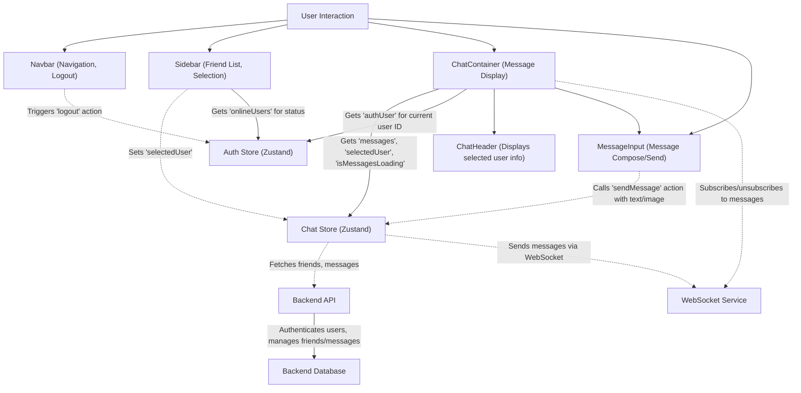

 
---
title: "UI Components and Layout"
description: "Details on the reusable React components that form the user interface and overall page layouts."
---

# UI Components and Layout

The user interface (UI) of the ShinyChat application is built using reusable React components, providing a modular and maintainable structure. These components are responsible for rendering various parts of the application, from navigation bars and sidebars to the main chat interface and message input fields. This section details the core UI components, their responsibilities, and how they interact to create the overall user experience.

## Core UI Components

The application's UI is composed of several key components, each serving a specific purpose:

*   **`Navbar.jsx`**: Manages global navigation, user authentication status (login/logout), and quick access to friends, settings, and profile.
*   **`Sidebar.jsx`**: Displays a list of friends/users, allowing users to select a chat partner and filter online friends.
*   **`ChatContainer.jsx`**: The main chat view, responsible for displaying messages between the authenticated user and the selected friend.
*   **`MessageInput.jsx`**: Provides the interface for users to type and send messages, including text and image attachments.

### Navbar Component

The `Navbar` component is a persistent header visible across most pages. It provides essential navigational links and user actions.

**Key Features:**

*   **Brand Logo and Name**: Displays "ShinyChat" with an icon, linking to the home page.
*   **Navigation Links**:
    *   "Friends" button: Toggles the visibility of the `Sidebar` or `FriendsBox` (implicitly managed by `useChatStore`).
    *   "Settings" link: Navigates to the user settings page.
    *   "Profile" link: Available when authenticated, leads to the user's profile.
*   **Authentication Actions**:
    *   "Logout" button: Appears for authenticated users, invoking the `logout` function from `useAuthStore`.
*   **Responsiveness**: Adapts for smaller screens, collapsing text labels for icons.

**Component Snippet - Logout Button:**

This snippet demonstrates how the logout functionality is integrated into the `Navbar` using the `useAuthStore`.

```jsx
// frontend/src/components/Navbar.jsx
import { LogOut } from "lucide-react";
import { useAuthStore } from "../store/useAuthStore";

const Navbar = () => {
  const { logout, authUser } = useAuthStore();

  return (
    // ... other Navbar elements ...
    {authUser && (
      <>
        <button className="btn btn-sm flex gap-2 items-center" onClick={logout}>
          <LogOut className="size-5" />
          <span className="hidden sm:inline">Logout</span>
        </button>
      </>
    )}
  );
};
```
[View on GitHub](https://github.com/shinymack/Chat-App-MERN/blob/main/frontend/src/components/Navbar.jsx#L42-L47)

### Sidebar Component

The `Sidebar` component is responsible for displaying the list of available chat partners (friends/users) and managing their selection.

**Key Features:**

*   **Friend List Display**: Renders a scrollable list of users.
*   **User Selection**: Clicking a user in the sidebar sets them as the `selectedUser` in `useChatStore`, triggering the `ChatContainer` to display messages with that user.
*   **Online Status Indicator**: Visually distinguishes online and offline users.
*   **Online Filter**: A checkbox allows users to filter the list to show only online friends.
*   **Dynamic Visibility**: On small screens, the sidebar's visibility is tied to whether a user is `selectedUser`, allowing the `ChatContainer` to take precedence when a chat is active.

**Component Snippet - User Selection and Online Status:**

This code shows how `setSelectedUser` is called on click and how the online status is displayed.

```jsx
// frontend/src/components/Sidebar.jsx
import { useChatStore } from "../store/useChatStore";
import { useAuthStore } from "../store/useAuthStore";

const Sidebar = () => {
    const { users, selectedUser, setSelectedUser } = useChatStore();
    const { onlineUsers } = useAuthStore();

    return (
        <div className={`h-full sm:w-72 sm:border-r border-base-300  flex-col transition-all duration-200 ${selectedUser ?
                                    "hidden sm:flex w-[100vw] "
                                    : ""}`}>
            {/* ... other sidebar elements ... */}
            <div className="overflow-y-scroll h-[calc(100vh-14rem)] w-full flex flex-col py-3">
                {users.map((user) => (
                    <button
                        key={user._id}
                        onClick={() => setSelectedUser(user)}
                        className={`sm:w-full w-[88vw] p-3 flex items-center gap-3 hover:bg-base-300 transition-colors
                        ${
                            selectedUser?._id === user._id
                                ? "bg-base-300 ring-1 ring-base-300"
                                : ""
                        }`}
                    >
                        <div className="relative mx-0">
                            
                            {onlineUsers.includes(user._id) && (
                                <span className="absolute bottom-0 right-0 size-3 bg-green-500 rounded-full ring-2 ring-zinc-900" />
                            )}
                        </div>
                        <div className=" block text-left min-w-0">
                            <div className=" font-medium truncate">
                                {user.username}
                            </div>
                            <div className="text-sm text-zinc-400">
                                {onlineUsers.includes(user._id)
                                    ? "Online"
                                    : "Offline"}
                            </div>
                        </div>
                    </button>
                ))}
            </div>
        </div>
    );
};
```
[View on GitHub](https://github.com/shinymack/Chat-App-MERN/blob/main/frontend/src/components/Sidebar.jsx#L42-L86)

### ChatContainer Component

The `ChatContainer` is the central component for displaying chat messages. It orchestrates the loading, display, and real-time updates of messages for the currently `selectedUser`.

**Key Features:**

*   **Message Display**: Iterates through the `messages` array from `useChatStore` and renders individual chat bubbles.
*   **Real-time Updates**: Subscribes to new messages via WebSockets, ensuring the chat updates dynamically.
*   **Scroll-to-Bottom**: Automatically scrolls to the latest message using `useRef` and `useEffect`.
*   **Loading State**: Displays a `MessageSkeleton` while messages are being fetched.
*   **Integrations**: Renders `ChatHeader` at the top and `MessageInput` at the bottom.
*   **User Identification**: Differentiates messages sent by the `authUser` versus the `selectedUser` for proper styling (`chat-end` vs. `chat-start`).
*   **Image Handling**: Displays attached images within chat bubbles.

**Component Snippet - Message Mapping and Styling:**

This snippet illustrates how messages are mapped and styled based on the sender.

```jsx
// frontend/src/components/ChatContainer.jsx
import { useChatStore } from "../store/useChatStore";
import { useAuthStore } from "../store/useAuthStore";
import ChatHeader from "./ChatHeader";
import MessageInput from "./MessageInput";

const ChatContainer = () => {
    const { messages, isMessagesLoading, selectedUser } = useChatStore();
    const { authUser } = useAuthStore();

    if (isMessagesLoading)
        return (
            <div className="flex-1 flex flex-col overflow-auto">
                <ChatHeader />
                <MessageSkeleton />
                <MessageInput />
            </div>
        );
    return (
        <div className="flex-1 flex flex-col overflow-auto">
            <ChatHeader />
            <div className="flex-1 overflow-y-auto p-4 space-y-4">
                {messages.map((message) => (
                    <div
                        key={message._id}
                        className={`chat ${message.senderId == authUser._id ? "chat-end": "chat-start"} `}
                        ref={messageEndRef}
                    >
                        <div className="chat-image avatar">
                            <div className="size-9 rounded-full border">
                                
                            </div>
                        </div>
                        <div className="chat-header mb-1">
                            <time className="text-xs opacity-50 ml-1">{formatMessageTime(message.createdAt)}</time>
                        </div>
                        <div className="chat-bubble flex flex-col">
                            {message.image && (
                                
                            )}
                            {message.text && <p>{message.text}</p>}
                        </div>
                    </div>
                ))}
            </div>
            <MessageInput />
        </div>
    );
};
```
[View on GitHub](https://github.com/shinymack/Chat-App-MERN/blob/main/frontend/src/components/ChatContainer.jsx#L29-L74)

**Component Snippet - Real-time Message Subscription:**

The `useEffect` hook handles the subscription and unsubscription to real-time message updates.

```jsx
// frontend/src/components/ChatContainer.jsx
import { useEffect } from "react";
import { useChatStore } from "../store/useChatStore";

const ChatContainer = () => {
    const { getMessages, selectedUser, subscribeToMessages, unsubscribeFromMessages } =
        useChatStore();

    useEffect(() => {
        getMessages(selectedUser._id);
        subscribeToMessages();

        return () => unsubscribeFromMessages();
    }, [selectedUser._id, getMessages, subscribeToMessages, unsubscribeFromMessages]);
    
    // ... rest of the component ...
};
```
[View on GitHub](https://github.com/shinymack/Chat-App-MERN/blob/main/frontend/src/components/ChatContainer.jsx#L17-L23)

### MessageInput Component

The `MessageInput` component is the interactive area at the bottom of the chat interface, allowing users to compose and send messages.

**Key Features:**

*   **Text Input**: A standard input field for typing messages.
*   **Image Attachment**: Allows users to select an image file for attachment.
*   **Image Preview**: Displays a preview of the selected image before sending, with an option to remove it.
*   **Send Button**: Sends the message (text and/or image) to the recipient.
*   **State Management**: Uses `useState` for managing input text and image preview, and `useRef` for file input control.
*   **Validation**: Prevents sending empty messages (no text and no image).
*   **Integration**: Calls the `sendMessage` action from `useChatStore`.

**Component Snippet - Handling Image Selection and Preview:**

This demonstrates the logic for processing image file input and setting up a preview.

```jsx
// frontend/src/components/MessageInput.jsx
import { useRef, useState } from "react";
import toast from "react-hot-toast";

const MessageInput = () => {
    const [imagePreview, setImagePreview] = useState(null);
    const fileInputRef = useRef(null);

    const handleImageChange = (e) => {
        const file = e.target.files[0];
        if (!file.type.startsWith("image/")) {
            toast.error("Please select an image file");
            return;
        }

        const reader = new FileReader();
        reader.onloadend = () => {
            setImagePreview(reader.result);
        };
        reader.readAsDataURL(file);
    };

    const removeImage = () => {
        setImagePreview(null);
        if (fileInputRef.current) fileInputRef.current.value = "";
    };

    return (
        <div className="p-4 w-full">
            {imagePreview && (
                <div className="mb-3 flex items-center gap-2">
                    <div className="relative">
                        
                        <button
                            onClick={removeImage}
                            className="absolute -top-1.5 -right-1.5 w-5 h-5 rounded-full bg-base-300
              flex items-center justify-center"
                            type="button"
                        >
                            <X className="size-3" />
                        </button>
                    </div>
                </div>
            )}
            {/* ... form for sending message ... */}
        </div>
    );
};
```
[View on GitHub](https://github.com/shinymack/Chat-App-MERN/blob/main/frontend/src/components/MessageInput.jsx#L14-L61)

**Component Snippet - Sending Message Action:**

The `handleSendMessage` function orchestrates sending the message and clearing the input/preview.

```jsx
// frontend/src/components/MessageInput.jsx
import { useChatStore } from "../store/useChatStore";

const MessageInput = () => {
    const [text, setText] = useState("");
    const [imagePreview, setImagePreview] = useState(null);
    const fileInputRef = useRef(null);
    const { sendMessage } = useChatStore();

    const handleSendMessage = async (e) => {
        e.preventDefault();
        if (!text.trim() && !imagePreview) return;

        try {
            await sendMessage({
                text: text.trim(),
                image: imagePreview,
            });

            setText("");
            setImagePreview(null);
            if (fileInputRef.current) fileInputRef.current = "";
        } catch (error) {
            console.error("Failed to send message", error);
        }
    };

    return (
        <div className="p-4 w-full">
            {/* ... image preview and other elements ... */}
            <form
                onSubmit={handleSendMessage}
                className="flex items-center gap-2"
            >
                <div className="flex flex-1 gap-2">
                    <input
                        type="text"
                        className="w-full input input-bordered rounded-lg input-sm sm:input-md"
                        placeholder="Type a message..."
                        value={text}
                        onChange={(e) => setText(e.target.value)}
                    />
                    <input
                        type="file"
                        accept="image/*"
                        className="hidden"
                        ref={fileInputRef}
                        onChange={handleImageChange}
                    />
                    {/* ... image attachment button ... */}
                </div>
                <button
                    type="submit"
                    className="btn btn-sm btn-circle"
                    disabled={!text.trim() && !imagePreview}
                >
                    <Send size={22} />
                </button>
            </form>
        </div>
    );
};
```
[View on GitHub](https://github.com/shinymack/Chat-App-MERN/blob/main/frontend/src/components/MessageInput.jsx#L36-L121)

## Component Interaction Flow

The UI components interact dynamically, often leveraging the global state managed by Zustand stores (`useChatStore` and `useAuthStore`) to facilitate communication and data sharing.





## Key Integration Points

*   **State-driven Rendering**: All major UI components (`Navbar`, `Sidebar`, `ChatContainer`, `MessageInput`) rely heavily on state from `useAuthStore` and `useChatStore` to determine what to render and how to behave. This includes authentication status, selected chat partner, message lists, and online user status.
*   **Real-time Communication**: `ChatContainer` and `MessageInput` are deeply integrated with the WebSocket service through `useChatStore` to provide a real-time messaging experience, ensuring messages are instantly sent and received without requiring page refreshes.
*   **Modular Design**: Each component is focused on a specific part of the UI, promoting reusability and making the codebase easier to understand and maintain. For example, `MessageInput` can be easily integrated into other parts of the application if needed.
*   **Responsiveness**: Components like `Sidebar` handle dynamic visibility based on screen size and `selectedUser` presence, ensuring a good user experience on both desktop and mobile.

Next: [State Management and Stores](./3.2_state-management-and-stores.mdx)
```