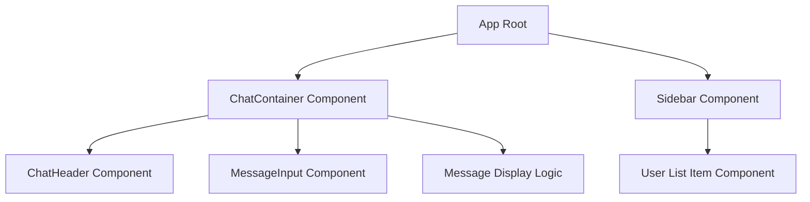
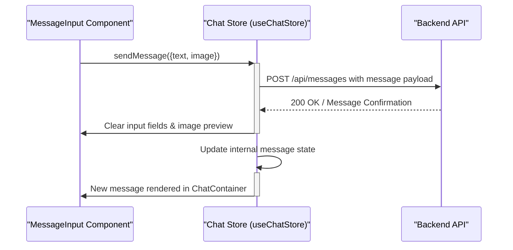

 ```md
---
title: "UI Components and Layout"
description: "Documents the reusable React components and their role in constructing the application's user interface."
---

# UI Components and Layout

This section details the primary React components responsible for rendering the user interface of the chat application. These components are designed for reusability, modularity, and a clear separation of concerns, ensuring a maintainable and scalable frontend architecture. They leverage state management from `useChatStore` and `useAuthStore` to provide a dynamic and interactive user experience.

## Component Overview

The application's UI is composed of several key components working in concert to display messages, manage user lists, and handle user input.





## ChatContainer

The `ChatContainer` component is the central hub for displaying active chat conversations. It orchestrates the fetching and rendering of messages for a selected user, integrating various sub-components to present a complete chat view.

*   **Purpose**: Displays messages between the authenticated user and a selected chat partner.
*   **Key Features**:
    *   Fetches historical messages for the currently selected user.
    *   Subscribes to real-time message updates to display new messages instantly.
    *   Automatically scrolls to the most recent message.
    *   Renders `ChatHeader` (not provided in snippets, but referenced), `MessageInput`, and a list of `Message` components.
    *   Shows a `MessageSkeleton` during loading states.
*   **Dependencies**: `useChatStore` for messages and chat-related actions, `useAuthStore` for authenticated user details, `ChatHeader`, `MessageInput`, `MessageSkeleton`, `formatMessageTime` utility.

The `useEffect` hook is crucial for managing the message lifecycle, fetching initial messages, and setting up/tearing down real-time subscriptions.

```jsx
// frontend/src/components/ChatContainer.jsx
import { useEffect } from "react";
import { useChatStore } from "../store/useChatStore";

const ChatContainer = () => {
    const { messages, getMessages, isMessagesLoading, selectedUser, subscribeToMessages, unsubscribeFromMessages } =
        useChatStore();

    useEffect(() => {
        getMessages(selectedUser._id);
        subscribeToMessages();

        return () => unsubscribeFromMessages();
    }, [selectedUser._id, getMessages, subscribeToMessages, unsubscribeFromMessages]);
    
    // ... other useEffect for scrolling and component logic
};
```
[View on GitHub](https://github.com/shinymack/Chat-App-MERN/blob/main/frontend/src/components/ChatContainer.jsx#L9-L18)

The component dynamically renders each message, distinguishing between messages sent by the authenticated user and those received from the chat partner. It supports both text and image content.

```jsx
// frontend/src/components/ChatContainer.jsx
// ... inside the return statement, within the messages.map
<div className="flex-1 overflow-y-auto p-4 space-y-4">
    {messages.map((message) => (
        <div
            key={message._id}
            className={`chat ${message.senderId == authUser._id ? "chat-end": "chat-start"} `}
            ref={messageEndRef}
        >
            <div className="chat-image avatar">
                <div className="size-9 rounded-full border">
                    
                </div>
            </div>
            <div className="chat-header mb-1">
                <time className="text-xs opacity-50 ml-1">{formatMessageTime(message.createdAt)}</time>
            </div>
            <div className="chat-bubble flex flex-col">
                {message.image && (
                    
                )}
                {message.text && <p>{message.text}</p>}
            </div>
        </div>
    ))}
</div>
// ...
```
[View on GitHub](https://github.com/shinymack/Chat-App-MERN/blob/main/frontend/src/components/ChatContainer.jsx#L41-L71)

## MessageInput

The `MessageInput` component provides the interface for users to compose and send messages. This includes typing text, attaching images, and triggering the send action.

*   **Purpose**: Enables users to send text and image messages.
*   **Key Features**:
    *   Text input field with state management.
    *   Image attachment functionality with a preview display.
    *   Option to remove attached images before sending.
    *   Disables send button if no text or image is present.
    *   Integration with `useChatStore` to dispatch messages.
*   **Dependencies**: `useChatStore` for `sendMessage` action, `useState` and `useRef` for local component state, `lucide-react` for icons, `react-hot-toast` for user feedback.

The `handleSendMessage` function orchestrates the submission of a message, handling both text and image content, and then resets the input fields.

```jsx
// frontend/src/components/MessageInput.jsx
import { useRef, useState } from "react";
import { useChatStore } from "../store/useChatStore";

const MessageInput = () => {
    const [text, setText] = useState("");
    const [imagePreview, setImagePreview] = useState(null);
    const fileInputRef = useRef(null);
    const { sendMessage } = useChatStore();

    const handleSendMessage = async (e) => {
        e.preventDefault();
        if (!text.trim() && !imagePreview) return;

        try {
            await sendMessage({
                text: text.trim(),
                image: imagePreview,
            });

            setText("");
            setImagePreview(null);
            if (fileInputRef.current) fileInputRef.current = "";
        } catch (error) {
            console.error("Failed to send message", error);
        }
    };

    // ... other functions and return statement
};
```
[View on GitHub](https://github.com/shinymack/Chat-App-MERN/blob/main/frontend/src/components/MessageInput.jsx#L29-L49)

The component includes logic to handle image selection and display a preview, offering a visual confirmation to the user before sending.

```jsx
// frontend/src/components/MessageInput.jsx
// ... inside the return statement
{imagePreview && (
    <div className="mb-3 flex items-center gap-2">
        <div className="relative">
            
            <button
                onClick={removeImage}
                className="absolute -top-1.5 -right-1.5 w-5 h-5 rounded-full bg-base-300
                  flex items-center justify-center"
                type="button"
            >
                <X className="size-3" />
            </button>
        </div>
    </div>
)}
// ...
```
[View on GitHub](https://github.com/shinymack/Chat-App-MERN/blob/main/frontend/src/components/MessageInput.jsx#L55-L75)

### Message Sending Flow

The process of sending a message involves the `MessageInput` component interacting with the global chat state managed by `useChatStore`.





## Sidebar

The `Sidebar` component provides navigation and user selection capabilities. It lists available chat partners (friends) and highlights their online status.

*   **Purpose**: Displays a list of friends/users, allows filtering, and enables selecting a user to chat with.
*   **Key Features**:
    *   Fetches and displays a list of users.
    *   Indicates online/offline status for each user.
    *   Provides a toggle to filter and show only online users.
    *   Highlights the currently selected chat partner.
    *   Adapts visibility based on whether a user is selected (mobile responsiveness).
*   **Dependencies**: `useChatStore` for `getFriends`, `users`, `selectedUser`, `setSelectedUser`, `isUsersLoading`; `useAuthStore` for `onlineUsers`; `useState` for local `showOnlineOnly` filter; `SidebarSkeleton` for loading states.

The `useEffect` hook in `Sidebar` is used to fetch the list of friends when the component mounts.

```jsx
// frontend/src/components/Sidebar.jsx
import { useEffect, useState } from "react";
import { useChatStore } from "../store/useChatStore";

const Sidebar = () => {
    const { getFriends, users, selectedUser, setSelectedUser, isUsersLoading } =
        useChatStore();

    const { onlineUsers } = useAuthStore();
    const [showOnlineOnly, setShowOnlineOnly] = useState(false);

    useEffect(() => {
        getFriends();
    }, [getFriends]);

    // ... other logic and return statement
};
```
[View on GitHub](https://github.com/shinymack/Chat-App-MERN/blob/main/frontend/src/components/Sidebar.jsx#L9-L21)

The component maps through the filtered list of users, rendering each as a clickable button with their profile picture, username, and real-time online status.

```jsx
// frontend/src/components/Sidebar.jsx
// ... inside the return statement, within the user list div
<div className="overflow-y-scroll h-[calc(100vh-14rem)] w-full flex flex-col py-3">
    {filteredUsers.map((user) => (
        <button
            key={user._id}
            onClick={() => setSelectedUser(user)}
            className={`sm:w-full w-[88vw] p-3 flex items-center gap-3 hover:bg-base-300 transition-colors
            ${
                selectedUser?._id === user._id
                    ? "bg-base-300 ring-1 ring-base-300"
                    : ""
            }`}
        >
            <div className="relative mx-0">
                
                {onlineUsers.includes(user._id) && (
                    <span className="absolute bottom-0 right-0 size-3 bg-green-500 rounded-full ring-2 ring-zinc-900" />
                )}
            </div>
            <div className=" block text-left min-w-0">
                <div className=" font-medium truncate">
                    {user.username}
                </div>
                <div className="text-sm text-zinc-400">
                    {onlineUsers.includes(user._id)
                        ? "Online"
                        : "Offline"}
                </div>
            </div>
        </button>
    ))}
</div>
// ...
```
[View on GitHub](https://github.com/shinymack/Chat-App-MERN/blob/main/frontend/src/components/Sidebar.jsx#L49-L87)

## Styling and Theming

The `index.css` file is the entry point for the application's global styles, integrating Tailwind CSS for utility-first styling and importing a custom font.

*   **Purpose**: Sets up the base styling, imports Tailwind utilities, and applies a custom font.
*   **Key Features**:
    *   Imports Google Fonts (`Chivo`).
    *   Integrates Tailwind CSS base, components, and utilities layers.
    *   Applies the `Chivo` font globally to the `body` element.
*   **Dependencies**: Tailwind CSS, Google Fonts.

The CSS structure is minimal, focusing on importing necessary frameworks and applying global typography.

```css
/* frontend/src/index.css */
@import url('https://fonts.googleapis.com/css2?family=Chivo:ital,wght@0,100..900;1,100..900&display=swap');
@tailwind base;
@tailwind components;
@tailwind utilities;


@layer base {
    body {
        @apply font-chivo;
    }
}
```
[View on GitHub](https://github.com/shinymack/Chat-App-MERN/blob/main/frontend/src/index.css#L1-L12)

## Key Integration Points

The UI components exhibit strong integration patterns, primarily revolving around state management and real-time capabilities:

*   **Centralized State Management**: Both `ChatContainer`, `MessageInput`, and `Sidebar` heavily rely on `useChatStore` and `useAuthStore`. These Zustand stores serve as single sources of truth for chat messages, selected users, friends lists, and authentication details, ensuring data consistency across different parts of the UI.
*   **Real-time Updates**: The `ChatContainer` subscribes to message updates, and the `Sidebar` displays online statuses based on `onlineUsers` from `useAuthStore`. This real-time synchronization is critical for a responsive chat experience, facilitated by WebSocket connections (though the WebSocket setup itself is managed outside these specific UI components, their integration points are clearly visible).
*   **Component Composition**: `ChatContainer` acts as a parent to `MessageInput`, demonstrating how different components are composed to build a larger feature. This promotes reusability and a clear hierarchy.
*   **Responsive Design**: The `Sidebar` component includes conditional styling (`hidden sm:flex`) to adapt its visibility based on screen size and whether a user is selected, enhancing the mobile user experience.
*   **User Feedback**: Loading skeletons (`MessageSkeleton`, `SidebarSkeleton`) provide visual cues during data fetching, while image previews in `MessageInput` offer immediate feedback on attached content. Toast notifications (from `react-hot-toast` used in `MessageInput`) provide transient feedback for actions like invalid file selection.
```