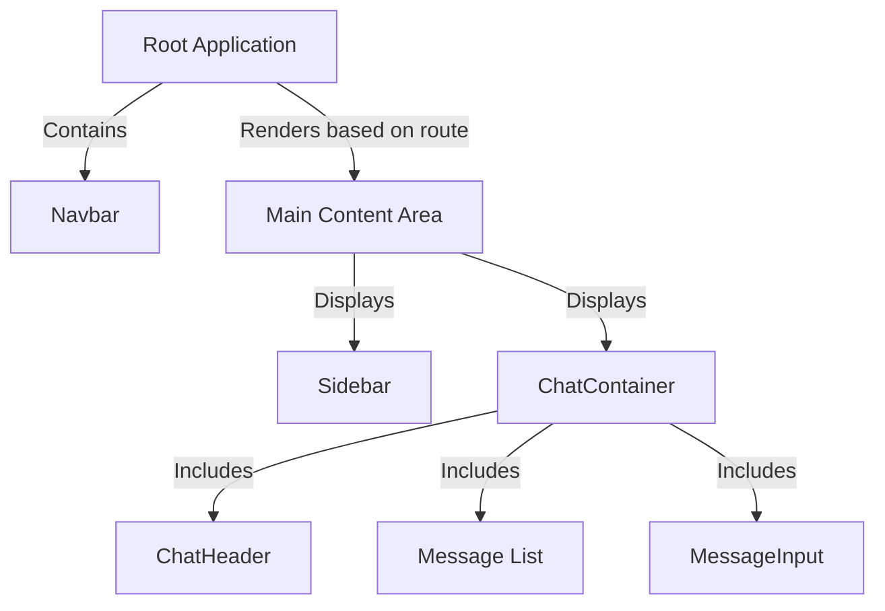
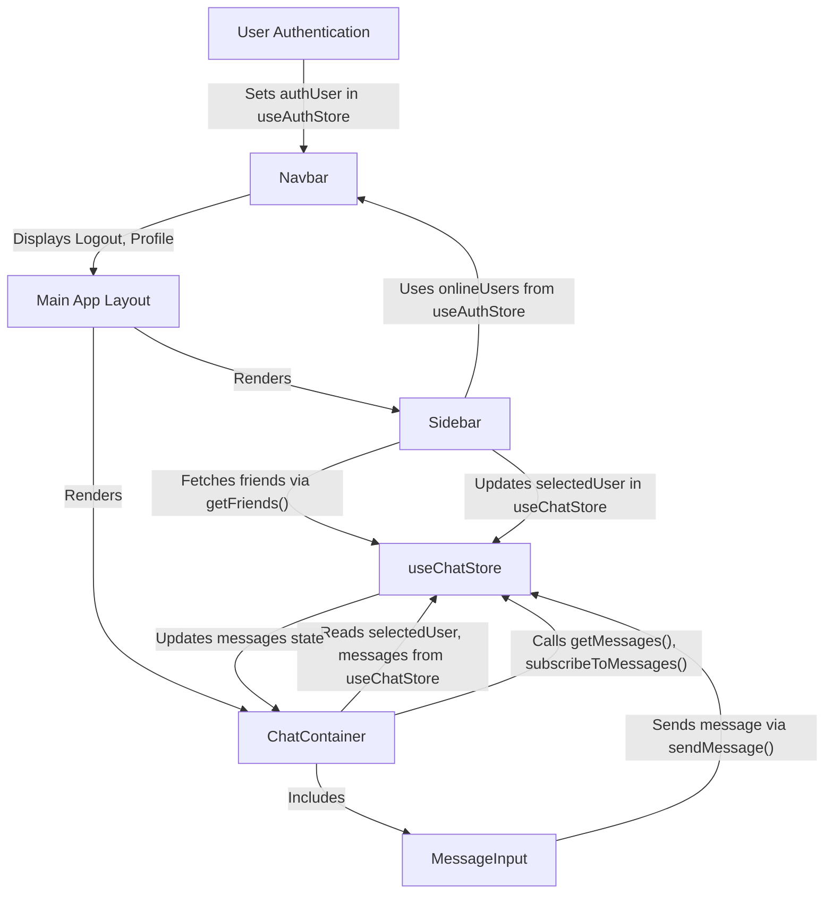

 # UI Components and Layout

The frontend of ShinyChat is built with React, utilizing a component-based architecture to create a responsive and intuitive user interface. This document details the primary UI components, their individual responsibilities, and how they integrate to form the overall application layout and user experience.

The core components discussed here are `Navbar`, `Sidebar`, `ChatContainer`, and `MessageInput`, which collectively manage user navigation, friend list display, message viewing, and message composition.

## Application Layout Overview

The ShinyChat application follows a common chat application layout, typically featuring a navigation bar at the top, a sidebar for friend lists, and a main content area for chat messages. This structure ensures easy navigation and a focused chat experience. The `Navbar` provides universal access to settings and user profile, while the `Sidebar` dynamically displays available friends. The `ChatContainer` is the central hub for conversation, and `MessageInput` facilitates message composition.

Here's a high-level overview of how the main components are structured:





## Navbar

The `Navbar` component, located at `frontend/src/components/Navbar.jsx`, serves as the global header for the application. It provides essential navigation links and user-related actions.

**Key Responsibilities:**

*   **Brand Identity**: Displays the application logo and name.
*   **Navigation**: Offers links to main sections like Home, Settings, and Profile.
*   **User Actions**: Provides a logout button for authenticated users.
*   **Friends Box Toggle**: Includes a button to toggle the visibility of the friends list, leveraging the `useChatStore`.

**Implementation Details:**

The `Navbar` conditionally renders profile and logout buttons based on the `authUser` state from `useAuthStore`. It also interacts with `useChatStore` to manage the display of the friends list.

```jsx title="frontend/src/components/Navbar.jsx - Logout Button"
<button className="btn btn-sm flex gap-2 items-center" onClick={logout}>
  <LogOut className="size-5" />
  <span className="hidden sm:inline">Logout</span>
</button>
```

[View on GitHub](https://github.com/shinymack/Chat-App-MERN/blob/main/frontend/src/components/Navbar.jsx#L42-L45)

This snippet illustrates the logout functionality, which is a core feature for user session management. The `LogOut` icon from `lucide-react` provides a visual cue for the action.

## Sidebar

The `Sidebar` component, found at `frontend/src/components/Sidebar.jsx`, is responsible for displaying the list of available friends or users. It allows users to select a friend to initiate or continue a chat.

**Key Responsibilities:**

*   **Friend List Display**: Fetches and renders a list of users/friends.
*   **User Selection**: Allows selection of a specific user to display their chat messages in the `ChatContainer`.
*   **Online Status Indication**: Visually distinguishes between online and offline users.
*   **Online Filter**: Provides a toggle to filter the list to show only online users.

**Implementation Details:**

The `Sidebar` uses `useChatStore` to fetch `users` and manage the `selectedUser` state. It also leverages `onlineUsers` from `useAuthStore` to display real-time online status. The `useEffect` hook ensures that the friend list is fetched upon component mount.

```jsx title="frontend/src/components/Sidebar.jsx - Fetching Friends"
useEffect(() => {
    getFriends();
}, [getFriends]);
```

[View on GitHub](https://github.com/shinymack/Chat-App-MERN/blob/main/frontend/src/components/Sidebar.jsx#L15-L17)

This `useEffect` hook is crucial for populating the sidebar with the list of contacts as soon as the component loads, ensuring the user always has an up-to-date list of friends. The dependency array `[getFriends]` ensures it runs once when the component mounts.

```jsx title="frontend/src/components/Sidebar.jsx - User Online Status"
{onlineUsers.includes(user._id) && (
    <span className="absolute bottom-0 right-0 size-3 bg-green-500 rounded-full ring-2 ring-zinc-900" />
)}
```

[View on GitHub](https://github.com/shinymack/Chat-App-MERN/blob/main/frontend/src/components/Sidebar.jsx#L69-L71)

This snippet demonstrates how the online status indicator is rendered. A small green circle appears on the user's profile picture if their ID is present in the `onlineUsers` array, providing an immediate visual cue about their availability.

## ChatContainer

The `ChatContainer` component, located in `frontend/src/components/ChatContainer.jsx`, is the central area where messages are displayed. It manages the loading, display, and real-time updates of messages for the currently selected user.

**Key Responsibilities:**

*   **Message Display**: Renders a list of messages between the authenticated user and the `selectedUser`.
*   **Real-time Updates**: Subscribes to and unsubscribes from message updates via WebSockets.
*   **Auto-scrolling**: Automatically scrolls to the latest message.
*   **Loading State**: Displays a skeleton loader while messages are being fetched.
*   **Message Input Integration**: Includes the `MessageInput` component at the bottom for composing new messages.

**Implementation Details:**

`ChatContainer` heavily relies on `useChatStore` to fetch `messages`, manage `isMessagesLoading`, and handle `selectedUser` context. It also uses `useAuthStore` to differentiate between sent and received messages. `useEffect` hooks manage message fetching, real-time subscription lifecycle, and auto-scrolling behavior.

```jsx title="frontend/src/components/ChatContainer.jsx - Message Fetching and Subscription"
useEffect(() => {
    getMessages(selectedUser._id);
    subscribeToMessages();

    return () => unsubscribeFromMessages();
}, [selectedUser._id, getMessages, subscribeToMessages, unsubscribeFromMessages]);
```

[View on GitHub](https://github.com/shinymack/Chat-App-MERN/blob/main/frontend/src/components/ChatContainer.jsx#L20-L25)

This `useEffect` hook is vital for the core functionality of the chat. It fetches messages for the currently selected user and sets up a real-time subscription, ensuring messages are updated instantly without manual refresh. The cleanup function unsubscribes when the component unmounts or the `selectedUser` changes, preventing memory leaks and stale subscriptions.

```jsx title="frontend/src/components/ChatContainer.jsx - Auto-scrolling to Latest Message"
useEffect(() => {
    if(messageEndRef.current && messages){
        messageEndRef.current.scrollIntoView({behaviour : "smooth"})
    }
}, [messages])
```

[View on GitHub](https://github.com/shinymack/Chat-App-MERN/blob/main/frontend/src/components/ChatContainer.jsx#L27-L31)

This snippet ensures that the chat view always scrolls to the most recent message when new messages arrive, providing a smooth user experience. It uses a `useRef` to target the last message element.

## MessageInput

The `MessageInput` component, located at `frontend/src/components/MessageInput.jsx`, is responsible for allowing users to compose and send messages, including text and image attachments.

**Key Responsibilities:**

*   **Text Input**: Provides a text field for typing messages.
*   **Image Attachment**: Allows users to select and preview image files before sending.
*   **Message Sending**: Handles the submission of text and image messages.
*   **Input Management**: Clears the input field and image preview after a message is sent.

**Implementation Details:**

`MessageInput` uses local state (`text`, `imagePreview`) to manage the current message composition. It integrates with `useChatStore` to call the `sendMessage` action. File input handling and image preview logic are also managed within this component.

```jsx title="frontend/src/components/MessageInput.jsx - Image Selection and Preview"
const handleImageChange = (e) => {
    const file = e.target.files[0];
    if (!file.type.startsWith("image/")) {
        toast.error("Please select an image file");
        return;
    }

    const reader = new FileReader();
    reader.onloadend = () => {
        setImagePreview(reader.result);
    };
    reader.readAsDataURL(file);
};
```

[View on GitHub](https://github.com/shinymack/Chat-App-MERN/blob/main/frontend/src/components/MessageInput.jsx#L15-L26)

This function manages the process of selecting an image file, validating its type, and generating a preview. The `FileReader` API is used to convert the image file into a Data URL, which can then be displayed in an `` tag.

```jsx title="frontend/src/components/MessageInput.jsx - Send Message Handler"
const handleSendMessage = async (e) => {
    e.preventDefault();
    if (!text.trim() && !imagePreview) return;

    try {
        await sendMessage({
            text: text.trim(),
            image: imagePreview,
        });

        setText("");
        setImagePreview(null);
        if (fileInputRef.current) fileInputRef.current = "";
    } catch (error) {
        console.error("Failed to send message", error);
    }
};
```

[View on GitHub](https://github.com/shinymack/Chat-App-MERN/blob/main/frontend/src/components/MessageInput.jsx#L37-L52)

This `handleSendMessage` function orchestrates the sending of a message. It prevents default form submission, ensures there's content to send, calls the `sendMessage` action from the chat store, and then resets the input fields, clearing both text and image preview. Error handling is included to catch potential issues during message transmission.

## Key Integration Points

The UI components are tightly integrated through React's component hierarchy and Zustand for state management.

*   **Global State (Zustand)**: `useAuthStore` manages user authentication status, which impacts the `Navbar`'s content and the `Sidebar`'s online user detection. `useChatStore` is central to `Sidebar` (for friends list and selection), `ChatContainer` (for messages and real-time updates), and `MessageInput` (for sending messages).
*   **Component Composition**:
    *   `ChatContainer` includes `ChatHeader` (not detailed in files but implied) and `MessageInput`, demonstrating composition.
    *   The overall layout typically combines `Navbar`, `Sidebar`, and `ChatContainer` within a parent layout component (not provided in snippets).
*   **Real-time Communication**: The `ChatContainer`'s subscription to messages, powered by WebSockets, is crucial for a dynamic chat experience.
*   **User Experience Flow**:
    1.  User logs in (`Navbar` shows authenticated links).
    2.  `Sidebar` loads friends; user selects a friend.
    3.  `ChatContainer` displays messages for the `selectedUser`.
    4.  User types/attaches image in `MessageInput`.
    5.  `MessageInput` sends message via `useChatStore`.
    6.  `ChatContainer` updates messages in real-time, scrolling to the new message.

This flow illustrates the seamless interaction between these UI components, driven by state changes and event handling, to provide a complete chat application experience.


