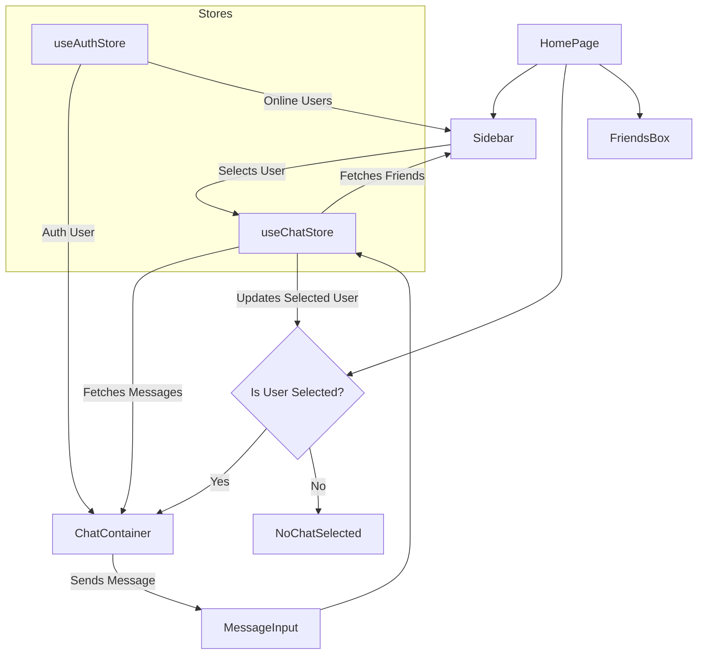
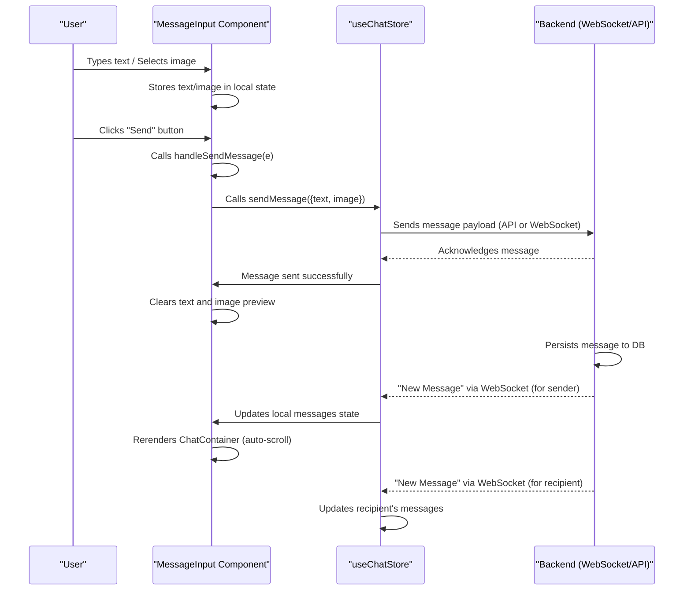

 # UI Components and Pages

This document details the primary UI components and pages within the `frontend/src` directory, focusing on their functionality, structure, and interconnections. These elements form the user interface of the chat application, managing user interactions from chat selection to message display and input.

## Application Pages

### HomePage

The `HomePage.jsx` serves as the central layout for the chat application, orchestrating the display of various components based on user interaction and state. It conditionally renders either a `NoChatSelected` message or the `ChatContainer` based on whether a user has been selected for a chat.

-   **Purpose**: Manages the overall layout and conditional rendering of the main chat interface.
-   **Key Features**:
    -   Renders the `Sidebar` for friend selection.
    -   Dynamically displays `NoChatSelected` when no user is chosen, or `ChatContainer` when a user is selected.
    -   Integrates `FriendsBox` for managing friend invitations or search functionality.
-   **Dependencies**: `ChatContainer`, `FriendsBox`, `NoChatSelected`, `Sidebar`, `useChatStore`.

The conditional rendering logic for `ChatContainer` and `NoChatSelected` is a core aspect of the `HomePage`:

```jsx
// frontend/src/pages/HomePage.jsx
// Line 11-12
            <Sidebar />
            {!selectedUser ? <NoChatSelected /> : <ChatContainer />}
            {isFriendsBoxOpen && <FriendsBox />}
```
[View on GitHub](https://github.com/shinymack/Chat-App-MERN/blob/main/frontend/src/pages/HomePage.jsx#L11-L12)

This snippet demonstrates how `HomePage` dynamically adjusts its content based on the `selectedUser` state from the `useChatStore`.

## UI Components

### ChatContainer

The `ChatContainer.jsx` component is responsible for displaying messages for a selected user and managing the message input area. It fetches messages, subscribes to real-time updates, and ensures the chat scrolls to the latest message.

-   **Purpose**: Displays the chat history and integrates the message input.
-   **Key Features**:
    -   Fetches and renders messages specific to the `selectedUser`.
    -   Subscribes to real-time message updates using WebSockets.
    -   Automatically scrolls to the bottom of the chat when new messages arrive.
    -   Handles loading states with a `MessageSkeleton`.
    -   Displays user profile pictures, message text, and attached images.
-   **Dependencies**: `useChatStore`, `useAuthStore`, `ChatHeader`, `MessageInput`, `MessageSkeleton`.

The `useEffect` hook handles message fetching and real-time subscription:

```jsx
// frontend/src/components/ChatContainer.jsx
// Line 17-23
    useEffect(() => {
        getMessages(selectedUser._id);
        subscribeToMessages();

        return () => unsubscribeFromMessages();
    }, [selectedUser._id, getMessages, subscribeToMessages, unsubscribeFromMessages]);
```
[View on GitHub](https://github.com/shinymack/Chat-App-MERN/blob/main/frontend/src/components/ChatContainer.jsx#L17-L23)

This snippet illustrates how `ChatContainer` ensures that messages are loaded and real-time updates are managed based on the currently `selectedUser`. The cleanup function returned by `useEffect` is crucial for preventing memory leaks and ensuring subscriptions are properly closed when the component unmounts or the `selectedUser` changes.

Another `useEffect` handles auto-scrolling to the latest message:

```jsx
// frontend/src/components/ChatContainer.jsx
// Line 25-29
    useEffect(() => {
        if(messageEndRef.current && messages){
            messageEndRef.current.scrollIntoView({behaviour : "smooth"})
        }
    }, [messages])
```
[View on GitHub](https://github.com/shinymack/Chat-App-MERN/blob/main/frontend/src/components/ChatContainer.jsx#L25-L29)

This ensures a smooth user experience by automatically bringing the newest messages into view as they are loaded or received.

### MessageInput

The `MessageInput.jsx` component provides the interface for users to type and send messages, including support for image attachments.

-   **Purpose**: Allows users to compose and send text messages and image attachments.
-   **Key Features**:
    -   Text input field for messages.
    -   Image attachment functionality with preview.
    -   Option to remove image preview.
    -   Sends messages via the `sendMessage` action from `useChatStore`.
    -   Input validation (prevents sending empty messages).
-   **Dependencies**: `useChatStore`, `lucide-react` (for icons), `react-hot-toast`.

The `handleSendMessage` function processes the message submission, including text and image data:

```jsx
// frontend/src/components/MessageInput.jsx
// Line 34-47
    const handleSendMessage = async (e) => {
        e.preventDefault();
        if (!text.trim() && !imagePreview) return;

        try {
            await sendMessage({
                text: text.trim(),
                image: imagePreview,
            });

            setText("");
            setImagePreview(null);
            if (fileInputRef.current) fileInputRef.current = "";
        } catch (error) {
            console.error("Failed to send message", error);
        }
    };
```
[View on GitHub](https://github.com/shinymack/Chat-App-MERN/blob/main/frontend/src/components/MessageInput.jsx#L34-L47)

This function ensures that only non-empty messages (either text or an image) are sent. It also clears the input field and image preview after successful transmission.

### Sidebar

The `Sidebar.jsx` component displays a list of the user's friends, allowing selection to initiate a chat. It includes features to filter online users and indicates their online/offline status.

-   **Purpose**: Navigational component for selecting a chat partner.
-   **Key Features**:
    -   Lists all friends.
    -   Highlights the currently `selectedUser`.
    -   Displays online status indicators.
    -   Toggle to show only online friends.
    -   Handles loading states with a `SidebarSkeleton`.
-   **Dependencies**: `useChatStore`, `useAuthStore`, `SidebarSkeleton`.

The filtering logic for online users is shown below:

```jsx
// frontend/src/components/Sidebar.jsx
// Line 20-22
    const filteredUsers = showOnlineOnly
        ? users.filter((user) => onlineUsers.includes(user._id))
        : users;
```
[View on GitHub](https://github.com/shinymack/Chat-App-MERN/blob/main/frontend/src/components/Sidebar.jsx#L20-L22)

This snippet conditionally filters the list of users based on the `showOnlineOnly` state, integrating directly with the `onlineUsers` array from the authentication store.

## Component Interaction Flow

The following diagram illustrates the high-level interaction between the main UI components and the data stores:





This diagram maps how `HomePage` orchestrates the display, `Sidebar` manages user selection, and `ChatContainer` handles message display and input via `MessageInput`, all while interacting with the central `useChatStore` and `useAuthStore` for state management.

## Message Sending Process

The following sequence diagram details the flow for sending a message from the `MessageInput` component:





This sequence details the complete lifecycle of a message, from user input to backend processing and subsequent UI updates for both sender and recipient.

## Key Integration Points

The UI components and pages are tightly integrated through the Zustand stores, `useChatStore` and `useAuthStore`. This approach centralizes state management, enabling efficient data flow and reactivity across the application.

-   **State-Driven Rendering**: `HomePage` dynamically renders `ChatContainer` or `NoChatSelected` based on `selectedUser` from `useChatStore`. This ensures that the UI always reflects the current chat context.
-   **Real-time Updates**: `ChatContainer` subscribes to real-time message updates via `useChatStore`, leveraging WebSockets for instant message delivery and display. This is critical for a responsive chat application.
-   **User Authentication and Status**: `useAuthStore` provides crucial information like the `authUser` and `onlineUsers`. This data is consumed by `ChatContainer` (to identify sender/receiver) and `Sidebar` (to display online status and filter users), ensuring personalized and accurate UI presentation.
-   **Component Reusability**: Components like `ChatHeader` and `MessageSkeleton` (not detailed but imported) are used within `ChatContainer`, demonstrating a modular design approach where smaller, focused components build up larger ones.
-   **Input Handling and Validation**: `MessageInput` integrates with `useChatStore` to send messages, and includes client-side validation for input, enhancing user experience by preventing empty messages and providing immediate feedback.
-   **Scroll Management**: The `useRef` and `useEffect` pattern in `ChatContainer` for auto-scrolling is a robust way to manage UI behavior dependent on dynamic content, ensuring that users always see the latest part of the conversation.

These integration points highlight the application's reliance on a centralized state management pattern (Zustand) to maintain consistency and responsiveness across its interactive UI elements.