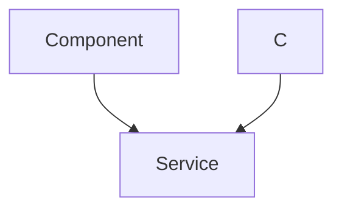

 # User Interface Components

This section provides an in-depth look at the core user interface components within the `frontend/src/components` directory. These components are designed to be reusable and encapsulate specific functionalities, from displaying chat messages to handling user input and navigation.

## ChatContainer

The `ChatContainer` component, located at `frontend/src/components/ChatContainer.jsx`, is the central hub for displaying active chat messages. It orchestrates the fetching, rendering, and real-time updates of messages for a selected conversation.

### Purpose and Functionality

`ChatContainer` is responsible for:
*   **Message Display**: Iterating through and rendering individual chat messages, distinguishing between messages sent by the authenticated user and the selected friend.
*   **Real-time Updates**: Subscribing to and unsubscribing from message updates to ensure new messages are displayed instantly.
*   **Auto-scrolling**: Automatically scrolling to the most recent message upon loading or when new messages arrive.
*   **Loading State**: Displaying a `MessageSkeleton` while messages are being loaded.
*   **Integration**: Embedding the `ChatHeader` (for displaying selected user info) and `MessageInput` (for composing and sending messages).

### Data Flow

The `ChatContainer` heavily relies on the `useChatStore` to manage chat-related state, such as `messages`, `selectedUser`, and loading indicators. It also utilizes `useAuthStore` to identify the currently authenticated user for styling messages.

```javascript
import { useEffect } from "react";
import { useChatStore } from "../store/useChatStore";
import ChatHeader from "./ChatHeader";
import MessageInput from "./MessageInput";
import MessageSkeleton from "./skeletons/MessageSkeleton";
import { useAuthStore } from "../store/useAuthStore";
import { formatMessageTime } from "../lib/utils";
import { useRef } from "react";

const ChatContainer = () => {
    const { messages, getMessages, isMessagesLoading, selectedUser, subscribeToMessages, unsubscribeFromMessages } =
        useChatStore();
    const { authUser } = useAuthStore();
    const messageEndRef = useRef(null);

    // ... (rest of the component)
};
export default ChatContainer;
```
[View on GitHub](https://github.com/shinymack/Chat-App-MERN/blob/main/frontend/src/components/ChatContainer.jsx#L1-L16)

This snippet shows the primary imports and state management hooks used by `ChatContainer`. The `useEffect` hook is crucial for handling message fetching and real-time subscriptions based on the `selectedUser`.

### Real-time Message Subscription

The component subscribes to real-time message updates using `subscribeToMessages` from `useChatStore`. This ensures that as soon as a new message is sent or received, it appears in the chat without requiring a page refresh. The cleanup function `unsubscribeFromMessages` prevents memory leaks.

```javascript
    useEffect(() => {
        getMessages(selectedUser._id);
        subscribeToMessages();

        return () => unsubscribeFromMessages();
    }, [selectedUser._id, getMessages, subscribeToMessages, unsubscribeFromMessages]);
```
[View on GitHub](https://github.com/shinymack/Chat-App-MERN/blob/main/frontend/src/components/ChatContainer.jsx#L20-L25)

### Message Rendering Logic

Each message is rendered within a `div` element, dynamically applying `chat-end` or `chat-start` CSS classes based on whether the `senderId` matches the `authUser._id`. This visual distinction clearly indicates who sent which message.

```javascript
                {messages.map((message) => (
                    <div
                        key={message._id}
                        className={`chat ${message.senderId == authUser._id ? "chat-end": "chat-start"} `}
                        ref={messageEndRef}
                    >
                        <div className="chat-image avatar">
                            <div className="size-9 rounded-full border">
                                
                            </div>
                        </div>
                        <div className="chat-header mb-1">
                            <time className="text-xs opacity-50 ml-1">{formatMessageTime(message.createdAt)}</time>
                        </div>
                        <div className="chat-bubble flex flex-col">
                            {message.image && (
                                
                            )}
                            {message.text && <p>{message.text}</p>}
                        </div>
                    </div>
                ))}
```
[View on GitHub](https://github.com/shinymack/Chat-App-MERN/blob/main/frontend/src/components/ChatContainer.jsx#L38-L69)

## MessageInput

The `MessageInput` component, found in `frontend/src/components/MessageInput.jsx`, provides the interface for users to compose and send messages, including text and image attachments.

### Purpose and Functionality

`MessageInput` is responsible for:
*   **Text Input**: Allowing users to type message content.
*   **Image Attachment**: Enabling users to select and preview image files before sending.
*   **Image Removal**: Providing a clear option to remove a selected image preview.
*   **Message Sending**: Dispatching the message (text and/or image) to the backend.
*   **Input Clearing**: Resetting the input field and image preview after a message is sent.

### Interaction Flow

The interaction within `MessageInput` involves local state management for the message text and image preview, along with a `sendMessage` action from the `useChatStore`.





### Image Handling

The component uses an `input type="file"` element to allow image selection. A `FileReader` is used to display a preview of the selected image, enhancing the user experience.

```javascript
    const handleImageChange = (e) => {
        const file = e.target.files[0];
        if (!file.type.startsWith("image/")) {
            toast.error("Please select an image file");
            return;
        }

        const reader = new FileReader();
        reader.onloadend = () => {
            setImagePreview(reader.result);
        };
        reader.readAsDataURL(file);
    };
```
[View on GitHub](https://github.com/shinymack/Chat-App-MERN/blob/main/frontend/src/components/MessageInput.jsx#L15-L26)

### Sending Messages

The `handleSendMessage` function orchestrates the message dispatch. It prevents sending empty messages, calls the `sendMessage` action from the `useChatStore`, and then resets the component's local state.

```javascript
    const handleSendMessage = async (e) => {
        e.preventDefault();
        if (!text.trim() && !imagePreview) return;

        try {
            await sendMessage({
                text: text.trim(),
                image: imagePreview,
            });

            setText("");
            setImagePreview(null);
            if (fileInputRef.current) fileInputRef.current = "";
        } catch (error) {
            console.error("Failed to send message", error);
        }
    };
```
[View on GitHub](https://github.com/shinymack/Chat-App-MERN/blob/main/frontend/src/components/MessageInput.jsx#L36-L53)

## Navbar

The `Navbar` component, located at `frontend/src/components/Navbar.jsx`, provides global navigation and access to key application features like friend lists, settings, user profile, and logout functionality.

### Purpose and Functionality

`Navbar` is responsible for:
*   **Branding**: Displaying the application's logo and title.
*   **Navigation**: Providing links to the home page, settings, and user profile.
*   **Friends List Toggle**: Toggling the visibility of the friends list sidebar.
*   **Authentication State**: Conditionally rendering profile and logout buttons based on the user's authentication status.
*   **Logout**: Initiating the logout process via `useAuthStore`.

### Structure and Links

The `Navbar` leverages `react-router-dom`'s `Link` component for client-side navigation and utilizes `lucide-react` icons for a visually appealing and intuitive interface.

```javascript
import { Link } from "react-router-dom";
import { useAuthStore } from "../store/useAuthStore";
import { LogOut, MessageSquare, Settings, User, Users } from "lucide-react";
import { useChatStore } from "../store/useChatStore";

const Navbar = () => {
  const { logout, authUser } = useAuthStore();
  const { toggleFriendsBox } = useChatStore();

  return (
    <header
      className=" bg-base-100 border-b border-base-300 fixed w-full top-0 z-40
        backdrop-blur-lg bg-base-100/80"
    >
      <div className="container mx-auto px-4 h-16">
        <div className="flex items-center justify-between h-full">
          {/* ... (rest of the component) */}
        </div>
      </div>
    </header>
  );
};

export default Navbar;
```
[View on GitHub](https://github.com/shinymack/Chat-App-MERN/blob/main/frontend/src/components/Navbar.jsx#L4-L24)

### Conditional Rendering

The profile and logout buttons are only displayed if an `authUser` is present in the `useAuthStore`, ensuring that unauthenticated users do not see irrelevant options.

```javascript
            {authUser && (
              <>
                <Link to={"/profile"} className={`btn btn-sm gap-2`}>
                  <User className="size-5" />
                  <span className="hidden sm:inline">Profile</span>
                </Link>

                <button className="btn btn-sm flex gap-2 items-center" onClick={logout}>
                  <LogOut className="size-5" />
                  <span className="hidden sm:inline">Logout</span>
                </button>
              </>
            )}
```
[View on GitHub](https://github.com/shinymack/Chat-App-MERN/blob/main/frontend/src/components/Navbar.jsx#L43-L56)

## Sidebar

The `Sidebar` component, located at `frontend/src/components/Sidebar.jsx`, displays a list of the user's friends, allowing selection to initiate a chat. It also provides filtering options to view only online friends.

### Purpose and Functionality

`Sidebar` is responsible for:
*   **Friend List Display**: Listing all friends retrieved from the backend.
*   **Friend Selection**: Allowing users to select a friend, which updates the `selectedUser` state and triggers the `ChatContainer` to display their messages.
*   **Online Status Indicator**: Visually indicating which friends are currently online.
*   **Online Filter**: Providing a checkbox to filter the list to show only online friends.
*   **Loading State**: Displaying a `SidebarSkeleton` while the friends list is being loaded.
*   **Responsiveness**: Adapting its visibility based on `selectedUser` for better mobile experience.

### Data Management

`Sidebar` integrates with both `useChatStore` (for fetching friends and managing `selectedUser`) and `useAuthStore` (for accessing `onlineUsers` to determine online status).

```javascript
import { useEffect, useState } from "react";
import { useChatStore } from "../store/useChatStore";
import SidebarSkeleton from "./skeletons/SidebarSkeleton";
import { Users } from "lucide-react";
import { useAuthStore } from "../store/useAuthStore";

const Sidebar = () => {
    const { getFriends, users, selectedUser, setSelectedUser, isUsersLoading } =
        useChatStore();

    const { onlineUsers } = useAuthStore();
    const [showOnlineOnly, setShowOnlineOnly] = useState(false);

    // ... (rest of the component)
};
export default Sidebar;
```
[View on GitHub](https://github.shinymack.com/Chat-App-MERN/blob/main/frontend/src/components/Sidebar.jsx#L1-L12)

### Filtering Friends

The `showOnlineOnly` state allows users to toggle a filter that displays only friends who are currently online, using the `onlineUsers` array from `useAuthStore`.

```javascript
    const filteredUsers = showOnlineOnly
        ? users.filter((user) => onlineUsers.includes(user._id))
        : users;
    if (isUsersLoading) return <SidebarSkeleton />;
```
[View on GitHub](https://github.com/shinymack/Chat-App-MERN/blob/main/frontend/src/components/Sidebar.jsx#L17-L19)

### User List Rendering

Each friend in the `filteredUsers` list is rendered as a clickable button. When a friend is clicked, `setSelectedUser` is called, updating the global chat state and triggering a re-render in `ChatContainer`.

```javascript
                    {filteredUsers.map((user) => (
                        <button
                            key={user._id}
                            onClick={() => setSelectedUser(user)}
                            className={`sm:w-full w-[88vw] p-3 flex items-center gap-3 hover:bg-base-300 transition-colors
                            ${
                                selectedUser?._id === user._id
                                    ? "bg-base-300 ring-1 ring-base-300"
                                    : ""
                            }`}
                        >
                            <div className="relative mx-0">
                                
                                {onlineUsers.includes(user._id) && (
                                    <span className="absolute bottom-0 right-0 size-3 bg-green-500 rounded-full ring-2 ring-zinc-900" />
                                )}
                            </div>
                            <div className=" block text-left min-w-0">
                                <div className=" font-medium truncate">
                                    {user.username}
                                </div>
                                <div className="text-sm text-zinc-400">
                                    {onlineUsers.includes(user._id)
                                        ? "Online"
                                        : "Offline"}
                                </div>
                            </div>
                        </button>
                    ))}
```
[View on GitHub](https://github.com/shinymack/Chat-App-MERN/blob/main/frontend/src/components/Sidebar.jsx#L52-L89)

## Key Integration Points

These UI components are tightly integrated to provide a seamless chat experience:

*   **Global State Management**: `useChatStore` and `useAuthStore` act as central hubs, managing the application's global state regarding authentication, selected chat, messages, and online users. This pattern ensures that components can react to changes in state without direct prop drilling.
*   **Component Composition**: `ChatContainer` effectively composes `ChatHeader` and `MessageInput`, demonstrating how smaller, focused components can be combined to build a larger, feature-rich interface.
*   **Real-time Communication**: The combination of `ChatContainer`'s message subscription and `Sidebar`'s display of `onlineUsers` highlights the application's real-time capabilities, crucial for a modern chat application.
*   **User Experience**: Features like auto-scrolling in `ChatContainer`, image preview in `MessageInput`, and the online filter in `Sidebar` are all designed to enhance the user experience, making the application intuitive and efficient.
*   **Responsive Design**: The conditional rendering in `Sidebar` (hiding on small screens when a user is selected) ensures a smooth experience across different device sizes.

The modular design of these components, coupled with a robust state management system, allows for maintainable and scalable development, ensuring that new features can be added without significantly impacting existing functionalities.