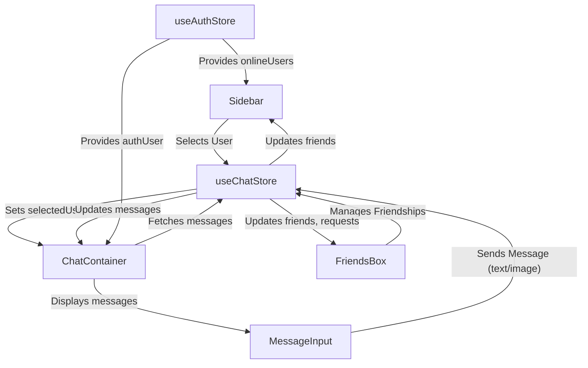
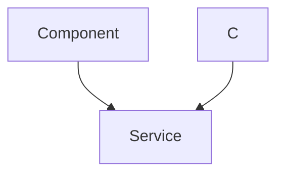

 # User Interface Components

This section details the core React components that form the user interface of the application. These components are designed for reusability and maintainability, leveraging React's functional patterns, hooks, and global state management through Zustand. They integrate seamlessly to provide a dynamic and responsive chat experience.

## ChatContainer

The `ChatContainer` component is responsible for displaying the conversation history with a selected user. It dynamically fetches messages, subscribes to real-time updates, and ensures the view scrolls to the latest message.

### Purpose and Features

*   **Message Display**: Renders individual messages, differentiating between sender and receiver.
*   **Real-time Updates**: Subscribes to new messages using `subscribeToMessages` from `useChatStore`.
*   **Automatic Scrolling**: Uses `useRef` and `useEffect` to automatically scroll to the newest message.
*   **Loading State**: Displays a `MessageSkeleton` while messages are being loaded.
*   **Integration**: Composes `ChatHeader` and `MessageInput` for a complete chat interface.

### Message Fetching and Subscription

The component uses `useEffect` to manage the lifecycle of message fetching and subscription. When a new user is selected, it fetches their messages and sets up a real-time listener.

```jsx
// frontend/src/components/ChatContainer.jsx (lines 17-23)
import { useEffect } from "react";
import { useChatStore } from "../store/useChatStore";

const ChatContainer = () => {
    const { messages, getMessages, isMessagesLoading, selectedUser, subscribeToMessages, unsubscribeFromMessages } =
        useChatStore();
    // ... other code

    useEffect(() => {
        getMessages(selectedUser._id);
        subscribeToMessages();

        return () => unsubscribeFromMessages();
    }, [selectedUser._id, getMessages, subscribeToMessages, unsubscribeFromMessages]);
    
    // ... rest of component
};
export default ChatContainer;
```
[View on GitHub](https://github.com/shinymack/Chat-App-MERN/blob/main/frontend/src/components/ChatContainer.jsx#L17-L23)

### Message Rendering Logic

Messages are rendered dynamically, applying different styles based on whether the `authUser` is the sender or receiver, and displaying attachments if present.

```jsx
// frontend/src/components/ChatContainer.jsx (lines 40-67)
// ... other code
            <div className="flex-1 overflow-y-auto p-4 space-y-4">
                {messages.map((message) => (
                    <div
                        key={message._id}
                        className={`chat ${message.senderId == authUser._id ? "chat-end": "chat-start"} `}
                        ref={messageEndRef}
                    >
                        <div className="chat-image avatar">
                            <div className="size-9 rounded-full border">
                                
                            </div>
                        </div>
                        <div className="chat-header mb-1">
                            <time className="text-xs opacity-50 ml-1">{formatMessageTime(message.createdAt)}</time>
                        </div>
                        <div className="chat-bubble flex flex-col">
                            {message.image && (
                                
                            )}
                            {message.text && <p>{message.text}</p>}
                        </div>
                    </div>
                ))}
            </div>
// ... rest of component
```
[View on GitHub](https://github.com/shinymack/Chat-App-MERN/blob/main/frontend/src/components/ChatContainer.jsx#L40-L67)

## FriendsBox

The `FriendsBox` component provides a modal interface for managing friend relationships, including viewing current friends, pending requests, sent requests, and sending new friend requests.

### Purpose and Features

*   **Friend Management**: Allows users to view, accept, reject, and remove friends.
*   **Tabbed Interface**: Organizes content into "Friends", "Pending", and "Sent" tabs.
*   **Friend Request System**: Enables sending new friend requests via username or email.
*   **State Management**: Utilizes `useChatStore` for all friend-related actions and data.
*   **Modal Overlay**: Presented as a fixed overlay with a backdrop, controlled by `toggleFriendsBox`.

### Tabbed Content Rendering

The `renderContent` function dynamically displays the appropriate list of users based on the `activeTab` state.

```jsx
// frontend/src/components/FriendsBox.jsx (lines 31-89)
// ... other code
    const renderContent = () => {
        switch (activeTab) {
            case 'pending':
                return (
                    <div className="space-y-2">
                        {pendingRequests.length > 0 ? pendingRequests.map(req => (
                            <div key={req._id} className="flex items-center justify-between p-2 rounded-lg bg-base-200">
                                <div className="flex items-center gap-3">
                                    
                                    <span>{req.username}</span>
                                </div>
                                <div className="flex gap-2">
                                    <button onClick={() => acceptFriendRequest(req._id)} className="btn btn-xs btn-success btn-circle"><Check size={16}/></button>
                                    <button onClick={() => rejectFriendRequest(req._id)} className="btn btn-xs btn-error btn-circle"><X size={16}/></button>
                                </div>
                            </div>
                        )) : <p className="text-center text-base-content/60 py-4">No pending requests.</p>}
                    </div>
                );
            case 'sent':
                return (
                    <div className="space-y-2">
                        {sentRequests.length > 0 ? sentRequests.map(req => (
                             <div key={req._id} className="flex items-center justify-between p-2 rounded-lg bg-base-200">
                                <div className="flex items-center gap-3">
                                    
                                    <span>{req.username}</span>
                                </div>
                                <span className="text-sm text-base-content/50">Pending</span>
                            </div>
                        )) : <p className="text-center text-base-content/60 py-4">No sent requests.</p>}
                    </div>
                );
            case 'friends':
            default:
                return (
                    <div className="space-y-2">
                        {users.length > 0 ? users.map(friend => (
                            <div key={friend._id} className="flex items-center justify-between p-2 rounded-lg bg-base-200">
                               <div className="flex items-center gap-3">
                                    
                                    <span>{friend.username}</span>
                                </div>
                                <button onClick={() => removeFriend(friend._id)} className="btn btn-xs btn-ghost btn-circle text-error"><Trash2 size={16}/></button>
                            </div>
                        )) : <p className="text-center text-base-content/60 py-4">You have no friends yet.</p>}
                    </div>
                );
        }
    };
// ... rest of component
```
[View on GitHub](https://github.com/shinymack/Chat-App-MERN/blob/main/frontend/src/components/FriendsBox.jsx#L31-L89)

## MessageInput

The `MessageInput` component provides an interface for users to compose and send messages, including text and image attachments.

### Purpose and Features

*   **Text Input**: A text field for typing messages.
*   **Image Attachment**: Allows users to select and preview an image, which can be sent along with or instead of text.
*   **Validation**: Ensures only image files are selected for attachments.
*   **Sending Mechanism**: Dispatches the `sendMessage` action from `useChatStore` upon submission.
*   **State Management**: Manages local state for message text and image preview.

### Image Handling Logic

The component includes functionality to preview an selected image and to clear the preview.

```jsx
// frontend/src/components/MessageInput.jsx (lines 14-26)
// ... other code
    const handleImageChange = (e) => {
        const file = e.target.files["0"];
        if (!file.type.startsWith("image/")) {
            toast.error("Please select an image file");
            return;
        }

        const reader = new FileReader();
        reader.onloadend = () => {
            setImagePreview(reader.result);
        };
        reader.readAsDataURL(file);
    };

    const removeImage = () => {
        setImagePreview(null);
        if (fileInputRef.current) fileInputRef.current.value = "";
    };
// ... rest of component
```
[View on GitHub](https://github.com/shinymack/Chat-App-MERN/blob/main/frontend/src/components/MessageInput.jsx#L14-L26)

### Sending Messages

The `handleSendMessage` function orchestrates sending the message, clearing input fields, and resetting the image preview after a successful submission.

```jsx
// frontend/src/components/MessageInput.jsx (lines 28-41)
// ... other code
    const handleSendMessage = async (e) => {
        e.preventDefault();
        if (!text.trim() && !imagePreview) return;

        try {
            await sendMessage({
                text: text.trim(),
                image: imagePreview,
            });

            setText("");
            setImagePreview(null);
            if (fileInputRef.current) fileInputRef.current = "";
        } catch (error) {
            console.error("Failed to send message", error);
        }
    };
// ... rest of component
```
[View on GitHub](https://github.com/shinymack/Chat-App-MERN/blob/main/frontend/src/components/MessageInput.jsx#L28-L41)

## Sidebar

The `Sidebar` component displays a list of the user's friends, allowing them to select a friend to start or continue a chat. It also indicates online/offline status and provides a filter for online friends.

### Purpose and Features

*   **Friend List Display**: Shows all friends with their profile pictures and usernames.
*   **User Selection**: Allows selection of a user to view their chat history in `ChatContainer`.
*   **Online Status Indicator**: Displays a visual indicator for online friends and textual status.
*   **Online Filter**: Provides a checkbox to filter the list to show only online friends.
*   **Loading State**: Displays a `SidebarSkeleton` while the friend list is loading.
*   **Responsive Hiding**: Automatically hides when a user is selected on smaller screens.

### Filtering Online Friends

The component maintains a `showOnlineOnly` state to filter the list of friends based on their online status, derived from `onlineUsers` in `useAuthStore`.

```jsx
// frontend/src/components/Sidebar.jsx (lines 12-23)
// ... other code
    const { onlineUsers } = useAuthStore();
    const [showOnlineOnly, setShowOnlineOnly] = useState(false);
    useEffect(() => {
        getFriends();
    }, [getFriends]);
    const filteredUsers = showOnlineOnly
        ? users.filter((user) => onlineUsers.includes(user._id))
        : users;
    if (isUsersLoading) return <SidebarSkeleton />;
// ... rest of component
```
[View on GitHub](https://github.com/shinymack/Chat-App-MERN/blob/main/frontend/src/components/Sidebar.jsx#L12-L23)

### Online Status Display

Each friend item in the sidebar displays an online/offline status and a green dot for online users.

```jsx
// frontend/src/components/Sidebar.jsx (lines 53-66)
// ... other code
                            <div className="relative mx-0">
                                
                                {onlineUsers.includes(user._id) && (
                                    <span className="absolute bottom-0 right-0 size-3 bg-green-500 rounded-full ring-2 ring-zinc-900" />
                                )}
                            </div>
                            <div className=" block text-left min-w-0">
                                <div className=" font-medium truncate">
                                    {user.username}
                                </div>
                                <div className="text-sm text-zinc-400">
                                    {onlineUsers.includes(user._id)
                                        ? "Online"
                                        : "Offline"}
                                </div>
                            </div>
// ... rest of component
```
[View on GitHub](https://github.com/shinymack/Chat-App-MERN/blob/main/frontend/src/components/Sidebar.jsx#L53-L66)

## Component Interaction Flow

The UI components interact to provide a cohesive chat experience, primarily orchestrated by the `useChatStore` and `useAuthStore` Zustand stores.





## Messaging Sequence

When a user sends a message, a specific sequence of events unfolds, involving the `MessageInput`, `useChatStore`, and potentially the backend for persistence and real-time delivery.





## Key Integration Points

These UI components are tightly integrated with the application's state management and backend services to provide a dynamic and responsive user experience.

*   **Centralized State**: The `useChatStore` acts as a central hub for all chat-related data (messages, selected user, friends, requests) and actions (sending messages, fetching data, managing friendships). This minimizes prop drilling and ensures data consistency across the application.
*   **Real-time Communication**: The `ChatContainer` leverages real-time subscriptions managed by `useChatStore` (implicitly through WebSockets or similar) to instantly display new messages without requiring manual refreshes.
*   **User Context**: The `useAuthStore` provides crucial authentication details (`authUser`) and real-time online status (`onlineUsers`), which are consumed by `ChatContainer` for message display and `Sidebar` for friend status indicators.
*   **Component Composition**: Components like `ChatContainer` and `Sidebar` are high-level orchestrators, composing smaller, focused components (`ChatHeader`, `MessageInput`, `MessageSkeleton`, individual friend/message items) to build complex views.
*   **Responsive Design**: The components often include responsive classes (e.g., `sm:hidden`, `sm:flex`) to adapt their layout and visibility across different screen sizes, providing an optimal experience on both mobile and desktop.
*   **Error Handling and Feedback**: Basic error handling (e.g., `toast` notifications for image upload) and loading states (`MessageSkeleton`, `SidebarSkeleton`) enhance the user experience by providing clear feedback during asynchronous operations.