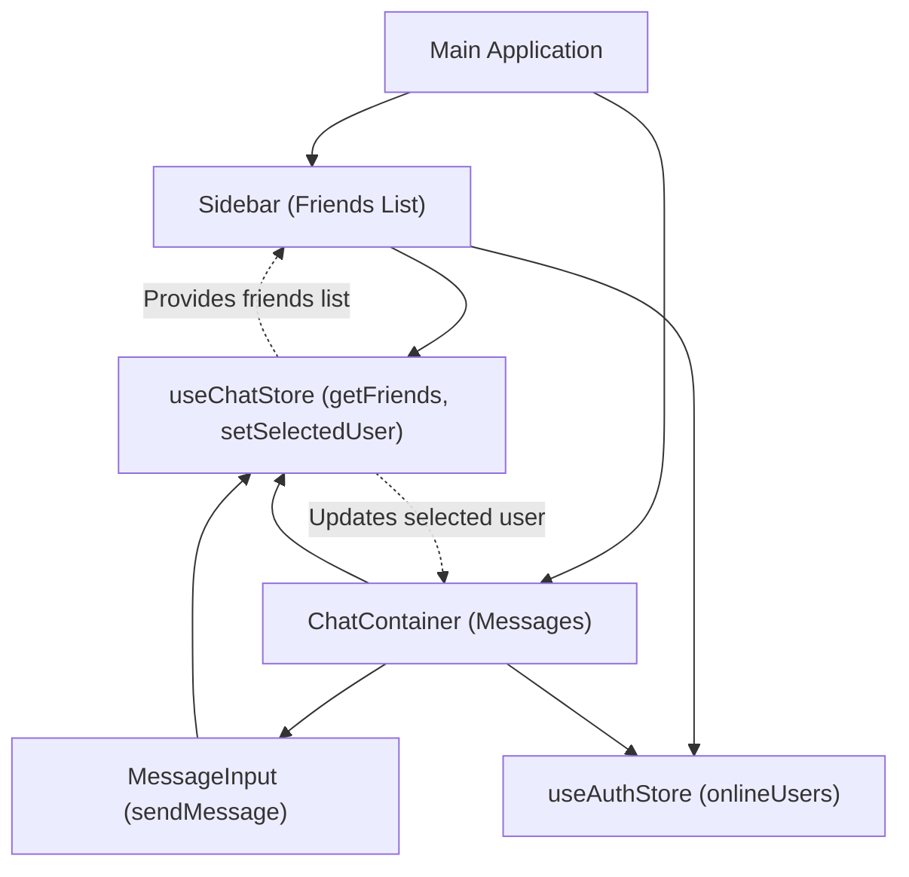
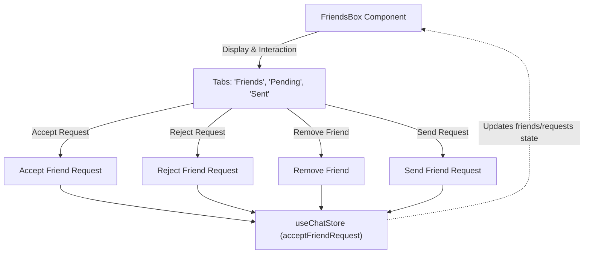

 # User Interface Components

This section provides an in-depth look at the core reusable React components that form the user interface of the application. These components are responsible for rendering chat messages, managing friend interactions, handling user input, and displaying the list of active conversations. Each component leverages Zustand for state management, interacting with `useChatStore` and `useAuthStore` to maintain a reactive and dynamic UI.

## ChatContainer

The `ChatContainer` component is the central display area for messages. It renders the `ChatHeader`, the list of messages for the currently selected user, and the `MessageInput` component. It handles message fetching, real-time message subscription, and automatically scrolls to the latest message.

### Key Features

*   **Message Display:** Renders individual messages, distinguishing between sent and received messages.
*   **Real-time Updates:** Subscribes to message updates using `useEffect`, ensuring new messages appear instantly.
*   **Automatic Scrolling:** Uses `useRef` and `useEffect` to scroll to the bottom of the chat, showing the latest messages.
*   **Loading State:** Displays a `MessageSkeleton` while messages are being fetched.
*   **Media Support:** Renders image attachments within messages.

### Code Snippets

#### Real-time Message Subscription

This `useEffect` hook handles the lifecycle of message fetching and subscription. It fetches messages for the `selectedUser` and sets up a real-time listener for new messages, unsubscribing when the component unmounts or the `selectedUser` changes.

```jsx
// frontend/src/components/ChatContainer.jsx
import { useEffect } from "react";
import { useChatStore } from "../store/useChatStore";

const ChatContainer = () => {
    const { messages, getMessages, selectedUser, subscribeToMessages, unsubscribeFromMessages } =
        useChatStore();

    useEffect(() => {
        getMessages(selectedUser._id);
        subscribeToMessages();

        return () => unsubscribeFromMessages();
    }, [selectedUser._id, getMessages, subscribeToMessages, unsubscribeFromMessages]);
    // ...
};
```
[View on GitHub](https://github.com/shinymack/Chat-App-MERN/blob/main/frontend/src/components/ChatContainer.jsx#L11-L18)

#### Auto-Scrolling to Latest Message

This `useEffect` ensures that the chat view automatically scrolls to the most recent message whenever the `messages` array is updated.

```jsx
// frontend/src/components/ChatContainer.jsx
import { useRef, useEffect } from "react";

const ChatContainer = () => {
    const { messages } = useChatStore();
    const messageEndRef = useRef(null);

    useEffect(() => {
        if(messageEndRef.current && messages){
            messageEndRef.current.scrollIntoView({behaviour : "smooth"})
        }
    }, [messages])
    // ...
};
```
[View on GitHub](https://github.com/shinymack/Chat-App-MERN/blob/main/frontend/src/components/ChatContainer.jsx#L20-L24)

## FriendsBox

The `FriendsBox` component provides a modal interface for managing friend relationships, including viewing friends, handling pending requests, and sending new friend requests. It uses a tabbed navigation system to switch between different views.

### Key Features

*   **Tabbed Navigation:** Organizes content into "Friends," "Pending Requests," and "Sent Requests" tabs.
*   **Friend Management:** Allows users to accept, reject, or remove friends.
*   **Add Friend Functionality:** Provides an input field to send friend requests by username or email.
*   **Dynamic Updates:** Fetches all relevant friend data (`friends`, `pendingRequests`, `sentRequests`) upon mounting.

### Code Snippets

#### Fetching Friend Data on Mount

Upon component mount, `FriendsBox` fetches the user's friends, pending requests, and sent requests to populate the respective tabs.

```jsx
// frontend/src/components/FriendsBox.jsx
import { useEffect } from 'react';
import { useChatStore } from '../store/useChatStore';

const FriendsBox = () => {
    const { 
        getFriends,
        getPendingRequests,
        getSentRequests,
    } = useChatStore();

    useEffect(() => {
        getFriends();
        getPendingRequests();
        getSentRequests();
    }, [getFriends, getPendingRequests, getSentRequests]);
    // ...
};
```
[View on GitHub](https://github.com/shinymack/Chat-App-MERN/blob/main/frontend/src/components/FriendsBox.jsx#L13-L21)

#### Rendering Tab Content

The `renderContent` function dynamically displays the appropriate list based on the currently active tab.

```jsx
// frontend/src/components/FriendsBox.jsx
const FriendsBox = () => {
    const [activeTab, setActiveTab] = useState('friends');
    const { pendingRequests, sentRequests, users } = useChatStore(); // users here refers to friends list

    const renderContent = () => {
        switch (activeTab) {
            case 'pending':
                return ( /* ... display pending requests ... */ );
            case 'sent':
                return ( /* ... display sent requests ... */ );
            case 'friends':
            default:
                return ( /* ... display friends list ... */ );
        }
    };
    // ...
};
```
[View on GitHub](https://github.com/shinymack/Chat-App-MERN/blob/main/frontend/src/components/FriendsBox.jsx#L36-L79)

## MessageInput

The `MessageInput` component is responsible for handling user input for sending messages. It supports both text and image attachments.

### Key Features

*   **Text Input:** Allows users to type and send text messages.
*   **Image Attachment:** Supports selecting and previewing image files before sending.
*   **Image Preview:** Displays a preview of the selected image, with an option to remove it.
*   **Validation:** Ensures only image files can be attached.
*   **Message Sending:** Triggers the `sendMessage` action from `useChatStore`.

### Code Snippets

#### Image File Handling

This function handles the image file selection, validates it, and generates a preview using `FileReader`.

```jsx
// frontend/src/components/MessageInput.jsx
import { useState, useRef } from "react";
import toast from "react-hot-toast";

const MessageInput = () => {
    const [imagePreview, setImagePreview] = useState(null);
    const fileInputRef = useRef(null);

    const handleImageChange = (e) => {
        const file = e.target.files[0];
        if (!file.type.startsWith("image/")) {
            toast.error("Please select an image file");
            return;
        }

        const reader = new FileReader();
        reader.onloadend = () => {
            setImagePreview(reader.result);
        };
        reader.readAsDataURL(file);
    };
    // ...
};
```
[View on GitHub](https://github.com/shinymack/Chat-App-MERN/blob/main/frontend/src/components/MessageInput.jsx#L10-L24)

#### Sending Message Logic

This `handleSendMessage` function prepares the message payload (text and/or image) and dispatches it via the `sendMessage` action, then resets the input fields.

```jsx
// frontend/src/components/MessageInput.jsx
import { useChatStore } from "../store/useChatStore";

const MessageInput = () => {
    const [text, setText] = useState("");
    const [imagePreview, setImagePreview] = useState(null);
    const { sendMessage } = useChatStore();

    const handleSendMessage = async (e) => {
        e.preventDefault();
        if (!text.trim() && !imagePreview) return;

        try {
            await sendMessage({
                text: text.trim(),
                image: imagePreview,
            });

            setText("");
            setImagePreview(null);
            if (fileInputRef.current) fileInputRef.current = "";
        } catch (error) {
            console.error("Failed to send message", error);
        }
    };
    // ...
};
```
[View on GitHub](https://github.com/shinymack/Chat-App-MERN/blob/main/frontend/src/components/MessageInput.jsx#L34-L52)

## Sidebar

The `Sidebar` component displays a list of the user's friends and allows selection to initiate a chat. It also provides a filter to show only online friends.

### Key Features

*   **Friend List:** Renders a list of all friends.
*   **User Selection:** Allows users to select a friend to open their chat.
*   **Online Status Indicator:** Displays whether a friend is online or offline.
*   **Online Filter:** A checkbox to filter the list to show only online friends.
*   **Loading State:** Displays a `SidebarSkeleton` while friends data is loading.

### Code Snippets

#### Filtering Online Users

This section demonstrates how the `users` (friends) list is filtered based on the `showOnlineOnly` state and the `onlineUsers` from the `useAuthStore`.

```jsx
// frontend/src/components/Sidebar.jsx
import { useState, useEffect } from "react";
import { useChatStore } from "../store/useChatStore";
import { useAuthStore } from "../store/useAuthStore";

const Sidebar = () => {
    const { getFriends, users, selectedUser, setSelectedUser } = useChatStore();
    const { onlineUsers } = useAuthStore();
    const [showOnlineOnly, setShowOnlineOnly] = useState(false);

    useEffect(() => {
        getFriends();
    }, [getFriends]);

    const filteredUsers = showOnlineOnly
        ? users.filter((user) => onlineUsers.includes(user._id))
        : users;
    // ...
};
```
[View on GitHub](https://github.com/shinymack/Chat-App-MERN/blob/main/frontend/src/components/Sidebar.jsx#L13-L24)

## Key Integration Points

These components are deeply integrated through Zustand stores, enabling efficient state management and reactivity across the application.





_Figure 1: Core UI Component Interactions_

The `FriendsBox` component, while part of the UI, acts as a self-contained module for friend request management. Its interactions primarily revolve around sending, accepting, and rejecting friend requests via the `useChatStore`.





_Figure 2: FriendsBox Management Flow_