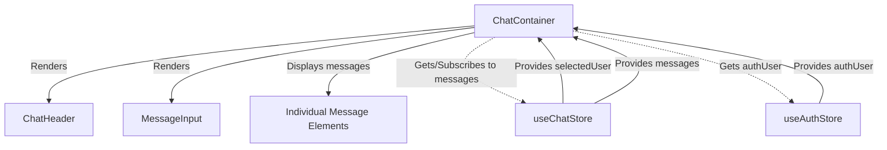
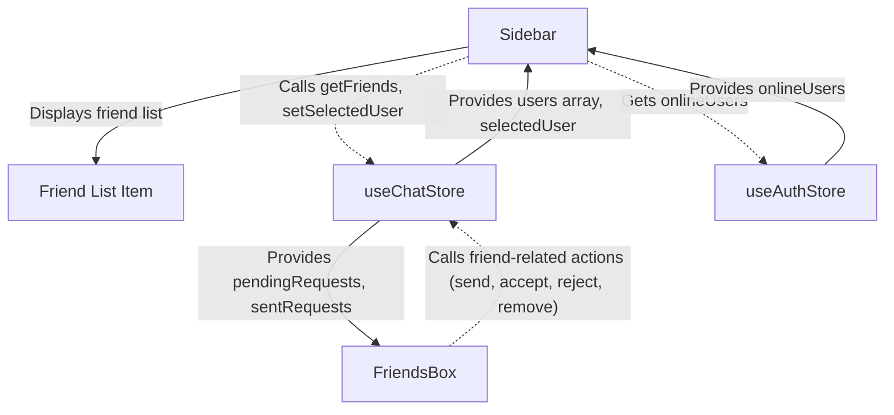

 # User Interface Components

The application's front-end is structured around a set of reusable React components, each responsible for a specific part of the user interface. These components interact with shared state management via Zustand stores (`useChatStore` and `useAuthStore`) to provide a dynamic and responsive user experience. This document details the primary UI components, their functionalities, and how they contribute to the overall application architecture.

## ChatContainer

The `ChatContainer` component is the central hub for displaying and managing message conversations. It orchestrates the display of messages, integrates the message input functionality, and handles real-time updates for active chats.

### Features

*   **Message Display**: Renders individual messages, distinguishing between sent and received messages.
*   **Real-time Updates**: Subscribes to real-time message updates to ensure conversations are always current.
*   **Automatic Scrolling**: Automatically scrolls to the latest message, providing a seamless chat experience.
*   **Loading State**: Displays a skeleton loader while messages are being fetched.
*   **User Context**: Dynamically displays sender and receiver profile pictures based on the active user and selected chat partner.
*   **Media Handling**: Supports the display of image attachments within messages.

### Dependencies

This component heavily relies on the `useChatStore` for fetching and managing chat-related state (messages, selected user, loading status) and `useAuthStore` to identify the currently authenticated user.

```jsx title="frontend/src/components/ChatContainer.jsx"
import { useEffect, useRef } from "react";
import { useChatStore } from "../store/useChatStore";
import ChatHeader from "./ChatHeader";
import MessageInput from "./MessageInput";
import MessageSkeleton from "./skeletons/MessageSkeleton";
import { useAuthStore } from "../store/useAuthStore";
import { formatMessageTime } from "../lib/utils";

const ChatContainer = () => {
    const { messages, getMessages, isMessagesLoading, selectedUser, subscribeToMessages, unsubscribeFromMessages } =
        useChatStore();
    const { authUser } = useAuthStore();
    const messageEndRef = useRef(null);

    useEffect(() => {
        // Fetch messages for the selected user and subscribe to real-time updates
        getMessages(selectedUser._id);
        subscribeToMessages();

        return () => unsubscribeFromMessages(); // Cleanup subscription
    }, [selectedUser._id, getMessages, subscribeToMessages, unsubscribeFromMessages]);
    
    useEffect(() => {
        // Scroll to the latest message whenever messages change
        if(messageEndRef.current && messages){
            messageEndRef.current.scrollIntoView({behaviour : "smooth"})
        }
    }, [messages])
    // ... rest of the component
};

export default ChatContainer;
```

*   [View on GitHub](https://github.com/shinymack/Chat-App-MERN/blob/main/frontend/src/components/ChatContainer.jsx)

### Chat Flow Diagram

The following diagram illustrates the interaction of `ChatContainer` with other components and the global state.





## MessageInput

The `MessageInput` component provides the interface for users to compose and send messages, including text and image attachments.

### Features

*   **Text Input**: Allows users to type and send textual messages.
*   **Image Attachment**: Supports selecting an image file and displaying a preview before sending.
*   **Image Preview Management**: Provides functionality to remove an attached image preview.
*   **Send Functionality**: Triggers the `sendMessage` action from the chat store upon submission.
*   **Input Clearing**: Clears the text and image preview after a message is successfully sent.

### Interaction with ChatContainer

`MessageInput` is rendered directly within `ChatContainer`, enabling a seamless message sending experience within the active chat window. It uses the `sendMessage` function provided by `useChatStore` to push new messages to the backend.

```jsx title="frontend/src/components/MessageInput.jsx"
import { useRef, useState } from "react";
import { useChatStore } from "../store/useChatStore";
import { Image, Send, X } from "lucide-react";
import toast from "react-hot-toast";

const MessageInput = () => {
    const [text, setText] = useState("");
    const [imagePreview, setImagePreview] = useState(null);
    const fileInputRef = useRef(null);
    const { sendMessage } = useChatStore();

    const handleImageChange = (e) => {
        const file = e.target.files[0];
        if (!file.type.startsWith("image/")) {
            toast.error("Please select an image file");
            return;
        }
        const reader = new FileReader();
        reader.onloadend = () => {
            setImagePreview(reader.result);
        };
        reader.readAsDataURL(file);
    };

    const removeImage = () => {
        setImagePreview(null);
        if (fileInputRef.current) fileInputRef.current.value = "";
    };

    const handleSendMessage = async (e) => {
        e.preventDefault();
        if (!text.trim() && !imagePreview) return;

        try {
            await sendMessage({
                text: text.trim(),
                image: imagePreview,
            });

            setText("");
            setImagePreview(null);
            if (fileInputRef.current) fileInputRef.current = "";
        } catch (error) {
            console.error("Failed to send message", error);
        }
    };

    return (
        <div className="p-4 w-full">
            {imagePreview && (
                <div className="mb-3 flex items-center gap-2">
                    <div className="relative">
                        
                        <button
                            onClick={removeImage}
                            className="absolute -top-1.5 -right-1.5 w-5 h-5 rounded-full bg-base-300
              flex items-center justify-center"
                            type="button"
                        >
                            <X className="size-3" />
                        </button>
                    </div>
                </div>
            )}
            <form
                onSubmit={handleSendMessage}
                className="flex items-center gap-2"
            >
                <div className="flex flex-1 gap-2">
                    <input
                        type="text"
                        className="w-full input input-bordered rounded-lg input-sm sm:input-md"
                        placeholder="Type a message..."
                        value={text}
                        onChange={(e) => setText(e.target.value)}
                    />
                    <input
                        type="file"
                        accept="image/*"
                        className="hidden"
                        ref={fileInputRef}
                        onChange={handleImageChange}
                    />

                    <button
                        type="button"
                        className={`hidden sm:flex btn btn-circle
                            ${
                                imagePreview
                                    ? "text-emerald-500"
                                    : "text-zinc-400"
                            }`}
                        onClick={
                            () => {
                                if (fileInputRef.current) {
                                    fileInputRef.current.click();
                                } else {
                                    console.error("fileInputRef is not attached");
                                }
                        }
                        }
                    >
                        <Image size={20} />
                    </button>
                </div>

                <button
                    type="submit"
                    className="btn btn-sm btn-circle"
                    disabled={!text.trim() && !imagePreview}
                >
                    <Send size={22} />
                </button>
            </form>
        </div>
    );
};

export default MessageInput;
```

*   [View on GitHub](https://github.com/shinymack/Chat-App-MERN/blob/main/frontend/src/components/MessageInput.jsx)

## FriendsBox

The `FriendsBox` component provides a dedicated modal interface for managing friend relationships within the application. It allows users to view their friends, pending friend requests, and sent friend requests, as well as send, accept, reject, and remove friends.

### Features

*   **Modal Display**: Appears as an overlay, ensuring focus on friend management.
*   **Tabbed Interface**: Organizes friend management into three tabs: "Friends", "Pending Requests", and "Sent Requests".
*   **Add Friend Functionality**: A form to send new friend requests by entering a username or email.
*   **Request Management**: Buttons to accept or reject pending friend requests.
*   **Friend Removal**: Option to remove existing friends.
*   **Dynamic Counts**: Shows the number of friends, pending, and sent requests in the tab headers.

### State Management

`FriendsBox` relies on `useChatStore` for all its friend-related operations and data, including fetching lists of friends, pending requests, and sent requests, and dispatching actions like `sendFriendRequest`, `acceptFriendRequest`, `rejectFriendRequest`, and `removeFriend`.

```jsx title="frontend/src/components/FriendsBox.jsx"
import { useEffect, useState } from 'react';
import { useChatStore } from '../store/useChatStore';
import { X, UserPlus, Check, Trash2 } from 'lucide-react';

const FriendsBox = () => {
    const { 
        toggleFriendsBox, 
        getFriends, users,
        getPendingRequests, pendingRequests,
        getSentRequests, sentRequests,
        sendFriendRequest, acceptFriendRequest, rejectFriendRequest, removeFriend
    } = useChatStore();

    const [activeTab, setActiveTab] = useState('friends');
    const [identifier, setIdentifier] = useState('');

    useEffect(() => {
        // Fetch all necessary data when the component mounts
        getFriends();
        getPendingRequests();
        getSentRequests();
    }, [getFriends, getPendingRequests, getSentRequests]);

    const handleAddFriend = (e) => {
        e.preventDefault();
        if (identifier.trim()) {
            sendFriendRequest(identifier);
            setIdentifier('');
        }
    };
    // ... rest of the component
};

export default FriendsBox;
```

*   [View on GitHub](https://github.com/shinymack/Chat-App-MERN/blob/main/frontend/src/components/FriendsBox.jsx)

## Sidebar

The `Sidebar` component displays a list of the user's friends, allowing them to select a friend to initiate or continue a chat conversation. It also indicates the online status of friends.

### Features

*   **Friend List Display**: Shows a list of the user's friends.
*   **User Selection**: Allows users to select a friend, which updates the `selectedUser` in the global chat state.
*   **Online Status Indicator**: Visually represents whether a friend is currently online or offline.
*   **Online Filter**: Provides a checkbox to filter the friend list to show only online friends.
*   **Loading State**: Displays a skeleton loader while the friend list is being fetched.
*   **Responsiveness**: Adapts its visibility and width based on whether a user is selected on smaller screens.

### Integration

The `Sidebar` interacts closely with `useChatStore` to retrieve the list of friends and to set the `selectedUser`. It also consumes `onlineUsers` from `useAuthStore` to display real-time online status.

```jsx title="frontend/src/components/Sidebar.jsx"
import { useEffect, useState } from "react";
import { useChatStore } from "../store/useChatStore";
import SidebarSkeleton from "./skeletons/SidebarSkeleton";
import { Users } from "lucide-react";
import { useAuthStore } from "../store/useAuthStore";

const Sidebar = () => {
    const { getFriends, users, selectedUser, setSelectedUser, isUsersLoading } =
        useChatStore();

    const { onlineUsers } = useAuthStore();
    const [showOnlineOnly, setShowOnlineOnly] = useState(false);

    useEffect(() => {
        getFriends();
    }, [getFriends]);

    const filteredUsers = showOnlineOnly
        ? users.filter((user) => onlineUsers.includes(user._id))
        : users;

    if (isUsersLoading) return <SidebarSkeleton />;

    return (
        <div className={`h-full sm:w-72 sm:border-r border-base-300  flex-col transition-all duration-200 ${selectedUser ?
                                    "hidden sm:flex w-[100vw]"
                                    : ""}`}>
            <div className="border-b border-base-300  p-5">
                <div className="flex items-center gap-2">
                    <Users className="size-6"></Users>
                    <span className="font-medium  lg:block">
                        Friends
                    </span>
                </div>
                {/* Online toggle filter remaining */}
                <div className="mt-3 lg:flex items-center gap-2">
                    <label className="cursor-pointer flex items-center gap-2">
                        <input
                            type="checkbox"
                            checked={showOnlineOnly}
                            onChange={(e) =>
                                setShowOnlineOnly(e.target.checked)
                            }
                            className="checkbox checkbox-sm"
                        />
                        <span className="text-sm">Show online only</span>
                    </label>
                    <span className="text-xs text-zinc-500">
                          ({users.filter(friend => onlineUsers.includes(friend._id)).length} online)
                    </span>
                </div>
                {/* ... friend list rendering ... */}
            </div>
        </div>
    );
};

export default Sidebar;
```

*   [View on GitHub](https://github.com/shinymack/Chat-App-MERN/blob/main/frontend/src/components/Sidebar.jsx)

### Sidebar and FriendsBox Interaction





## Key Integration Points

The UI components demonstrate a clear separation of concerns, with presentation logic residing within the components and state management delegated to Zustand stores.

1.  **Centralized State (Zustand)**: Both `useChatStore` and `useAuthStore` are critical for component communication and data consistency. `useChatStore` manages chat-specific data like messages, selected users, and friend lists, while `useAuthStore` handles user authentication status and online users. This pattern ensures that data is easily accessible and consistently updated across different parts of the UI.

2.  **Real-time Capabilities**: `ChatContainer` actively subscribes to real-time message updates (`subscribeToMessages` from `useChatStore`), demonstrating how UI components can leverage WebSockets (via the store) to provide an immediate and responsive user experience without constant polling.

3.  **Component Reusability**: Components like `MessageInput` are designed to be self-contained but integrate seamlessly into larger structures like `ChatContainer`. This modular approach promotes maintainability and scalability.

4.  **Loading and UI Feedback**: The inclusion of skeleton loaders (`MessageSkeleton`, `SidebarSkeleton`) and `toast` notifications (in `MessageInput`) highlights a focus on user experience, providing clear feedback during asynchronous operations.

5.  **Responsive Design**: The `Sidebar` component's dynamic `className` based on `selectedUser` illustrates how UI can adapt to different screen sizes, providing an optimal layout for both mobile and desktop users. For instance, on smaller screens, the `Sidebar` is hidden when a chat is active, giving more space to the `ChatContainer`.

These components collectively form a robust and interactive user interface, designed to handle the complexities of a real-time chat application efficiently.