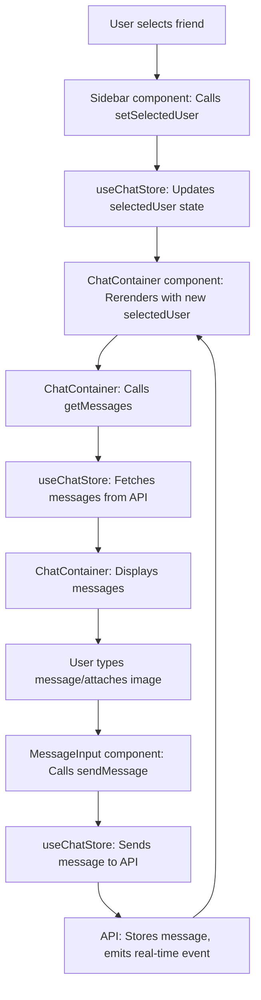
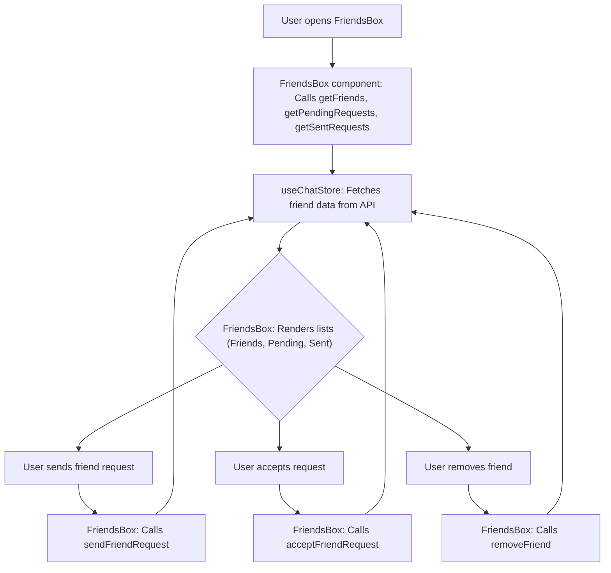

 
---
title: "User Interface Components"
description: "Documentation of reusable React components that form the building blocks of the chat application's UI."
---

# User Interface Components

This section details the core reusable React components that comprise the user interface of the chat application. These components are designed to be modular, leveraging Zustand for state management and interacting with backend services to provide a dynamic and responsive user experience.

## ChatContainer Component

The `ChatContainer` component is responsible for displaying chat messages, managing message fetching, and ensuring real-time updates. It orchestrates the display of `ChatHeader`, the list of messages, and the `MessageInput` area.

-   **Purpose**: Manages the display of messages for the currently selected user.
-   **State Management**: Utilizes `useChatStore` to access `messages`, `getMessages`, `isMessagesLoading`, `selectedUser`, `subscribeToMessages`, and `unsubscribeFromMessages`. It also uses `useAuthStore` for `authUser` details to determine message sender.
-   **Lifecycle**:
    -   Fetches messages for the `selectedUser` upon component mount or `selectedUser` change.
    -   Subscribes to real-time message updates and cleans up the subscription on unmount.
    -   Automatically scrolls to the latest message using a `useRef` hook.
-   **Dependencies**: Relies on `ChatHeader`, `MessageInput`, and `MessageSkeleton` components.

### Key Features and Logic

-   **Message Fetching and Real-time Updates**:
    The component fetches historical messages and subscribes to new messages via WebSocket.
    ```jsx
    // frontend/src/components/ChatContainer.jsx
    // Lines 17-22
    useEffect(() => {
        getMessages(selectedUser._id);
        subscribeToMessages();

        return () => unsubscribeFromMessages();
    }, [selectedUser._id, getMessages, subscribeToMessages, unsubscribeFromMessages]);
    ```
    [View on GitHub](https://github.com/shinymack/Chat-App-MERN/blob/main/frontend/src/components/ChatContainer.jsx#L17-L22)

-   **Auto-Scroll to Latest Message**:
    After new messages are loaded or received, the chat view automatically scrolls to the bottom to show the most recent exchange.
    ```jsx
    // frontend/src/components/ChatContainer.jsx
    // Lines 24-28
    useEffect(() => {
        if(messageEndRef.current && messages){
            messageEndRef.current.scrollIntoView({behaviour : "smooth"})
        }
    }, [messages])
    ```
    [View on GitHub](https://github.com/shinymack/Chat-App-MERN/blob/main/frontend/src/components/ChatContainer.jsx#L24-L28)

-   **Message Rendering**: Each message displays the sender's profile picture, timestamp, and content (text or image). Messages are styled differently based on whether the `authUser` is the sender or receiver.
    ```jsx
    // frontend/src/components/ChatContainer.jsx
    // Lines 42-69
    {messages.map((message) => (
        <div
            key={message._id}
            className={`chat ${message.senderId == authUser._id ? "chat-end": "chat-start"} `}
            ref={messageEndRef}
        >
            <div className="chat-image avatar">
                <div className="size-9 rounded-full border">
                    
                </div>
            </div>
            <div className="chat-header mb-1">
                <time className="text-xs opacity-50 ml-1">{formatMessageTime(message.createdAt)}</time>
            </div>
            <div className="chat-bubble flex flex-col">
                {message.image && (
                    
                )}
                {message.text && <p>{message.text}</p>}
            </div>
        </div>
    ))}
    ```
    [View on GitHub](https://github.com/shinymack/Chat-App-MERN/blob/main/frontend/src/components/ChatContainer.jsx#L42-L69)

## FriendsBox Component

The `FriendsBox` component provides an interface for managing friend requests and viewing the friend list. It allows users to send, accept, reject, and remove friends.

-   **Purpose**: Manages friend relationships within the application.
-   **State Management**: Uses `useChatStore` for `toggleFriendsBox`, `getFriends`, `users` (friends list), `getPendingRequests`, `pendingRequests`, `getSentRequests`, `sentRequests`, `sendFriendRequest`, `acceptFriendRequest`, `rejectFriendRequest`, and `removeFriend`. Internal state manages the active tab (`friends`, `pending`, `sent`) and the input for adding friends.
-   **Lifecycle**: Fetches friends, pending requests, and sent requests when the component mounts.
-   **User Interaction**: Provides tabs to switch between friend lists, pending requests, and sent requests. Includes an input field to send friend requests by identifier (username/email).

### Key Features and Logic

-   **Tabbed Navigation**:
    The component uses a tabbed interface to organize the different friend-related lists: friends, pending requests, and sent requests.
    ```jsx
    // frontend/src/components/FriendsBox.jsx
    // Lines 111-115
    <div role="tablist" className="tabs tabs-boxed">
        <a role="tab" className={`tab ${activeTab === 'friends' ? 'tab-active' : ''}`} onClick={() => setActiveTab('friends')}>Friends ({users.length})</a>
        <a role="tab" className={`tab ${activeTab === 'pending' ? 'tab-active' : ''}`} onClick={() => setActiveTab('pending')}>Pending ({pendingRequests.length})</a>
        <a role="tab" className={`tab ${activeTab === 'sent' ? 'tab-active' : ''}`} onClick={() => setActiveTab('sent')}>Sent ({sentRequests.length})</a>
    </div>
    ```
    [View on GitHub](https://github.com/shinymack/Chat-App-MERN/blob/main/frontend/src/components/FriendsBox.jsx#L111-L115)

-   **Dynamic Content Rendering**:
    A `renderContent` function dynamically displays the appropriate list (friends, pending, or sent requests) based on the `activeTab` state.
    ```jsx
    // frontend/src/components/FriendsBox.jsx
    // Lines 34-87
    const renderContent = () => {
        switch (activeTab) {
            case 'pending':
                return (
                    // ... rendering pending requests ...
                );
            case 'sent':
                return (
                    // ... rendering sent requests ...
                );
            case 'friends':
            default:
                return (
                    // ... rendering friends list ...
                );
        }
    };
    ```
    [View on GitHub](https://github.github.com/shinymack/Chat-App-MERN/blob/main/frontend/src/components/FriendsBox.jsx#L34-L87)

## MessageInput Component

The `MessageInput` component provides the interface for users to compose and send messages, including text and image attachments.

-   **Purpose**: Allows users to input text messages and attach images.
-   **State Management**: Manages internal `text` and `imagePreview` states. Uses `useChatStore` for the `sendMessage` action.
-   **User Interaction**:
    -   Input field for text messages.
    -   Button to open file picker for image selection.
    -   Image preview with a removal option.
    -   Send button to submit the message.
-   **Validation**: Ensures only image files are selected for attachments.

### Key Features and Logic

-   **Image Attachment and Preview**:
    Users can attach images, which are then displayed as a preview before sending. A button is provided to remove the selected image.
    ```jsx
    // frontend/src/components/MessageInput.jsx
    // Lines 39-58
    {imagePreview && (
        <div className="mb-3 flex items-center gap-2">
            <div className="relative">
                
                <button
                    onClick={removeImage}
                    className="absolute -top-1.5 -right-1.5 w-5 h-5 rounded-full bg-base-300
              flex items-center justify-center"
                    type="button"
                >
                    <X className="size-3" />
                </button>
            </div>
        </div>
    )}
    ```
    [View on GitHub](https://github.com/shinymack/Chat-App-MERN/blob/main/frontend/src/components/MessageInput.jsx#L39-L58)

-   **Sending Messages**:
    The `handleSendMessage` function constructs the message payload (text and/or image) and calls the `sendMessage` action from the Zustand store. It then resets the input fields.
    ```jsx
    // frontend/src/components/MessageInput.jsx
    // Lines 29-37
    const handleSendMessage = async (e) => {
        e.preventDefault();
        if (!text.trim() && !imagePreview) return;

        try {
            await sendMessage({
                text: text.trim(),
                image: imagePreview,
            });

            setText("");
            setImagePreview(null);
            if (fileInputRef.current) fileInputRef.current = "";
        } catch (error) {
            console.error("Failed to send message", error);
        }
    };
    ```
    [View on GitHub](https://github.com/shinymack/Chat-App-MERN/blob/main/frontend/src/components/MessageInput.jsx#L29-L37)

## Sidebar Component

The `Sidebar` component displays the list of friends, allowing users to select a friend to initiate or continue a chat. It also provides a filter to show only online friends.

-   **Purpose**: Navigates between different chat conversations.
-   **State Management**: Uses `useChatStore` to get `users` (friends list), `selectedUser`, `setSelectedUser`, and `isUsersLoading`. Leverages `useAuthStore` for `onlineUsers` to display online status.
-   **Lifecycle**: Fetches the friend list when the component mounts.
-   **User Interaction**:
    -   Displays a list of friends with their profile pictures and online/offline status.
    -   Allows filtering the list to show only online friends.
    -   Highlights the currently selected chat.
    -   Responsive hiding/showing based on `selectedUser` for mobile views.

### Key Features and Logic

-   **Online Status Filtering**:
    Users can toggle a checkbox to filter the friends list, showing only friends who are currently online.
    ```jsx
    // frontend/src/components/Sidebar.jsx
    // Lines 25-30
    <label className="cursor-pointer flex items-center gap-2">
        <input
            type="checkbox"
            checked={showOnlineOnly}
            onChange={(e) =>
                setShowOnlineOnly(e.target.checked)
            }
            className="checkbox checkbox-sm"
        />
        <span className="text-sm">Show online only</span>
    </label>
    ```
    [View on GitHub](https://github.com/shinymack/Chat-App-MERN/blob/main/frontend/src/components/Sidebar.jsx#L25-L30)

-   **Dynamic User List Rendering**:
    The component maps through the `filteredUsers` array to render each friend's entry, displaying their profile picture, username, and online status.
    ```jsx
    // frontend/src/components/Sidebar.jsx
    // Lines 40-70
    {filteredUsers.map((user) => (
        <button
            key={user._id}
            onClick={() => setSelectedUser(user)}
            className={`sm:w-full w-[88vw] p-3 flex items-center gap-3 hover:bg-base-300 transition-colors
            ${
                selectedUser?._id === user._id
                    ? "bg-base-300 ring-1 ring-base-300"
                    : ""
            }`}
        >
            <div className="relative mx-0">
                
                {onlineUsers.includes(user._id) && (
                    <span className="absolute bottom-0 right-0 size-3 bg-green-500 rounded-full ring-2 ring-zinc-900" />
                )}
            </div>
            <div className=" block text-left min-w-0">
                <div className=" font-medium truncate">
                    {user.username}
                </div>
                <div className="text-sm text-zinc-400">
                    {onlineUsers.includes(user._id)
                        ? "Online"
                        : "Offline"}
                </div>
            </div>
        </button>
    ))}
    ```
    [View on GitHub](https://github.com/shinymack/Chat-App-MERN/blob/main/frontend/src/components/Sidebar.jsx#L40-L70)

## Key Integration Points

The UI components demonstrate a clear separation of concerns, leveraging Zustand for centralized state management and reactive updates.

### Chat Flow Diagram

This diagram illustrates the primary flow of user interaction from selecting a friend to sending a message.





### Friend Management Integration

This diagram highlights how the `FriendsBox` interacts with the chat store to manage friend relationships.





### Best Practices

-   **Zustand for Global State**: The use of `useChatStore` and `useAuthStore` ensures that global state (like selected user, messages, friends list, online users) is managed efficiently and reactively across components.
-   **Component Reusability**: Components like `MessageInput` and `ChatHeader` are used within `ChatContainer`, promoting a modular architecture.
-   **Responsive Design**: Components like `Sidebar` include logic for responsive layouts, adapting visibility based on screen size and selected chat.
-   **Clear UI Feedback**: Loading states (`MessageSkeleton`, `SidebarSkeleton`) provide users with immediate feedback during data fetching.
-   **Error Handling**: Basic error handling is present (e.g., `MessageInput` for invalid image files), but could be expanded for more robust user notifications.
```