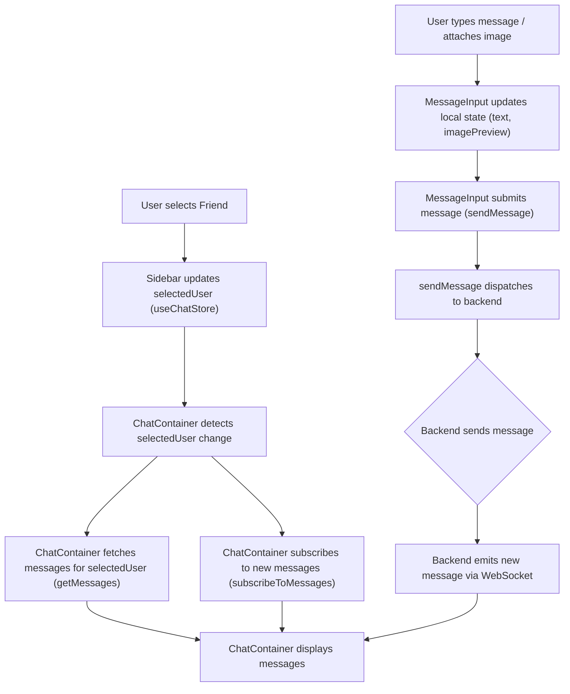
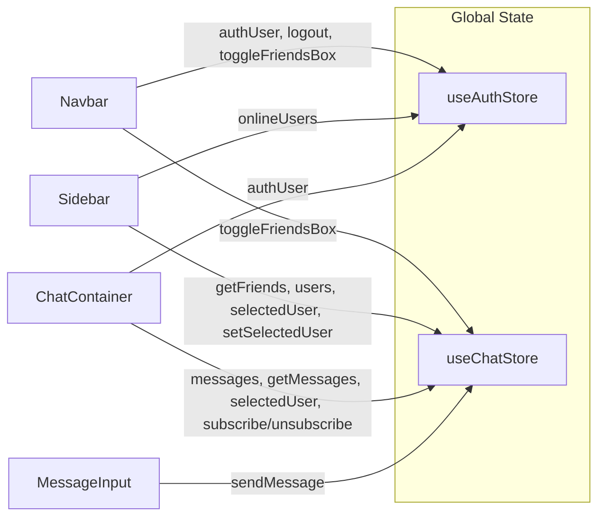

 # User Interface Components

This section details the core React components that constitute the chat application's user interface. These components are designed for reusability and encapsulate specific functionalities, from displaying messages to managing user interactions, ensuring a modular and maintainable frontend architecture. Each component interacts with global state management (Zustand stores) and leverages modern React hooks for dynamic behavior.

## Navbar

The `Navbar` component serves as the primary navigation and header for the application. It provides branding, quick access to various sections like friends, settings, and user profiles, and handles user authentication actions like logout.

### Features
- **Application Branding:** Displays the "ShinyChat" logo and name.
- **Navigation Links:** Provides links to the homepage, settings, and the user's profile.
- **Friends List Toggle:** A button to show/hide the friends sidebar, enhancing responsiveness for smaller screens.
- **Authentication Actions:** Conditionally renders "Profile" and "Logout" buttons based on the user's authentication status.
- **Responsive Design:** Utilizes Tailwind CSS classes to adapt its layout across different screen sizes.

### Code Snippets

#### 1. Application Branding and Navigation
The `Navbar` includes the application's brand and a link to the homepage, demonstrating basic `react-router-dom` usage.

```jsx
import { Link } from "react-router-dom";
// ... other imports

const Navbar = () => {
  // ... state and store hooks

  return (
    <header className=" bg-base-100 border-b border-base-300 fixed w-full top-0 z-40 backdrop-blur-lg bg-base-100/80">
      <div className="container mx-auto px-4 h-16">
        <div className="flex items-center justify-between h-full">
          <div className="flex items-center gap-8">
            <Link to="/" className="flex items-center gap-2.5 hover:opacity-80 transition-all">
              <div className="size-9 rounded-lg bg-primary/10 flex items-center justify-center">
                <MessageSquare className="size-5 text-primary"></MessageSquare>
              </div>
              <h1 className="text-lg font-bold">ShinyChat</h1>
            </Link>
          </div>
          {/* ... other navbar content */}
        </div>
      </div>
    </header>
  );
};
```
This snippet showcases the structural setup of the Navbar, focusing on branding and the main navigation link.
[View on GitHub](https://github.com/shinymack/Chat-App-MERN/blob/main/frontend/src/components/Navbar.jsx#L15-L27)

#### 2. Conditional Rendering for Authenticated Users
The profile and logout buttons are only displayed if a user is authenticated (`authUser` is present). This uses the `useAuthStore` to access the global authentication state.

```jsx
// ... other imports and component setup

const Navbar = () => {
  const { logout, authUser } = useAuthStore();
  // ... other hooks

  return (
    // ... header and container div
          <div className="flex items-center gap-4">
            <button className="btn btn-sm gap-2" onClick={toggleFriendsBox}>
              <Users className="size-5" />
              <span className="hidden sm:inline">Friends</span>
            </button>
            <Link to={"/settings"} className={`btn btn-sm gap-2 transition-colors`}>
            <Settings className="size-4"/>
            <span className="hidden sm:inline">Settings</span>

            </Link>
            {authUser && (
              <>
                <Link to={"/profile"} className={`btn btn-sm gap-2`}>
                  <User className="size-5" />
                  <span className="hidden sm:inline">Profile</span>
                </Link>

                <button className="btn btn-sm flex gap-2 items-center" onClick={logout}>
                  <LogOut className="size-5" />
                  <span className="hidden sm:inline">Logout</span>
                </button>
              </>
            )}
          </div>
    // ... closing divs
  );
};
```
This demonstrates conditional rendering in React, showing different UI elements based on the `authUser` state. The `logout` function is called directly from `useAuthStore` when the logout button is clicked.
[View on GitHub](https://github.com/shinymack/Chat-App-MERN/blob/main/frontend/src/components/Navbar.jsx#L36-L56)

## Sidebar

The `Sidebar` component displays a list of the user's friends or available chat partners. It allows users to select a contact to initiate or continue a chat, and includes filtering options such as showing only online users.

### Features
- **Friends List Display:** Renders a scrollable list of users.
- **User Selection:** Clicking on a user sets them as the `selectedUser` in the global chat store.
- **Online Status Indicator:** Displays a visual indicator (green dot) for online users and text status.
- **Online Filter:** A checkbox to filter the list to show only online friends.
- **Responsiveness:** Hides itself on small screens when a user is selected to maximize chat container space.
- **Loading State:** Displays a skeleton loader while fetching the list of friends.

### Code Snippets

#### 1. Fetching and Displaying Friends
Upon component mount, the `Sidebar` fetches the list of friends and displays them. It uses `useEffect` to call `getFriends` from `useChatStore`.

```jsx
import { useEffect, useState } from "react";
import { useChatStore } from "../store/useChatStore";
import SidebarSkeleton from "./skeletons/SidebarSkeleton";
import { Users } from "lucide-react";
import { useAuthStore } from "../store/useAuthStore";

const Sidebar = () => {
    const { getFriends, users, selectedUser, setSelectedUser, isUsersLoading } =
        useChatStore();

    const { onlineUsers } = useAuthStore();
    const [showOnlineOnly, setShowOnlineOnly] = useState(false);
    useEffect(() => {
        getFriends();
    }, [getFriends]);
    
    // ... rest of the component
    if (isUsersLoading) return <SidebarSkeleton />;
    return (
        // ... sidebar structure
            <div className="overflow-y-scroll h-[calc(100vh-14rem)] w-full flex flex-col py-3">
                {filteredUsers.map((user) => (
                    <button
                        key={user._id}
                        onClick={() => setSelectedUser(user)}
                        className={`sm:w-full w-[88vw] p-3 flex items-center gap-3 hover:bg-base-300 transition-colors
                        ${
                            selectedUser?._id === user._id
                                ? "bg-base-300 ring-1 ring-base-300"
                                : ""
                        }`}
                    >
                        {/* ... user details and online indicator */}
                    </button>
                ))}
            </div>
        // ... closing divs
    );
};
```
This highlights how `useEffect` is used to fetch data once, and how the `users` array is mapped to render interactive buttons for each friend.
[View on GitHub](https://github.com/shinymack/Chat-App-MERN/blob/main/frontend/src/components/Sidebar.jsx#L9-L16)

#### 2. Online/Offline Status and Filtering
The sidebar prominently displays whether a user is online or offline, and allows filtering the list to only show online users.

```jsx
// ... component setup

const Sidebar = () => {
    // ... store hooks and state
    const { onlineUsers } = useAuthStore();
    const [showOnlineOnly, setShowOnlineOnly] = useState(false);

    // ... useEffect for getFriends
    const filteredUsers = showOnlineOnly
        ? users.filter((user) => onlineUsers.includes(user._id))
        : users;
    
    // ... loading skeleton check
    return (
        <div className={`h-full sm:w-72 sm:border-r border-base-300  flex-col transition-all duration-200 ${selectedUser ?
                                    "hidden sm:flex w-[100vw] "
                                    : ""}`}>
            <div className="border-b border-base-300  p-5">
                {/* ... Friends header */}
                <div className="mt-3 lg:flex items-center gap-2">
                    <label className="cursor-pointer flex items-center gap-2">
                        <input
                            type="checkbox"
                            checked={showOnlineOnly}
                            onChange={(e) =>
                                setShowOnlineOnly(e.target.checked)
                            }
                            className="checkbox checkbox-sm"
                        />
                        <span className="text-sm">Show online only</span>
                    </label>
                    <span className="text-xs text-zinc-500">
                          ({users.filter(friend => onlineUsers.includes(friend._id)).length} online)
                    </span>
                </div>
                {/* ... filtered users map */}
            </div>
        </div>
    );
};
```
This snippet demonstrates state management (`useState`) for the `showOnlineOnly` filter and how it dynamically alters the `filteredUsers` list. The `onlineUsers` array from `useAuthStore` is crucial for determining user status.
[View on GitHub](https://github.com/shinymack/Chat-App-MERN/blob/main/frontend/src/components/Sidebar.jsx#L22-L46)

## ChatContainer

The `ChatContainer` component is the main view for displaying messages within a chat. It fetches and renders messages for the currently selected user, provides real-time updates, and includes an input area for sending new messages.

### Features
- **Message Display:** Renders a list of messages, distinguishing between sent and received messages.
- **Real-time Updates:** Subscribes to and unsubscribes from real-time message updates using WebSockets.
- **Scroll to Bottom:** Automatically scrolls to the latest message when new messages arrive.
- **Loading State:** Shows a skeleton loader while messages are being fetched.
- **Image Support:** Displays attached images within chat bubbles.
- **Message Input Integration:** Includes the `MessageInput` component for composing and sending messages.

### Code Snippets

#### 1. Message Fetching and Real-time Subscription
The `ChatContainer` manages fetching messages for the `selectedUser` and subscribing to real-time message updates, ensuring the chat is always current.

```jsx
import { useEffect } from "react";
import { useChatStore } from "../store/useChatStore";
import ChatHeader from "./ChatHeader";
import MessageInput from "./MessageInput";
import MessageSkeleton from "./skeletons/MessageSkeleton";
import { useAuthStore } from "../store/useAuthStore";
import { formatMessageTime } from "../lib/utils";
import { useRef } from "react";

const ChatContainer = () => {
    const { messages, getMessages, isMessagesLoading, selectedUser, subscribeToMessages, unsubscribeFromMessages } =
        useChatStore();
    const { authUser } = useAuthStore();
    const messageEndRef = useRef(null);


    useEffect(() => {
        getMessages(selectedUser._id);
        subscribeToMessages();

        return () => unsubscribeFromMessages();
    }, [selectedUser._id, getMessages, subscribeToMessages, unsubscribeFromMessages]);
    
    useEffect(() => {
        if(messageEndRef.current && messages){
            messageEndRef.current.scrollIntoView({behaviour : "smooth"})
        }
    }, [messages])

    // ... rest of the component
};

export default ChatContainer;
```
This `useEffect` hook demonstrates dependency array usage to re-fetch messages and re-subscribe whenever `selectedUser._id` changes. The cleanup function ensures proper unsubscription. The second `useEffect` handles auto-scrolling to the latest message.
[View on GitHub](https://github.com/shinymack/Chat-App-MERN/blob/main/frontend/src/components/ChatContainer.jsx#L14-L27)

#### 2. Rendering Messages with Conditional Styling
Messages are mapped and rendered, with conditional styling (`chat-end` or `chat-start`) applied based on whether the message was sent by the authenticated user or received from another user.

```jsx
// ... component setup

const ChatContainer = () => {
    // ... state and store hooks

    if (isMessagesLoading)
        return (
            <div className="flex-1 flex flex-col overflow-auto">
                <ChatHeader />
                <MessageSkeleton />
                <MessageInput />
            </div>
        );
    return (
        <div className="flex-1 flex flex-col overflow-auto">
            <ChatHeader />
            <div className="flex-1 overflow-y-auto p-4 space-y-4">
                {messages.map((message) => (
                    <div
                        key={message._id}
                        className={`chat ${message.senderId == authUser._id ? "chat-end": "chat-start"} `}
                        ref={messageEndRef}
                    >
                        <div className="chat-image avatar">
                            <div className="size-9 rounded-full border">
                                
                            </div>
                        </div>
                        <div className="chat-header mb-1">
                            <time className="text-xs opacity-50 ml-1">{formatMessageTime(message.createdAt)}</time>
                        </div>
                        <div className="chat-bubble flex flex-col">
                            {message.image && (
                                
                            )}
                            {message.text && <p>{message.text}</p>}
                        </div>
                    </div>
                ))}
            </div>
            <MessageInput />
        </div>
    );
};
```
This section demonstrates rendering a list of messages, using conditional CSS classes to style messages differently for the sender and receiver, and displaying image attachments.
[View on GitHub](https://github.com/shinymack/Chat-App-MERN/blob/main/frontend/src/components/ChatContainer.jsx#L34-L79)

## MessageInput

The `MessageInput` component provides the interface for users to type and send messages, including support for attaching images.

### Features
- **Text Input:** A text area for composing messages.
- **Image Attachment:** Allows users to select and preview an image before sending.
- **Image Preview:** Displays a thumbnail of the selected image with an option to remove it.
- **Send Button:** Enables sending the message (text, image, or both).
- **Validation:** Disables the send button if no text or image is present.
- **Error Handling:** Displays a toast notification for invalid file types.

### Code Snippets

#### 1. Image Selection and Preview Handling
This component includes logic for handling image file selection, displaying a preview, and removing the preview if needed.

```jsx
import { useRef, useState } from "react";
import { useChatStore } from "../store/useChatStore";
import { Image, Send, X } from "lucide-react";
import toast from "react-hot-toast";

const MessageInput = () => {
    const [text, setText] = useState("");
    const [imagePreview, setImagePreview] = useState(null);
    const fileInputRef = useRef(null);
    const { sendMessage } = useChatStore();

    const handleImageChange = (e) => {
        const file = e.target.files[0];
        if (!file.type.startsWith("image/")) {
            toast.error("Please select an image file");
            return;
        }

        const reader = new FileReader();
        reader.onloadend = () => {
            setImagePreview(reader.result);
        };
        reader.readAsDataURL(file);
    };

    const removeImage = () => {
        setImagePreview(null);
        if (fileInputRef.current) fileInputRef.current.value = "";
    };

    // ... rest of the component
};

export default MessageInput;
```
This snippet focuses on the `handleImageChange` and `removeImage` functions, which manage the `imagePreview` state and interact with a hidden file input using `useRef`.
[View on GitHub](https://github.com/shinymack/Chat-App-MERN/blob/main/frontend/src/components/MessageInput.jsx#L7-L31)

#### 2. Sending Messages and UI Controls
The `handleSendMessage` function dispatches the message and clears the input. The send button's disabled state depends on the presence of text or an image.

```jsx
// ... component setup

const MessageInput = () => {
    const [text, setText] = useState("");
    const [imagePreview, setImagePreview] = useState(null);
    const fileInputRef = useRef(null);
    const { sendMessage } = useChatStore();

    // ... handleImageChange and removeImage functions

    const handleSendMessage = async (e) => {
        e.preventDefault();
        if (!text.trim() && !imagePreview) return;

        try {
            await sendMessage({
                text: text.trim(),
                image: imagePreview,
            });

            setText("");
            setImagePreview(null);
            if (fileInputRef.current) fileInputRef.current = "";
        } catch (error) {
            console.error("Failed to send message", error);
        }
    };

    return (
        <div className="p-4 w-full">
            {imagePreview && (
                <div className="mb-3 flex items-center gap-2">
                    {/* ... image preview display */}
                </div>
            )}

            <form onSubmit={handleSendMessage} className="flex items-center gap-2">
                <div className="flex flex-1 gap-2">
                    <input
                        type="text"
                        className="w-full input input-bordered rounded-lg input-sm sm:input-md"
                        placeholder="Type a message..."
                        value={text}
                        onChange={(e) => setText(e.target.value)}
                    />
                    <input
                        type="file"
                        accept="image/*"
                        className="hidden"
                        ref={fileInputRef}
                        onChange={handleImageChange}
                    />

                    <button
                        type="button"
                        className={`hidden sm:flex btn btn-circle
                            ${
                                imagePreview
                                    ? "text-emerald-500"
                                    : "text-zinc-400"
                            }`}
                        onClick={() => fileInputRef.current?.click()}
                    >
                        <Image size={20} />
                    </button>
                </div>

                <button
                    type="submit"
                    className="btn btn-sm btn-circle"
                    disabled={!text.trim() && !imagePreview}
                >
                    <Send size={22} />
                </button>
            </form>
        </div>
    );
};
```
This provides the JSX for the message input form, including the text input, image upload button (which triggers the hidden file input), and the send button with its conditional `disabled` state.
[View on GitHub](https://github.com/shinymack/Chat-App-MERN/blob/main/frontend/src/components/MessageInput.jsx#L33-L121)

## Key Integration Points

The UI components form a cohesive chat experience through well-defined interactions and state management.

### Component Interaction Flow

The following diagram illustrates the primary flow of user interaction and data updates across the main UI components.





This diagram outlines how selecting a user in the `Sidebar` triggers message fetching and real-time subscription in the `ChatContainer`, and how sending a message from `MessageInput` results in real-time updates in the `ChatContainer`.

### State Management Dependencies

All listed components heavily rely on Zustand stores for global state management, specifically `useAuthStore` for authentication and user details, and `useChatStore` for chat-specific data like selected users, messages, and friend lists.





This flowchart visually represents the dependencies of each UI component on the global Zustand stores, illustrating which parts of the global state or actions each component consumes. This centralized state management approach simplifies data flow and ensures consistency across the application.