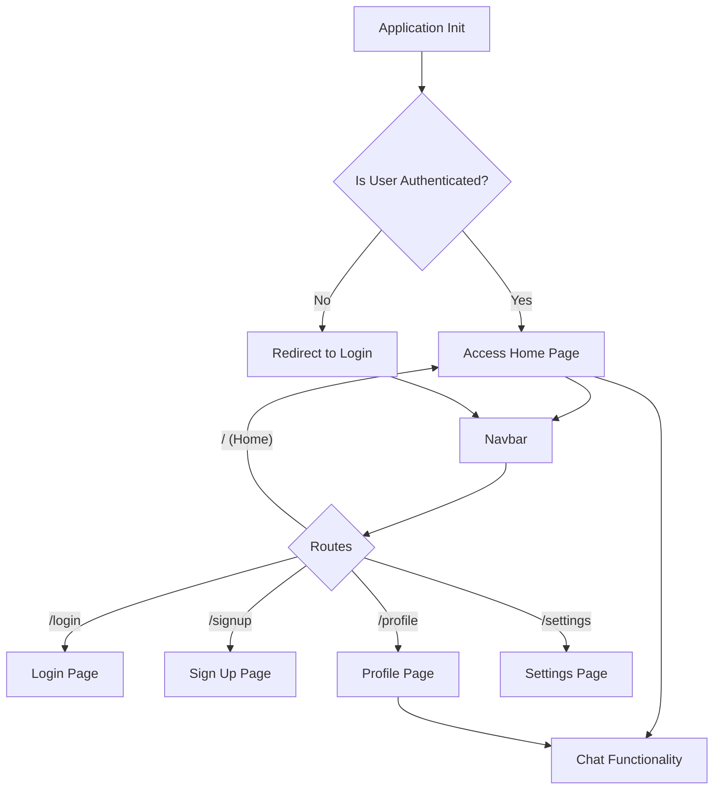

 # User Interface Components

This section provides a detailed overview of the core reusable React components that form the user interface of the application. These components are designed for modularity and maintainability, handling various aspects from navigation and authentication flow to real-time chat functionalities.

## Core Application Structure (`App.jsx`)

The `App.jsx` file serves as the main entry point for the React application, responsible for routing, global state management, and initial authentication checks. It sets up the primary layout, including the navigation bar and routes to different pages, ensuring a consistent user experience.

The component utilizes `react-router-dom` for navigation, managing authenticated and unauthenticated user access to various routes. Global state for authentication (`useAuthStore`) and theme (`useThemeStore`) is integrated here to provide application-wide context.

```jsx title="frontend/src/App.jsx"
// Routing and global state setup
import Navbar from './components/Navbar'
import { Routes, Route, Navigate } from 'react-router-dom'
import { useEffect } from 'react'
import HomePage from './pages/HomePage'
import SignUpPage from './pages/SignUpPage' 
import LoginPage from './pages/LoginPage' 
import SettingsPage from './pages/SettingsPage' 
import ProfilePage from './pages/ProfilePage'

import { useThemeStore } from './store/useThemeStore'
import { useAuthStore } from './store/useAuthStore'; 
import { Loader } from 'lucide-react'
import { Toaster } from 'react-hot-toast'

const App = () => {
  const { authUser, checkAuth, isCheckingAuth, onlineUsers } = useAuthStore();
  const { theme } = useThemeStore();
  useEffect(() => {
    checkAuth();
  }, [checkAuth]);

  // ... (rest of the component)

  if(isCheckingAuth && !authUser) return (
      <div className='flex items-center justify-center h-screen'>
        <Loader className='size-10 animate-spin' />
      </div>
  )

  return (
    <div className='' data-theme={theme}>

      <Navbar />

      <Toaster />
      <Routes>
        <Route path='/' element={authUser ? <HomePage />: <Navigate to='/login' />} />
        <Route path='/signup' element={ !authUser ? <SignUpPage />: <Navigate to='/' />} />
        <Route path='/login' element={!authUser ? <LoginPage />: <Navigate to='/' />} />
        <Route path='/settings' element={<SettingsPage />} />
        <Route path='/profile' element={authUser ? <ProfilePage />: <Navigate to='/login' />} />

      </Routes>

    </div> 
  )
}

export default App
```
[View on GitHub](https://github.com/shinymack/Chat-App-MERN/blob/main/frontend/src/App.jsx#L1-L50)

This snippet demonstrates the initial setup and conditional rendering based on authentication status (`authUser`). The `useEffect` hook triggers `checkAuth` on component mount to verify the user's login state.

### Application Flow Diagram

The following diagram illustrates the high-level routing and authentication flow within the `App` component:





## Chat Container (`ChatContainer.jsx`)

The `ChatContainer` component is the central hub for displaying messages within a conversation. It manages message fetching, real-time message subscriptions, and displays individual messages, including text and images, along with sender information and timestamps.

It leverages the `useChatStore` for state management related to messages and the `useAuthStore` to identify the current user. A `useRef` hook is used to automatically scroll to the latest message.

```jsx title="frontend/src/components/ChatContainer.jsx"
// Message display and real-time updates
import { useEffect } from "react";
import { useChatStore } from "../store/useChatStore";
import ChatHeader from "./ChatHeader";
import MessageInput from "./MessageInput";
import MessageSkeleton from "./skeletons/MessageSkeleton";
import { useAuthStore } from "../store/useAuthStore";
import { formatMessageTime } from "../lib/utils";
import { useRef } from "react";

const ChatContainer = () => {
    const { messages, getMessages, isMessagesLoading, selectedUser, subscribeToMessages, unsubscribeFromMessages } =
        useChatStore();
    const { authUser } = useAuthStore();
    const messageEndRef = useRef(null);

    useEffect(() => {
        getMessages(selectedUser._id);
        subscribeToMessages();

        return () => unsubscribeFromMessages();
    }, [selectedUser._id, getMessages, subscribeToMessages, unsubscribeFromMessages]);
    
    // ... (rest of the component)
```
[View on GitHub](https://github.com/shinymack/Chat-App-MERN/blob/main/frontend/src/components/ChatContainer.jsx#L6-L23)

This `useEffect` hook is critical for handling the lifecycle of messages. It fetches messages for the `selectedUser`, subscribes to real-time updates, and cleans up the subscription when the component unmounts or the `selectedUser` changes.

Individual messages are rendered conditionally based on whether they contain text or an image. The `chat-end` and `chat-start` classes dynamically align messages to the right (sender) or left (receiver).

```jsx title="frontend/src/components/ChatContainer.jsx" {41-60}
// Rendering individual messages
    return (
        <div className="flex-1 flex flex-col overflow-auto">
            <ChatHeader />
            <div className="flex-1 overflow-y-auto p-4 space-y-4">
                {messages.map((message) => (
                    <div
                        key={message._id}
                        className={`chat ${message.senderId == authUser._id ? "chat-end": "chat-start"} `}
                        ref={messageEndRef}
                    >
                        <div className="chat-image avatar">
                            <div className="size-9 rounded-full border">
                                
                            </div>
                        </div>
                        <div className="chat-header mb-1">
                            <time className="text-xs opacity-50 ml-1">{formatMessageTime(message.createdAt)}</time>
                        </div>
                        <div className="chat-bubble flex flex-col">
                            {message.image && (
                                
                            )}
                            {message.text && <p>{message.text}</p>}
                        </div>
                    </div>
                ))}
            </div>
            <MessageInput />
        </div>
    );
};
```
[View on GitHub](https://github.com/shinymack/Chat-App-MERN/blob/main/frontend/src/components/ChatContainer.jsx#L41-L60)

## Message Input (`MessageInput.jsx`)

The `MessageInput` component provides the interface for users to compose and send messages, supporting both text and image attachments. It manages local state for the message text and image preview, and interacts with the chat store to dispatch messages.

The component includes functionality for selecting an image file, previewing it, and removing it before sending. Input validation ensures only image files are selected.

```jsx title="frontend/src/components/MessageInput.jsx" {18-28}
// Image attachment handling
import { useRef, useState } from "react";
import { useChatStore } from "../store/useChatStore";
import { Image, Send, X } from "lucide-react";
import toast from "react-hot-toast";

const MessageInput = () => {
    const [text, setText] = useState("");
    const [imagePreview, setImagePreview] = useState(null);
    const fileInputRef = useRef(null);
    const { sendMessage } = useChatStore();

    const handleImageChange = (e) => {
        const file = e.target.files[0];
        if (!file.type.startsWith("image/")) {
            toast.error("Please select an image file");
            return;
        }

        const reader = new FileReader();
        reader.onloadend = () => {
            setImagePreview(reader.result);
        };
        reader.readAsDataURL(file);
    };

    const removeImage = () => {
        setImagePreview(null);
        if (fileInputRef.current) fileInputRef.current.value = "";
    };

    // ... (rest of the component)
```
[View on GitHub](https://github.com/shinymack/Chat-App-MERN/blob/main/frontend/src/components/MessageInput.jsx#L10-L33)

This `handleImageChange` function is responsible for processing a selected image file, validating its type, and generating a preview to be displayed in the UI. The `removeImage` function clears the preview and the file input.

The form submission handles sending the message, clearing inputs, and managing potential errors.

```jsx title="frontend/src/components/MessageInput.jsx" {35-49}
// Message submission logic
    const handleSendMessage = async (e) => {
        e.preventDefault();
        if (!text.trim() && !imagePreview) return;

        try {
            await sendMessage({
                text: text.trim(),
                image: imagePreview,
            });

            setText("");
            setImagePreview(null);
            if (fileInputRef.current) fileInputRef.current = "";
        } catch (error) {
            console.error("Failed to send message", error);
        }
    };
```
[View on GitHub](https://github.com/shinymack/Chat-App-MERN/blob/main/frontend/src/components/MessageInput.jsx#L35-L49)

## Sidebar (`Sidebar.jsx`)

The `Sidebar` component displays a list of the user's friends, allowing them to select a friend to initiate or view a conversation. It integrates with the `useChatStore` to fetch friends and manage the currently selected user, and with `useAuthStore` to determine online status.

The sidebar also features a toggle to filter and display only online friends, enhancing user experience by highlighting available contacts.

```jsx title="frontend/src/components/Sidebar.jsx" {9-12}
// Friend list fetching and online status filtering
import { useEffect, useState } from "react";
import { useChatStore } from "../store/useChatStore";
import SidebarSkeleton from "./skeletons/SidebarSkeleton";
import { Users } from "lucide-react";
import { useAuthStore } from "../store/useAuthStore";

const Sidebar = () => {
    const { getFriends, users, selectedUser, setSelectedUser, isUsersLoading } =
        useChatStore();

    const { onlineUsers } = useAuthStore();
    const [showOnlineOnly, setShowOnlineOnly] = useState(false);
    useEffect(() => {
        getFriends();
    }, [getFriends]);
    const filteredUsers = showOnlineOnly
        ? users.filter((user) => onlineUsers.includes(user._id))
        : users;
    // ... (rest of the component)
```
[View on GitHub](https://github.com/shinymack/Chat-App-MERN/blob/main/frontend/src/components/Sidebar.jsx#L9-L20)

The `useEffect` hook here ensures that the friend list is fetched upon component mount. The `filteredUsers` array is dynamically populated based on the `showOnlineOnly` state and the `onlineUsers` list from the authentication store.

Each friend in the list is a clickable button that updates the `selectedUser` state, triggering a change in the `ChatContainer` to display the conversation with that friend.

```jsx title="frontend/src/components/Sidebar.jsx" {34-60}
// Rendering friend list and online status indicators
                <div className="overflow-y-scroll h-[calc(100vh-14rem)] w-full flex flex-col py-3">
                    {filteredUsers.map((user) => (
                        <button
                            key={user._id}
                            onClick={() => setSelectedUser(user)}
                            className={`sm:w-full w-[88vw] p-3 flex items-center gap-3 hover:bg-base-300 transition-colors
                            ${
                                selectedUser?._id === user._id
                                    ? "bg-base-300 ring-1 ring-base-300"
                                    : ""
                            }`}
                        >
                            <div className="relative mx-0">
                                
                                {onlineUsers.includes(user._id) && (
                                    <span className="absolute bottom-0 right-0 size-3 bg-green-500 rounded-full ring-2 ring-zinc-900" />
                                )}
                            </div>
                            <div className=" block text-left min-w-0">
                                <div className=" font-medium truncate">
                                    {user.username}
                                </div>
                                <div className="text-sm text-zinc-400">
                                    {onlineUsers.includes(user._id)
                                        ? "Online"
                                        : "Offline"}
                                </div>
                            </div>
                        </button>
                    ))}
                </div>
                {filteredUsers.length == 0 && (
                    <div className="text-center text-zinc-500 py-4">No online friends</div>
                )}
            </div>
        </div>
    );
};
```
[View on GitHub](https://github.com/shinymack/Chat-App-MERN/blob/main/frontend/src/components/Sidebar.jsx#L34-L64)

## Key Integration Points

These components demonstrate a clear separation of concerns and effective state management through Zustand stores.

*   **Global State Management**: `App.jsx` uses `useAuthStore` and `useThemeStore` for application-wide settings, while `ChatContainer.jsx`, `MessageInput.jsx`, and `Sidebar.jsx` heavily rely on `useChatStore` for chat-specific data. This centralized state management simplifies data flow and ensures consistency across related components.
*   **Real-time Communication**: The `ChatContainer` subscribes to real-time message updates (`subscribeToMessages`), showcasing how components can react to server-sent events for dynamic UI updates. This is crucial for a chat application.
*   **Conditional Rendering and Routing**: `App.jsx` exemplifies robust conditional rendering based on authentication status, redirecting users as necessary and guarding routes. `ChatContainer` also uses conditional rendering for loading states (`MessageSkeleton`).
*   **User Interaction and Feedback**: `MessageInput` provides immediate visual feedback through `imagePreview` and uses `react-hot-toast` for user notifications. The `Sidebar` uses a `checkbox` for filtering, providing an intuitive way to manage the displayed friend list.
*   **Component Composition**: The main application (`App.jsx`) composes `Navbar` and different page components. `ChatContainer` composes `ChatHeader`, `MessageInput`, and `MessageSkeleton`, illustrating how smaller, focused components build up complex UI sections.

This modular approach ensures that each component is responsible for a specific part of the UI and its related logic, making the application easier to understand, test, and maintain.