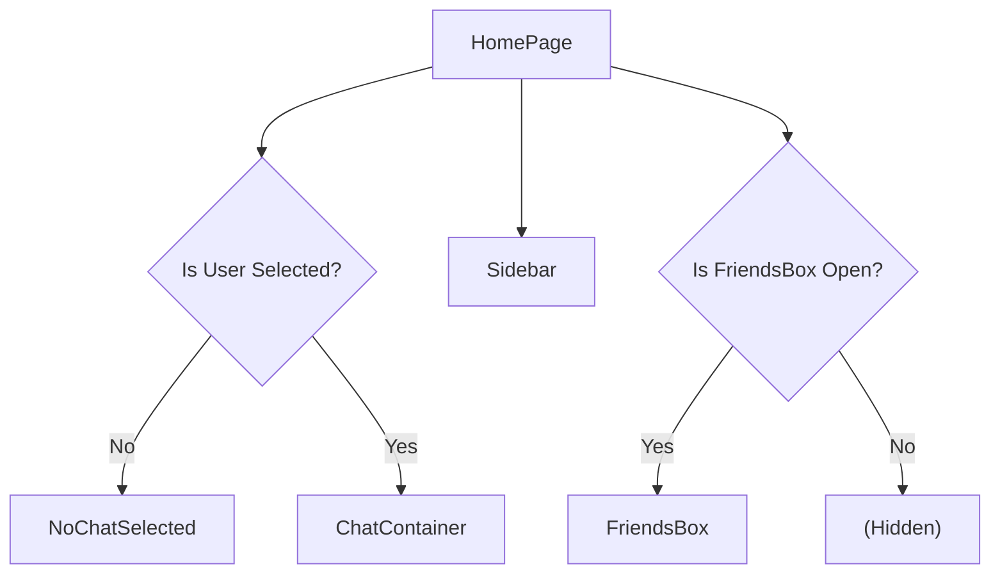
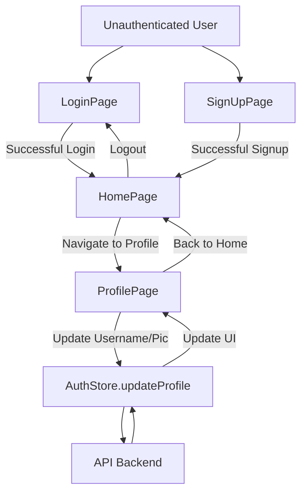

 # Application Pages and Routing

The frontend application is structured around several key pages, each serving a distinct purpose in the user experience. These pages handle user authentication, core chat functionality, and profile management, utilizing client-side routing to provide a seamless navigation flow. This document details the responsibilities and key components of the `HomePage`, `LoginPage`, `SignUpPage`, and `ProfilePage`.

## Home Page (`HomePage.jsx`)

The `HomePage` serves as the central hub for authenticated users, displaying the main chat interface. It intelligently renders different components based on the user's current interaction, such as whether a chat is selected or the friends list is open.

**Responsibilities:**

*   Display the main chat application layout.
*   Conditionally render the `ChatContainer` when a user is selected for chat.
*   Display `NoChatSelected` when no chat is active.
*   Integrate the `Sidebar` for global navigation and user list.
*   Conditionally show the `FriendsBox` for managing friends.

**Key Components & Structure:**

The home page leverages global state management (Zustand's `useChatStore`) to determine which sub-components to render.

```jsx
// frontend/src/pages/HomePage.jsx
// View on GitHub: https://github.com/shinymack/Chat-App-MERN/blob/main/frontend/src/pages/HomePage.jsx#L9-L20
const HomePage = () => {
  const { selectedUser } = useChatStore();
  const { isFriendsBoxOpen } = useChatStore();
  return (
      <div className="h-screen bg-base-200">
      <div className="flex items-center justify-center pt-20 px-4 w-full">
        <div className="bg-base-100 rounded-lg shadow-xl w-full max-w-6xl h-[calc(100vh-8rem)]">
          <div className="flex h-full rounded-lg overflow-hidden w-full">
            <Sidebar />
            {!selectedUser ? <NoChatSelected /> : <ChatContainer />}
            {isFriendsBoxOpen && <FriendsBox />}
          </div>
        </div>
      </div>
    </div>
  )
}
```

This snippet illustrates the root structure and conditional rendering logic, ensuring that the appropriate chat or placeholder view is shown, alongside the essential `Sidebar` and optional `FriendsBox`.

### Home Page Component Flow

The diagram below illustrates how `HomePage` dynamically renders components based on application state.





## Login Page (`LoginPage.jsx`)

The `LoginPage` is responsible for authenticating existing users. It provides both email/password login and a convenient Google OAuth option.

**Responsibilities:**

*   Collect user credentials (email and password).
*   Handle form submission and trigger the authentication process via `useAuthStore`.
*   Provide visual feedback during the login process (loading states).
*   Offer an option to log in using Google OAuth.
*   Navigate to the `SignUpPage` for new users.

**Key Features:**

*   **Password Visibility Toggle**: Users can toggle password visibility for better usability.
*   **Google OAuth Integration**: Direct link to the backend's Google authentication endpoint.
*   **Loading State**: A `Loader2` icon and "Loading..." text are displayed when `isLoggingIn` is true.

```jsx
// frontend/src/pages/LoginPage.jsx
// View on GitHub: https://github.com/shinymack/Chat-App-MERN/blob/main/frontend/src/pages/LoginPage.jsx#L34-L44
            <div className="form-control">
              <label className="label">
                <span className="label-text font-medium">Password</span>
              </label>
              <div className="relative">
                <div className="absolute inset-y-0 left-0 pl-3 flex items-center pointer-events-none">
                  <Lock className="h-5 w-5 text-base-content/40" />
                </div>
                <input
                  type={showPassword ? "text" : "password"}
                  className={`input input-bordered w-full pl-10`}
                  placeholder="••••••••"
                  value={formData.password}
                  onChange={(e) => setFormData({ ...formData, password: e.target.value })}
                />
                <button
                  type="button"
                  className="absolute inset-y-0 right-0 pr-3 flex items-center"
                  onClick={() => setShowPassword(!showPassword)}
                >
                  {showPassword ? (
                    <EyeOff className="h-5 w-5 text-base-content/40" />
                  ) : (
                    <Eye className="h-5 w-5 text-base-content/40" />
                  )}
                </button>
              </div>
            </div>
```

The password input field includes a button to toggle `showPassword` state, enhancing user experience and security.

```jsx
// frontend/src/pages/LoginPage.jsx
// View on GitHub: https://github.com/shinymack/Chat-App-MERN/blob/main/frontend/src/pages/LoginPage.jsx#L62-L66
          <a
            href={googleAuthUrl} // Link to your backend Google auth route
            className="btn btn-primary btn-outline w-full"
          >
            <FcGoogle className="size-5 mr-2" />
            Sign in with Google
          </a>
```

This snippet shows the integration of the Google OAuth button, linking directly to the backend's authentication route.

## Sign Up Page (`SignUpPage.jsx`)

The `SignUpPage` facilitates the creation of new user accounts. It collects necessary details and performs client-side validation before attempting to register the user.

**Responsibilities:**

*   Collect new user information (username, email, and password).
*   Perform client-side validation on input fields (e.g., email format, password length).
*   Trigger the user registration process via `useAuthStore`.
*   Provide visual feedback during the registration process.
*   Offer an option to sign up using Google OAuth.
*   Navigate to the `LoginPage` for existing users.

**Client-Side Validation:**

The `validateForm` function ensures that all required fields are filled and meet specific criteria before submitting.

```jsx
// frontend/src/pages/SignUpPage.jsx
// View on GitHub: https://github.com/shinymack/Chat-App-MERN/blob/main/frontend/src/pages/SignUpPage.jsx#L19-L28
  const validateForm = () => {
    if(!formData.username.trim()) return toast.error("Username is required");
    if(!formData.email.trim()) return toast.error("Email is required");
    if (!/\S+@\S+\.\S+/.test(formData.email)) return toast.error("Invalid email format");
    if (!formData.password) return toast.error("Password is required");
    if (formData.password.length < 6) return toast.error("Password must be at least 6 characters");

    return true;
  };
```

This validation logic provides immediate feedback to the user and prevents unnecessary network requests for invalid data.

## Profile Page (`ProfilePage.jsx`)

The `ProfilePage` allows authenticated users to view and update their profile information, such as their profile picture and username.

**Responsibilities:**

*   Display the authenticated user's profile details (username, email, profile picture, member since date).
*   Allow users to upload and update their profile picture.
*   Enable editing of the username with real-time availability checks.
*   Provide feedback during profile updates.

**Profile Picture Update:**

Users can upload a new profile picture, which is then converted to a base64 string and sent to the backend.

```jsx
// frontend/src/pages/ProfilePage.jsx
// View on GitHub: https://github.com/shinymack/Chat-App-MERN/blob/main/frontend/src/pages/ProfilePage.jsx#L42-L54
	const handleImageUpload = async (e) => {
		const file = e.target.files[0];
		if (!file) return;

		const reader = new FileReader();
		reader.readAsDataURL(file);

		reader.onload = async () => {
			const base64Image = reader.result;
			setSelectedImg(base64Image);
			// Let's call updateProfile from here
			await updateProfile({ profilePic: base64Image });
			// No need to call it again from the save button if you have one
		};
	};
```

This function handles the file input, reads the image, updates local state for preview, and then dispatches the update to the global authentication store.

**Username Editing and Debounced Check:**

The profile page includes an editable username field with a debounced availability check to prevent excessive API calls.

```jsx
// frontend/src/pages/ProfilePage.jsx
// View on GitHub: https://github.com/shinymack/Chat-App-MERN/blob/main/frontend/src/pages/ProfilePage.jsx#L61-L87
	useEffect(() => {
		clearTimeout(debounceTimeout.current);

		if (!newUsername.trim() || newUsername.trim().length < 3) {
			setUsernameStatus({ checking: false, available: false, message: "Must be 3+ characters." });
			return;
		}

		if (newUsername === authUser.username) {
			setUsernameStatus({ checking: false, available: true, message: "" });
			return;
		}

		setUsernameStatus((prev) => ({ ...prev, checking: true, message: "Checking..." }));

		debounceTimeout.current = setTimeout(async () => {
			try {
				const res = await axiosInstance.get(`/auth/username/check/${newUsername}`);
				setUsernameStatus({
					checking: false,
					available: res.data.available,
					message: res.data.message,
				});
			} catch (error) {
				const message = error.response?.data?.message || "Error checking username.";
				setUsernameStatus({ checking: false, available: false, message });
			}
		}, 500); // 500ms debounce delay

		return () => clearTimeout(debounceTimeout.current);
	}, [newUsername, authUser.username]);
```

This `useEffect` hook manages the debounced check, ensuring the username availability is validated only after the user pauses typing, optimizing network requests.

```jsx
// frontend/src/pages/ProfilePage.jsx
// View on GitHub: https://github.com/shinymack/Chat-App-MERN/blob/main/frontend/src/pages/ProfilePage.jsx#L130-L149
							{!isEditingUsername ? (
								<div className="flex items-center gap-2">
									<p className="px-4 py-2.5 bg-base-200 rounded-lg border flex-grow">
										{authUser?.username}
									</p>
									<button onClick={() => setIsEditingUsername(true)} className="btn btn-ghost btn-sm">
										<Edit className="w-4 h-4" />
									</button>
								</div>
							) : (
								<div className="space-y-2">
									<div className="flex items-center gap-2">
										<input
											type="text"
											value={newUsername}
											onChange={(e) => setNewUsername(e.target.value.toLowerCase())}
											className="input input-bordered w-full"
										/>
										<button onClick={handleSaveUsername} className="btn btn-success btn-sm" disabled={!usernameStatus.available || usernameStatus.checking || isUpdatingProfile}>
											{isUpdatingProfile ? <Loader2 className="w-4 h-4 animate-spin" /> : <Save className="w-4 h-4" />}
										</button>
										<button onClick={handleCancelEdit} className="btn btn-error btn-sm">
											<X className="w-4 h-4" />
										</button>
									</div>
									<div className={`text-xs h-4 ${usernameStatus.available ? 'text-green-500' : 'text-error'}`}>
										{usernameStatus.checking ? <Loader2 className="w-3 h-3 animate-spin inline-block mr-1" /> : null}
										{usernameStatus.message}
									</div>
								</div>
							)}
```

This section of the JSX displays either the username as text or an input field with save/cancel buttons, controlled by the `isEditingUsername` state. Status messages provide real-time feedback on username availability.

## Key Integration Points

The application's routing and page structure are underpinned by React Router DOM for client-side navigation and a centralized authentication store (Zustand) for managing user sessions and profile data.

*   **Client-Side Routing**: `react-router-dom` handles transitions between `LoginPage`, `SignUpPage`, `HomePage`, and `ProfilePage`. This ensures a single-page application (SPA) experience. Authentication guards (not shown in these specific files but implied by the application's overall design) would protect routes like `HomePage` and `ProfilePage` from unauthenticated access, redirecting to `LoginPage` if necessary.

*   **Global State Management (`useAuthStore`, `useChatStore`)**:
    *   `useAuthStore` is crucial for `LoginPage`, `SignUpPage`, and `ProfilePage`, managing user login/signup, authentication status, and profile updates.
    *   `useChatStore` on the `HomePage` manages the currently `selectedUser` and the visibility of `FriendsBox`, dictating the dynamic rendering of chat components.

### Authentication and User Flow Diagram

This diagram illustrates the primary user authentication and navigation flow within the frontend application.


