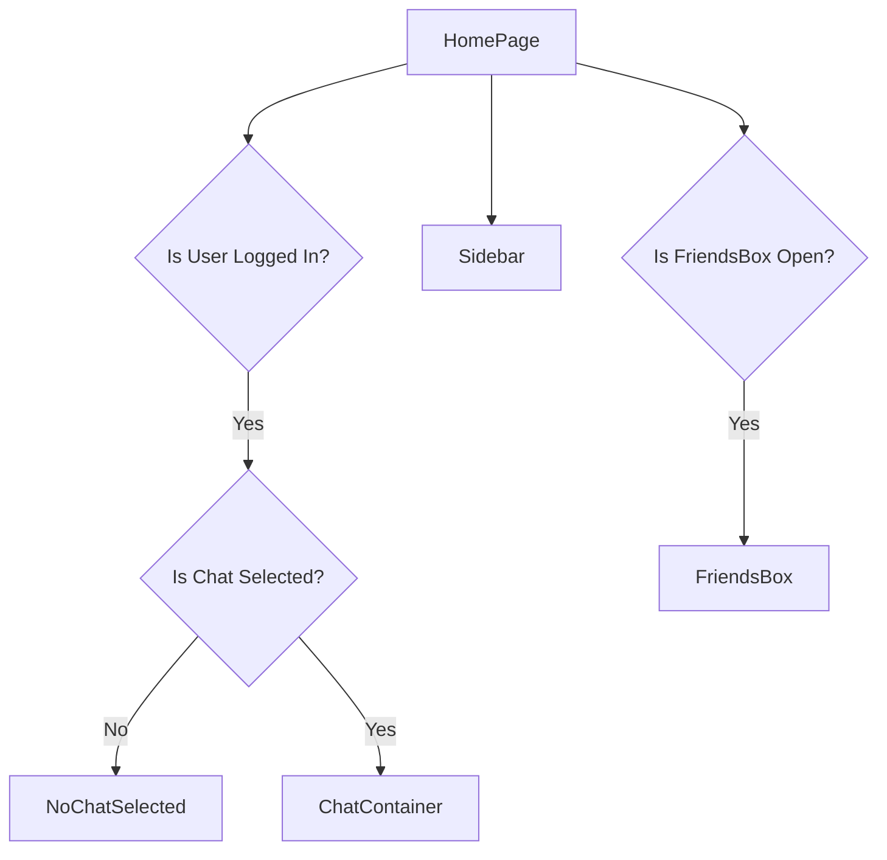
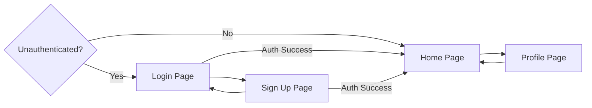

 # Application Pages and Routing

The client-side of the Chat-App-MERN application is structured around several core pages, each serving a distinct purpose in providing a seamless user experience. These pages handle everything from user authentication to real-time chat interactions and profile management. This document outlines the main application pages, their responsibilities, and how users navigate between them, ensuring a clear flow within the application.

## HomePage.jsx

The `HomePage.jsx` component serves as the primary interface for authenticated users. It's the central hub where users can engage in conversations, view their friends, and manage their chat experience. This page dynamically renders various components based on the user's interaction, such as selecting a chat or opening the friends list.

### Key Components

*   **Sidebar:** Displays the list of conversations and provides navigation options.
*   **ChatContainer:** Renders the active chat window, showing messages and allowing message input.
*   **FriendsBox:** A dynamic overlay for managing friend requests and viewing friend statuses.
*   **NoChatSelected:** A placeholder component displayed when no chat is active.

```jsx
// frontend/src/pages/HomePage.jsx
import ChatContainer from "../components/ChatContainer";
import FriendsBox from "../components/FriendsBox";
import NoChatSelected from "../components/NoChatSelected";
import Sidebar from "../components/Sidebar";
import { useChatStore } from "../store/useChatStore"

const HomePage = () => {
  const { selectedUser } = useChatStore();
  const { isFriendsBoxOpen } = useChatStore();
  return (
      <div className="h-screen bg-base-200">
      <div className="flex items-center justify-center pt-20 px-4 w-full">
        <div className="bg-base-100 rounded-lg shadow-xl w-full max-w-6xl h-[calc(100vh-8rem)]">
          <div className="flex h-full rounded-lg overflow-hidden w-full">
            <Sidebar />
            {!selectedUser ? <NoChatSelected /> : <ChatContainer />}
            {isFriendsBoxOpen && <FriendsBox />}
          </div>
        </div>
      </div>
    </div>
  )
}

export default HomePage
```
[View on GitHub](https://github.com/shinymack/Chat-App-MERN/blob/main/frontend/src/pages/HomePage.jsx#L7-L25)

The `HomePage` conditionally renders `ChatContainer` or `NoChatSelected` based on whether a user has been `selectedUser` from the `useChatStore`. The `FriendsBox` is also conditionally rendered, appearing when `isFriendsBoxOpen` is true.





## LoginPage.jsx

The `LoginPage.jsx` component provides the interface for existing users to authenticate and gain access to the application. It supports both email/password-based login and Google OAuth for convenience.

### Authentication Flow

Users can log in using their registered email and password. The `login` function from `useAuthStore` handles the authentication request to the backend. Alternatively, users can choose to "Sign in with Google," which redirects them to a Google authentication flow managed by the backend.

```jsx
// frontend/src/pages/LoginPage.jsx
const LoginPage = () => {
  const [showPassword, setShowPassword] = useState(false);
  const [formData, setFormData] = useState({
    email: "",
    password: "",
  })
  const { login, isLoggingIn } = useAuthStore();

  const handleSubmit = async (e) => {
    e.preventDefault();
    login(formData);
  }
  const backendDomain = import.meta.env.VITE_BACKEND_URL;
  const googleAuthUrl = `${backendDomain}/api/auth/google`;
  // ... rest of the component
```
[View on GitHub](https://github.com/shinymack/Chat-App-MERN/blob/main/frontend/src/pages/LoginPage.jsx#L15-L27)

The `handleSubmit` function prevents default form submission and calls the `login` action from the `useAuthStore`, passing the collected `formData`. The `googleAuthUrl` points to the backend endpoint responsible for initiating the Google OAuth flow.

## SignUpPage.jsx

The `SignUpPage.jsx` component is where new users can register for an account. Similar to the login page, it supports both traditional email/password registration and Google OAuth.

### Registration Process

Users provide a username, email, and password. Client-side validation ensures that all required fields are filled and meet basic criteria (e.g., valid email format, minimum password length) before the `signup` action from `useAuthStore` is dispatched.

```jsx
// frontend/src/pages/SignUpPage.jsx
const SignUpPage = () => {
  const [showPassword, setShowPassword] = useState(false);
  const [formData, setFormData] = useState({
    username: "",
    email: "",
    password: "",
  });

  const { signup, IsSigningUp } = useAuthStore();

  const validateForm = () => {
    if(!formData.username.trim()) return toast.error("Username is required");
    if(!formData.email.trim()) return toast.error("Email is required");
    if (!/\S+@\S+\.\S+/.test(formData.email)) return toast.error("Invalid email format");
    if (!formData.password) return toast.error("Password is required");
    if (formData.password.length < 6) return toast.error("Password must be at least 6 characters");

    return true;
  };

  const handleSubmit = (e) => {
    e.preventDefault();

    const success = validateForm();
    if(success===true) signup(formData);
  };
  
  const backendDomain = import.meta.env.VITE_BACKEND_URL;
  const googleAuthUrl = `${backendDomain}/api/auth/google`;
  // ... rest of the component
```
[View on GitHub](https://github.com/shinymack/Chat-App-MERN/blob/main/frontend/src/pages/SignUpPage.jsx#L10-L42)

The `validateForm` function performs essential client-side checks before submitting the form data to the `signup` action. This prevents unnecessary network requests for invalid input.

## ProfilePage.jsx

The `ProfilePage.jsx` allows authenticated users to view and update their profile information, including their profile picture and username.

### Profile Management Features

*   **Profile Picture Update:** Users can upload a new profile picture. The image is converted to a base64 string and sent to the backend via the `updateProfile` action.
*   **Username Edit:** Users can edit their username. A debounced check is implemented to verify username availability in real-time before saving.

```jsx
// frontend/src/pages/ProfilePage.jsx
const ProfilePage = () => {
	const { authUser, isUpdatingProfile, updateProfile } = useAuthStore();
	const [selectedImg, setSelectedImg] = useState(null);

	const [isEditingUsername, setIsEditingUsername] = useState(false);
	const [newUsername, setNewUsername] = useState(authUser?.username || "");
	const [usernameStatus, setUsernameStatus] = useState({
		checking: false,
		available: true,
		message: "",
	});
	const debounceTimeout = useRef(null);

	const handleImageUpload = async (e) => {
		const file = e.target.files[0];
		if (!file) return;

		const reader = new FileReader();
		reader.readAsDataURL(file);

		reader.onload = async () => {
			const base64Image = reader.result;
			setSelectedImg(base64Image);
			await updateProfile({ profilePic: base64Image });
		};
	};
    // ... rest of the component
```
[View on GitHub](https://github.com/shinymack/Chat-App-MERN/blob/main/frontend/src/pages/ProfilePage.jsx#L90-L113)

The `handleImageUpload` function reads the selected file as a data URL (base64) and then calls `updateProfile` to send it to the server. The `useEffect` hook with `debounceTimeout` manages the real-time username availability check.

```jsx
// frontend/src/pages/ProfilePage.jsx
	useEffect(() => {
		clearTimeout(debounceTimeout.current);
		if (!newUsername.trim() || newUsername.trim().length < 3) {
			setUsernameStatus({ checking: false, available: false, message: "Must be 3+ characters." });
			return;
		}
		if (newUsername === authUser.username) {
			setUsernameStatus({ checking: false, available: true, message: "" });
			return;
		}
		setUsernameStatus((prev) => ({ ...prev, checking: true, message: "Checking..." }));
		debounceTimeout.current = setTimeout(async () => {
			try {
				const res = await axiosInstance.get(`/auth/username/check/${newUsername}`);
				setUsernameStatus({
					checking: false,
					available: res.data.available,
					message: res.data.message,
				});
			} catch (error) {
				const message = error.response?.data?.message || "Error checking username.";
				setUsernameStatus({ checking: false, available: false, message });
			}
		}, 500); 
		return () => clearTimeout(debounceTimeout.current);
	}, [newUsername, authUser.username]);
```
[View on GitHub](https://github.com/shinymack/Chat-App-MERN/blob/main/frontend/src/pages/ProfilePage.jsx#L116-L141)

This `useEffect` hook demonstrates a debounced API call to check if a new username is available. This improves user experience by not flooding the server with requests as the user types, and providing immediate feedback.

## Application Navigation Flow

The application's routing is managed on the client-side, typically using `react-router-dom`. The main navigation paths revolve around authentication status.





This flowchart illustrates the primary navigation paths. Unauthenticated users are directed to either the Login or Sign Up pages. Upon successful authentication (login or sign up), users are redirected to the Home Page. From the Home Page, they can access their Profile Page, and navigate back.

## Key Integration Points

The core of the application's navigation and state management lies in the integration of global state (managed by Zustand `useAuthStore` and `useChatStore`) with the routing logic.

1.  **Authentication State (`useAuthStore`):**
    *   The `authUser` state in `useAuthStore` determines if a user is logged in. This state is often checked by a top-level route guard or context provider to redirect unauthenticated users to `/login` or `/signup` and authenticated users to `/`.
    *   Upon successful `login` or `signup`, the `authUser` state is updated, triggering a re-render and pushing the user to the `HomePage`.
    *   `isLoggingIn` and `IsSigningUp` states are used to disable buttons and show loading indicators during API calls, improving UI feedback.

2.  **Chat State (`useChatStore`):**
    *   The `selectedUser` state dictates which chat conversation is currently displayed in the `HomePage`. This allows for dynamic content rendering within the main application layout.
    *   `isFriendsBoxOpen` controls the visibility of the `FriendsBox` component, overlaying the chat interface.

These integrations ensure that the application reacts appropriately to user actions and authentication status, providing a smooth and intuitive navigation experience.