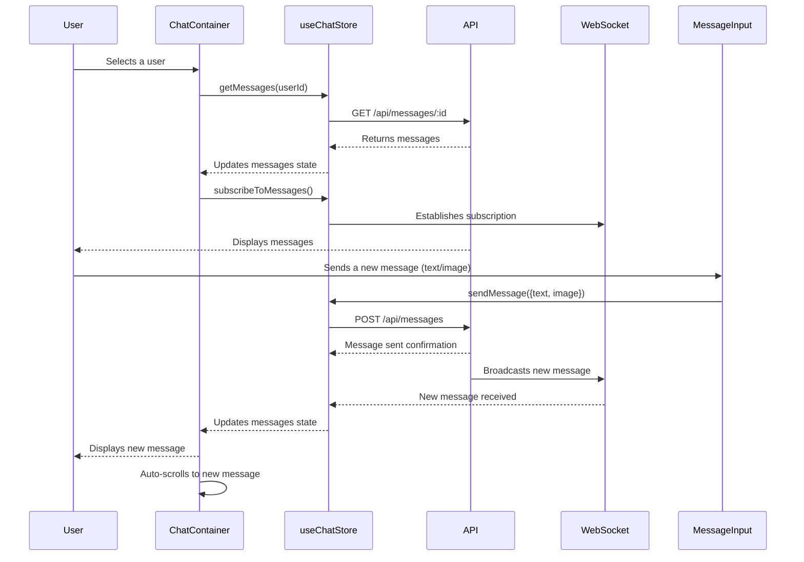

 # Frontend Components and UI Elements

This section provides detailed documentation for the core reusable UI components that form the interactive chat interface and related functionalities within the application. These components are built with React and leverage Zustand for state management, ensuring a reactive and efficient user experience.

## ChatContainer

The `ChatContainer` component is the primary view for displaying messages in an ongoing conversation with a selected user. It manages message fetching, real-time updates, and ensures the chat view is always scrolled to the latest message.

### Features

*   **Dynamic Message Display:** Renders individual messages, distinguishing between messages sent by the authenticated user and those received from the selected contact.
*   **Real-time Updates:** Subscribes to and unsubscribes from message updates, ensuring new messages appear instantly without manual refreshes.
*   **Auto-scrolling:** Automatically scrolls to the bottom of the chat view when new messages are loaded or sent.
*   **Message Types:** Supports both text-based messages and image attachments, rendering them appropriately.
*   **Loading State:** Displays a skeleton loader while messages are being fetched, improving perceived performance.

### Key Implementation Details

The `ChatContainer` heavily relies on the `useChatStore` for managing conversation-specific state such as `messages`, `selectedUser`, and loading indicators. It also uses `useAuthStore` to identify the current user.

#### Real-time Message Subscription

The component subscribes to real-time message updates when mounted and for the selected user, cleaning up the subscription when unmounted or the selected user changes. This ensures messages are always current.

```javascript
// frontend/src/components/ChatContainer.jsx
import { useEffect } from "react";
import { useChatStore } from "../store/useChatStore";

const ChatContainer = () => {
    const { messages, getMessages, isMessagesLoading, selectedUser, subscribeToMessages, unsubscribeFromMessages } =
        useChatStore();

    useEffect(() => {
        getMessages(selectedUser._id);
        subscribeToMessages();

        return () => unsubscribeFromMessages();
    }, [selectedUser._id, getMessages, subscribeToMessages, unsubscribeFromMessages]);
    // ...
};
```
This `useEffect` hook ensures that messages for the `selectedUser` are fetched and that the component actively listens for new messages via WebSocket subscriptions. The cleanup function prevents memory leaks by unsubscribing. [View on GitHub](https://github.com/shinymack/Chat-App-MERN/blob/main/frontend/src/components/ChatContainer.jsx#L11-L16)

#### Auto-Scrolling to Latest Message

To provide a smooth user experience, the chat automatically scrolls to the latest message whenever the `messages` array is updated.

```javascript
// frontend/src/components/ChatContainer.jsx
import { useRef } from "react";

const ChatContainer = () => {
    // ...
    const messageEndRef = useRef(null);

    useEffect(() => {
        if(messageEndRef.current && messages){
            messageEndRef.current.scrollIntoView({behaviour : "smooth"})
        }
    }, [messages])
    // ...
    return (
        // ...
            <div className="flex-1 overflow-y-auto p-4 space-y-4">
                {messages.map((message) => (
                    <div
                        key={message._id}
                        className={`chat ${message.senderId == authUser._id ? "chat-end": "chat-start"} `}
                        ref={messageEndRef}
                    >
                    {/* ... */}
                    </div>
                ))}
            </div>
        // ...
    );
};
```
The `messageEndRef` is attached to the last message in the `messages` array, and a `useEffect` triggers `scrollIntoView` whenever `messages` change. [View on GitHub](https://github.com/shinymack/Chat-App-MERN/blob/main/frontend/src/components/ChatContainer.jsx#L18-L22)

### Message Flow Diagram





## FriendsBox

The `FriendsBox` component provides a modal interface for managing friend relationships within the application. Users can add new friends, accept or reject pending requests, view sent requests, and remove existing friends.

### Features

*   **Tabbed Interface:** Organizes friend management into three tabs: "Friends", "Pending Requests", and "Sent Requests".
*   **Add Friend:** Allows users to send friend requests by entering a username or email.
*   **Request Management:** Provides actions to accept or reject incoming friend requests.
*   **Friend Removal:** Enables users to remove existing friends from their list.
*   **Real-time Updates:** Integrates with `useChatStore` to ensure friend lists and request statuses are always up-to-date.

### Key Implementation Details

The `FriendsBox` uses local state (`activeTab`, `identifier`) for UI management and interacts extensively with `useChatStore` for all friend-related data and actions.

#### Friend Request Handling

The component dispatches actions to the `useChatStore` for sending, accepting, and rejecting friend requests.

```javascript
// frontend/src/components/FriendsBox.jsx
import { useEffect, useState } from 'react';
import { useChatStore } from '../store/useChatStore';
import { X, UserPlus, Check, Trash2 } from 'lucide-react';

const FriendsBox = () => {
    const { 
        toggleFriendsBox, 
        getFriends, users,
        getPendingRequests, pendingRequests,
        getSentRequests, sentRequests,
        sendFriendRequest, acceptFriendRequest, rejectFriendRequest, removeFriend
    } = useChatStore();

    const [activeTab, setActiveTab] = useState('friends');
    const [identifier, setIdentifier] = useState('');

    useEffect(() => {
        // Fetch all necessary data when the component mounts
        getFriends();
        getPendingRequests();
        getSentRequests();
    }, [getFriends, getPendingRequests, getSentRequests]);

    const handleAddFriend = (e) => {
        e.preventDefault();
        if (identifier.trim()) {
            sendFriendRequest(identifier);
            setIdentifier('');
        }
    };
    // ...
};
```
This snippet shows the destructuring of actions from `useChatStore` and the `useEffect` hook to initially fetch friend data. The `handleAddFriend` function demonstrates how a new friend request is initiated. [View on GitHub](https://github.com/shinymack/Chat-App-MERN/blob/main/frontend/src/components/FriendsBox.jsx#L8-L34)

#### Dynamic Content Rendering

The `renderContent` function dynamically renders the appropriate list based on the currently active tab (`friends`, `pending`, `sent`).

```javascript
// frontend/src/components/FriendsBox.jsx
const FriendsBox = () => {
    // ...
    const renderContent = () => {
        switch (activeTab) {
            case 'pending':
                return (
                    <div className="space-y-2">
                        {pendingRequests.length > 0 ? pendingRequests.map(req => (
                            <div key={req._id} className="flex items-center justify-between p-2 rounded-lg bg-base-200">
                                <div className="flex items-center gap-3">
                                    
                                    <span>{req.username}</span>
                                </div>
                                <div className="flex gap-2">
                                    <button onClick={() => acceptFriendRequest(req._id)} className="btn btn-xs btn-success btn-circle"><Check size={16}/></button>
                                    <button onClick={() => rejectFriendRequest(req._id)} className="btn btn-xs btn-error btn-circle"><X size={16}/></button>
                                </div>
                            </div>
                        )) : <p className="text-center text-base-content/60 py-4">No pending requests.</p>}
                    </div>
                );
            case 'sent':
            // ... (similar structure for sent requests)
            case 'friends':
            default:
            // ... (similar structure for friends list)
        }
    };
    // ...
};
```
This conditional rendering logic ensures that the user interface updates correctly as the user navigates between the friend management tabs, displaying the relevant list of users or requests. [View on GitHub](https://github.com/shinymack/Chat-App-MERN/blob/main/frontend/src/components/FriendsBox.jsx#L42-L71)

## MessageInput

The `MessageInput` component is responsible for composing and sending messages, including text and optional image attachments. It provides a user-friendly interface for input and preview.

### Features

*   **Text Input:** A text area for typing messages.
*   **Image Attachment:** Allows users to select and attach an image to their message.
*   **Image Preview:** Displays a preview of the selected image before sending, with an option to remove it.
*   **Input Validation:** Ensures that either text or an image is present before allowing the message to be sent.
*   **Sending Mechanism:** Dispatches the message (text, image, or both) to the chat store for processing.

### Key Implementation Details

The component manages local state for the message text and image preview. It interacts with `useChatStore` to send the composed message.

#### Image Handling and Preview

The `handleImageChange` function reads the selected image file and sets up an image preview using `FileReader`.

```javascript
// frontend/src/components/MessageInput.jsx
import { useRef, useState } from "react";
import toast from "react-hot-toast";

const MessageInput = () => {
    const [text, setText] = useState("");
    const [imagePreview, setImagePreview] = useState(null);
    const fileInputRef = useRef(null);
    // ...

    const handleImageChange = (e) => {
        const file = e.target.files[0];
        if (!file.type.startsWith("image/")) {
            toast.error("Please select an image file");
            return;
        }

        const reader = new FileReader();
        reader.onloadend = () => {
            setImagePreview(reader.result);
        };
        reader.readAsDataURL(file);
    };

    const removeImage = () => {
        setImagePreview(null);
        if (fileInputRef.current) fileInputRef.current.value = "";
    };
    // ...
};
```
This code block shows how `FileReader` is used to create a base64 encoded string of the image, which is then used for `imagePreview`. It also includes basic validation for file types and a mechanism to remove the preview. [View on GitHub](https://github.com/shinymack/Chat-App-MERN/blob/main/frontend/src/components/MessageInput.jsx#L10-L31)

#### Sending Message Logic

The `handleSendMessage` function constructs the message payload and dispatches it to the `sendMessage` action from `useChatStore`.

```javascript
// frontend/src/components/MessageInput.jsx
const MessageInput = () => {
    // ...
    const { sendMessage } = useChatStore();
    // ...
    const handleSendMessage = async (e) => {
        e.preventDefault();
        if (!text.trim() && !imagePreview) return;

        try {
            await sendMessage({
                text: text.trim(),
                image: imagePreview,
            });

            setText("");
            setImagePreview(null);
            if (fileInputRef.current) fileInputRef.current = "";
        } catch (error) {
            console.error("Failed to send message", error);
        }
    };
    // ...
};
```
This asynchronous function is triggered on form submission. It prevents sending empty messages and clears the input fields after a successful send. Error handling is included to catch potential issues during the message sending process. [View on GitHub](https://github.mack/Chat-App-MERN/blob/main/frontend/src/components/MessageInput.jsx#L33-L49)

## Sidebar

The `Sidebar` component displays a list of the authenticated user's friends, allowing selection to start or continue a conversation. It also shows online/offline status and provides a filter to view only online friends.

### Features

*   **Friend List Display:** Shows a list of friends with their profile pictures and usernames.
*   **User Selection:** Allows users to select a friend, updating the `selectedUser` state and triggering the `ChatContainer` to display the corresponding messages.
*   **Online Status Indicator:** Displays a visual indicator (green dot) for online friends and textual "Online"/"Offline" status.
*   **Online Filter:** A checkbox to filter the friend list, showing only friends who are currently online.
*   **Responsive Visibility:** Adjusts its visibility based on whether a user is selected on smaller screens.

### Key Implementation Details

The `Sidebar` fetches the user's friend list using `useChatStore` and determines online status through `useAuthStore`.

#### Friend List and Online Filtering

The component fetches friends on mount and uses the `onlineUsers` array from the `useAuthStore` to filter and display status.

```javascript
// frontend/src/components/Sidebar.jsx
import { useEffect, useState } from "react";
import { useChatStore } from "../store/useChatStore";
import { Users } from "lucide-react";
import { useAuthStore } from "../store/useAuthStore";

const Sidebar = () => {
    const { getFriends, users, selectedUser, setSelectedUser, isUsersLoading } =
        useChatStore();

    const { onlineUsers } = useAuthStore();
    const [showOnlineOnly, setShowOnlineOnly] = useState(false);
    
    useEffect(() => {
        getFriends();
    }, [getFriends]);

    const filteredUsers = showOnlineOnly
        ? users.filter((user) => onlineUsers.includes(user._id))
        : users;
    // ...
};
```
This code ensures that the friend list is loaded when the sidebar appears. The `filteredUsers` computed property dynamically adjusts the displayed list based on the `showOnlineOnly` toggle and the `onlineUsers` from the authentication store. [View on GitHub](https://github.com/shinymack/Chat-App-MERN/blob/main/frontend/src/components/Sidebar.jsx#L10-L24)

#### User Selection and UI Update

Clicking on a user in the sidebar updates the `selectedUser` in the global chat store, which in turn causes the `ChatContainer` to refresh with the new conversation.

```javascript
// frontend/src/components/Sidebar.jsx
const Sidebar = () => {
    // ...
    return (
        <div className={`h-full sm:w-72 sm:border-r border-base-300  flex-col transition-all duration-200 ${selectedUser ?
                                    "hidden sm:flex w-[100vw] "
                                    : ""}`}>
            {/* ... */}
                <div className="overflow-y-scroll h-[calc(100vh-14rem)] w-full flex flex-col py-3">
                    {filteredUsers.map((user) => (
                        <button
                            key={user._id}
                            onClick={() => setSelectedUser(user)}
                            className={`sm:w-full w-[88vw] p-3 flex items-center gap-3 hover:bg-base-300 transition-colors
                            ${
                                selectedUser?._id === user._id
                                    ? "bg-base-300 ring-1 ring-base-300"
                                    : ""
                            }`}
                        >
                            {/* ... User profile details ... */}
                        </button>
                    ))}
                </div>
            {/* ... */}
        </div>
    );
};
```
The `setSelectedUser(user)` call is crucial for changing the active conversation. The conditional styling highlights the currently selected user. [View on GitHub](https://github.com/shinymack/Chat-App-MERN/blob/main/frontend/src/components/Sidebar.jsx#L42-L68)

## Key Integration Points

These frontend components are tightly integrated to provide a cohesive chat experience.

*   **Zustand Stores:** All components heavily rely on `useChatStore` and `useAuthStore` for centralized state management. This ensures that actions like selecting a user, sending a message, or updating friend lists are reflected across the application consistently. For example, `Sidebar` updates `selectedUser` in `useChatStore`, which then triggers `ChatContainer` to fetch messages for that user.
*   **Real-time Communication:** The `useChatStore` encapsulates the WebSocket logic, abstracting real-time message subscriptions for `ChatContainer` and friend list updates for `FriendsBox` and `Sidebar`. This separation of concerns allows components to simply consume data and trigger actions without managing WebSocket connections directly.
*   **Component Composition:** `ChatContainer` composes `ChatHeader` (not detailed here), `MessageInput`, and `MessageSkeleton`, while the main application layout likely orchestrates the rendering of `Sidebar` and `ChatContainer` side-by-side. `FriendsBox` is rendered as a modal overlay when triggered.
*   **User Experience Flow:** The application design guides the user from selecting a friend in the `Sidebar` to viewing their conversation in `ChatContainer` and then interacting via `MessageInput`. Friend management through `FriendsBox` is an ancillary but vital part of the user's social interaction.