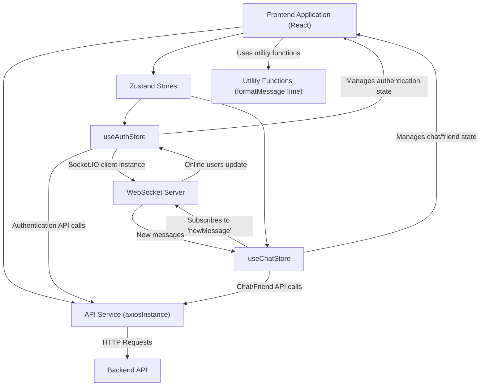
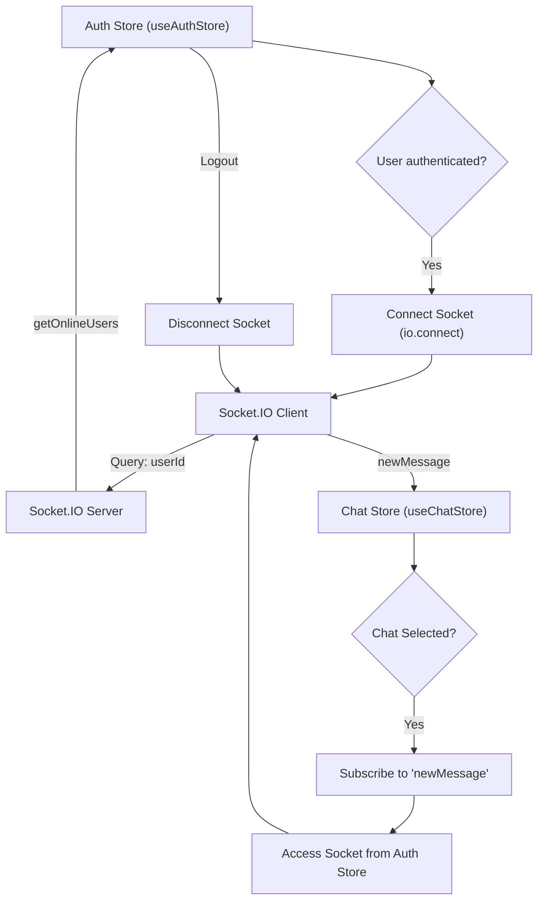

 # Frontend State Management and Utilities

This document details the frontend architecture concerning client-side state management and essential utility functions. The application leverages [Zustand](https://zustand-bear.netlify.app/) for streamlined state management, providing a minimalistic and powerful alternative to more verbose solutions. Alongside Zustand, common utility functions are defined to assist with data formatting and API interaction, ensuring a clean and modular codebase.

## Core Utilities

The `lib` directory houses essential utility functions and configurations that are shared across the frontend application.

### API Instance Configuration

The `axios.js` file configures a global Axios instance, `axiosInstance`, which serves as the primary tool for all HTTP requests to the backend API. This setup centralizes API base URL management and ensures that credentials (like cookies for session management) are automatically sent with each request.

```javascript
// frontend/src/lib/axios.js
import axios from "axios";

export const axiosInstance = axios.create({
    baseURL: import.meta.env.MODE == "development" ? "http://localhost:5001/api": "/api",
    withCredentials: true,
});
```

-   **`baseURL`**: Dynamically set based on the environment (`development` or `production`), ensuring requests are routed correctly.
-   **`withCredentials`**: Set to `true` to include cookies with cross-origin requests, which is crucial for authenticated sessions.

For more details, refer to the [Axios instance definition on GitHub](https://github.com/shinymack/Chat-App-MERN/blob/main/frontend/src/lib/axios.js).

### Message Time Formatting

The `utils.js` file contains general-purpose utility functions. A notable example is `formatMessageTime`, which formats a given date into a human-readable time string, including year, month, day, and 12-hour time. This ensures a consistent display of message timestamps throughout the application.

```javascript
// frontend/src/lib/utils.js
export function formatMessageTime(date) {
    return new Date(date).toLocaleTimeString("en-US", {
        year: "numeric",
        month: "short",
        day:"2-digit",
        hour: "2-digit",
        minute: "2-digit",
        hour12: true,
    });
}
```

This function is essential for presenting user-friendly timestamps in chat interfaces. [View `utils.js` on GitHub](https://github.com/shinymack/Chat-App-MERN/blob/main/frontend/src/lib/utils.js).

## State Management with Zustand

Zustand is used for managing global application state, offering a simple yet powerful API. The state is divided into logical stores, primarily `useAuthStore` for authentication and user-related data, and `useChatStore` for chat-specific functionalities and friend management.

### Authentication and User Store (`useAuthStore`)

The `useAuthStore` manages all authentication-related state and actions, including user data, login/signup processes, and WebSocket connections for real-time features.

#### State Variables

*   `authUser`: Stores the authenticated user object.
*   `isSigningUp`, `isLoggingIn`, `isUpdatingProfile`, `isCheckingAuth`: Boolean flags to indicate the status of various asynchronous operations, useful for UI loading states.
*   `onlineUsers`: An array of user IDs currently online, updated via WebSocket.
*   `socket`: The WebSocket client instance used for real-time communication.

#### Key Actions

*   **`checkAuth()`**: Verifies the user's authentication status with the backend on application load. If authenticated, it sets `authUser` and initiates the WebSocket connection.
*   **`signup(data)`**: Handles user registration.
*   **`login(data)`**: Manages user login.
*   **`logout()`**: Clears user session and disconnects the WebSocket.
*   **`updateProfile(data)`**: Allows authenticated users to update their profile information.
*   **`connectSocket()`**: Initializes and connects the Socket.IO client, passing the `userId` as a query parameter. It also subscribes to the "getOnlineUsers" event.
*   **`disconnectSocket()`**: Disconnects the Socket.IO client.

```javascript
// frontend/src/store/useAuthStore.js - Snippet
import { create } from "zustand";
import { axiosInstance } from "../lib/axios";
import { io } from "socket.io-client";

const BASE_URL = import.meta.env.MODE == "development" ? "http://localhost:5001": "/";

export const useAuthStore = create((set, get) => ({
    authUser: null,
    isCheckingAuth: true,
    onlineUsers: [],
    socket: null,

    checkAuth: async () => {
        try {
            const res = await axiosInstance.get("/auth/check");
            set({ authUser: res.data });
            get().connectSocket(); // Connect socket if authenticated
        } catch (error) {
            set({ authUser: null });
        } finally {
            set({ isCheckingAuth: false });
        }
    },

    connectSocket: () => {
        const { authUser } = get();
        if(!authUser || get().socket?.connected) return;

        const socket = io(BASE_URL, {
            query: { userId : authUser._id },
        });
        socket.connect();
        set({socket: socket});

        socket.on("getOnlineUsers", (userIds) => {
            set({onlineUsers: userIds})
        }); 
    },
    // ... other actions like signup, login, logout, updateProfile, disconnectSocket
}));
```

[Explore `useAuthStore.js` on GitHub](https://github.com/shinymack/Chat-App-MERN/blob/main/frontend/src/store/useAuthStore.js).

### Chat and Friends Store (`useChatStore`)

The `useChatStore` manages all chat-specific functionalities, including message handling, friend lists, and friend request management. It also integrates with the `useAuthStore` to leverage the WebSocket connection.

#### State Variables

*   `messages`: An array of messages for the currently selected chat.
*   `users`: A list of the authenticated user's friends.
*   `pendingRequests`: Friend requests received by the user.
*   `sentRequests`: Friend requests sent by the user.
*   `selectedUser`: The user currently selected for chatting.
*   `isUsersLoading`, `isMessagesLoading`: Flags for loading states related to friends and messages.
*   `isFriendBoxOpen`: Boolean to control the visibility of the friends management UI.

#### Key Actions

*   **`toggleFriendsBox()`**: Toggles the `isFriendBoxOpen` state.
*   **`getFriends()`**: Fetches the list of friends.
*   **`getPendingRequests()`**: Fetches incoming friend requests.
*   **`getSentRequests()`**: Fetches outgoing friend requests.
*   **`sendFriendRequest(identifier)`**: Sends a new friend request.
*   **`acceptFriendRequest(senderId)`**: Accepts a pending friend request.
*   **`rejectFriendRequest(senderId)`**: Rejects a pending friend request.
*   **`removeFriend(friendId)`**: Removes an existing friend.
*   **`getMessages(userId)`**: Fetches chat messages for a specific user.
*   **`sendMessage(messageData)`**: Sends a new message to the `selectedUser`.
*   **`subscribeToMessages()`**: Subscribes to the "newMessage" WebSocket event to receive real-time messages. It accesses the `socket` instance from `useAuthStore`.
*   **`unsubscribeFromMessages()`**: Cleans up the "newMessage" WebSocket event listener.
*   **`setSelectedUser(selectedUser)`**: Sets the user whose chat is currently active.

```javascript
// frontend/src/store/useChatStore.js - Snippet
import { create } from "zustand";
import { axiosInstance } from "../lib/axios";
import { useAuthStore } from "./useAuthStore";

export const useChatStore = create((set, get) => ({
    messages:[],
    users: [],
    selectedUser: null,
    isMessagesLoading: false,

    getMessages: async (userId) => {
        set({isMessagesLoading: true});
        try {
            const res = await axiosInstance.get(`/messages/${userId}`);
            set({messages: res.data});
        } catch (error) { /* ... */ } finally {
            set({isMessagesLoading: false});
        }
    },
    sendMessage: async (messageData) => {
        const {selectedUser, messages} = get();
        try {
            const res = await axiosInstance.post(`/messages/send/${selectedUser._id}`, messageData);
            set({messages : [...messages, res.data]});
        } catch (error){ /* ... */ }
    },

    subscribeToMessages: () => {
        const { selectedUser } = get();
        if(!selectedUser) return;
        
        const socket = useAuthStore.getState().socket; // Access socket from auth store
        socket.on("newMessage", (newMessage) => {
            if(newMessage.senderId !== selectedUser._id) return
            set({
                messages: [...get().messages, newMessage]
            })
        })
    },

    unsubscribeFromMessages: () => {
        const socket = useAuthStore.getState().socket;
        socket.off("newMessage");
    },
    
    setSelectedUser: (selectedUser) => set({selectedUser})
    // ... other actions for friends and requests
}));
```

Notice how `useChatStore` accesses the `socket` from `useAuthStore` using `useAuthStore.getState().socket` for real-time message handling. This demonstrates cross-store communication for shared resources.
[View `useChatStore.js` on GitHub](https://github.com/shinymack/Chat-App-MERN/blob/main/frontend/src/store/useChatStore.js).

## Frontend State and Data Flow

The following diagram illustrates the primary components and data flow within the frontend's state management and utility layers.





## Key Integration Points

### Authentication and Socket Lifecycle
The `useAuthStore` plays a critical role in initializing and managing the WebSocket connection. Upon successful authentication (login or signup) or during an initial `checkAuth` on application load, `connectSocket()` is called. This ensures that the user's socket is immediately available and connected, allowing the application to receive real-time updates for online users. Conversely, `logout()` triggers `disconnectSocket()` to properly close the connection.

### Real-time Messaging and Cross-Store Communication
For real-time message reception, the `useChatStore` depends on the `socket` instance provided by the `useAuthStore`. This is achieved by directly accessing `useAuthStore.getState().socket`. When a user selects a chat, `subscribeToMessages()` is invoked to listen for `newMessage` events from the WebSocket. This design ensures that the WebSocket connection is centralized in the `useAuthStore` but can be leveraged by other stores requiring real-time updates.





### Centralized API Handling
The `axiosInstance` defined in `frontend/src/lib/axios.js` is the single point of interaction for all HTTP requests to the backend. Both `useAuthStore` and `useChatStore` import and utilize this instance for their respective API calls, ensuring consistency in request headers, base URL, and credentials management. This abstraction simplifies API interactions and makes it easier to manage network configurations.

### UI Integration and Loading States
The various `is...Loading` state variables (e.g., `isSigningUp`, `isMessagesLoading`) in both stores are crucial for providing user feedback. Components consuming these stores can use these flags to display loading spinners, disable buttons, or adjust UI elements, enhancing the overall user experience during asynchronous operations. Toast notifications are also integrated directly into the store actions using `react-hot-toast` to provide immediate feedback on success or failure of operations.