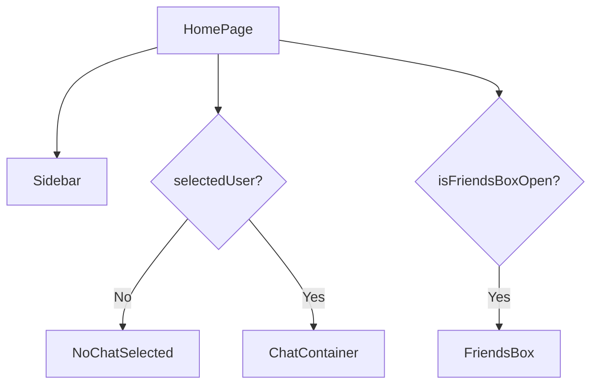
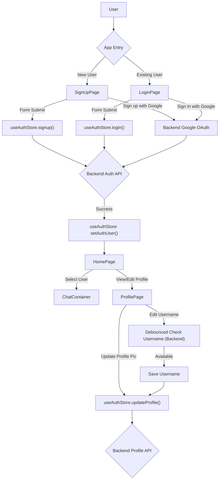

 # Page-Level Views

The `frontend/src/pages` directory houses the core view components that define the main screens of the application. Each file corresponds to a distinct page, managing its layout, state, and interactions. This section provides an overview of the key page-level components, including the Home, Login, Sign Up, and Profile pages.

## Home Page (`HomePage.jsx`)

The `HomePage.jsx` component serves as the main application interface after a user has successfully logged in. It orchestrates the display of various chat-related components, creating a comprehensive messaging experience.

-   **Purpose**: Renders the primary chat interface, including the sidebar, chat area, and friends list.
-   **Key Components**:
    -   `Sidebar`: Displays user information, search, and a list of conversations/users.
    -   `ChatContainer`: Shows the active chat messages and input field when a user is selected.
    -   `NoChatSelected`: A placeholder component displayed when no chat is active.
    -   `FriendsBox`: A modal or slide-out component for managing friends, appearing conditionally.
-   **State Management**: Utilizes the `useChatStore` Zustand store to manage `selectedUser` (the currently active chat) and `isFriendsBoxOpen` (visibility of the friends list).

The core layout of the home page conditionally renders the `ChatContainer` or `NoChatSelected` based on whether a user has been selected for a chat.

```jsx
// frontend/src/pages/HomePage.jsx
// Relevant lines: 14-23
const HomePage = () => {
  const { selectedUser } = useChatStore();
  const { isFriendsBoxOpen } = useChatStore();
  return (
      <div className="h-screen bg-base-200">
      <div className="flex items-center justify-center pt-20 px-4 w-full">
        <div className="bg-base-100 rounded-lg shadow-xl w-full max-w-6xl h-[calc(100vh-8rem)]">
          <div className="flex h-full rounded-lg overflow-hidden w-full">
            <Sidebar />
            {!selectedUser ? <NoChatSelected /> : <ChatContainer />}
            {isFriendsBoxOpen && <FriendsBox />}
          </div>
        </div>
      </div>
    </div>
  )
}
```
[View on GitHub](https://github.com/shinymack/Chat-App-MERN/blob/main/frontend/src/pages/HomePage.jsx#L14-L23)

This snippet demonstrates the main container for the chat application, where `Sidebar`, `ChatContainer`, `NoChatSelected`, and `FriendsBox` are dynamically rendered.





## Login Page (`LoginPage.jsx`)

The `LoginPage.jsx` component handles user authentication, allowing existing users to sign in. It supports both traditional email/password login and Google OAuth.

-   **Purpose**: Provides a user interface for logging into the application.
-   **Authentication**: Integrates with the `useAuthStore` to manage login state and actions.
-   **Form Handling**: Manages form input for email and password, including toggling password visibility.
-   **External Auth**: Includes a button for Google authentication, directing to the backend's Google OAuth endpoint.
-   **Navigation**: Contains a link to the sign-up page for new users.

The login form uses basic state management for input fields and interacts with the authentication store.

```jsx
// frontend/src/pages/LoginPage.jsx
// Relevant lines: 10-21
const LoginPage = () => {
  const [showPassword, setShowPassword] = useState(false);
  const [formData, setFormData] = useState({
    email: "",
    password: "",
  })
  const { login, isLoggingIn } = useAuthStore();

  const handleSubmit = async (e) => {
    e.preventDefault();
    login(formData);
  }
  const backendDomain = import.meta.env.VITE_BACKEND_URL;
  const googleAuthUrl = `${backendDomain}/api/auth/google`;
  return (
    // ...
  )
}
```
[View on GitHub](https://github.com/shinymack/Chat-App-MERN/blob/main/frontend/src/pages/LoginPage.jsx#L10-L21)

This snippet shows the state initialization for the form data and password visibility, as well as the `handleSubmit` function that calls the `login` action from the `useAuthStore`.

The Google authentication link is dynamically generated using an environment variable for the backend URL.

```jsx
// frontend/src/pages/LoginPage.jsx
// Relevant lines: 101-105
          <a
            href={googleAuthUrl} // Link to your backend Google auth route
            className="btn btn-primary btn-outline w-full"
          >
            <FcGoogle className="size-5 mr-2" />
            Sign in with Google
          </a>
```
[View on GitHub](https://github.com/shinymack/Chat-App-MERN/blob/main/frontend/src/pages/LoginPage.jsx#L101-L105)

## Sign Up Page (`SignUpPage.jsx`)

The `SignUpPage.jsx` component allows new users to create an account within the application. Similar to the login page, it supports both traditional registration and Google OAuth.

-   **Purpose**: Facilitates the creation of new user accounts.
-   **Authentication**: Interacts with `useAuthStore` to handle the registration process.
-   **Form Validation**: Includes client-side validation for username, email format, and password strength.
-   **User Feedback**: Uses `react-hot-toast` for displaying validation errors and other messages.
-   **External Auth**: Provides a "Sign up with Google" option, linking to the backend's Google OAuth endpoint.
-   **Navigation**: Offers a link back to the login page for existing users.

Form validation is a critical part of the sign-up process to ensure data integrity and a good user experience.

```jsx
// frontend/src/pages/SignUpPage.jsx
// Relevant lines: 19-30
  const validateForm = () => {
    if(!formData.username.trim()) return toast.error("Username is required");
    if(!formData.email.trim()) return toast.error("Email is required");
    if (!/\S+@\S+\.\S+/.test(formData.email)) return toast.error("Invalid email format");
    if (!formData.password) return toast.error("Password is required");
    if (formData.password.length < 6) return toast.error("Password must be at least 6 characters");

    return true;
  };

  const handleSubmit = (e) => {
    e.preventDefault();

    const success = validateForm();
    if(success===true) signup(formData);
  };
```
[View on GitHub](https://github.com/shinymack/Chat-App-MERN/blob/main/frontend/src/pages/SignUpPage.jsx#L19-L30)

This `validateForm` function performs basic checks before attempting to register the user, providing immediate feedback via `react-hot-toast`.

## Profile Page (`ProfilePage.jsx`)

The `ProfilePage.jsx` component allows authenticated users to view and update their profile information, such as their profile picture and username.

-   **Purpose**: Displays user profile details and provides options for editing.
-   **User Data**: Fetches and displays `authUser` data from `useAuthStore`.
-   **Image Upload**: Allows users to upload a new profile picture, which is then sent to the backend as a base64 encoded string.
-   **Username Editing**: Features an inline editing mechanism for the username, including a debounced availability check against the backend.
-   **Real-time Feedback**: Shows loading states for profile updates and username availability checks.

The profile picture update mechanism involves file reading and updating the profile via the `updateProfile` action.

```jsx
// frontend/src/pages/ProfilePage.jsx
// Relevant lines: 34-47
	const handleImageUpload = async (e) => {
		const file = e.target.files[0];
		if (!file) return;

		const reader = new FileReader();
		reader.readAsDataURL(file);

		reader.onload = async () => {
			const base64Image = reader.result;
			setSelectedImg(base64Image);
			// Let's call updateProfile from here
			await updateProfile({ profilePic: base64Image });
			// No need to call it again from the save button if you have one
		};
	};
```
[View on GitHub](https://github.com/shinymack/Chat-App-MERN/blob/main/frontend/src/pages/ProfilePage.jsx#L34-L47)

The username editing feature includes a debounced check to prevent excessive API calls while typing.

```jsx
// frontend/src/pages/ProfilePage.jsx
// Relevant lines: 52-79
	useEffect(() => {
		// Clear any existing timer when newUsername changes
		clearTimeout(debounceTimeout.current);

		if (!newUsername.trim() || newUsername.trim().length < 3) {
			setUsernameStatus({ checking: false, available: false, message: "Must be 3+ characters." });
			return;
		}

		if (newUsername === authUser.username) {
			setUsernameStatus({ checking: false, available: true, message: "" });
			return;
		}

		setUsernameStatus((prev) => ({ ...prev, checking: true, message: "Checking..." }));

		debounceTimeout.current = setTimeout(async () => {
			try {
				const res = await axiosInstance.get(`/auth/username/check/${newUsername}`);
				setUsernameStatus({
					checking: false,
					available: res.data.available,
					message: res.data.message,
				});
			} catch (error) {
				const message = error.response?.data?.message || "Error checking username.";
				setUsernameStatus({ checking: false, available: false, message });
			}
		}, 500); // 500ms debounce delay

		// Cleanup function to clear timeout on component unmount
		return () => clearTimeout(debounceTimeout.current);
	}, [newUsername, authUser.username]);
```
[View on GitHub](https://github.com/shinymack/Chat-App-MERN/blob/main/frontend/src/pages/ProfilePage.jsx#L52-L79)

This `useEffect` hook demonstrates how a debounce pattern is implemented to check username availability against the backend, providing a smooth user experience without overwhelming the server.

The rendering logic for the username field dynamically switches between a static display and an editable input.

```jsx
// frontend/src/pages/ProfilePage.jsx
// Relevant lines: 120-150
							{!isEditingUsername ? (
								<div className="flex items-center gap-2">
									<p className="px-4 py-2.5 bg-base-200 rounded-lg border flex-grow">
										{authUser?.username}
									</p>
									<button onClick={() => setIsEditingUsername(true)} className="btn btn-ghost btn-sm">
										<Edit className="w-4 h-4" />
									</button>
								</div>
							) : (
								<div className="space-y-2">
									<div className="flex items-center gap-2">
										<input
											type="text"
											value={newUsername}
											onChange={(e) => setNewUsername(e.target.value.toLowerCase())}
											className="input input-bordered w-full"
										/>
										<button onClick={handleSaveUsername} className="btn btn-success btn-sm" disabled={!usernameStatus.available || usernameStatus.checking || isUpdatingProfile}>
											{isUpdatingProfile ? <Loader2 className="w-4 h-4 animate-spin" /> : <Save className="w-4 h-4" />}
										</button>
										<button onClick={handleCancelEdit} className="btn btn-error btn-sm">
											<X className="w-4 h-4" />
										</button>
									</div>
									<div className={`text-xs h-4 ${usernameStatus.available ? 'text-green-500' : 'text-error'}`}>
										{usernameStatus.checking ? <Loader2 className="w-3 h-3 animate-spin inline-block mr-1" /> : null}
										{usernameStatus.message}
									</div>
								</div>
							)}
```
[View on GitHub](https://github.com/shinymack/Chat-App-MERN/blob/main/frontend/src/pages/ProfilePage.jsx#L120-L150)

This conditional rendering allows for a seamless transition between viewing and editing the username, complete with save and cancel options, and real-time feedback on username availability.

## Key Integration Points

-   **Authentication Flow**: The `LoginPage` and `SignUpPage` are the entry points for user authentication. They both rely heavily on the `useAuthStore` to perform `login` and `signup` operations, which in turn communicate with the backend API.
-   **Google OAuth**: Both authentication pages integrate Google OAuth by redirecting the user to a backend endpoint (`/api/auth/google`). This delegates the authentication to Google and, upon success, the backend handles session creation and redirects the user back to the frontend.
-   **Global State Management**: `useAuthStore` and `useChatStore` are central to managing application-wide state. `HomePage` consumes chat-related state (`selectedUser`, `isFriendsBoxOpen`), while `ProfilePage` and authentication pages use `authUser` and related actions.
-   **API Interaction**: All page components interact with the backend API, either directly (e.g., `axiosInstance.get` for username check) or indirectly through store actions (e.g., `updateProfile`, `login`, `signup`).
-   **User Experience**: Components like `react-hot-toast` and conditional rendering of loading spinners (`Loader2`) provide immediate feedback to the user, enhancing the overall experience during asynchronous operations.
-   **Routing**: `react-router-dom`'s `Link` component is used for navigation between login and signup pages, and implicitly for redirects after successful authentication.


