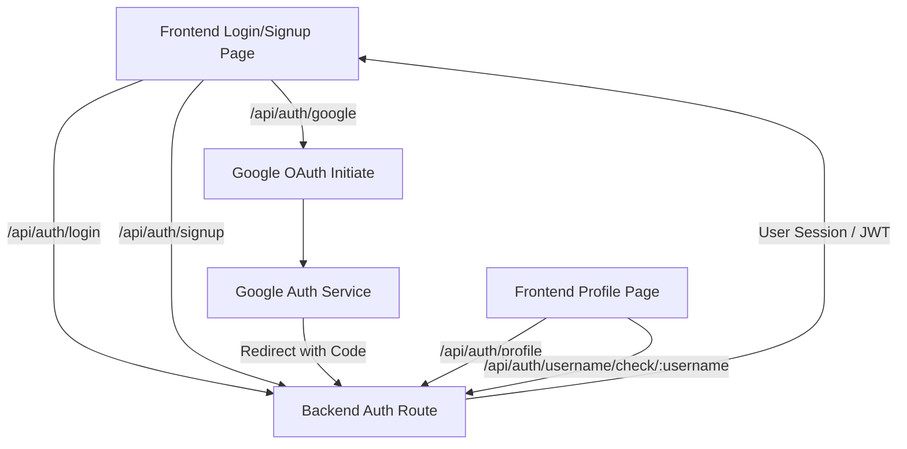

 # Pages and Navigation

This document outlines the primary user-facing pages within the application, detailing their purpose, key components, and how users navigate between them. The frontend, built with React, utilizes `react-router-dom` for client-side routing, ensuring a smooth Single Page Application (SPA) experience.

## Core Application Pages

The application is structured around several key pages, each serving a distinct function for user interaction and experience.

### Authentication Pages

The authentication flow is handled by `LoginPage` and `SignUpPage`, ensuring secure access to the application.

#### Login Page

The `LoginPage` (`frontend/src/pages/LoginPage.jsx`) allows existing users to authenticate and gain access to the application's features. It provides fields for email and password, as well as a "Sign in with Google" option for OAuth authentication.

**Key Features:**

*   **User Authentication:** Standard email/password login.
*   **Google OAuth:** Integration for seamless login via Google accounts.
*   **Password Visibility Toggle:** Users can show/hide their password for ease of input.
*   **Navigation to Sign Up:** A clear link is provided for new users to register.

**Login Form Snippet:**

```jsx
// frontend/src/pages/LoginPage.jsx
// ... (imports)

const LoginPage = () => {
  const [showPassword, setShowPassword] = useState(false);
  const [formData, setFormData] = useState({
    email: "",
    password: "",
  })
  const { login, isLoggingIn } = useAuthStore();

  const handleSubmit = async (e) => {
    e.preventDefault();
    login(formData);
  }
  const backendDomain = import.meta.env.VITE_BACKEND_URL;
  const googleAuthUrl = `${backendDomain}/api/auth/google`;
  return (
    <div className="h-screen grid lg:grid-cols-2">
      <div className="flex flex-col justify-center items-center p-6 sm:p-12">
        <div className="w-full max-w-md space-y-8">
          {/* ... (Logo and Welcome back text) */}
          <form onSubmit={handleSubmit} className="space-y-6">
            {/* Email and Password Input Fields */}
            {/* ... */}
            <button type="submit" className="btn btn-primary w-full" disabled={isLoggingIn}>
              {isLoggingIn ? (
                <>
                  <Loader2 className="h-5 w-5 animate-spin" />
                  Loading...
                </>
              ) : (
                "Sign in"
              )}
            </button>
          </form>
          <div className="divider text-base-content/60 my-4">OR</div>
          <a
            href={googleAuthUrl}
            className="btn btn-primary btn-outline w-full"
          >
            <FcGoogle className="size-5 mr-2" />
            Sign in with Google
          </a>
          <div className="text-center">
            <p className="text-base-content/60">
              Don&apos;t have an account?{" "}
              <Link to="/signup" className="link link-primary">
                Create account
              </Link>
            </p>
          </div>
        </div>
      </div>
      <AuthImagePattern
        title={"Welcome back!"}
        subtitle={"Sign in to continue your conversations and catch up with your messages."}
      />
    </div>
  )
}

export default LoginPage
```
[View on GitHub](https://github.com/shinymack/Chat-App-MERN/blob/main/frontend/src/pages/LoginPage.jsx#L14-L126)

#### Sign Up Page

The `SignUpPage` (`frontend/src/pages/SignUpPage.jsx`) allows new users to create an account. It requires a username, email, and password, and also offers Google OAuth for registration.

**Key Features:**

*   **New User Registration:** Collects necessary information for account creation.
*   **Form Validation:** Client-side validation for required fields, email format, and password strength.
*   **Google OAuth:** Alternative registration method.
*   **Navigation to Login:** A link is available for users who already have an account.

**Sign Up Form Snippet:**

```jsx
// frontend/src/pages/SignUpPage.jsx
// ... (imports)

const SignUpPage = () => {
  const [showPassword, setShowPassword] = useState(false);
  const [formData, setFormData] = useState({
    username: "",
    email: "",
    password: "",
  });

  const { signup, IsSigningUp } = useAuthStore();

  const validateForm = () => {
    if(!formData.username.trim()) return toast.error("Username is required");
    if(!formData.email.trim()) return toast.error("Email is required");
    if (!/\S+@\S+\.\S+/.test(formData.email)) return toast.error("Invalid email format");
    if (!formData.password) return toast.error("Password is required");
    if (formData.password.length < 6) return toast.error("Password must be at least 6 characters");
    return true;
  };

  const handleSubmit = (e) => {
    e.preventDefault();
    const success = validateForm();
    if(success===true) signup(formData);
  };
  
  const backendDomain = import.meta.env.VITE_BACKEND_URL;
  const googleAuthUrl = `${backendDomain}/api/auth/google`;
  return (
    <div className="min-h-screen grid lg:grid-cols-2">
      <div className="flex flex-col justify-center items-center p-6 sm:p-12">
        <div className="w-full max-w-md space-y-8">
          {/* ... (Logo and Create Account text) */}
          <form onSubmit={handleSubmit} className="space-y-6">
            {/* Username, Email, and Password Input Fields */}
            {/* ... */}
            <button type="submit" className="btn btn-primary w-full" disabled={IsSigningUp}>
              {IsSigningUp ? (
                <>
                  <Loader2 className="size-5 animate-spin" />
                  Loading...
                </>
              ) : (
                "Create Account"
              )}
            </button>
          </form>
          <div className="divider text-base-content/60 my-4">OR</div>
          <a
            href={googleAuthUrl}
            className="btn btn-primary btn-outline w-full" 
          >
            <FcGoogle className="size-5 mr-2" /> 
            Sign up with Google
          </a>
          <div className="text-center">
            <p className="text-base-content/60">
              Already have an account?{" "}
              <Link to="/login" className="link link-primary">
                Sign in
              </Link>
            </p>
          </div>
        </div>
      </div>
      <AuthImagePattern
        title="Join our community"
        subtitle="Connect with friends, share moments, and stay in touch with your loved ones."
      />
    </div>
  );
};
export default SignUpPage;
```
[View on GitHub](https://github.com/shinymack/Chat-App-MERN/blob/main/frontend/src/pages/SignUpPage.jsx#L14-L138)

### Home Page

The `HomePage` (`frontend/src/pages/HomePage.jsx`) is the central hub for authenticated users, displaying the main chat interface.

**Key Features:**

*   **Sidebar:** Displays a list of users for initiating conversations.
*   **Chat Container:** Shows the active chat messages for a selected user.
*   **"No Chat Selected" Placeholder:** A component displayed when no chat is active.
*   **Friends Box:** A component to manage friend relationships, conditionally rendered.

**Home Page Structure Snippet:**

```jsx
// frontend/src/pages/HomePage.jsx
// ... (imports)

const HomePage = () => {
  const { selectedUser } = useChatStore();
  const { isFriendsBoxOpen } = useChatStore();
  return (
      <div className="h-screen bg-base-200">
      <div className="flex items-center justify-center pt-20 px-4 w-full">
        <div className="bg-base-100 rounded-lg shadow-xl w-full max-w-6xl h-[calc(100vh-8rem)]">
          <div className="flex h-full rounded-lg overflow-hidden w-full">
            <Sidebar />
            {!selectedUser ? <NoChatSelected /> : <ChatContainer />}
            {isFriendsBoxOpen && <FriendsBox />}
          </div>
        </div>
      </div>
    </div>
  )
}

export default HomePage
```
[View on GitHub](https://github.com/shinymack/Chat-App-MERN/blob/main/frontend/src/pages/HomePage.jsx#L9-L27)

### Profile Page

The `ProfilePage` (`frontend/src/pages/ProfilePage.jsx`) allows authenticated users to view and update their profile information, such as their profile picture and username.

**Key Features:**

*   **Profile Picture Upload:** Users can change their avatar.
*   **Username Editing:** Allows users to update their display name, with real-time availability checks.
*   **Email Display:** Shows the user's registered email address.
*   **Account Information:** Displays metadata like "Member Since" and "Account Status".

**Profile Page Username Editing Snippet:**

```jsx
// frontend/src/pages/ProfilePage.jsx
// ... (imports)

const ProfilePage = () => {
  const { authUser, isUpdatingProfile, updateProfile } = useAuthStore();
  const [selectedImg, setSelectedImg] = useState(null);

  const [isEditingUsername, setIsEditingUsername] = useState(false);
  const [newUsername, setNewUsername] = useState(authUser?.username || "");
  const [usernameStatus, setUsernameStatus] = useState({
    checking: false,
    available: true,
    message: "",
  });
  const debounceTimeout = useRef(null);

  // ... (handleImageUpload, useEffect for debounced username check)

  const handleSaveUsername = async () => {
    if (!usernameStatus.available || newUsername === authUser.username) {
      toast.error("Cannot save. Username is either unavailable or unchanged.");
      return;
    }
    await updateProfile({ username: newUsername });
    setIsEditingUsername(false); // Exit edit mode on success
  };

  const handleCancelEdit = () => {
    setIsEditingUsername(false);
    setNewUsername(authUser.username); // Reset to original username
    setUsernameStatus({ checking: false, available: true, message: "" }); // Reset status
  };

  return (
    <div className="h-screen pt-20">
      <div className="max-w-2xl mx-auto p-4 py-8">
        <div className="bg-base-300 rounded-xl p-6 space-y-8">
          {/* ... (Profile header, profilePic section) */}
          <div className="space-y-6">
            <div className="space-y-1.5">
              <div className="text-sm text-zinc-400 flex items-center gap-2">
                <User className="w-4 h-4" />
                Username
              </div>

              {!isEditingUsername ? (
                <div className="flex items-center gap-2">
                  <p className="px-4 py-2.5 bg-base-200 rounded-lg border flex-grow">
                    {authUser?.username}
                  </p>
                  <button onClick={() => setIsEditingUsername(true)} className="btn btn-ghost btn-sm">
                    <Edit className="w-4 h-4" />
                  </button>
                </div>
              ) : (
                <div className="space-y-2">
                  <div className="flex items-center gap-2">
                    <input
                      type="text"
                      value={newUsername}
                      onChange={(e) => setNewUsername(e.target.value.toLowerCase())}
                      className="input input-bordered w-full"
                    />
                    <button onClick={handleSaveUsername} className="btn btn-success btn-sm" disabled={!usernameStatus.available || usernameStatus.checking || isUpdatingProfile}>
                      {isUpdatingProfile ? <Loader2 className="w-4 h-4 animate-spin" /> : <Save className="w-4 h-4" />}
                    </button>
                    <button onClick={handleCancelEdit} className="btn btn-error btn-sm">
                      <X className="w-4 h-4" />
                    </button>
                  </div>
                  <div className={`text-xs h-4 ${usernameStatus.available ? 'text-green-500' : 'text-error'}`}>
                    {usernameStatus.checking ? <Loader2 className="w-3 h-3 animate-spin inline-block mr-1" /> : null}
                    {usernameStatus.message}
                  </div>
                </div>
              )}
            </div>
            {/* ... (Email and Account Info section) */}
          </div>
        </div>
      </div>
    </div>
  );
};

export default ProfilePage;
```
[View on GitHub](https://github.com/shinymack/Chat-App-MERN/blob/main/frontend/src/pages/ProfilePage.jsx#L40-L162)

## Navigation Flow

The application's navigation is handled primarily by `react-router-dom`, defining routes that map to each page component. Authentication state plays a critical role in controlling access to certain routes.

### User Authentication Flow


```mermaid
sequenceDiagram
    participant U as "User"
    participant A as "Auth Pages (Login/Signup)"
    participant R as "Router"
    participant H as "Home Page"
    participant P as "Profile Page"
    participant AS as "Auth Store"
    participant B as "Backend API"

    U->>+A: Enters Credentials / Clicks Google Auth
    A->>+AS: Calls login/signup action
    AS->>+B: Sends Auth Request
    B ->>- AS: Auth Response (Token/User Data)
    alt Successful Authentication
        AS->>R: Updates Auth State
        R->>H: Redirects to Home Page
        H->>AS: Fetches Initial Data
        AS ->>- H: Displays Chat Interface
    else Failed Authentication
        AS ->>- A: Shows Error Message
    end
    H->>+U: Interact with Chat
    U->>+P: Clicks Profile Link
    P->>+AS: Fetches Auth User Data
    AS ->>- P: Displays Profile Information
    P->>+U: Edit Profile
    P->>+AS: Calls updateProfile action
    AS->>+B: Sends Update Request
    B ->>- AS: Update Response
    AS ->>- P: Updates UI
    P->>-U: Profile Updated
```


### Route Definitions (Conceptual)

The main routing logic typically resides in `src/App.jsx` or a dedicated `Routes.jsx` file. It often involves protected routes that require an authenticated user.

```jsx
// Conceptual routing in src/App.jsx
import { Routes, Route, Navigate } from "react-router-dom";
import HomePage from "./pages/HomePage";
import LoginPage from "./pages/LoginPage";
import SignUpPage from "./pages/SignUpPage";
import ProfilePage from "./pages/ProfilePage";
import { useAuthStore } from "./store/useAuthStore";

function App() {
  const { authUser } = useAuthStore();

  return (
    <Routes>
      <Route path="/" element={authUser ? <HomePage /> : <Navigate to="/login" />} />
      <Route path="/login" element={!authUser ? <LoginPage /> : <Navigate to="/" />} />
      <Route path="/signup" element={!authUser ? <SignUpPage /> : <Navigate to="/" />} />
      <Route path="/profile" element={authUser ? <ProfilePage /> : <Navigate to="/login" />} />
      {/* Other routes */}
    </Routes>
  );
}

export default App;
```
[View on GitHub](https://github.com/shinymack/Chat-App-MERN/blob/main/frontend/src/App.jsx) (Actual file might vary slightly based on project structure, but this is the logical flow)

## Key Integration Points

### `useAuthStore` for State Management

The `useAuthStore` (powered by Zustand) is central to managing the user's authentication state across the application. It stores the `authUser` object and provides actions like `login`, `signup`, `logout`, and `updateProfile`. This store is crucial for determining which pages a user can access and personalizing the user experience.

**Auth Store Integration Snippet:**

```jsx
// Example from LoginPage.jsx using useAuthStore
// ...
import { useAuthStore } from "../store/useAuthStore";

const LoginPage = () => {
  // ...
  const { login, isLoggingIn } = useAuthStore(); // Accessing state and actions
  // ...
  const handleSubmit = async (e) => {
    e.preventDefault();
    login(formData); // Calling the login action
  }
  // ...
}
```
[View on GitHub](https://github.com/shinymack/Chat-App-MERN/blob/main/frontend/src/pages/LoginPage.jsx#L10)

### `react-router-dom` for Routing

`react-router-dom` handles all client-side navigation. The `Routes` and `Route` components define the URL paths and their corresponding React components. The `Link` component facilitates declarative navigation between pages without full page reloads.

**Router Link Snippet (from LoginPage):**

```jsx
// frontend/src/pages/LoginPage.jsx
// ...
import { Link } from "react-router-dom";
// ...
          <div className="text-center">
            <p className="text-base-content/60">
              Don&apos;t have an account?{" "}
              <Link to="/signup" className="link link-primary">
                Create account
              </Link>
            </p>
          </div>
// ...
```
[View on GitHub](https://github.com/shinymack/Chat-App-MERN/blob/main/frontend/src/pages/LoginPage.jsx#L116-L123)

### Protected Routes Logic

The application implements protected routes to ensure that only authenticated users can access certain parts of the application (like `HomePage` and `ProfilePage`), and conversely, prevent authenticated users from seeing authentication pages (like `LoginPage` and `SignUpPage`). This is typically achieved using conditional rendering or wrapper components based on the `authUser` state from `useAuthStore`.

```jsx
// Conceptual Protected Route logic
// In App.jsx's <Routes>
// ...
      <Route path="/" element={authUser ? <HomePage /> : <Navigate to="/login" />} />
      <Route path="/login" element={!authUser ? <LoginPage /> : <Navigate to="/" />} />
// ...
```
This pattern ensures that if a user tries to access `/` without being authenticated, they are redirected to `/login`. If an authenticated user tries to go to `/login`, they are redirected to `/`.

### Backend Authentication Endpoints

The frontend pages interact with various backend API endpoints for user authentication and profile management.

**Authentication Endpoint Interaction:**


