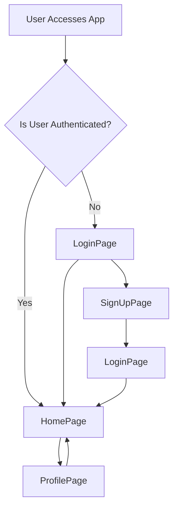

 # Pages and Navigation

The core of the application's user interface is built upon a set of distinct pages, each serving a specific purpose within the user journey. This document outlines the structure and functionality of these main pages, detailing their roles, key components, and navigation pathways.

## Application Page Flow

The application follows a typical authenticated flow, starting with sign-up or login, leading to the main chat interface, and providing a dedicated profile management section.





## Home Page (`frontend/src/pages/HomePage.jsx`)

The `HomePage` serves as the primary chat interface where users can view their conversations and interact with other users. It dynamically renders different components based on the user's current chat selection.

<p align="right">
  [View on GitHub](https://github.com/shinymack/Chat-App-MERN/blob/main/frontend/src/pages/HomePage.jsx)
</p>

### Key Features:

*   **Main Chat View**: Displays the `ChatContainer` when a user is selected, otherwise shows `NoChatSelected`.
*   **Sidebar Navigation**: Integrates the `Sidebar` component for user list and navigation.
*   **Friends Box**: Conditionally renders the `FriendsBox` for managing friend requests or adding new friends.
*   **Real-time Interaction**: Leverages the `useChatStore` Zustand store to manage the currently selected chat and friends box visibility.

### Component Structure

The `HomePage` orchestrates the main UI elements, conditionally rendering the chat area or a placeholder based on user interaction.

```jsx
// frontend/src/pages/HomePage.jsx
// ... other imports

const HomePage = () => {
  const { selectedUser } = useChatStore();
  const { isFriendsBoxOpen } = useChatStore();
  return (
      <div className="h-screen bg-base-200">
      <div className="flex items-center justify-center pt-20 px-4 w-full">
        <div className="bg-base-100 rounded-lg shadow-xl w-full max-w-6xl h-[calc(100vh-8rem)]">
          <div className="flex h-full rounded-lg overflow-hidden w-full">
            <Sidebar />
            {!selectedUser ? <NoChatSelected /> : <ChatContainer />}
            {isFriendsBoxOpen && <FriendsBox />}

          </div>

        </div>
      </div>
    </div>
  )
}
// ...
```

### State Management for Chat Selection

The `useChatStore` is central to managing the active chat and the visibility of the `FriendsBox`.

```jsx
// frontend/src/pages/HomePage.jsx
import { useChatStore } from "../store/useChatStore"

const HomePage = () => {
  const { selectedUser } = useChatStore(); // Get currently selected user for chat
  const { isFriendsBoxOpen } = useChatStore(); // Control FriendsBox visibility
  // ...
}
```

## Login Page (`frontend/src/pages/LoginPage.jsx`)

The `LoginPage` provides the interface for existing users to sign into their accounts using email/password or Google OAuth.

<p align="right">
  [View on GitHub](https://github.com/shinymack/Chat-App-MERN/blob/main/frontend/src/pages/LoginPage.jsx)
</p>

### Key Features:

*   **Email/Password Authentication**: Standard form for user credentials.
*   **Google OAuth Integration**: Allows users to sign in using their Google accounts.
*   **Password Visibility Toggle**: A utility to show/hide the password input.
*   **Loading State**: Provides visual feedback during the login process using `isLoggingIn` from `useAuthStore`.
*   **Navigation**: Link to the `SignUpPage` for new users.

### User Authentication Logic

The `handleSubmit` function orchestrates the login process by calling the `login` action from the `useAuthStore`.

```jsx
// frontend/src/pages/LoginPage.jsx
// ... other imports
import { useAuthStore } from "../store/useAuthStore";

const LoginPage = () => {
  // ... useState for form data and password visibility
  const { login, isLoggingIn } = useAuthStore(); // Get login action and loading state

  const handleSubmit = async (e) => {
    e.preventDefault();
    login(formData); // Call the login function from the store
  }
  // ...
}
```

### Google Authentication Redirect

The Google sign-in uses a direct link to the backend's Google authentication route.

```jsx
// frontend/src/pages/LoginPage.jsx
// ...
const backendDomain = import.meta.env.VITE_BACKEND_URL;
const googleAuthUrl = `${backendDomain}/api/auth/google`;
return (
  // ...
  <a
    href={googleAuthUrl} // Link to your backend Google auth route
    className="btn btn-primary btn-outline w-full"
  >
    <FcGoogle className="size-5 mr-2" />
    Sign in with Google
  </a>
  // ...
);
```

## Sign-Up Page (`frontend/src/pages/SignUpPage.jsx`)

The `SignUpPage` enables new users to create an account, similar to the login page, offering both traditional registration and Google OAuth.

<p align="right">
  [View on GitHub](https://github.com/shinymack/Chat-App-MERN/blob/main/frontend/src/pages/SignUpPage.jsx)
</p>

### Key Features:

*   **User Registration Form**: Collects username, email, and password.
*   **Form Validation**: Client-side validation for required fields, email format, and password length.
*   **Google OAuth**: Option to sign up using Google.
*   **Loading State**: Displays loading indicators during the sign-up process using `IsSigningUp` from `useAuthStore`.
*   **Navigation**: Link to the `LoginPage` for existing users.

### Form Validation and Submission

The `validateForm` function ensures that user inputs meet the minimum requirements before attempting to register.

```jsx
// frontend/src/pages/SignUpPage.jsx
// ... other imports
import { useAuthStore } from "../store/useAuthStore";
import toast from "react-hot-toast";

const SignUpPage = () => {
  // ... useState for form data and password visibility
  const { signup, IsSigningUp } = useAuthStore();

  const validateForm = () => {
    if(!formData.username.trim()) return toast.error("Username is required");
    if(!formData.email.trim()) return toast.error("Email is required");
    if (!/\S+@\S+\.\S+/.test(formData.email)) return toast.error("Invalid email format");
    if (!formData.password) return toast.error("Password is required");
    if (formData.password.length < 6) return toast.error("Password must be at least 6 characters");
    return true;
  };

  const handleSubmit = (e) => {
    e.preventDefault();
    const success = validateForm();
    if(success===true) signup(formData); // Call signup only if validation passes
  };
  // ...
}
```

## Profile Page (`frontend/src/pages/ProfilePage.jsx`)

The `ProfilePage` allows authenticated users to view and update their profile information, specifically their profile picture and username.

<p align="right">
  [View on GitHub](https://github.com/shinymack/Chat-App-MERN/blob/main/frontend/src/pages/ProfilePage.jsx)
</p>

### Key Features:

*   **Profile Picture Upload**: Users can change their profile picture with a live preview.
*   **Username Editing**: An inline editing mechanism for the username, including debounced availability checks.
*   **Account Details**: Displays static information like email, member since date, and account status.
*   **Loading States**: Visual feedback during profile updates and username checks.
*   **Toast Notifications**: Provides user feedback for actions like username availability and update status.

### Profile Picture Update

The `handleImageUpload` function reads the selected file and triggers the profile update action.

```jsx
// frontend/src/pages/ProfilePage.jsx
// ...
import { useAuthStore } from "../store/useAuthStore";

const ProfilePage = () => {
  const { authUser, isUpdatingProfile, updateProfile } = useAuthStore();
  const [ selectedImg, setSelectedImg ] = useState(null);

  const handleImageUpload = async (e) => {
    const file = e.target.files[0];
    if (!file) return;

    const reader = new FileReader();
    reader.readAsDataURL(file);

    reader.onload = async () => {
      const base64Image = reader.result;
      setSelectedImg(base64Image); // Update local state for immediate preview
      await updateProfile({ profilePic: base64Image }); // Send update to backend
    };
  };
  // ...
}
```

### Debounced Username Availability Check

To provide a smooth user experience, username availability is checked with a debounce mechanism, preventing excessive API calls.

```jsx
// frontend/src/pages/ProfilePage.jsx
// ...
import { axiosInstance } from "../lib/axios"; // Assuming configured axios instance

const ProfilePage = () => {
  // ... other states and handlers
  const [newUsername, setNewUsername] = useState(authUser?.username || "");
  const [usernameStatus, setUsernameStatus] = useState({ checking: false, available: true, message: "" });
  const debounceTimeout = useRef(null);

  useEffect(() => {
    clearTimeout(debounceTimeout.current); // Clear previous timeout

    if (!newUsername.trim() || newUsername.trim().length < 3) {
      setUsernameStatus({ checking: false, available: false, message: "Must be 3+ characters." });
      return;
    }
    if (newUsername === authUser.username) {
      setUsernameStatus({ checking: false, available: true, message: "" });
      return;
    }

    setUsernameStatus((prev) => ({ ...prev, checking: true, message: "Checking..." }));

    debounceTimeout.current = setTimeout(async () => {
      try {
        const res = await axiosInstance.get(`/auth/username/check/${newUsername}`);
        setUsernameStatus({
          checking: false,
          available: res.data.available,
          message: res.data.message,
        });
      } catch (error) {
        const message = error.response?.data?.message || "Error checking username.";
        setUsernameStatus({ checking: false, available: false, message });
      }
    }, 500); // 500ms debounce delay

    return () => clearTimeout(debounceTimeout.current); // Cleanup
  }, [newUsername, authUser.username]);
  // ...
}
```

## Key Integration Points

*   **React Router**: The primary navigation between pages (`/login`, `/signup`, `/`, `/profile`) is handled by `react-router-dom`.
*   **Zustand for Global State**: The `useAuthStore` and `useChatStore` are critical for managing authentication status, user data, and active chat states across pages.
*   **Authentication Middleware**: On the backend, routes are protected to ensure only authenticated users can access the `HomePage` and `ProfilePage`. Unauthenticated users are redirected to `LoginPage`.
*   **`AuthImagePattern` Component**: This reusable component provides consistent background imagery and promotional text for authentication-related pages, improving UI consistency.
*   **Axios Instance**: A configured `axiosInstance` (`axiosInstance.get("/auth/username/check/${newUsername}")`) is used for making API requests, ensuring consistent headers and error handling.