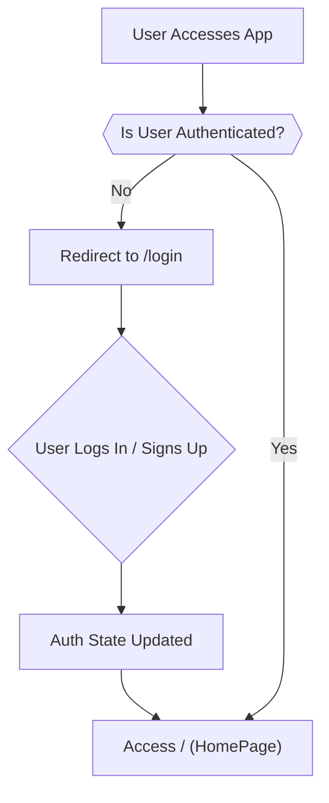
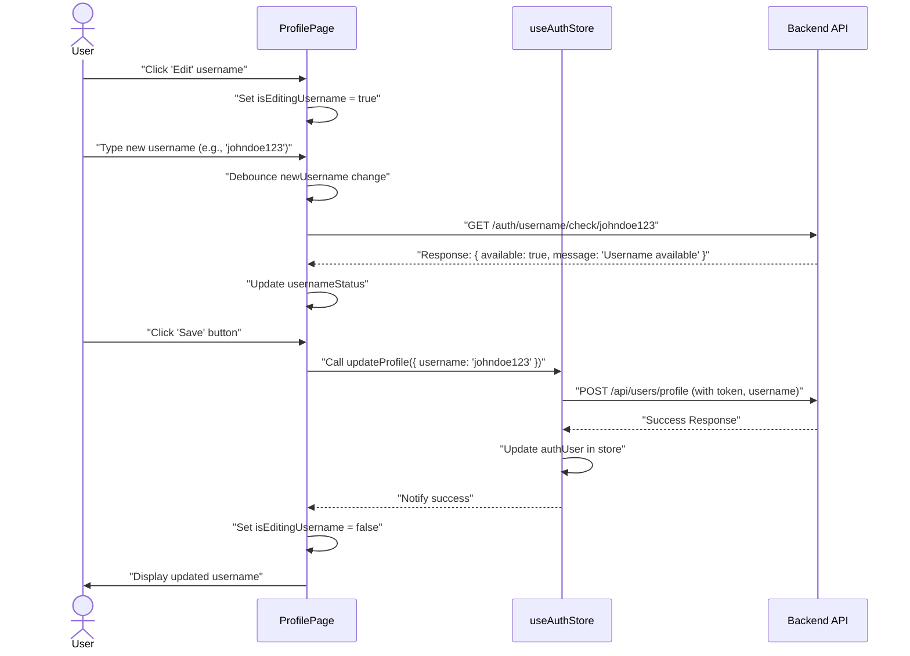

 # Pages and Navigation

This section provides an overview of the core pages within the frontend application, detailing their purpose, components, and how users navigate between them. The application utilizes `react-router-dom` for client-side routing, enabling a smooth single-page application experience.

## Application Pages

The frontend is structured around several key pages, each serving a distinct function in the user journey.

### 1. Home Page (`/`)

The `HomePage` is the primary interface for logged-in users, displaying chat conversations and contact lists. It orchestrates various components to provide a comprehensive messaging experience.

-   **Route**: `/`
-   **Purpose**: Main chat interface for authenticated users.
-   **Relevant File**: [`frontend/src/pages/HomePage.jsx`](https://github.com/shinymack/Chat-App-MERN/blob/main/frontend/src/pages/HomePage.jsx)

The `HomePage` conditionally renders the chat area based on whether a user has selected a chat. It integrates the `Sidebar` for navigation and user actions, `ChatContainer` for active conversations, `NoChatSelected` as a placeholder, and `FriendsBox` for managing contacts.

```jsx
// frontend/src/pages/HomePage.jsx
import ChatContainer from "../components/ChatContainer";
import FriendsBox from "../components/FriendsBox";
import NoChatSelected from "../components/NoChatSelected";
import Sidebar from "../components/Sidebar";
import { useChatStore } from "../store/useChatStore"

const HomePage = () => {
  const { selectedUser } = useChatStore();
  const { isFriendsBoxOpen } = useChatStore();
  return (
      <div className="h-screen bg-base-200">
      <div className="flex items-center justify-center pt-20 px-4 w-full">
        <div className="bg-base-100 rounded-lg shadow-xl w-full max-w-6xl h-[calc(100vh-8rem)]">
          <div className="flex h-full rounded-lg overflow-hidden w-full">
            <Sidebar />
            {/* Renders ChatContainer if a user is selected, otherwise NoChatSelected */}
            {!selectedUser ? <NoChatSelected /> : <ChatContainer />}
            {/* Conditionally renders FriendsBox */}
            {isFriendsBoxOpen && <FriendsBox />}

          </div>

        </div>
      </div>
    </div>
  )
}

export default HomePage
```
[View on GitHub](https://github.com/shinymack/Chat-App-MERN/blob/main/frontend/src/pages/HomePage.jsx#L10-L28)

### 2. Login Page (`/login`)

The `LoginPage` provides the interface for existing users to authenticate and gain access to the application. It supports both email/password login and Google OAuth.

-   **Route**: `/login`
-   **Purpose**: User authentication for existing accounts.
-   **Relevant File**: [`frontend/src/pages/LoginPage.jsx`](https://github.com/shinymack/Chat-App-MERN/blob/main/frontend/src/pages/LoginPage.jsx)

This page uses a form to collect user credentials and integrates with the `useAuthStore` for handling the login logic. It also provides a link to the `SignUpPage` for new users.

```jsx
// frontend/src/pages/LoginPage.jsx
// ... (imports)
import { Link } from "react-router-dom"; // Import for navigation

const LoginPage = () => {
  // ... (state and form handling)

  const handleSubmit = async (e) => {
    e.preventDefault();
    login(formData); // Calls the login function from useAuthStore
  }
  const backendDomain = import.meta.env.VITE_BACKEND_URL;
  const googleAuthUrl = `${backendDomain}/api/auth/google`; // Google OAuth endpoint

  return (
    <div className="h-screen grid lg:grid-cols-2">
      {/* ... (form content) */}
      <form onSubmit={handleSubmit} className="space-y-6">
        {/* ... (email and password inputs) */}
        <button type="submit" className="btn btn-primary w-full" disabled={isLoggingIn}>
          {isLoggingIn ? (
            <>
              <Loader2 className="h-5 w-5 animate-spin" />
              Loading...
            </>
          ) : (
            "Sign in"
          )}
        </button>
      </form>
      <div className="divider text-base-content/60 my-4">OR</div>
      <a
        href={googleAuthUrl} // Link to your backend Google auth route
        className="btn btn-primary btn-outline w-full"
      >
        <FcGoogle className="size-5 mr-2" />
        Sign in with Google
      </a>
      <div className="text-center">
        <p className="text-base-content/60">
          Don&apos;t have an account?{" "}
          <Link to="/signup" className="link link-primary"> {/* Navigation to SignUpPage */}
            Create account
          </Link>
        </p>
      </div>
      {/* ... (AuthImagePattern) */}
    </div>
  )
}

export default LoginPage
```
[View on GitHub](https://github.com/shinymack/Chat-App-MERN/blob/main/frontend/src/pages/LoginPage.jsx#L23-L121)

### 3. Sign Up Page (`/signup`)

The `SignUpPage` allows new users to create an account. Similar to the `LoginPage`, it supports both traditional registration and Google OAuth.

-   **Route**: `/signup`
-   **Purpose**: User registration for new accounts.
-   **Relevant File**: [`frontend/src/pages/SignUpPage.jsx`](https://github.com/shinymack/Chat-App-MERN/blob/main/frontend/src/pages/SignUpPage.jsx)

This page collects username, email, and password. It performs basic client-side validation before attempting to register the user via the `signup` function from `useAuthStore`.

```jsx
// frontend/src/pages/SignUpPage.jsx
// ... (imports)
import { Link } from "react-router-dom"; // Import for navigation

const SignUpPage = () => {
  // ... (state and form handling)

  const validateForm = () => { /* ... validation logic ... */ return true; };

  const handleSubmit = (e) => {
    e.preventDefault();
    const success = validateForm();
    if(success===true) signup(formData); // Calls the signup function from useAuthStore
  };
  
  const backendDomain = import.meta.env.VITE_BACKEND_URL;
  const googleAuthUrl = `${backendDomain}/api/auth/google`; // Google OAuth endpoint

  return (
    <div className="min-h-screen grid lg:grid-cols-2">
      {/* ... (form content) */}
      <form onSubmit={handleSubmit} className="space-y-6">
        {/* ... (username, email, password inputs) */}
        <button type="submit" className="btn btn-primary w-full" disabled={IsSigningUp}>
          {IsSigningUp ? (
            <>
              <Loader2 className="size-5 animate-spin" />
              Loading...
            </>
          ) : (
            "Create Account"
          )}
        </button>
      </form>
      <div className="divider text-base-content/60 my-4">OR</div>
      <a
        href={googleAuthUrl} // Link to your backend Google auth route
        className="btn btn-primary btn-outline w-full" 
      >
        <FcGoogle className="size-5 mr-2" /> 
        Sign up with Google
      </a>
      <div className="text-center">
        <p className="text-base-content/60">
          Already have an account?{" "}
          <Link to="/login" className="link link-primary"> {/* Navigation to LoginPage */}
            Sign in
          </Link>
        </p>
      </div>
      {/* ... (AuthImagePattern) */}
    </div>
  );
};
export default SignUpPage;
```
[View on GitHub](https://github.com/shinymack/Chat-App-MERN/blob/main/frontend/src/pages/SignUpPage.jsx#L17-L131)

### 4. Profile Page (`/profile`)

The `ProfilePage` allows authenticated users to view and update their profile information, such as their profile picture and username.

-   **Route**: `/profile`
-   **Purpose**: Display and allow editing of user profile details.
-   **Relevant File**: [`frontend/src/pages/ProfilePage.jsx`](https://github.com/shinymack/Chat-App-MERN/blob/main/frontend/src/pages/ProfilePage.jsx)

This page features an image upload mechanism for the profile picture and an editable username field with a debounced availability check. It interacts with the `useAuthStore` to manage profile updates.

```jsx
// frontend/src/pages/ProfilePage.jsx
// ... (imports)
import { useAuthStore } from "../store/useAuthStore";
import { axiosInstance } from "../lib/axios"; // For username check

const ProfilePage = () => {
  const { authUser, isUpdatingProfile, updateProfile } = useAuthStore();
  const [selectedImg, setSelectedImg] = useState(null);
  const [isEditingUsername, setIsEditingUsername] = useState(false);
  const [newUsername, setNewUsername] = useState(authUser?.username || "");
  // ... (username status and debounce logic)

  const handleImageUpload = async (e) => {
    // ... (file reading and updateProfile call)
  };

  const handleSaveUsername = async () => {
    // ... (validation and updateProfile call)
  };

  return (
    <div className="h-screen pt-20">
      <div className="max-w-2xl mx-auto p-4 py-8">
        <div className="bg-base-300 rounded-xl p-6 space-y-8">
          {/* ... (profile picture section) */}
          <div className="flex flex-col items-center gap-4">
            <div className="relative">
              
              <label htmlFor="avatar-upload" /* ... (styling) */>
                <Camera className="w-5 h-5 text-base-200" />
                <input
                  type="file"
                  id="avatar-upload"
                  className="hidden"
                  accept="image/*"
                  onChange={handleImageUpload}
                  disabled={isUpdatingProfile}
                />
              </label>
            </div>
          </div>

          {/* User Info section */}
          <div className="space-y-6">
            <div className="space-y-1.5">
              <div className="text-sm text-zinc-400 flex items-center gap-2">
                <User className="w-4 h-4" />
                Username
              </div>
              {!isEditingUsername ? (
                <div className="flex items-center gap-2">
                  <p className="px-4 py-2.5 bg-base-200 rounded-lg border flex-grow">
                    {authUser?.username}
                  </p>
                  <button onClick={() => setIsEditingUsername(true)} className="btn btn-ghost btn-sm">
                    <Edit className="w-4 h-4" />
                  </button>
                </div>
              ) : (
                <div className="space-y-2">
                  <div className="flex items-center gap-2">
                    <input
                      type="text"
                      value={newUsername}
                      onChange={(e) => setNewUsername(e.target.value.toLowerCase())}
                      className="input input-bordered w-full"
                    />
                    <button onClick={handleSaveUsername} className="btn btn-success btn-sm" disabled={!usernameStatus.available || usernameStatus.checking || isUpdatingProfile}>
                      {isUpdatingProfile ? <Loader2 className="w-4 h-4 animate-spin" /> : <Save className="w-4 h-4" />}
                    </button>
                    <button onClick={handleCancelEdit} className="btn btn-error btn-sm">
                      <X className="w-4 h-4" />
                    </button>
                  </div>
                  <div className={`text-xs h-4 ${usernameStatus.available ? 'text-green-500' : 'text-error'}`}>
                    {usernameStatus.checking ? <Loader2 className="w-3 h-3 animate-spin inline-block mr-1" /> : null}
                    {usernameStatus.message}
                  </div>
                </div>
              )}
            </div>
            {/* ... (email and account info sections) */}
          </div>
        </div>
      </div>
    </div>
  );
};

export default ProfilePage;
```
[View on GitHub](https://github.com/shinymack/Chat-App-MERN/blob/main/frontend/src/pages/ProfilePage.jsx#L42-L194)

## Navigation Flow

The application's navigation is handled primarily by `react-router-dom`. Authentication status plays a crucial role in determining which pages a user can access.

### Authentication Flow

The authentication flow manages user access to different parts of the application. Unauthenticated users are directed to login/signup pages, while authenticated users are directed to the main application.





### Profile Update Flow

The `ProfilePage` includes a flow for updating the user's username, which involves client-side validation and a debounced check against the backend.





## Key Integration Points

-   **`react-router-dom`**: This library is central to managing routes and navigation. Links such as `<Link to="/signup" />` or `<Link to="/login" />` facilitate seamless client-side transitions between authentication pages.
-   **Zustand (`useAuthStore`, `useChatStore`)**: State management is handled by Zustand. The `useAuthStore` is critical for managing authentication status (`authUser`), which in turn dictates navigation guards (e.g., redirecting unauthenticated users from the home page). `useChatStore` manages selected chats and UI states like `isFriendsBoxOpen`.
-   **Conditional Rendering**: Pages like `HomePage` extensively use conditional rendering (`!selectedUser ? <NoChatSelected /> : <ChatContainer />`) to adapt the UI based on user interactions and application state.
-   **Backend API Interaction**: All authentication (login, signup, Google OAuth) and profile updates (username, profile picture) involve interactions with the backend API. These calls are encapsulated within the Zustand stores (`login`, `signup`, `updateProfile`) to centralize logic and provide loading/error states.
-   **Google OAuth**: Both `LoginPage` and `SignUpPage` integrate Google OAuth by providing a link directly to the backend's Google authentication endpoint (`${backendDomain}/api/auth/google`), offloading the complex OAuth handshake to the server.
-   **Form Handling and Validation**: Pages like `LoginPage` and `SignUpPage` utilize `useState` for form input management and include client-side validation to provide immediate feedback to the user before submitting data to the server.
-   **Debouncing for Username Check**: The `ProfilePage` demonstrates a best practice for checking username availability. By using a debounced API call, it reduces the number of requests to the backend while still providing a responsive user experience.