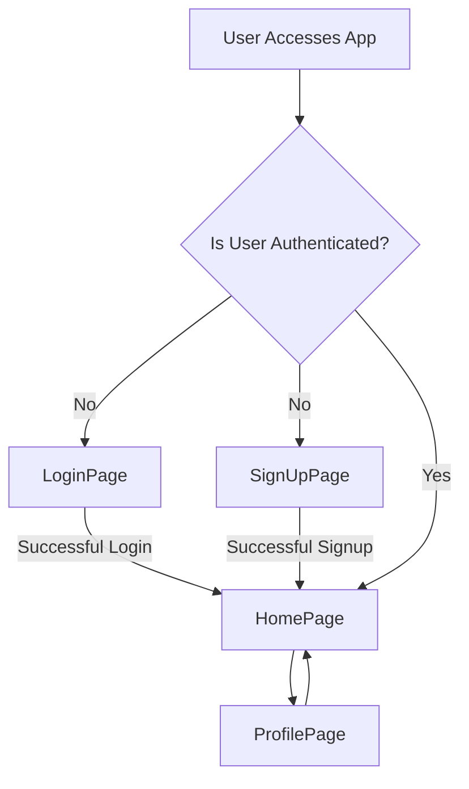

 # Pages and Navigation

The frontend of the application is structured around several key pages, each responsible for a distinct part of the user experience. These pages handle user authentication, primary chat interactions, and profile management. Navigation between these pages is managed using `react-router-dom`, ensuring a seamless and intuitive user journey.

## Core Application Pages

### Home Page (`HomePage.jsx`)

The `HomePage` serves as the central hub for authenticated users, displaying the main chat interface. It conditionally renders the chat window or a placeholder if no chat is selected. The page integrates various components to provide a complete messaging experience.

**Key Responsibilities:**
- Displays the primary chat interface.
- Renders `Sidebar` for user and chat list navigation.
- Conditionally renders `ChatContainer` (when a user is selected) or `NoChatSelected` (default view).
- Shows `FriendsBox` if the friends list is open.
- Manages global chat state using `useChatStore`.

**Code Snippet: HomePage Structure**

```jsx
// frontend/src/pages/HomePage.jsx
import ChatContainer from "../components/ChatContainer";
import FriendsBox from "../components/FriendsBox";
import NoChatSelected from "../components/NoChatSelected";
import Sidebar from "../components/Sidebar";
import { useChatStore } from "../store/useChatStore"

const HomePage = () => {
  const { selectedUser } = useChatStore();
  const { isFriendsBoxOpen } = useChatStore();
  return (
      <div className="h-screen bg-base-200">
      <div className="flex items-center justify-center pt-20 px-4 w-full">
        <div className="bg-base-100 rounded-lg shadow-xl w-full max-w-6xl h-[calc(100vh-8rem)]">
          <div className="flex h-full rounded-lg overflow-hidden w-full">
            <Sidebar />
            {!selectedUser ? <NoChatSelected /> : <ChatContainer />}
            {isFriendsBoxOpen && <FriendsBox />}
          </div>
        </div>
      </div>
    </div>
  )
}

export default HomePage
```
[View on GitHub](https://github.com/shinymack/Chat-App-MERN/blob/main/frontend/src/pages/HomePage.jsx)

### Authentication Pages

The application provides dedicated pages for user authentication, including login and sign-up. Both pages share a common `AuthImagePattern` component for visual consistency and provide options for email/password authentication and Google OAuth.

#### Login Page (`LoginPage.jsx`)

The `LoginPage` is where existing users authenticate to access the application. It handles user input for email and password, manages the login process, and provides a link to the sign-up page.

**Key Responsibilities:**
- Collects user email and password.
- Submits credentials for authentication via `useAuthStore`.
- Displays loading state during login.
- Offers Google OAuth integration.
- Provides navigation to the sign-up page.

**Code Snippet: Login Form Submission**

```jsx
// frontend/src/pages/LoginPage.jsx
// ... (imports and state initialization)
import { useAuthStore } from "../store/useAuthStore";
// ...

const LoginPage = () => {
  // ... (state and other logic)
  const { login, isLoggingIn } = useAuthStore();

  const handleSubmit = async (e) => {
    e.preventDefault();
    login(formData);
  }
  // ...
  return (
    // ...
            <button type="submit" className="btn btn-primary w-full" disabled={isLoggingIn}>
              {isLoggingIn ? (
                <>
                  <Loader2 className="h-5 w-5 animate-spin" />
                  Loading...
                </>
              ) : (
                "Sign in"
              )}
            </button>
    // ...
  )
}
// ...
```
[View on GitHub](https://github.com/shinymack/Chat-App-MERN/blob/main/frontend/src/pages/LoginPage.jsx#L23-L27)

**Code Snippet: Google OAuth Integration**

```jsx
// frontend/src/pages/LoginPage.jsx
// ... (imports)
const LoginPage = () => {
  // ... (state and other logic)
  const backendDomain = import.meta.env.VITE_BACKEND_URL;
  const googleAuthUrl = `${backendDomain}/api/auth/google`;
  return (
    // ...
          <a
            href={googleAuthUrl} // Link to your backend Google auth route
            className="btn btn-primary btn-outline w-full"
          >
            <FcGoogle className="size-5 mr-2" />
            Sign in with Google
          </a>
    // ...
  )
}
// ...
```
[View on GitHub](https://github.com/shinymack/Chat-App-MERN/blob/main/frontend/src/pages/LoginPage.jsx#L125-L131)

#### Sign Up Page (`SignUpPage.jsx`)

The `SignUpPage` allows new users to create an account. It collects username, email, and password, performs client-side validation, and initiates the registration process.

**Key Responsibilities:**
- Collects new user's username, email, and password.
- Performs client-side validation before submission.
- Registers new users via `useAuthStore`.
- Displays loading state during sign-up.
- Offers Google OAuth integration.
- Provides navigation to the login page.

**Code Snippet: Sign Up Form Validation**

```jsx
// frontend/src/pages/SignUpPage.jsx
// ... (imports and state initialization)

const SignUpPage = () => {
  // ... (state and other logic)
  const { signup, IsSigningUp } = useAuthStore();

  const validateForm = () => {
    if(!formData.username.trim()) return toast.error("Username is required");
    if(!formData.email.trim()) return toast.error("Email is required");
    if (!/\S+@\S+\.\S+/.test(formData.email)) return toast.error("Invalid email format");
    if (!formData.password) return toast.error("Password is required");
    if (formData.password.length < 6) return toast.error("Password must be at least 6 characters");

    return true;
  };

  const handleSubmit = (e) => {
    e.preventDefault();

    const success = validateForm();
    if(success===true) signup(formData);
  };
  // ...
}
// ...
```
[View on GitHub](https://github.com/shinymack/Chat-App-MERN/blob/main/frontend/src/pages/SignUpPage.jsx#L20-L36)

### Profile Page (`ProfilePage.jsx`)

The `ProfilePage` enables authenticated users to view and update their profile information, such as their profile picture and username.

**Key Responsibilities:**
- Displays current user profile details (username, email, member since).
- Allows updating the profile picture.
- Supports inline editing and debounced validation for the username.
- Manages profile update state via `useAuthStore`.

**Code Snippet: Profile Picture Upload Handler**

```jsx
// frontend/src/pages/ProfilePage.jsx
// ... (imports and state initialization)

const ProfilePage = () => {
  const { authUser, isUpdatingProfile, updateProfile } = useAuthStore();
  const [selectedImg, setSelectedImg] = useState(null);
  // ...

  const handleImageUpload = async (e) => {
    const file = e.target.files[0];
    if (!file) return;

    const reader = new FileReader();
    reader.readAsDataURL(file);

    reader.onload = async () => {
      const base64Image = reader.result;
      setSelectedImg(base64Image);
      await updateProfile({ profilePic: base64Image });
    };
  };
  // ...
}
// ...
```
[View on GitHub](https://github.com/shinymack/Chat-App-MERN/blob/main/frontend/src/pages/ProfilePage.jsx#L35-L48)

**Code Snippet: Debounced Username Availability Check**

```jsx
// frontend/src/pages/ProfilePage.jsx
// ... (imports and state initialization)
import { axiosInstance } from "../lib/axios"; // Assuming you have this configured instance

const ProfilePage = () => {
  // ... (other state and handlers)
	const [newUsername, setNewUsername] = useState(authUser?.username || "");
	const [usernameStatus, setUsernameStatus] = useState({
		checking: false,
		available: true,
		message: "",
	});
	const debounceTimeout = useRef(null);

	useEffect(() => {
		clearTimeout(debounceTimeout.current);

		if (!newUsername.trim() || newUsername.trim().length < 3) {
			setUsernameStatus({ checking: false, available: false, message: "Must be 3+ characters." });
			return;
		}

		if (newUsername === authUser.username) {
			setUsernameStatus({ checking: false, available: true, message: "" });
			return;
		}

		setUsernameStatus((prev) => ({ ...prev, checking: true, message: "Checking..." }));

		debounceTimeout.current = setTimeout(async () => {
			try {
				const res = await axiosInstance.get(`/auth/username/check/${newUsername}`);
				setUsernameStatus({
					checking: false,
					available: res.data.available,
					message: res.data.message,
				});
			} catch (error) {
				const message = error.response?.data?.message || "Error checking username.";
				setUsernameStatus({ checking: false, available: false, message });
			}
		}, 500); // 500ms debounce delay

		return () => clearTimeout(debounceTimeout.current);
	}, [newUsername, authUser.username]);
  // ...
}
// ...
```
[View on GitHub](https://github.com/shinymack/Chat-App-MERN/blob/main/frontend/src/pages/ProfilePage.jsx#L52-L99)

## Navigation Flow

The application's navigation primarily uses `react-router-dom` to manage routing. Unauthenticated users are directed to authentication pages, while authenticated users access the main application and profile pages.





## Key Integration Points

### State Management for Navigation

The `useAuthStore` (Zustand) plays a crucial role in managing authentication state (`authUser`, `isLoggingIn`, `isSigningUp`). This state determines which pages are accessible to the user and triggers programmatic navigation upon successful login or sign-up. Similarly, `useChatStore` manages `selectedUser` and `isFriendsBoxOpen` to control the dynamic rendering of `ChatContainer` or `FriendsBox` within the `HomePage`.

### Route Protection

The routing system, typically implemented using a wrapper component like a `ProtectedRoute` or directly within the router configuration, ensures that unauthenticated users cannot access protected routes like `/` (HomePage) or `/profile`. Conversely, authenticated users are redirected from `/login` and `/signup` to the `/` route.

### User Experience

Navigation is designed to be straightforward:
- **Authentication**: Users are clearly guided through login and sign-up flows, with options for both traditional and social authentication.
- **Main Application**: Once logged in, users are immediately presented with the chat interface, and the sidebar allows easy switching between conversations.
- **Profile Management**: The profile page provides a dedicated area for users to manage their personal information.

This page-based architecture, combined with robust state management and navigation, ensures a clear separation of concerns and a cohesive user experience across the application.