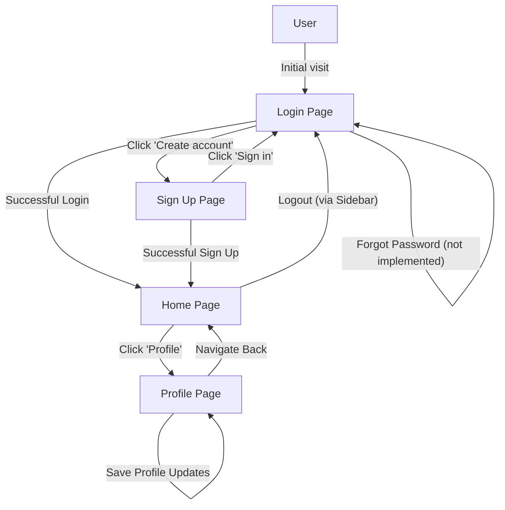
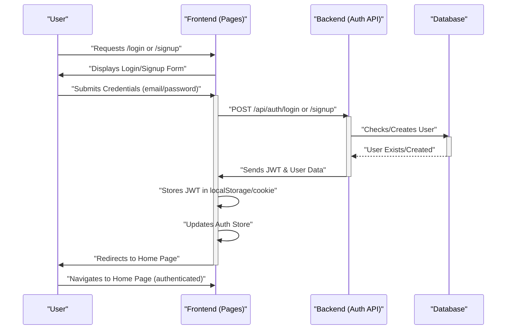

 # Pages and Navigation

This section details the primary user-facing pages within the frontend application, explaining their individual roles, the components they integrate, and how users transition between them to achieve core application functionalities. Understanding the page structure is crucial for comprehending the user experience and the overall application flow.

## Application Pages Overview

The application is structured around several key pages, each serving a distinct purpose in the user journey.

### Home Page

The `HomePage.jsx` serves as the central hub for authenticated users, displaying the main chat interface. It dynamically renders different views based on user interactions, primarily whether a chat is currently selected.

*   **File Location**: `frontend/src/pages/HomePage.jsx`
*   **Responsibilities**:
    *   Displays the main chat interface.
    *   Manages the layout of chat components (sidebar, chat container, friends box).
    *   Conditionally renders a `NoChatSelected` component or a `ChatContainer` based on the `selectedUser` state.
    *   Shows or hides the `FriendsBox` for managing contacts.
*   **Key Components**:
    *   `Sidebar`: For user navigation and friend lists.
    *   `ChatContainer`: Displays messages for the currently selected chat.
    *   `FriendsBox`: A modal or slide-out for managing friends.
    *   `NoChatSelected`: Placeholder content when no chat is active.
*   **Dependencies**: Uses `useChatStore` to manage chat-related state, such as `selectedUser` and `isFriendsBoxOpen`.

```jsx
// frontend/src/pages/HomePage.jsx
import ChatContainer from "../components/ChatContainer";
import FriendsBox from "../components/FriendsBox";
import NoChatSelected from "../components/NoChatSelected";
import Sidebar from "../components/Sidebar";
import { useChatStore } from "../store/useChatStore"

const HomePage = () => {
  const { selectedUser } = useChatStore();
  const { isFriendsBoxOpen } = useChatStore();
  return (
      <div className="h-screen bg-base-200">
      <div className="flex items-center justify-center pt-20 px-4 w-full">
        <div className="bg-base-100 rounded-lg shadow-xl w-full max-w-6xl h-[calc(100vh-8rem)]">
          <div className="flex h-full rounded-lg overflow-hidden w-full">
            <Sidebar />
            {!selectedUser ? <NoChatSelected /> : <ChatContainer />}
            {isFriendsBoxOpen && <FriendsBox />}

          </div>

        </div>
      </div>
    </div>
  )
}
export default HomePage
```
[View on GitHub](https://github.com/shinymack/Chat-App-MERN/blob/main/frontend/src/pages/HomePage.jsx)

### Login Page

The `LoginPage.jsx` handles user authentication by providing a form for existing users to sign in. It also offers alternative authentication methods like Google Sign-In and navigation to the sign-up page.

*   **File Location**: `frontend/src/pages/LoginPage.jsx`
*   **Responsibilities**:
    *   Provides email/password login functionality.
    *   Integrates Google OAuth for authentication.
    *   Navigates users to the sign-up page if they don't have an account.
    *   Manages loading states during login attempts.
*   **Key Features**:
    *   Toggle password visibility for better user experience.
    *   Validation and submission of login credentials.
    *   Direct link for Google authentication via the backend.
*   **Dependencies**: Utilizes `useAuthStore` for authentication logic (`login`, `isLoggingIn`).

```jsx
// frontend/src/pages/LoginPage.jsx
// Snippet for form submission and Google Auth link
const LoginPage = () => {
  // ... (state and other logic)
  const { login, isLoggingIn } = useAuthStore();

  const handleSubmit = async (e) => {
    e.preventDefault();
    login(formData);
  }
  const backendDomain = import.meta.env.VITE_BACKEND_URL;
  const googleAuthUrl = `${backendDomain}/api/auth/google`;
  return (
    <div className="h-screen grid lg:grid-cols-2">
      {/* ... (form structure) */}
          <form onSubmit={handleSubmit} className="space-y-6">
            {/* ... (input fields) */}
            <button type="submit" className="btn btn-primary w-full" disabled={isLoggingIn}>
              {isLoggingIn ? (
                <>
                  <Loader2 className="h-5 w-5 animate-spin" />
                  Loading...
                </>
              ) : (
                "Sign in"
              )}
            </button>
          </form>
          <div className="divider text-base-content/60 my-4">OR</div>

          <a
            href={googleAuthUrl} // Link to your backend Google auth route
            className="btn btn-primary btn-outline w-full"
          >
            <FcGoogle className="size-5 mr-2" />
            Sign in with Google
          </a>

          <div className="text-center">
            <p className="text-base-content/60">
              Don&apos;t have an account?{" "}
              <Link to="/signup" className="link link-primary">
                Create account
              </Link>
            </p>
          </div>
        </div>
      </div>
      {/* ... (AuthImagePattern) */}
    </div>
  )
}
export default LoginPage
```
[View on GitHub](https://github.com/shinymack/Chat-App-MERN/blob/main/frontend/src/pages/LoginPage.jsx)

### Sign Up Page

The `SignUpPage.jsx` allows new users to create an account by providing a username, email, and password. Similar to the login page, it supports Google Sign-Up and provides navigation back to the login page.

*   **File Location**: `frontend/src/pages/SignUpPage.jsx`
*   **Responsibilities**:
    *   Facilitates new user registration with username, email, and password.
    *   Includes client-side form validation.
    *   Offers Google OAuth for registration.
    *   Provides a link to the login page for existing users.
    *   Manages loading states during sign-up attempts.
*   **Key Features**:
    *   Form validation for required fields, email format, and password strength.
    *   Toggle password visibility.
    *   Google Sign-Up integration.
*   **Dependencies**: Leverages `useAuthStore` for sign-up logic (`signup`, `IsSigningUp`).

```jsx
// frontend/src/pages/SignUpPage.jsx
// Snippet for form validation and submission
const SignUpPage = () => {
  // ... (state and other logic)
  const { signup, IsSigningUp } = useAuthStore();

  const validateForm = () => {
    if(!formData.username.trim()) return toast.error("Username is required");
    if(!formData.email.trim()) return toast.error("Email is required");
    if (!/\S+@\S+\.\S+/.test(formData.email)) return toast.error("Invalid email format");
    if (!formData.password) return toast.error("Password is required");
    if (formData.password.length < 6) return toast.error("Password must be at least 6 characters");

    return true;
  };

  const handleSubmit = (e) => {
    e.preventDefault();

    const success = validateForm();
    if(success===true) signup(formData);
  };
  // ... (rest of the component)
}
export default SignUpPage;
```
[View on GitHub](https://github.com/shinymack/Chat-App-MERN/blob/main/frontend/src/pages/SignUpPage.jsx)

### Profile Page

The `ProfilePage.jsx` enables authenticated users to view and update their profile information, specifically their profile picture and username. It includes features for real-time username availability checking.

*   **File Location**: `frontend/src/pages/ProfilePage.jsx`
*   **Responsibilities**:
    *   Displays authenticated user's profile details (username, email, member since, account status).
    *   Allows users to upload and update their profile picture.
    *   Provides functionality to edit and save the username.
    *   Includes a debounced check for username availability during editing.
*   **Key Features**:
    *   Image upload with preview.
    *   Inline editing for username.
    *   Real-time feedback on username availability using a debounce mechanism.
    *   Loading indicators for profile updates.
*   **Dependencies**: Uses `useAuthStore` for user data and update actions (`authUser`, `isUpdatingProfile`, `updateProfile`). Interacts with `axiosInstance` for username checks.

```jsx
// frontend/src/pages/ProfilePage.jsx
// Snippet for profile picture upload
const ProfilePage = () => {
  const { authUser, isUpdatingProfile, updateProfile } = useAuthStore();
  const [ selectedImg, setSelectedImg ] = useState(null);

  const handleImageUpload = async (e) => {
    const file = e.target.files[0];
    if(!file) return;

    const reader = new FileReader();
    reader.readAsDataURL(file);

    reader.onload = async () => {
      const base64Image = reader.result;
      setSelectedImg(base64Image);
      await updateProfile({profilePic: base64Image});
    }
  }
  // ... (rest of the component)
}
export default ProfilePage;
```
[View on GitHub](https://github.com/shinymack/Chat-App-MERN/blob/main/frontend/src/pages/ProfilePage.jsx)

```jsx
// frontend/src/pages/ProfilePage.jsx
// Snippet for debounced username checking
useEffect(() => {
    clearTimeout(debounceTimeout.current);

    if (!newUsername.trim() || newUsername.trim().length < 3) {
        setUsernameStatus({ checking: false, available: false, message: "Must be 3+ characters." });
        return;
    }

    if (newUsername === authUser.username) {
        setUsernameStatus({ checking: false, available: true, message: "" });
        return;
    }

    setUsernameStatus((prev) => ({ ...prev, checking: true, message: "Checking..." }));

    debounceTimeout.current = setTimeout(async () => {
        try {
            const res = await axiosInstance.get(`/auth/username/check/${newUsername}`);
            setUsernameStatus({
                checking: false,
                available: res.data.available,
                message: res.data.message,
            });
        } catch (error) {
            const message = error.response?.data?.message || "Error checking username.";
            setUsernameStatus({ checking: false, available: false, message });
        }
    }, 500);

    return () => clearTimeout(debounceTimeout.current);
}, [newUsername, authUser.username]);
```
[View on GitHub](https://github.com/shinymack/Chat-App-MERN/blob/main/frontend/src/pages/ProfilePage.jsx)


## User Navigation Flow

The application's navigation is designed to guide users through authentication and into the main chat interface, with access to their profile.





**Description**:
*   New or unauthenticated users land on the **Login Page**.
*   From the **Login Page**, they can either sign in or navigate to the **Sign Up Page**.
*   Upon successful login or sign-up, users are redirected to the **Home Page**.
*   The **Home Page** is the primary interface for chatting.
*   From the **Home Page**, users can access their **Profile Page** to view or update details.
*   Logging out from the **Home Page** returns the user to the **Login Page**.

## Authentication Process

Authentication is a critical flow involving both frontend and backend components to secure user access and ensure data integrity.





**Description**:
1.  **User Request**: The user navigates to `/login` or `/signup`.
2.  **Form Display**: The frontend displays the respective authentication form.
3.  **Credential Submission**: The user enters their credentials and submits the form.
4.  **API Call**: The frontend makes a `POST` request to the backend's authentication API (`/api/auth/login` or `/api/auth/signup`).
5.  **Backend Processing**: The backend verifies credentials or creates a new user, interacting with the database.
6.  **Token Issuance**: Upon success, the backend sends a JSON Web Token (JWT) and user data back to the frontend.
7.  **Frontend Storage**: The frontend stores the JWT (e.g., in local storage or an HTTP-only cookie) and updates its authentication state.
8.  **Redirection**: The user is redirected to the `Home Page`.
9.  **Authenticated Access**: The user can now access protected routes and features using the stored authentication token.

## Key Integration Points

*   **Centralized State Management**: The `useAuthStore` and `useChatStore` Zustand stores are central to managing global application state, including user authentication status, selected chat, and profile information. This allows pages to easily access and update shared data.
*   **Routing**: React Router is used to manage navigation between pages, ensuring a smooth single-page application experience. Protected routes are implemented to restrict access to authenticated users.
*   **API Interaction**: All authentication and profile update operations involve direct interaction with the backend API. Pages like `LoginPage`, `SignUpPage`, and `ProfilePage` are responsible for making these requests and handling responses (e.g., displaying toasts for errors or success).
*   **Component Reusability**: Common elements like `AuthImagePattern` are extracted into reusable components, promoting consistency across pages and reducing code duplication.
*   **User Experience Feedback**: Pages provide immediate feedback to users through loading indicators (e.g., `Loader2` icon) and toast notifications (using `react-hot-toast`) during asynchronous operations like login, sign-up, or profile updates.