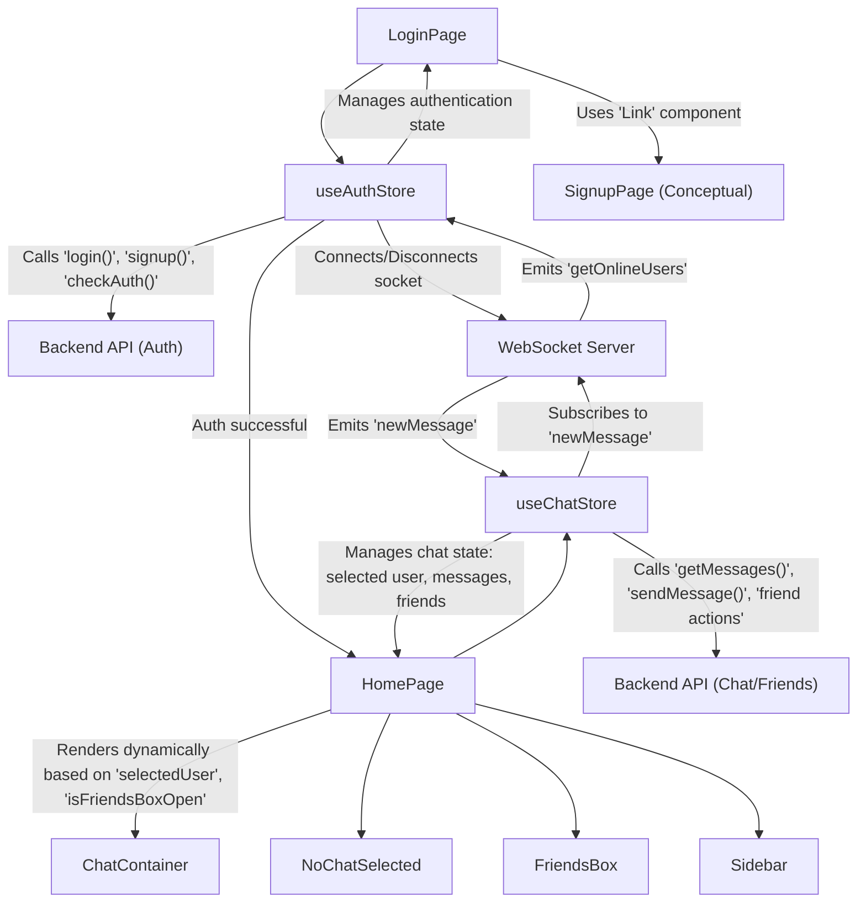
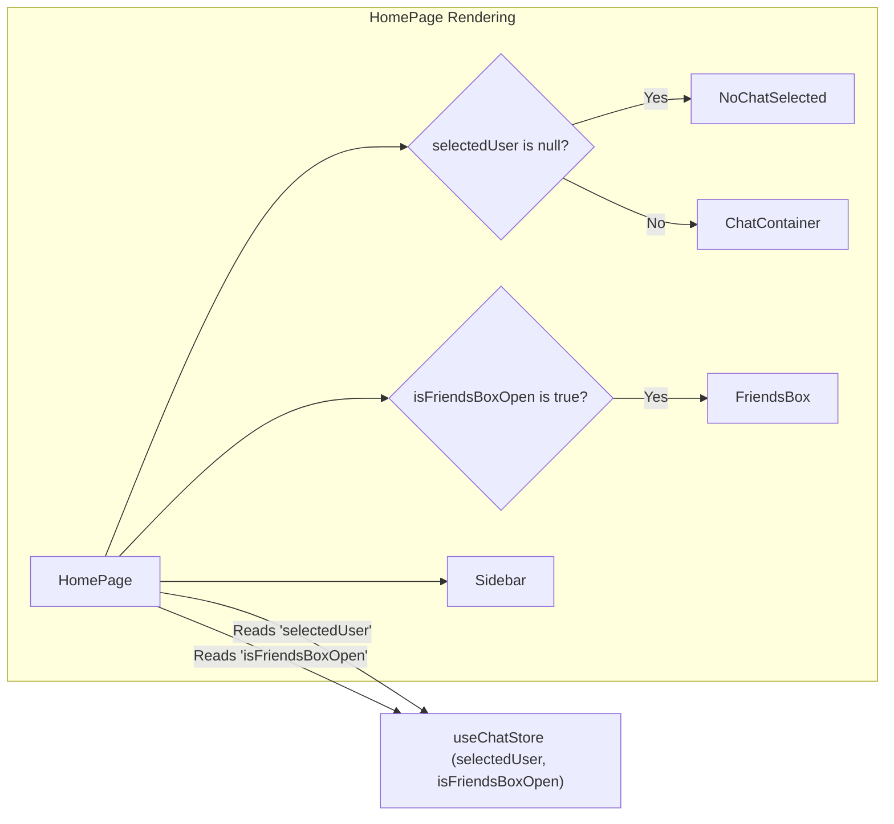

 # Pages, Routing, and State Management

This document outlines how the application manages different user interface views, handles navigation between them, and implements global state management using Zustand for authentication and chat functionalities. The primary pages are the `HomePage` (for authenticated users) and `LoginPage` (for authentication).

## Application Views and Routing

The application defines distinct views for user authentication and the main chat interface. Routing is handled implicitly through React Router, though explicit routes are not fully detailed in the provided snippets.

### Login Page (`LoginPage.jsx`)

The `LoginPage` component is responsible for user authentication. It provides a form for email and password login, as well as a "Sign in with Google" option. It integrates with the `useAuthStore` for managing login state and calling the authentication API.

```jsx
import { useState } from "react"
import { useAuthStore } from "../store/useAuthStore";
import { Eye, EyeOff, Loader2, Lock, Mail, MessageSquare } from "lucide-react";
import { Link } from "react-router-dom"; // Used for navigation to signup
import AuthImagePattern from "../components/AuthImagePattern";
import { FcGoogle } from "react-icons/fc";

const LoginPage = () => {
  const [showPassword, setShowPassword] = useState(false);
  const [formData, setFormData] = useState({
    email: "",
    password: "",
  })
  const { login, isLoggingIn } = useAuthStore(); // Uses useAuthStore for login logic

  const handleSubmit = async (e) => {
    e.preventDefault();
    login(formData); // Triggers the login action in the auth store
  }
  const backendDomain = import.meta.env.VITE_BACKEND_URL;
  const googleAuthUrl = `${backendDomain}/api/auth/google`;
  return (
    // ... JSX for login form ...
  )
}

export default LoginPage
```
**View on GitHub**: [frontend/src/pages/LoginPage.jsx](https://github.com/shinymack/Chat-App-MERN/blob/main/frontend/src/pages/LoginPage.jsx)

The `LoginPage` utilizes the `Link` component from `react-router-dom` to provide navigation to a hypothetical `/signup` route, suggesting a broader authentication flow.

### Home Page (`HomePage.jsx`)

The `HomePage` serves as the main interface for authenticated users, displaying the chat application. It dynamically renders different components based on the chat state managed by `useChatStore`.

```jsx
import ChatContainer from "../components/ChatContainer";
import FriendsBox from "../components/FriendsBox";
import NoChatSelected from "../components/NoChatSelected";
import Sidebar from "../components/Sidebar";
import { useChatStore } from "../store/useChatStore" // Imports chat store for state

const HomePage = () => {
  const { selectedUser } = useChatStore(); // Determines if a chat is active
  const { isFriendsBoxOpen } = useChatStore(); // Determines if friends box is open
  return (
      <div className="h-screen bg-base-200">
      <div className="flex items-center justify-center pt-20 px-4 w-full">
        <div className="bg-base-100 rounded-lg shadow-xl w-full max-w-6xl h-[calc(100vh-8rem)]">
          <div className="flex h-full rounded-lg overflow-hidden w-full">
            <Sidebar />
            {!selectedUser ? <NoChatSelected /> : <ChatContainer />} {/* Conditional rendering */}
            {isFriendsBoxOpen && <FriendsBox />} {/* Conditional rendering */}
          </div>
        </div>
      </div>
    </div>
  )
}

export default HomePage
```
**View on GitHub**: [frontend/src/pages/HomePage.jsx](https://github.com/shinymack/Chat-App-MERN/blob/main/frontend/src/pages/HomePage.jsx)

The conditional rendering logic for `NoChatSelected` / `ChatContainer` and `FriendsBox` ensures that the UI adapts to the user's current interaction state, driven by the `useChatStore`.

## State Management with Zustand

The application employs Zustand for efficient and flexible global state management. Two primary stores are defined: `useAuthStore` for authentication-related state and `useChatStore` for chat-specific data and actions.

### Authentication Store (`useAuthStore.js`)

The `useAuthStore` manages user authentication status, including login, signup, logout, and profile updates. It also handles WebSocket connections for real-time features.

#### Key States and Actions:

*   `authUser`: Stores the currently authenticated user's data.
*   `isSigningUp`, `isLoggingIn`, `isUpdatingProfile`, `isCheckingAuth`: Boolean flags indicating the status of various authentication operations.
*   `onlineUsers`: An array of user IDs currently online, received via WebSocket.
*   `socket`: The WebSocket connection instance.
*   `checkAuth()`: Verifies authentication status on application load.
*   `signup(data)`, `login(data)`: Handles user registration and login, respectively.
*   `logout()`: Clears authentication data and disconnects the WebSocket.
*   `updateProfile(data)`: Updates the authenticated user's profile.
*   `connectSocket()`, `disconnectSocket()`: Manages the lifecycle of the WebSocket connection.

```javascript
import { create } from "zustand";
import { axiosInstance } from "../lib/axios";
import toast from "react-hot-toast";
import { io } from "socket.io-client";

const BASE_URL = import.meta.env.MODE == "development" ? "http://localhost:5001": "/";

export const useAuthStore = create((set, get) => ({
    authUser: null,
    isSigningUp: false,
    isLoggingIn: false,
    isUpdatingProfile: false,
    isCheckingAuth: true,
    onlineUsers: [],
    socket: null, // Socket instance managed here

    checkAuth: async () => {
        // ... authentication check logic ...
        get().connectSocket(); // Connects socket upon successful authentication
    },

    login: async (data) => {
        set({ isLoggingIn: true });
        try {
            const res = await axiosInstance.post("/auth/login", data);
            set({ authUser: res.data });
            get().connectSocket(); // Connects socket upon login
            toast.success("Logged in successfully");
        } catch (error) {
            toast.error(error.response.data.message);
        } finally {
            set({ isLoggingIn: false });
        }
    },

    logout: async () => {
        // ... logout logic ...
        get().disconnectSocket(); // Disconnects socket upon logout
    },

    connectSocket: () => {
        const { authUser } = get();
        if(!authUser || get().socket?.connected) return;

        const socket = io(BASE_URL, {
            query: {
                userId : authUser._id, // Sends user ID for socket identification
            },
        });
        socket.connect();
        set({socket: socket});

        socket.on("getOnlineUsers", (userIds) => {
            set({onlineUsers: userIds}) // Updates online users state
        });
    },

    disconnectSocket : () => {
        if(get().socket?.connected) get().socket.disconnect();
    }
}));
```
**View on GitHub**: [frontend/src/store/useAuthStore.js](https://github.com/shinymack/Chat-App-MERN/blob/main/frontend/src/store/useAuthStore.js)

The `useAuthStore` is crucial for maintaining the user's session and integrating real-time features by managing the WebSocket connection.

### Chat Store (`useChatStore.js`)

The `useChatStore` handles all chat-related data, including messages, users, friend requests, and selected chat state.

#### Key States and Actions:

*   `messages`: Array of messages for the currently selected chat.
*   `users`: List of friends.
*   `pendingRequests`, `sentRequests`: Lists of friend requests.
*   `selectedUser`: The user currently being chatted with.
*   `isUsersLoading`, `isMessagesLoading`: Loading indicators for data fetching.
*   `isFriendsBoxOpen`: Boolean for the visibility of the friends management box.
*   `toggleFriendsBox()`: Toggles the `isFriendsBoxOpen` state.
*   `getFriends()`, `getPendingRequests()`, `getSentRequests()`: Fetches various friend-related lists.
*   `sendFriendRequest(identifier)`, `acceptFriendRequest(senderId)`, `rejectFriendRequest(senderId)`, `removeFriend(friendId)`: Actions for managing friend relationships.
*   `getMessages(userId)`, `sendMessage(messageData)`: Fetches and sends chat messages.
*   `subscribeToMessages()`, `unsubscribeFromMessages()`: Manages listening for new messages via WebSocket.
*   `setSelectedUser(selectedUser)`: Sets the active chat user.

```javascript
import toast from "react-hot-toast";
import { create } from "zustand";
import { axiosInstance } from "../lib/axios";
import { useAuthStore } from "./useAuthStore"; // Imports auth store for socket access

export const useChatStore = create((set, get) => ({
    messages:[],
    users: [],
    // ... other states ...
    selectedUser: null,
    // ... other loading states ...
    isFriendsBoxOpen: false,

    toggleFriendsBox: () => set(state => ({ isFriendsBoxOpen: !state.isFriendsBoxOpen })),

    getFriends: async () => { /* ... fetch friends ... */ },
    // ... other friend request actions ...

    getMessages: async (userId) => { /* ... fetch messages ... */ },
    sendMessage: async (messageData) => { /* ... send message ... */ },

    subscribeToMessages: () => {
        const { selectedUser } = get();
        if(!selectedUser) return;

        const socket = useAuthStore.getState().socket; // Accesses socket from auth store
        socket.on("newMessage", (newMessage) => {
            if(newMessage.senderId !== selectedUser._id) return
            set({
                messages: [...get().messages, newMessage] // Appends new message to state
            })
        })
    },

    unsubscribeFromMessages: () => {
        const socket = useAuthStore.getState().socket;
        socket.off("newMessage");
    },

    setSelectedUser: (selectedUser) => set({selectedUser})
}))
```
**View on GitHub**: [frontend/src/store/useChatStore.js](https://github.com/shinymack/Chat-App-MERN/blob/main/frontend/src/store/useChatStore.js)

The `useChatStore` demonstrates cross-store communication by accessing the `socket` instance from `useAuthStore` to subscribe to real-time message updates.

## Component Interaction and State Flow

The following diagram illustrates how the main components interact with the Zustand stores for state management and how the pages are connected.





## State-Driven UI Rendering Flow

The `HomePage` dynamically renders sub-components based on global state managed by `useChatStore`.





## Key Integration Points

1.  **Centralized Authentication**: The `useAuthStore` acts as the single source of truth for user authentication status, making it easy for any component to access the `authUser` or check `isLoggingIn` status.
2.  **WebSocket Integration**: The WebSocket connection is established and managed within `useAuthStore` upon successful authentication and disconnected upon logout. This ensures that the socket is only active when a user is logged in.
3.  **Cross-Store Communication**: `useChatStore` intelligently accesses the `socket` instance from `useAuthStore` using `useAuthStore.getState().socket` to subscribe to real-time chat events (`newMessage`), demonstrating effective communication between independent Zustand stores without direct dependencies.
4.  **Dynamic UI with State**: The `HomePage` exemplifies how component rendering can be completely driven by global state (`selectedUser`, `isFriendsBoxOpen` from `useChatStore`), leading to a responsive and interactive user interface without complex prop drilling.
5.  **Robust Error Handling**: Both stores incorporate `react-hot-toast` for user feedback on API errors, providing a consistent and helpful experience across authentication and chat operations.