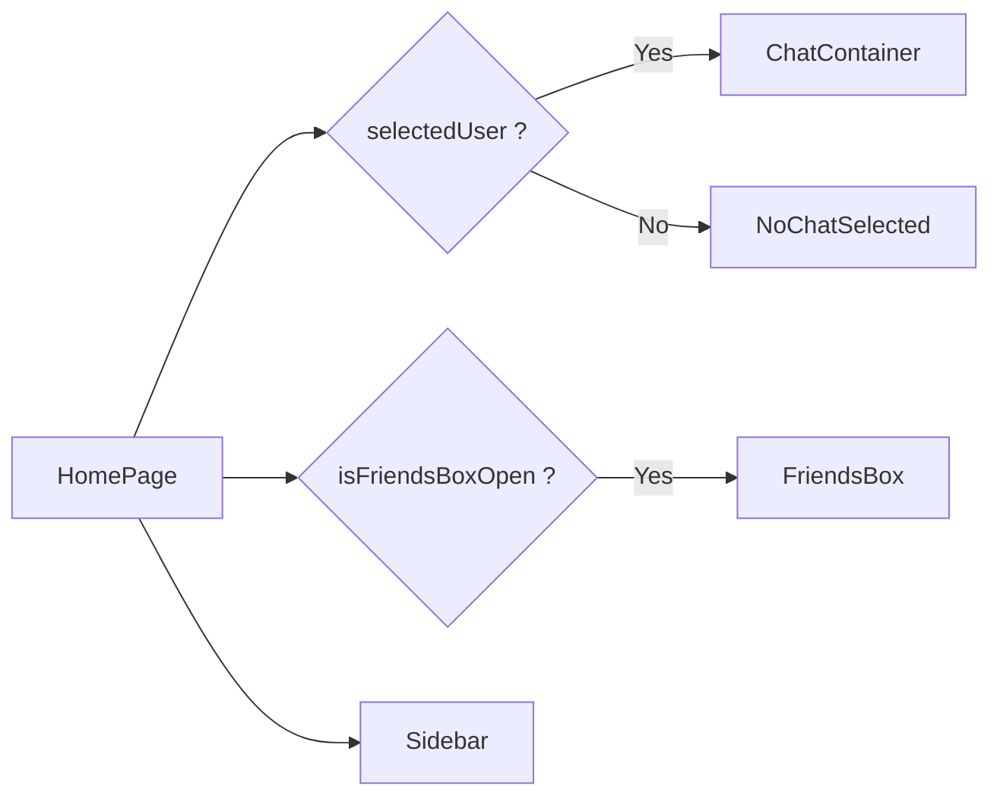
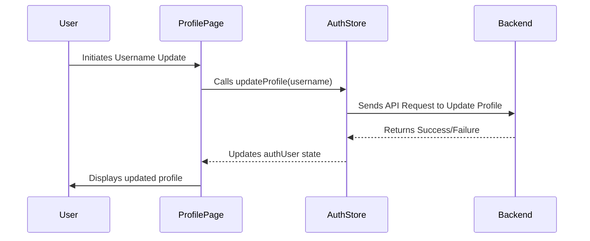

# Pages

This section provides an overview of the main pages within the frontend application of the chat app, built with the MERN stack. We'll cover the `HomePage`, `LoginPage`, and `ProfilePage`, highlighting their functionality and key components.

## HomePage

The `HomePage` is the central hub of the application, displaying the chat interface, friend list, and sidebar. It orchestrates the interaction between various components to provide a seamless user experience.

```javascript title="frontend/src/pages/HomePage.jsx"
import ChatContainer from "../components/ChatContainer";
import FriendsBox from "../components/FriendsBox";
import NoChatSelected from "../components/NoChatSelected";
import Sidebar from "../components/Sidebar";
import { useChatStore } from "../store/useChatStore"

const HomePage = () => {
  const { selectedUser } = useChatStore();
  const { isFriendsBoxOpen } = useChatStore();
  return (
      <div className="h-screen bg-base-200">
      <div className="flex items-center justify-center pt-20 px-4 w-full">
        <div className="bg-base-100 rounded-lg shadow-xl w-full max-w-6xl h-[calc(100vh-8rem)]">
          <div className="flex h-full rounded-lg overflow-hidden w-full">
            <Sidebar />
            {!selectedUser ? <NoChatSelected /> : <ChatContainer />}
            {isFriendsBoxOpen && <FriendsBox />}

          </div>

        </div>
      </div>
    </div>
  )
}

export default HomePage
```

[View on GitHub](https://github.com/shinymack/Chat-App-MERN/blob/main/frontend/src/pages/HomePage.jsx)

The `HomePage` component imports and utilizes several other components:

-   `Sidebar`: Provides navigation and user options.
-   `ChatContainer`: Displays the chat interface when a user is selected.
-   `FriendsBox`: Shows the list of friends (toggled based on state).
-   `NoChatSelected`: A placeholder displayed when no user is selected for chat.
-   `useChatStore`: Zustand store managing the currently selected user and friends box state.

```javascript title="frontend/src/pages/HomePage.jsx - useChatStore Usage"
const HomePage = () => {
  const { selectedUser } = useChatStore();
  const { isFriendsBoxOpen } = useChatStore();
  // ...
}
```

[View on GitHub](https://github.com/shinymack/Chat-App-MERN/blob/main/frontend/src/pages/HomePage.jsx)

This snippet illustrates how the `useChatStore` hook is used to access the `selectedUser` and `isFriendsBoxOpen` states, which determine the content displayed on the page.  The `ChatContainer` is rendered conditionally based on whether a user is selected.





## LoginPage

The `LoginPage` component handles user authentication, allowing users to log in with their email and password or via Google authentication.

```javascript title="frontend/src/pages/LoginPage.jsx"
import { useState } from "react"
import { useAuthStore } from "../store/useAuthStore";
import { Eye, EyeOff, Loader2, Lock, Mail, MessageSquare } from "lucide-react";
import { Link } from "react-router-dom";
import AuthImagePattern from "../components/AuthImagePattern";
import { FcGoogle } from "react-icons/fc";

const LoginPage = () => {
  const [showPassword, setShowPassword] = useState(false);
  const [formData, setFormData] = useState({
    email: "",
    password: "",
  })
  const { login, isLoggingIn } = useAuthStore();

  const handleSubmit = async (e) => {
    e.preventDefault();
    login(formData);
  }
  const backendDomain = import.meta.env.VITE_BACKEND_URL;
  const googleAuthUrl = `${backendDomain}/api/auth/google`;
  return (
    <div className="h-screen grid lg:grid-cols-2">
      {/* Left Side - Form */}
      <div className="flex flex-col justify-center items-center p-6 sm:p-12">
        <div className="w-full max-w-md space-y-8">
          {/* Logo */}
          <div className="text-center mb-8">
            <div className="flex flex-col items-center gap-2 group">
              <div
                className="w-12 h-12 rounded-xl bg-primary/10 flex items-center justify-center group-hover:bg-primary/20
              transition-colors"
              >
                <MessageSquare className="w-6 h-6 text-primary" />
              </div>
              <h1 className="text-2xl font-bold mt-2">Welcome Back</h1>
              <p className="text-base-content/60">Sign in to your account</p>
            </div>
          </div>

          {/* Form */}
          <form onSubmit={handleSubmit} className="space-y-6">
            <div className="form-control">
              <label className="label">
                <span className="label-text font-medium">Email</span>
              </label>
              <div className="relative">
                <div className="absolute inset-y-0 left-0 pl-3 flex items-center pointer-events-none">
                  <Mail className="h-5 w-5 text opacity-40" />
                </div>
                <input
                  type="email"
                  className={`input input-bordered w-full pl-10`}
                  placeholder="you@example.com"
                  value={formData.email}
                  onChange={(e) => setFormData({ ...formData, email: e.target.value })}
                />
              </div>
            </div>

            <div className="form-control">
              <label className="label">
                <span className="label-text font-medium">Password</span>
              </label>
              <div className="relative">
                <div className="absolute inset-y-0 left-0 pl-3 flex items-center pointer-events-none">
                  <Lock className="h-5 w-5 text-base-content/40" />
                </div>
                <input
                  type={showPassword ? "text" : "password"}
                  className={`input input-bordered w-full pl-10`}
                  placeholder="••••••••"
                  value={formData.password}
                  onChange={(e) => setFormData({ ...formData, password: e.target.value })}
                />
                <button
                  type="button"
                  className="absolute inset-y-0 right-0 pr-3 flex items-center"
                  onClick={() => setShowPassword(!showPassword)}
                >
                  {showPassword ? (
                    <EyeOff className="h-5 w-5 text-base-content/40" />
                  ) : (
                    <Eye className="h-5 w-5 text-base-content/40" />
                  )}
                </button>
              </div>
            </div>

            <button type="submit" className="btn btn-primary w-full" disabled={isLoggingIn}>
              {isLoggingIn ? (
                <>
                  <Loader2 className="h-5 w-5 animate-spin" />
                  Loading...
                </>
              ) : (
                "Sign in"
              )}
            </button>
          </form>
          <div className="divider text-base-content/60 my-4">OR</div>

          <a
            href={googleAuthUrl} // Link to your backend Google auth route
            className="btn btn-primary btn-outline w-full"
          >
            <FcGoogle className="size-5 mr-2" />
            Sign in with Google
          </a>

          <div className="text-center">
            <p className="text-base-content/60">
              Don&apos;t have an account?{" "}
              <Link to="/signup" className="link link-primary">
                Create account
              </Link>
            </p>
          </div>
        </div>
      </div>

      {/* Right Side - Image/Pattern */}
      <AuthImagePattern
        title={"Welcome back!"}
        subtitle={"Sign in to continue your conversations and catch up with your messages."}
      />
    </div>
  )
}

export default LoginPage
```

[View on GitHub](https://github.com/shinymack/Chat-App-MERN/blob/main/frontend/src/pages/LoginPage.jsx)

Key features include:

-   **Form Handling:** Uses `useState` to manage form data (email and password).
-   **Authentication:** Calls the `login` action from `useAuthStore` to initiate the login process.
-   **Password Visibility Toggle:** Allows users to toggle the visibility of their password.
-   **Google Authentication:** Provides a link for Google authentication.
-   **Loading State:** Displays a loading indicator while the login process is in progress.
-   **UI Components:** Uses components from `lucide-react` for icons and `AuthImagePattern` for visual appeal.

```javascript title="frontend/src/pages/LoginPage.jsx - Google Auth URL"
 const backendDomain = import.meta.env.VITE_BACKEND_URL;
 const googleAuthUrl = `${backendDomain}/api/auth/google`;
```

[View on GitHub](https://github.com/shinymack/Chat-App-MERN/blob/main/frontend/src/pages/LoginPage.jsx)

The `googleAuthUrl` is dynamically constructed using the backend URL from the environment variables, ensuring that the frontend always points to the correct authentication endpoint.

```javascript title="frontend/src/pages/LoginPage.jsx - Form Submission"
 const { login, isLoggingIn } = useAuthStore();

  const handleSubmit = async (e) => {
    e.preventDefault();
    login(formData);
  }
```

[View on GitHub](https://github.com/shinymack/Chat-App-MERN/blob/main/frontend/src/pages/LoginPage.jsx)

The `handleSubmit` function prevents the default form submission behavior and calls the `login` function from the `useAuthStore`, passing the form data as an argument. The `isLoggingIn` state is used to disable the submit button and show a loading indicator.

## ProfilePage

The `ProfilePage` allows users to view and update their profile information, including their profile picture and username.

```javascript title="frontend/src/pages/ProfilePage.jsx"
import { useState, useEffect, useRef } from "react";
import { useAuthStore } from "../store/useAuthStore";
import { Camera, Mail, User, Edit, Save, X, Loader2 } from "lucide-react";
import toast from "react-hot-toast";
import { axiosInstance } from "../lib/axios"; // Assuming you have this configured instance

const ProfilePage = () => {
	const { authUser, isUpdatingProfile, updateProfile } = useAuthStore();
	const [selectedImg, setSelectedImg] = useState(null);

	const [isEditingUsername, setIsEditingUsername] = useState(false);
	const [newUsername, setNewUsername] = useState(authUser?.username || "");
	const [usernameStatus, setUsernameStatus] = useState({
		checking: false,
		available: true,
		message: "",
	});
	const debounceTimeout = useRef(null);


	const handleImageUpload = async (e) => {
		const file = e.target.files[0];
		if (!file) return;

		const reader = new FileReader();
		reader.readAsDataURL(file);

		reader.onload = async () => {
			const base64Image = reader.result;
			setSelectedImg(base64Image);
			// Let's call updateProfile from here
			await updateProfile({ profilePic: base64Image });
			// No need to call it again from the save button if you have one
		};
	};

	// --- Debounced Username Check ---
	useEffect(() => {
		// Clear any existing timer when newUsername changes
		clearTimeout(debounceTimeout.current);

		if (!newUsername.trim() || newUsername.trim().length < 3) {
			setUsernameStatus({ checking: false, available: false, message: "Must be 3+ characters." });
			return;
		}

		if (newUsername === authUser.username) {
			setUsernameStatus({ checking: false, available: true, message: "" });
			return;
		}

		setUsernameStatus((prev) => ({ ...prev, checking: true, message: "Checking..." }));

		debounceTimeout.current = setTimeout(async () => {
			try {
				const res = await axiosInstance.get(`/auth/username/check/${newUsername}`);
				setUsernameStatus({
					checking: false,
					available: res.data.available,
					message: res.data.message,
				});
			} catch (error) {
				const message = error.response?.data?.message || "Error checking username.";
				setUsernameStatus({ checking: false, available: false, message });
			}
		}, 500); // 500ms debounce delay

		// Cleanup function to clear timeout on component unmount
		return () => clearTimeout(debounceTimeout.current);
	}, [newUsername, authUser.username]);
	// ---------------------------------

	const handleSaveUsername = async () => {
		if (!usernameStatus.available || newUsername === authUser.username) {
			toast.error("Cannot save. Username is either unavailable or unchanged.");
			return;
		}
		await updateProfile({ username: newUsername });
		setIsEditingUsername(false); // Exit edit mode on success
	};

	const handleCancelEdit = () => {
		setIsEditingUsername(false);
		setNewUsername(authUser.username); // Reset to original username
		setUsernameStatus({ checking: false, available: true, message: "" }); // Reset status
	};

	return (
		<div className="h-screen pt-20">
			<div className="max-w-2xl mx-auto p-4 py-8">
				<div className="bg-base-300 rounded-xl p-6 space-y-8">
					<div className="text-center">
						<h1 className="text-2xl font-semibold">Profile</h1>
						<p className="mt-2 ">Your profile information</p>
					</div>

					{/* profilePic section */}
					<div className="flex flex-col items-center gap-4">
						<div className="relative">
							
							<label
								htmlFor="avatar-upload"
								className={`
                  absolute bottom-0 right-0 
                  bg-base-content hover:scale-105
                  p-2 rounded-full cursor-pointer 
                  transition-all duration-200
                  ${isUpdatingProfile ? "animate-pulse pointer-events-none" : ""}
                `}
							>
								<Camera className="w-5 h-5 text-base-200" />
								<input
									type="file"
									id="avatar-upload"
									className="hidden"
									accept="image/*"
									onChange={handleImageUpload}
									disabled={isUpdatingProfile}
								/>
							</label>
						</div>
						<p className="text-sm text-zinc-400">
							{isUpdatingProfile ? "Updating profile..." : "Click the camera icon to update your photo"}
						</p>
					</div>

					{/* User Info section  */}
					<div className="space-y-6">
						<div className="space-y-1.5">
							<div className="text-sm text-zinc-400 flex items-center gap-2">
								<User className="w-4 h-4" />
								Username
							</div>

							{/* --- Conditional Username Display/Edit --- */}
							{!isEditingUsername ? (
								<div className="flex items-center gap-2">
									<p className="px-4 py-2.5 bg-base-200 rounded-lg border flex-grow">
										{authUser?.username}
									</p>
									<button onClick={() => setIsEditingUsername(true)} className="btn btn-ghost btn-sm">
										<Edit className="w-4 h-4" />
									</button>
								</div>
							) : (
								<div className="space-y-2">
									<div className="flex items-center gap-2">
										<input
											type="text"
											value={newUsername}
											onChange={(e) => setNewUsername(e.target.value.toLowerCase())}
											className="input input-bordered w-full"
										/>
										<button onClick={handleSaveUsername} className="btn btn-success btn-sm" disabled={!usernameStatus.available || usernameStatus.checking || isUpdatingProfile}>
											{isUpdatingProfile ? <Loader2 className="w-4 h-4 animate-spin" /> : <Save className="w-4 h-4" />}
										</button>
										<button onClick={handleCancelEdit} className="btn btn-error btn-sm">
											<X className="w-4 h-4" />
										</button>
									</div>
									<div className={`text-xs h-4 ${usernameStatus.available ? 'text-green-500' : 'text-error'}`}>
										{usernameStatus.checking ? <Loader2 className="w-3 h-3 animate-spin inline-block mr-1" /> : null}
										{usernameStatus.message}
									</div>
								</div>
							)}
							{/* ------------------------------------------- */}
						</div>

						<div className="space-y-1.5">
							<div className="text-sm text-zinc-400 flex items-center gap-2">
								<Mail className="w-4 h-4" />
								Email Address
							</div>
							<p className="px-4 py-2.5 bg-base-200 rounded-lg border">{authUser?.email}</p>
						</div>
					</div>

					{/* Account Info Section */}
					<div className="mt-6 bg-base-300 rounded-xl p-6">
						<h2 className="text-lg font-medium  mb-4">Account Information</h2>
						<div className="space-y-3 text-sm">
							<div className="flex items-center justify-between py-2 border-b border-zinc-700">
								<span>Member Since</span>
								<span>{authUser.createdAt?.split("T")[0]}</span>
							</div>
							<div className="flex items-center justify-between py-2">
								<span>Account Status</span>
								<span className="text-green-500">Active</span>
							</div>
						</div>
					</div>
				</div>
			</div>
		</div>
	);
};

export default ProfilePage;
```

[View on GitHub](https://github.com/shinymack/Chat-App-MERN/blob/main/frontend/src/pages/ProfilePage.jsx)

Core functionalities:

-   **Profile Picture Update:** Allows users to upload a new profile picture.
-   **Username Update:** Enables users to modify their username with real-time availability checking.
-   **Data Persistence:** Uses the `useAuthStore` to manage and persist user profile data.
-  **Username Validation:** Uses a debounced function with the backend to validate the username
-   **UI feedback**: Uses toast notifications from `react-hot-toast` to display information to the user.

```javascript title="frontend/src/pages/ProfilePage.jsx - Image Upload"
 const handleImageUpload = async (e) => {
  const file = e.target.files[0];
  if (!file) return;

  const reader = new FileReader();
  reader.readAsDataURL(file);

  reader.onload = async () => {
   const base64Image = reader.result;
   setSelectedImg(base64Image);
   await updateProfile({ profilePic: base64Image });
  };
 };
```

[View on GitHub](https://github.com/shinymack/Chat-App-MERN/blob/main/frontend/src/pages/ProfilePage.jsx)

This function handles the image upload process. It reads the selected file as a data URL and then calls the `updateProfile` function to update the profile picture in the backend.

```javascript title="frontend/src/pages/ProfilePage.jsx - Username Validation"
useEffect(() => {
		// Clear any existing timer when newUsername changes
		clearTimeout(debounceTimeout.current);

		if (!newUsername.trim() || newUsername.trim().length < 3) {
			setUsernameStatus({ checking: false, available: false, message: "Must be 3+ characters." });
			return;
		}

		if (newUsername === authUser.username) {
			setUsernameStatus({ checking: false, available: true, message: "" });
			return;
		}

		setUsernameStatus((prev) => ({ ...prev, checking: true, message: "Checking..." }));

		debounceTimeout.current = setTimeout(async () => {
			try {
				const res = await axiosInstance.get(`/auth/username/check/${newUsername}`);
				setUsernameStatus({
					checking: false,
					available: res.data.available,
					message: res.data.message,
				});
			} catch (error) {
				const message = error.response?.data?.message || "Error checking username.";
				setUsernameStatus({ checking: false, available: false, message });
			}
		}, 500); // 500ms debounce delay

		// Cleanup function to clear timeout on component unmount
		return () => clearTimeout(debounceTimeout.current);
	}, [newUsername, authUser.username]);
```

[View on GitHub](https://github.com/shinymack/Chat-App-MERN/blob/main/frontend/src/pages/ProfilePage.jsx)

This `useEffect` hook implements a debounced username validation. It checks if the new username is available by making a request to the backend. The `debounceTimeout` ensures that the request is only made after a delay, reducing unnecessary API calls.

## Key Integration Points

-   **Zustand Store Integration:** All three pages heavily rely on Zustand stores (`useChatStore` and `useAuthStore`) for state management, enabling efficient data sharing and updates across components.
-   **Backend API Interaction:** The `LoginPage` and `ProfilePage` interact with the backend API for authentication and profile updates, respectively.
-   **Conditional Rendering:** The `HomePage` uses conditional rendering to display different components based on the application state.
- **Axios Integration:**  The `ProfilePage` uses an `axiosInstance` for making API calls to the backend, simplifying the process of sending HTTP requests and handling responses.




