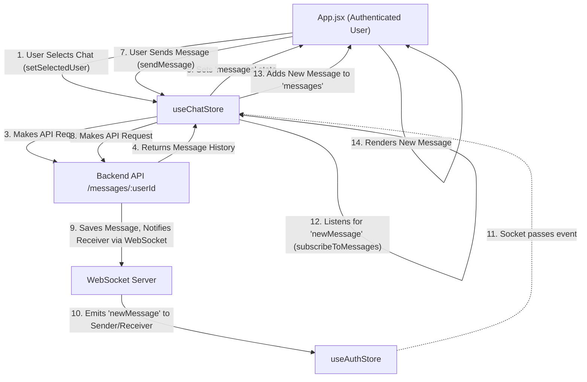

 # State Management and Stores

Effective state management is crucial for building responsive and maintainable frontend applications. In this project, global application state is handled using [Zustand](https://zustand-bear.github.io/zustand/), a small, fast, and scalable state-management solution based on simplified Flux principles. Zustand stores are leveraged to manage authentication status, user information, chat-related data, and application theme, ensuring a consistent and reactive user experience across different components.

This section delves into the design and implementation of the primary Zustand stores: `useAuthStore`, `useChatStore`, and `useThemeStore`, illustrating how they encapsulate specific domains of the application state and provide actions to modify that state.

## Core State Management with Zustand

Zustand offers a minimalistic API, allowing you to create stores as simple as `const useStore = create((set) => ({ count: 0 }))`. This simplicity translates into less boilerplate and more readable code, making it an excellent choice for managing complex application states efficiently.

### `useAuthStore` - Authentication and User Session

The `useAuthStore` manages all aspects related to user authentication, including user login status, user data, and the application's WebSocket connection for real-time features. It provides methods for checking authentication status, signing up, logging in, logging out, and updating user profiles.

**Key Responsibilities:**

*   **Authentication Status**: Tracks if a user is logged in (`authUser`).
*   **User Data**: Stores the authenticated user's details.
*   **Loading States**: Manages boolean flags like `isSigningUp`, `isLoggingIn`, `isCheckingAuth`, and `isUpdatingProfile` to provide feedback during asynchronous operations.
*   **Online Users**: Maintains a list of currently online users received via WebSocket.
*   **WebSocket Connection**: Establishes and manages the application's primary WebSocket connection, essential for real-time features.

**Core Actions:**

*   `checkAuth()`: Verifies the user's authentication status with the backend.
*   `signup(data)`: Handles new user registration.
*   `login(data)`: Manages user login.
*   `logout()`: Clears user session and disconnects the WebSocket.
*   `updateProfile(data)`: Updates the authenticated user's profile information.
*   `connectSocket()`: Initializes the WebSocket connection upon successful authentication.
*   `disconnectSocket()`: Closes the WebSocket connection.

Here's an excerpt from `useAuthStore.js` demonstrating the `checkAuth` action and socket connection logic:

```javascript
// frontend/src/store/useAuthStore.js
import { create } from "zustand";
import { axiosInstance } from "../lib/axios";
import toast from "react-hot-toast";
import { io } from "socket.io-client";

const BASE_URL = import.meta.env.MODE == "development" ? "http://localhost:5001": "/";

export const useAuthStore = create((set, get) => ({
    authUser: null,
    isSigningUp: false,
    isLoggingIn: false,
    isUpdatingProfile: false,
    isCheckingAuth: true,
    onlineUsers: [],
    socket: null,

    checkAuth: async () => {
        try {
            const res = await axiosInstance.get("/auth/check");
            set({ authUser: res.data });
            get().connectSocket(); // Connect socket on successful auth
        } catch (error) {
            set({ authUser: null });
            console.log("Error in checkAuth: ", error);
        } finally {
            set({ isCheckingAuth: false });
        }
    },

    connectSocket: () => {
        const { authUser } = get();
        if(!authUser || get().socket?.connected) return;

        const socket = io(BASE_URL, {
            query: {
                userId : authUser._id,
            },
        });
        socket.connect();
        set({socket: socket});

        socket.on("getOnlineUsers", (userIds) => {
            set({onlineUsers: userIds})
        });
    },

    disconnectSocket : () => {
        if(get().socket?.connected) get().socket.disconnect();
    }
}));
```
[View on GitHub](https://github.com/shinymack/Chat-App-MERN/blob/main/frontend/src/store/useAuthStore.js#L20-L76)

### `useChatStore` - Chat and Friend Management

The `useChatStore` is responsible for handling all chat-related data and interactions, including managing friend lists, pending requests, sent requests, and message retrieval/sending. It relies on `useAuthStore` to access the established WebSocket connection for real-time message updates.

**Key Responsibilities:**

*   **Messages**: Stores the messages for the currently selected chat.
*   **Users/Friends**: Manages the list of friends.
*   **Friend Requests**: Keeps track of pending and sent friend requests.
*   **Selected User**: Identifies the user currently being chatted with.
*   **Loading States**: Indicates loading status for user lists and messages.
*   **Real-time Messages**: Subscribes to and handles incoming real-time messages via WebSocket.

**Core Actions:**

*   `getFriends()`: Fetches the list of friends.
*   `getPendingRequests()`: Retrieves pending friend requests.
*   `getSentRequests()`: Fetches sent friend requests.
*   `sendFriendRequest(identifier)`: Sends a friend request.
*   `acceptFriendRequest(senderId)`: Accepts a pending friend request.
*   `rejectFriendRequest(senderId)`: Rejects a pending friend request.
*   `removeFriend(friendId)`: Removes a friend from the list.
*   `getMessages(userId)`: Fetches messages for a specific user.
*   `sendMessage(messageData)`: Sends a new message to the selected user.
*   `subscribeToMessages()`: Sets up a WebSocket listener for new messages.
*   `unsubscribeFromMessages()`: Removes the WebSocket listener.
*   `setSelectedUser(user)`: Sets the currently selected user for chat.

An example of `useChatStore` interacting with `useAuthStore` for WebSocket:

```javascript
// frontend/src/store/useChatStore.js
import toast from "react-hot-toast";
import { create } from "zustand";
import { axiosInstance } from "../lib/axios";
import { useAuthStore } from "./useAuthStore"; // Import useAuthStore

export const useChatStore = create((set, get) => ({
    // ... other state and actions ...

    subscribeToMessages: () => {
        const { selectedUser } = get();
        if(!selectedUser) return;

        // Access the socket instance directly from useAuthStore
        const socket = useAuthStore.getState().socket;
        if (!socket) {
            console.warn("Socket not available in AuthStore.");
            return;
        }

        socket.on("newMessage", (newMessage) => {
            if(newMessage.senderId !== selectedUser._id) return
            set({
                messages: [...get().messages, newMessage]
            })
        })
    },

    unsubscribeFromMessages: () => {
        const socket = useAuthStore.getState().socket;
        if (socket) {
            socket.off("newMessage");
        }
    },

    setSelectedUser: (selectedUser) => set({selectedUser})
}));
```
[View on GitHub](https://github.com/shinymack/Chat-App-MERN/blob/main/frontend/src/store/useChatStore.js#L125-L148)

### `useThemeStore` - Application Theme

The `useThemeStore` is a simple Zustand store dedicated to managing the application's UI theme (e.g., 'dark' or 'light'). It persists the selected theme in `localStorage` to remember user preferences across sessions.

**Key Responsibilities:**

*   **Theme Preference**: Stores the current theme setting.
*   **Persistence**: Saves and loads the theme from `localStorage`.

**Core Actions:**

*   `setTheme(theme)`: Updates the current theme and persists it.

```javascript
// frontend/src/store/useThemeStore.js
import { create } from "zustand";

export const useThemeStore = create((set) => ({
    theme: localStorage.getItem("chat-theme") || "dark", // Default to 'dark' if not found
    setTheme: (theme) => {
        localStorage.setItem("chat-theme", theme); // Persist theme
        set({theme});
    }
}))
```
[View on GitHub](https://github.com/shinymack/Chat-App-MERN/blob/main/frontend/src/store/useThemeStore.js)

## Application Entry Point (`App.jsx`) Integration

The `App.jsx` component, serving as the entry point of the React application, integrates with `useAuthStore` and `useThemeStore` to manage global application state. It checks the user's authentication status on mount, applies the current theme, and controls routing based on the authentication state.

**Key Integrations in `App.jsx`:**

*   **Initial Authentication Check**: `useEffect` hook triggers `checkAuth()` from `useAuthStore` to verify user session.
*   **Theme Application**: `data-theme` attribute on the root `div` is dynamically set using `useThemeStore`.
*   **Protected Routes**: Conditional rendering and `Navigate` components ensure that authenticated users access protected routes (`/`) while unauthenticated users are redirected to login/signup pages.
*   **Loading State**: Displays a loader (`Loader` component) while `isCheckingAuth` is true, preventing UI flicker during the initial authentication check.

Here's how `App.jsx` uses the stores:

```jsx
// frontend/src/App.jsx
import Navbar from './components/Navbar'
import { Routes, Route, Navigate } from 'react-router-dom'
import { useEffect } from 'react'
import HomePage from './pages/HomePage'
import SignUpPage from './pages/SignUpPage'
import LoginPage from './pages/LoginPage'
import SettingsPage from './pages/SettingsPage'
import ProfilePage from './pages/ProfilePage'

import { useThemeStore } from './store/useThemeStore'
import { useAuthStore } from './store/useAuthStore';
import { Loader } from 'lucide-react'
import { Toaster } from 'react-hot-toast'

const App = () => {
  const { authUser, checkAuth, isCheckingAuth, onlineUsers } = useAuthStore();
  const { theme } = useThemeStore();

  useEffect(() => {
    checkAuth(); // Initial check for authentication status
  }, [checkAuth]);

  if(isCheckingAuth && !authUser) return (
      <div className='flex items-center justify-center h-screen'>
        <Loader className='size-10 animate-spin' />
      </div>
  )

  return (
    <div className='' data-theme={theme}> {/* Apply theme from useThemeStore */}

      <Navbar />

      <Toaster />
      <Routes>
        <Route path='/' element={authUser ? <HomePage />: <Navigate to='/login' />} />
        <Route path='/signup' element={ !authUser ? <SignUpPage />: <Navigate to='/' />} />
        <Route path='/login' element={!authUser ? <LoginPage />: <Navigate to='/' />} />
        <Route path='/settings' element={<SettingsPage />} />
        <Route path='/profile' element={authUser ? <ProfilePage />: <Navigate to='/login' />} />
      </Routes>
    </div>
  )
}

export default App
```
[View on GitHub](https://github.com/shinymack/Chat-App-MERN/blob/main/frontend/src/App.jsx#L14-L47)

## State Flow Diagram

This diagram illustrates how the main application component (`App.jsx`) interacts with the `useAuthStore` and `useThemeStore` to initialize the application and manage global states.


```mermaid
graph TD
    A["App.jsx (Root Component)"]
    B["useAuthStore"]
    C["useThemeStore"]
    D["API Endpoints /auth/check"]
    E["WebSocket Server"]
    F["LocalStorage"]

    A -->|"1. On Mount: Calls checkAuth()"| B
    B -->|"2. Makes API Request"| D
    D -->|"3. Returns Auth User Data"| B
    B -->|"4. Sets authUser, isCheckingAuth=false"| A
    B -->|"5. Connects Socket (if authUser)"| E
    E -->|"6. Emits 'getOnlineUsers'"| B
    B -->|"7. Updates onlineUsers"| A

    A -->|"8. Reads 'theme' state"| C
    C -->|"9. Reads/Writes 'chat-theme'"| F
    A --.->|"10. Renders UI based on authUser & theme"| A

```


## Key Integration Points

The design of the Zustand stores facilitates clear separation of concerns while maintaining necessary inter-store communication.

1.  **Auth-dependent Routing**: `App.jsx` dynamically renders routes based on the `authUser` state from `useAuthStore`. This is a common pattern for authentication-protected applications, ensuring users are always directed to the appropriate section based on their login status.

2.  **AuthStore as Socket Provider**: The `useAuthStore` is solely responsible for establishing and maintaining the WebSocket connection. Other stores, like `useChatStore`, can then access this `socket` instance directly from `useAuthStore`'s state without needing to re-establish or manage their own connections. This centralizes WebSocket management and prevents redundant connections.

3.  **Real-time Updates**: `useAuthStore` listens for `getOnlineUsers` events from the WebSocket to update the `onlineUsers` list, which can be used throughout the application to show online status indicators. `useChatStore` subscribes to `newMessage` events, ensuring that chat conversations update in real-time.

4.  **Theme Persistence**: `useThemeStore` handles saving and loading the user's preferred theme to and from `localStorage`. This ensures that the application respects the user's choice across browser sessions, contributing to a better user experience.

5.  **State Initialization**: The `checkAuth` action in `useAuthStore` is critical. It runs once when the application loads, determining the initial authentication state and performing necessary side effects like connecting to the WebSocket server if a user is already authenticated. The `isCheckingAuth` state prevents premature rendering of private routes.

## Chat-Specific State Flow for Messaging

This diagram illustrates the flow of fetching and sending messages within the chat application, highlighting the interaction between `App.jsx`, `useAuthStore`, and `useChatStore`.





Next: [Page Views and Routing](./3.3_page-views-and-routing.mdx)