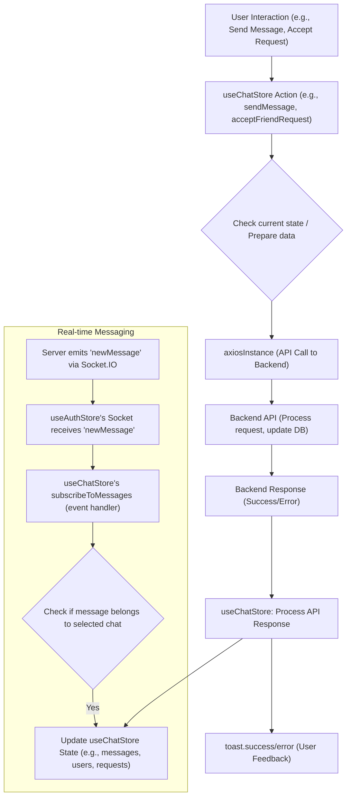

 # State Management and Utilities

This document provides an overview of how global state is managed and critical utility functions are implemented in the frontend of the application. The system leverages **Zustand** for lightweight and scalable state management, alongside custom utility functions and an Axios instance for streamlined API interactions. These components are foundational for user authentication, chat functionality, and overall application behavior.

## Core Utilities

The application utilizes a dedicated Axios instance for all API calls and a helper utility for common formatting tasks.

### Axios Instance

The `axios.js` file configures a pre-configured Axios instance, `axiosInstance`, which simplifies making authenticated HTTP requests to the backend. It automatically includes credentials (cookies) with each request and sets the base URL according to the environment (development or production).

```javascript
// frontend/src/lib/axios.js
import axios from "axios";

export const axiosInstance = axios.create({
    baseURL: import.meta.env.MODE == "development" ? "http://localhost:5001/api": "/api",
    withCredentials: true,
});
```

-   **`baseURL`**: Dynamically set to target the backend API, ensuring compatibility across development and production environments.
-   **`withCredentials: true`**: Crucial for sending and receiving HTTP cookies, which are used for session management and authentication.

This centralized configuration ensures that all API requests throughout the application consistently handle authentication and target the correct endpoint.

[View on GitHub](https://github.com/shinymack/Chat-App-MERN/blob/main/frontend/src/lib/axios.js)

### Utility Functions

The `utils.js` file contains general-purpose JavaScript functions that can be reused across different components. Currently, it includes a function for formatting message timestamps.

```javascript
// frontend/src/lib/utils.js
export function formatMessageTime(date) {
    return new Date(date).toLocaleTimeString("en-US", {
        year: "numeric",
        month: "short",
        day:"2-digit",
        hour: "2-digit",
        minute: "2-digit",
        hour12: true,
    });
}
```

-   **`formatMessageTime(date)`**: Takes a `Date` object or a date string and returns a formatted time string suitable for displaying message timestamps in the UI. This ensures a consistent and user-friendly display of message times.

[View on GitHub](https://github.com/shinymack/Chat-App-MERN/blob/main/frontend/src/lib/utils.js)

## Zustand Stores

Zustand is used for state management, providing a minimalistic and performant way to manage global application state. Two primary stores, `useAuthStore` and `useChatStore`, handle authentication and chat-related data, respectively.

### `useAuthStore`

The `useAuthStore` manages all authentication-related state, user profiles, and the WebSocket connection for real-time online status and messaging.

**State Variables:**

-   `authUser`: The currently authenticated user object.
-   `isSigningUp`, `isLoggingIn`, `isUpdatingProfile`, `isCheckingAuth`: Boolean flags to indicate the status of various asynchronous operations, used for UI feedback (e.g., loading spinners).
-   `onlineUsers`: An array of user IDs currently online, received via WebSocket.
-   `socket`: The Socket.IO client instance, used for real-time communication.

**Actions:**

-   **`checkAuth()`**: Verifies the user's authentication status with the backend. If authenticated, sets `authUser` and initiates a WebSocket connection.
-   **`signup(data)`**: Registers a new user. On success, sets `authUser` and connects the socket.
-   **`login(data)`**: Authenticates an existing user. On success, sets `authUser` and connects the socket.
-   **`logout()`**: Clears the `authUser` and disconnects the socket.
-   **`updateProfile(data)`**: Updates the `authUser`'s profile information.
-   **`connectSocket()`**: Establishes a WebSocket connection to the server, passing the `userId` as a query parameter. It also subscribes to the `"getOnlineUsers"` event to update the `onlineUsers` state.
-   **`disconnectSocket()`**: Closes the active WebSocket connection.

Here's an example of the `useAuthStore` creation and its core authentication check:

```javascript
// frontend/src/store/useAuthStore.js (excerpt)
import { create } from "zustand";
import { axiosInstance } from "../lib/axios";
import toast from "react-hot-toast";
import { io } from "socket.io-client";

const BASE_URL = import.meta.env.MODE == "development" ? "http://localhost:5001": "/";

export const useAuthStore = create((set, get) => ({
    authUser: null,
    isSigningUp: false,
    isLoggingIn: false,
    isUpdatingProfile: false,
    isCheckingAuth: true,
    onlineUsers: [],
    socket: null,

    checkAuth: async () => {
        try {
            const res = await axiosInstance.get("/auth/check");
            set({ authUser: res.data });
            get().connectSocket(); // Connect socket after successful auth
        } catch (error) {
            set({ authUser: null });
            console.log("Error in checkAuth: ", error);
        } finally {
            set({ isCheckingAuth: false });
        }
    },
    // ... other actions
}));
```

The `checkAuth` action is critical for initializing the user session and real-time features upon application load.

[View on GitHub](https://github.com/shinymack/Chat-App-MERN/blob/main/frontend/src/store/useAuthStore.js#L14-L26)

The `connectSocket` action demonstrates how the WebSocket connection is managed, including passing user identification for server-side socket management and subscribing to events:

```javascript
// frontend/src/store/useAuthStore.js (excerpt)
// ...
    connectSocket: () => {
        const { authUser } = get();
        if(!authUser || get().socket?.connected) return;

        const socket = io(BASE_URL, {
            query: {
                userId : authUser._id,
            },
        });
        socket.connect();
        set({socket: socket});

        socket.on("getOnlineUsers", (userIds) => {
            set({onlineUsers: userIds})
        }); 

    },

    disconnectSocket : () => {
        if(get().socket?.connected) get().socket.disconnect();
    }
// ...
```

[View on GitHub](https://github.com/shinymack/Chat-App-MERN/blob/main/frontend/src/store/useAuthStore.js#L104-L121)

### `useChatStore`

The `useChatStore` manages all chat-specific state, including messages, user lists, and friend requests. It interacts with `useAuthStore` to utilize the active WebSocket connection.

**State Variables:**

-   `messages`: Array of messages in the currently selected chat.
-   `users`: List of friends (or all users, depending on context).
-   `pendingRequests`: List of incoming friend requests.
-   `sentRequests`: List of outgoing friend requests.
-   `selectedUser`: The user currently selected for chatting.
-   `isUsersLoading`, `isMessagesLoading`: Flags for loading states.
-   `isFriendBoxOpen`: Boolean to control the visibility of the friend management UI.

**Actions:**

-   **`toggleFriendsBox()`**: Toggles the `isFriendBoxOpen` state.
-   **`getFriends()`**: Fetches the authenticated user's friends list.
-   **`getPendingRequests()`**: Fetches incoming friend requests.
-   **`getSentRequests()`**: Fetches outgoing friend requests.
-   **`sendFriendRequest(identifier)`**: Sends a friend request to another user.
-   **`acceptFriendRequest(senderId)`**: Accepts a pending friend request.
-   **`rejectFriendRequest(senderId)`**: Rejects a pending friend request.
-   **`removeFriend(friendId)`**: Removes an existing friend.
-   **`getMessages(userId)`**: Fetches chat messages for a specific user.
-   **`sendMessage(messageData)`**: Sends a new message to the `selectedUser`.
-   **`subscribeToMessages()`**: Subscribes to the `"newMessage"` WebSocket event via the `useAuthStore`'s socket, updating `messages` state in real-time.
-   **`unsubscribeFromMessages()`**: Unsubscribes from the `"newMessage"` event.
-   **`setSelectedUser(selectedUser)`**: Sets the `selectedUser` for the chat interface.

Here's an example of the `useChatStore` creation and message sending:

```javascript
// frontend/src/store/useChatStore.js (excerpt)
import toast from "react-hot-toast";
import { create } from "zustand";
import { axiosInstance } from "../lib/axios";
import { useAuthStore } from "./useAuthStore";


export const useChatStore = create((set, get) => ({
    messages:[],
    users: [],
    pendingRequests: [],
    sentRequests: [],
    selectedUser: null,
    isUsersLoading: false,
    isMessagesLoading: false,
    isFriendBoxOpen: false,

    toggleFriendsBox: () => set(state => ({ isFriendsBoxOpen: !state.isFriendsBoxOpen })),
    // ... other actions

    sendMessage: async (messageData) => {
        const {selectedUser, messages} = get();
        try {
            const res = await axiosInstance.post(`/messages/send/${selectedUser._id}`, messageData);
            set({messages : [...messages, res.data]});
        } catch (error){
            toast.error(error.response.data.message);
        }

    },
    // ... socket subscription
}));
```

The `sendMessage` action demonstrates how messages are sent via an API call and then immediately appended to the local state, providing an optimistic UI update.

[View on GitHub](https://github.com/shinymack/Chat-App-MERN/blob/main/frontend/src/store/useChatStore.js#L87-L99)

The real-time message subscription logic utilizes the socket managed by `useAuthStore`:

```javascript
// frontend/src/store/useChatStore.js (excerpt)
// ...
    subscribeToMessages: () => {
        const { selectedUser } = get();
        if(!selectedUser) return;
        
        const socket = useAuthStore.getState().socket; // Access socket from auth store
        socket.on("newMessage", (newMessage) => {
            if(newMessage.senderId !== selectedUser._id) return // Only add if from current chat
            set({
                messages: [...get().messages, newMessage]
            })
        })
    },

    unsubscribeFromMessages: () => {
        const socket = useAuthStore.getState().socket;
        socket.off("newMessage");
    },
    
    setSelectedUser: (selectedUser) => set({selectedUser})
// ...
```

This illustrates an important cross-store interaction, where `useChatStore` relies on the `socket` instance provided by `useAuthStore` to listen for new messages.

[View on GitHub](https://github.com/shinymack/Chat-App-MERN/blob/main/frontend/src/store/useChatStore.js#L102-L119)

## Key Integration Points

### Authentication and Socket Connection Flow

This diagram illustrates the typical flow for user authentication, from the client UI interaction to the backend API and the subsequent WebSocket connection establishment.


```mermaid
sequenceDiagram
    participant C as "Client UI"
    participant AS as "useAuthStore"
    participant AX as "axiosInstance"
    participant B as "Backend API"
    participant SIO as "Socket.IO Server"

    C->>+AS: "User Login/Signup Request"
    AS ->> AX: "Call POST /auth/login"
    AX->>+B: "HTTP Request"
    B ->>- AX: "Auth Response (User Data)"
    AX ->>- AS: "API Response"
    AS ->> AS: "set({authUser: data})"
    AS->>+SIO: "connectSocket() (with userId)"
    Note right of SIO: "Socket emits 'getOnlineUsers'"
    SIO ->> AS: "Online User IDs"
    AS ->> AS: "set({onlineUsers: IDs})"
    AS->>-C: "Login/Signup Success"
```


The `useAuthStore` orchestrates the entire process, from making the API call via `axiosInstance` to updating its internal state and managing the WebSocket connection with the `Socket.IO Server`. The `connectSocket` action is pivotal for enabling real-time features, such as displaying online users, immediately after a user authenticates.

### Chat and Friend Request Management Flow

This flowchart outlines the general interaction pattern for chat and friend request functionalities within the application, demonstrating how user actions translate into store actions, API calls, and state updates.





The `useChatStore` acts as the central hub for all chat and friend-related logic. It takes user input, constructs API requests using `axiosInstance`, handles responses, provides feedback via `react-hot-toast`, and updates its local state. For real-time messages, it subscribes to WebSocket events managed by `useAuthStore` to ensure messages appear instantly without needing page refreshes. This modular design keeps concerns separated while allowing necessary inter-store communication for a cohesive user experience.