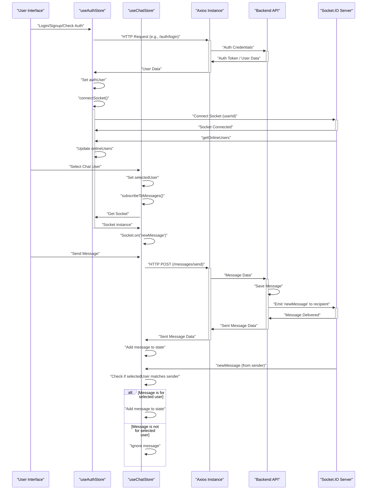

 # State Management and Utilities

This section provides a detailed overview of the frontend's state management strategy, primarily utilizing [Zustand](https://zustand-bear.github.io/zustand/) for global state. It also covers the core utility functions and the Axios instance used for API communication, highlighting how these components integrate to create a reactive and efficient user experience.

## Zustand State Management

Zustand is a small, fast, and scalable bear-bones state management solution. It's chosen for its simplicity, performance, and unopinionated nature, making it easy to integrate with React applications. The application leverages two main Zustand stores: `useAuthStore` for authentication and user-related state, and `useChatStore` for chat-specific data and friend management.

### Authentication and User State (`useAuthStore`)

The `useAuthStore` manages all aspects related to user authentication, authorization, and real-time online status. It integrates directly with the backend API via `axiosInstance` and handles WebSocket connections for real-time updates.

**Key Responsibilities:**

*   **Authentication Flow:** Handles user signup, login, and logout processes.
*   **User Profile:** Stores the authenticated user's data (`authUser`) and facilitates profile updates.
*   **Authentication Status:** Manages loading states for authentication actions (`isSigningUp`, `isLoggingIn`, `isCheckingAuth`).
*   **Online Users:** Tracks currently online users through WebSocket communication.
*   **Socket Management:** Initializes and manages the WebSocket connection (`socket`) for real-time features.

Here's a snippet demonstrating how the `useAuthStore` is created and its initial state:

```javascript
// frontend/src/store/useAuthStore.js
import { create } from "zustand";
import { axiosInstance } from "../lib/axios";
import toast from "react-hot-toast";
import { io } from "socket.io-client";

const BASE_URL = import.meta.env.MODE == "development" ? "http://localhost:5001": "/";

export const useAuthStore = create((set, get) => ({
    authUser: null,
    isSigningUp: false,
    isLoggingIn: false,
    isUpdatingProfile: false,
    isCheckingAuth: true,
    onlineUsers: [],
    socket: null,
    // ... actions
}));
```

[View on GitHub](https://github.com/shinymack/Chat-App-MERN/blob/main/frontend/src/store/useAuthStore.js#L1-L24)

The store includes several asynchronous actions to interact with the backend:

*   `checkAuth()`: Verifies the user's authentication status on application load.
*   `signup(data)`: Registers a new user.
*   `login(data)`: Authenticates an existing user.
*   `logout()`: Clears the user session.
*   `updateProfile(data)`: Updates the authenticated user's profile.

These actions utilize `axiosInstance` for API calls and `toast` for user feedback. Crucially, successful authentication (signup or login) and initial authentication check (`checkAuth`) trigger the `connectSocket()` action, which establishes a WebSocket connection:

```javascript
// frontend/src/store/useAuthStore.js
// ... inside useAuthStore create function
    connectSocket: () => {
        const { authUser } = get();
        if(!authUser || get().socket?.connected) return;

        const socket = io(BASE_URL, {
            query: {
                userId : authUser._id,
            },
        });
        socket.connect();
        set({socket: socket});

        socket.on("getOnlineUsers", (userIds) => {
            set({onlineUsers: userIds})
        }); 
    },

    disconnectSocket : () => {
        if(get().socket?.connected) get().socket.disconnect();
    }
// ...
```

[View on GitHub](https://github.com/shinymack/Chat-App-MERN/blob/main/frontend/src/store/useAuthStore.js#L111-L127)

This `connectSocket` function initializes a Socket.IO client, passing the authenticated user's ID as a query parameter. It then listens for the `getOnlineUsers` event to update the `onlineUsers` state, allowing the UI to display which friends are currently online.

### Chat and Friend Management (`useChatStore`)

The `useChatStore` manages all chat-specific data, including messages, user lists, friend requests, and the currently selected chat partner. It also orchestrates real-time message updates via WebSockets.

**Key Responsibilities:**

*   **Message Management:** Stores and updates chat messages for the selected conversation.
*   **User/Friend List:** Manages the list of friends and potential chat partners.
*   **Friend Requests:** Handles sending, accepting, and rejecting friend requests.
*   **Selected User:** Tracks the currently selected user for chat.
*   **Loading States:** Manages loading indicators for fetching users and messages.
*   **Real-time Messages:** Subscribes to and unsubscribes from WebSocket events for new messages.

```javascript
// frontend/src/store/useChatStore.js
import toast from "react-hot-toast";
import { create } from "zustand";
import { axiosInstance } from "../lib/axios";
import { useAuthStore } from "./useAuthStore";

export const useChatStore = create((set, get) => ({
    messages:[],
    users: [],
    pendingRequests: [],
    sentRequests: [],
    selectedUser: null,
    isUsersLoading: false,
    isMessagesLoading: false,
    isFriendBoxOpen: false,
    // ... actions
}));
```

[View on GitHub](https://github.com/shinymack/Chat-App-MERN/blob/main/frontend/src/store/useChatStore.js#L1-L20)

Actions within `useChatStore` include:

*   `getFriends()`: Fetches the list of user's friends.
*   `getPendingRequests()`: Retrieves incoming friend requests.
*   `getSentRequests()`: Retrieves outgoing friend requests.
*   `sendFriendRequest(identifier)`: Sends a friend request to another user.
*   `acceptFriendRequest(senderId)`: Accepts a pending friend request.
*   `rejectFriendRequest(senderId)`: Rejects a pending friend request.
*   `removeFriend(friendId)`: Removes an existing friend.
*   `getMessages(userId)`: Fetches chat messages for a specific user.
*   `sendMessage(messageData)`: Sends a new message to the selected user.
*   `setSelectedUser(user)`: Sets the current chat partner.

For real-time message updates, `useChatStore` directly interacts with the `socket` instance managed by `useAuthStore`:

```javascript
// frontend/src/store/useChatStore.js
// ... inside useChatStore create function
    subscribeToMessages: () => {
        const { selectedUser } = get();
        if(!selectedUser) return;
        
        const socket = useAuthStore.getState().socket; // Access socket from auth store
        socket.on("newMessage", (newMessage) => {
            if(newMessage.senderId !== selectedUser._id) return // Ensure message is for selected chat
            set({
                messages: [...get().messages, newMessage]
            })
        })
    },

    unsubscribeFromMessages: () => {
        const socket = useAuthStore.getState().socket;
        socket.off("newMessage"); // Clean up event listener
    },
// ...
```

[View on GitHub](https://github.com/shinymack/Chat-App-MERN/blob/main/frontend/src/store/useChatStore.js#L133-L149)

The `subscribeToMessages` function registers a listener for the `newMessage` event on the shared socket. This ensures that when a new message arrives, it's appended to the `messages` array, but only if it's from the currently `selectedUser`. The `unsubscribeFromMessages` function is crucial for preventing memory leaks and stale listeners when the component unmounts or the selected user changes.

### State Management Flow for Real-time Messaging

The integration of `useAuthStore` and `useChatStore` for real-time messaging is a critical aspect. The `socket` instance is centrally managed in `useAuthStore` and then shared for consumption by `useChatStore`.





### Key Integration Points

1.  **Shared `axiosInstance`**: Both `useAuthStore` and `useChatStore` rely on the globally configured `axiosInstance` for making HTTP requests to the backend API. This ensures consistent base URL, credential handling, and error interception.
2.  **Socket.IO Centralization**: The Socket.IO connection is initialized and managed by `useAuthStore` because it requires the authenticated `userId`. `useChatStore` then *accesses* this shared socket instance to subscribe to chat-specific events (`newMessage`), preventing multiple socket connections and simplifying management.
3.  **Cross-Store Communication**: While Zustand encourages atomicity, `useChatStore` explicitly retrieves the socket from `useAuthStore` using `useAuthStore.getState().socket`. This is a common pattern for accessing state or actions from another store without creating tight coupling or circular dependencies.

## Utility Functions (`frontend/src/lib/utils.js`)

The `utils.js` file houses general-purpose utility functions that enhance the user interface or perform common data transformations.

### `formatMessageTime`

This function is responsible for formatting timestamps into a user-friendly date and time string.

```javascript
// frontend/src/lib/utils.js
export function formatMessageTime(date) {
    return new Date(date).toLocaleTimeString("en-US", {
        year: "numeric",
        month: "short",
        day:"2-digit",
        hour: "2-digit",
        minute: "2-digit",
        hour12: true,
    });
}
```

[View on GitHub](https://github.com/shinymack/Chat-App-MERN/blob/main/frontend/src/lib/utils.js#L1-L10)

This utility is crucial for displaying message timestamps consistently and legibly across the chat interface, improving the overall user experience by providing clear chronological context to conversations.

## Axios Configuration (`frontend/src/lib/axios.js`)

The `axios.js` file defines a custom Axios instance (`axiosInstance`) used throughout the frontend for all API interactions. This central configuration ensures consistency and simplifies API requests.

```javascript
// frontend/src/lib/axios.js
import axios from "axios";

export const axiosInstance = axios.create({
    baseURL: import.meta.env.MODE == "development" ? "http://localhost:5001/api": "/api",
    withCredentials: true,
});
```

[View on GitHub](https://github.com/shinymack/Chat-App-MERN/blob/main/frontend/src/lib/axios.js#L1-L7)

**Key Configurations:**

*   **`baseURL`**: Dynamically sets the base URL for API requests. In development, it points to `http://localhost:5001/api`, while in production, it defaults to `/api` (assuming a proxy setup or co-location with the backend).
*   **`withCredentials: true`**: This option is critical for sending and receiving cookies (like the JWT token used for authentication) with cross-origin requests. Without this, the frontend would not be able to maintain authenticated sessions with the backend.

This `axiosInstance` is then imported and used by both `useAuthStore` and `useChatStore` for all their backend communication needs, abstracting away the underlying HTTP request details and ensuring proper credential handling.

## Conclusion

The state management and utility layer of the application is designed for clarity, efficiency, and scalability. By centralizing state with Zustand, configuring Axios for consistent API interactions, and providing essential utility functions, the frontend maintains a robust and maintainable architecture. The careful integration of `useAuthStore` and `useChatStore`, particularly around WebSocket management, ensures a seamless and real-time user experience for authentication and chat functionalities.