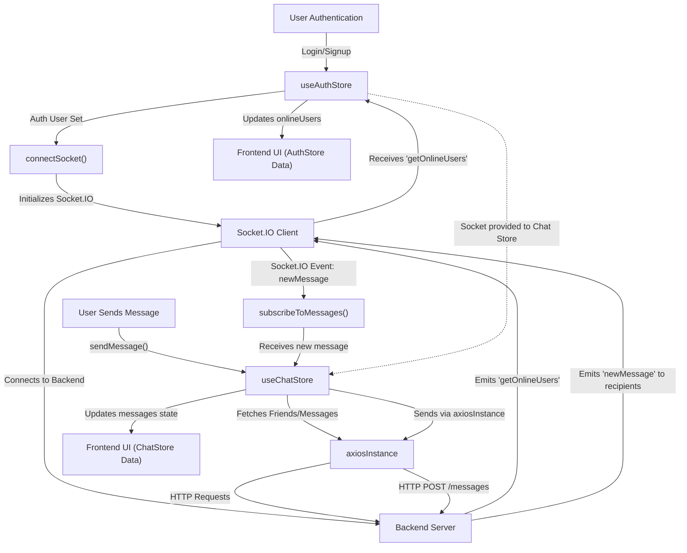

 # State Management and Utilities

This document details the frontend's approach to global state management using Zustand and outlines essential utility functions. It covers how authentication, user, and chat-related data are handled, alongside the configuration of the Axios HTTP client and a general utility library.

## Global State Management with Zustand

The application leverages [Zustand](https://zustand-bear.netlify.app/), a small, fast, and scalable bear-necessities state-management solution using React hooks, to manage global state. Two primary stores, `useAuthStore` and `useChatStore`, encapsulate distinct areas of the application's state.

### `useAuthStore`

The `useAuthStore` is responsible for managing authentication-related state, user information (`authUser`), online users (`onlineUsers`), and the Socket.IO client connection. It provides actions for authentication (signup, login, logout), profile updates, and socket connection management.

#### Key Responsibilities:

*   **User Authentication**: Handles `signup`, `login`, and `logout` operations by interacting with the backend API via Axios.
*   **User Profile**: Manages the `authUser` state, updating it upon successful authentication or profile modifications.
*   **Authentication Status**: Tracks `isSigningUp`, `isLoggingIn`, `isUpdatingProfile`, and `isCheckingAuth` flags for UI feedback.
*   **Socket.IO Integration**: Manages the lifecycle of the Socket.IO client (`socket`), connecting it when a user is authenticated and disconnecting upon logout. It also listens for `getOnlineUsers` events from the server.
*   **Online Users**: Maintains a list of `onlineUsers` received from the Socket.IO server.

#### `useAuthStore` Snippets:

Initial store setup and state variables:

```javascript
// frontend/src/store/useAuthStore.js
import { create } from "zustand";
import { axiosInstance } from "../lib/axios";
import toast from "react-hot-toast";
import { io } from "socket.io-client";

const BASE_URL = import.meta.env.MODE == "development" ? "http://localhost:5001": "/";

export const useAuthStore = create((set, get) => ({
    authUser: null,
    isSigningUp: false,
    isLoggingIn: false,
    isUpdatingProfile: false,
    isCheckingAuth: true,
    onlineUsers: [],
    socket: null,
    // ... actions
}));
```
[View on GitHub](https://github.com/shinymack/Chat-App-MERN/blob/main/frontend/src/store/useAuthStore.js#L1-L20)

Connecting the Socket.IO client:

```javascript
// frontend/src/store/useAuthStore.js
// ... inside useAuthStore
    connectSocket: () => {
        const { authUser } = get();
        if(!authUser || get().socket?.connected) return;

        const socket = io(BASE_URL, {
            query: {
                userId : authUser._id,
            },
        });
        socket.connect();
        set({socket: socket});

        socket.on("getOnlineUsers", (userIds) => {
            set({onlineUsers: userIds})
        }); 
    },

    disconnectSocket : () => {
        if(get().socket?.connected) get().socket.disconnect();
    }
// ...
```
[View on GitHub](https://github.com/shinymack/Chat-App-MERN/blob/main/frontend/src/store/useAuthStore.js#L104-L121)

### `useChatStore`

The `useChatStore` manages all state related to messaging, friends, and friend requests. It includes actions for fetching messages, sending messages, and managing friend relationships.

#### Key Responsibilities:

*   **Messages**: Stores `messages` for the currently selected chat and provides actions to `getMessages` and `sendMessage`.
*   **Users/Friends**: Manages the `users` (friends list), `pendingRequests`, and `sentRequests` arrays.
*   **Friend Management**: Offers actions like `sendFriendRequest`, `acceptFriendRequest`, `rejectFriendRequest`, and `removeFriend`.
*   **Selected User**: Keeps track of the `selectedUser` for the current chat session.
*   **Loading States**: Provides `isUsersLoading` and `isMessagesLoading` flags for asynchronous operations.
*   **Friends Box Visibility**: Controls `isFriendBoxOpen` for UI toggle.
*   **Real-time Messages**: Subscribes to and unsubscribes from `newMessage` Socket.IO events, using the socket from `useAuthStore`.

#### `useChatStore` Snippets:

Initial store setup and state variables:

```javascript
// frontend/src/store/useChatStore.js
import toast from "react-hot-toast";
import { create } from "zustand";
import { axiosInstance } from "../lib/axios";
import { useAuthStore } from "./useAuthStore";


export const useChatStore = create((set, get) => ({
    messages:[],
    users: [],
    pendingRequests: [],
    sentRequests: [],
    selectedUser: null,
    isUsersLoading: false,
    isMessagesLoading: false,

    isFriendBoxOpen: false,

    toggleFriendsBox: () => set(state => ({ isFriendsBoxOpen: !state.isFriendBoxOpen })),
    // ... actions
}));
```
[View on GitHub](https://github.com/shinymack/Chat-App-MERN/blob/main/frontend/src/store/useChatStore.js#L1-L22)

Subscribing to real-time messages using the `useAuthStore` socket:

```javascript
// frontend/src/store/useChatStore.js
// ... inside useChatStore
    subscribeToMessages: () => {
        const { selectedUser } = get();
        if(!selectedUser) return;
        
        const socket = useAuthStore.getState().socket; // Accessing socket from auth store
        socket.on("newMessage", (newMessage) => {
            if(newMessage.senderId !== selectedUser._id) return
            set({
                messages: [...get().messages, newMessage]
            })
        })
    },

    unsubscribeFromMessages: () => {
        const socket = useAuthStore.getState().socket;
        socket.off("newMessage");
    },
// ...
```
[View on GitHub](https://github.com/shinymack/Chat-App-MERN/blob/main/frontend/src/store/useChatStore.js#L155-L169)

### State Management and Real-time Communication Flow

The following diagram illustrates the interaction between the authentication and chat stores, especially concerning real-time communication:





## Utility Functions

Beyond state management, the application includes a set of general utility functions to assist with common tasks like date formatting or HTTP request configuration.

### Axios Instance (`axiosInstance`)

The `axiosInstance` is a pre-configured Axios client, ensuring consistent HTTP request behavior across the application. It automatically includes credentials (cookies) with each request and sets the appropriate base URL based on the environment (development or production).

#### Configuration Details:

*   **Base URL**: Dynamically set to `http://localhost:5001/api` for development or `/api` for production.
*   **`withCredentials`**: Set to `true` to ensure that cookies are sent with cross-origin requests, which is crucial for authentication.

#### `axios.js` Snippet:

```javascript
// frontend/src/lib/axios.js
import axios from "axios";

export const axiosInstance = axios.create({
    baseURL: import.meta.env.MODE == "development" ? "http://localhost:5001/api": "/api",
    withCredentials: true,
});
```
[View on GitHub](https://github.com/shinymack/Chat-App-MERN/blob/main/frontend/src/lib/axios.js#L1-L6)

### General Utilities (`utils.js`)

The `utils.js` file contains various helper functions that can be used across different components. Currently, it includes a function for formatting message timestamps.

#### `formatMessageTime`

This function takes a date string or object and formats it into a human-readable time and date string, including year, month, day, hour, and minute with AM/PM indication.

#### `utils.js` Snippet:

```javascript
// frontend/src/lib/utils.js
export function formatMessageTime(date) {
    return new Date(date).toLocaleTimeString("en-US", {
        year: "numeric",
        month: "short",
        day:"2-digit",
        hour: "2-digit",
        minute: "2-digit",
        hour12: true,
    });
}
```
[View on GitHub](https://github.com/shinymack/Chat-App-MERN/blob/main/frontend/src/lib/utils.js#L1-L10)

## Key Integration Points

*   **Authentication Flow**: Upon successful `login` or `signup` in `useAuthStore`, the `connectSocket` action is immediately invoked. This ensures that the user is connected to the real-time server as soon as they are authenticated, enabling features like online status and instant messaging.
*   **Inter-Store Communication**: `useChatStore` accesses the `socket` instance directly from `useAuthStore` using `useAuthStore.getState().socket` for subscribing to `newMessage` events. This demonstrates how Zustand allows for seamless cross-store access without prop drilling or complex context providers.
*   **Consistent API Calls**: Both `useAuthStore` and `useChatStore` rely on the `axiosInstance` for all their backend API interactions, ensuring that `withCredentials` and the correct `baseURL` are always used.
*   **Real-time Messaging**: The `sendMessage` action in `useChatStore` sends messages via HTTP, while incoming messages are handled via Socket.IO through the `subscribeToMessages` function, which updates the `messages` state in real-time. This dual approach ensures reliable message delivery and immediate UI updates.