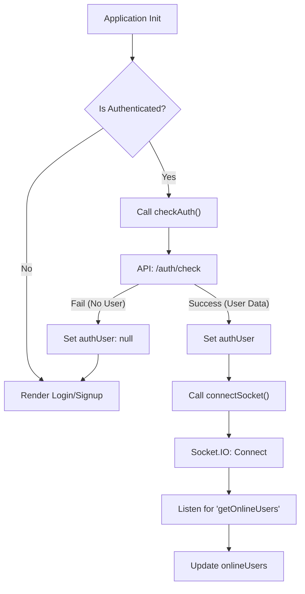
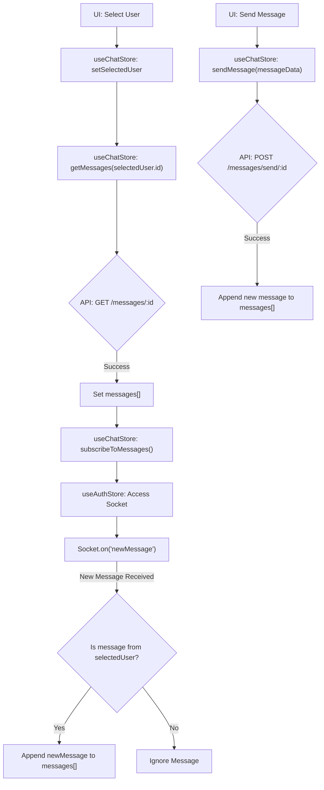

 # State Management and Utilities

This document outlines the core mechanisms for managing application state and common utility functions within the frontend. The application leverages [Zustand](https://zustand-bear.pm/docs/introduction) for reactive state management, providing a minimalistic and performant approach. For API interactions, a custom Axios instance ensures consistent request handling.

## API Request Handling

The `axios.js` file centralizes the configuration for `axios`, creating a reusable instance for all API calls. This ensures that requests are consistently made to the correct base URL and include credentials, which is crucial for authenticated sessions.

```javascript
// frontend/src/lib/axios.js
import axios from "axios";

export const axiosInstance = axios.create({
    baseURL: import.meta.env.MODE == "development" ? "http://localhost:5001/api": "/api",
    withCredentials: true,
});
```

This `axiosInstance` is then imported and used across various store actions to interact with the backend API. The `baseURL` dynamically adjusts based on the environment (`development` or `production`), and `withCredentials: true` ensures that cookies (like session tokens) are sent with each request, maintaining user authentication.

[View on GitHub](https://github.com/shinymack/Chat-App-MERN/blob/main/frontend/src/lib/axios.js)

## Utility Functions

The `utils.js` file provides a collection of helper functions that perform common, reusable tasks throughout the application. These functions are designed to encapsulate specific logic, promoting code readability and maintainability.

A primary example is `formatMessageTime`, which standardizes the display of message timestamps.

```javascript
// frontend/src/lib/utils.js
export function formatMessageTime(date) {
    return new Date(date).toLocaleTimeString("en-US", {
        year: "numeric",
        month: "short",
        day:"2-digit",
        hour: "2-digit",
        minute: "2-digit",
        hour12: true,
    });
}
```

This function takes a date string or object and returns a human-readable formatted time string, ensuring consistency in how timestamps are presented to the user across the application.

[View on GitHub](https://github.com/shinymack/Chat-App-MERN/blob/main/frontend/src/lib/utils.js)

## Authentication State Management (`useAuthStore`)

The `useAuthStore` is a Zustand store responsible for managing all authentication-related state and actions. This includes user data, authentication status, and integration with a WebSocket for real-time online user tracking.

Key responsibilities:

*   **User Authentication**: Handles `signup`, `login`, `logout`, and `checkAuth` operations.
*   **User Profile**: Manages `updateProfile` functionality.
*   **Loading States**: Tracks various loading states (`isSigningUp`, `isLoggingIn`, `isCheckingAuth`, `isUpdatingProfile`).
*   **Socket Connection**: Establishes and manages the WebSocket connection for the authenticated user, tracking `onlineUsers`.

Here's a snippet demonstrating the `checkAuth` process, which runs on application load to verify user session:

```javascript
// frontend/src/store/useAuthStore.js
// ... other imports
export const useAuthStore = create((set, get) => ({
    authUser: null,
    // ... other state variables
    isCheckingAuth: true,
    onlineUsers: [],
    socket: null,

    checkAuth: async () => {
        try {
            const res = await axiosInstance.get("/auth/check");
            set({ authUser: res.data });
            get().connectSocket(); // Connect socket if authenticated
        } catch (error) {
            set({ authUser: null });
            console.log("Error in checkAuth: ", error);
        } finally {
            set({ isCheckingAuth: false });
        }
    },
    // ... other actions
}));
```

The `checkAuth` action makes a request to the backend. If successful, it sets the `authUser` and then calls `connectSocket` to establish a real-time connection.

### Socket Connection Management

The store also manages the WebSocket connection for real-time features like online user presence.

```javascript
// frontend/src/store/useAuthStore.js
// ... other state and actions
    connectSocket: () => {
        const { authUser } = get();
        if(!authUser || get().socket?.connected) return;

        const socket = io(BASE_URL, {
            query: {
                userId : authUser._id,
            },
        });
        socket.connect();
        set({socket: socket});

        socket.on("getOnlineUsers", (userIds) => {
            set({onlineUsers: userIds})
        }); 
    },

    disconnectSocket : () => {
        if(get().socket?.connected) get().socket.disconnect();
    }
```

The `connectSocket` function initializes a Socket.IO client, passing the `authUser._id` as a query parameter to identify the user. It then listens for the `"getOnlineUsers"` event to update the list of online users. `disconnectSocket` ensures proper cleanup when a user logs out.

[View on GitHub](https://github.com/shinymack/Chat-App-MERN/blob/main/frontend/src/store/useAuthStore.js)

### Authentication and Socket Flow





## Chat State Management (`useChatStore`)

The `useChatStore` is another Zustand store dedicated to managing all chat-related data and functionalities. This includes messages, user lists, friend requests, and interaction with the WebSocket for real-time message updates.

Key responsibilities:

*   **Chat Messages**: Manages `messages` for the selected conversation.
*   **User & Friends**: Stores `users` (friends list), `pendingRequests`, and `sentRequests`.
*   **Selected User**: Tracks `selectedUser` for the active chat.
*   **Loading States**: Manages `isUsersLoading` and `isMessagesLoading`.
*   **Friend Management**: Handles sending, accepting, rejecting, and removing friend requests.
*   **Real-time Messaging**: Subscribes to and unsubscribes from new message events via WebSocket.

A core functionality is fetching messages for a selected user:

```javascript
// frontend/src/store/useChatStore.js
// ... other imports
export const useChatStore = create((set, get) => ({
    messages:[],
    // ... other state
    isMessagesLoading: false,

    getMessages: async (userId) => {
        set({isMessagesLoading: true});
        try {
            const res = await axiosInstance.get(`/messages/${userId}`);
            set({messages: res.data});
        } catch (error) {
            toast.error(error.response.data.message);
        } finally {
            set({isMessagesLoading: false});
        }
    },
    // ... other actions
}));
```

This action fetches all messages exchanged with a specific `userId` from the backend and updates the `messages` state.

### Sending Messages

After fetching, users can send new messages, which are then appended to the local state and sent to the server.

```javascript
// frontend/src/store/useChatStore.js
// ...
    sendMessage: async (messageData) => {
        const {selectedUser, messages} = get();
        try {
            const res = await axiosInstance.post(`/messages/send/${selectedUser._id}`, messageData);
            set({messages : [...messages, res.data]});
        } catch (error){
            toast.error(error.response.data.message);
        }
    },
```

The `sendMessage` action optimistically adds the new message to the local `messages` array before receiving a response from the server, improving perceived performance.

### Real-time Message Subscription

For receiving new messages in real-time, `useChatStore` interacts with the socket instance managed by `useAuthStore`.

```javascript
// frontend/src/store/useChatStore.js
// ...
    subscribeToMessages: () => {
        const { selectedUser } = get();
        if(!selectedUser) return;
        
        const socket = useAuthStore.getState().socket; // Access socket from auth store
        socket.on("newMessage", (newMessage) => {
            if(newMessage.senderId !== selectedUser._id) return // Only add if from selected user
            set({
                messages: [...get().messages, newMessage]
            })
        })
    },

    unsubscribeFromMessages: () => {
        const socket = useAuthStore.getState().socket;
        socket.off("newMessage");
    },
// ...
```

The `subscribeToMessages` function accesses the `socket` instance directly from `useAuthStore` using `useAuthStore.getState().socket`. This demonstrates inter-store communication in Zustand. It then sets up an event listener for `"newMessage"` events, appending new messages to the `messages` state if they are from the currently `selectedUser`. `unsubscribeFromMessages` is crucial for preventing memory leaks and duplicate listeners.

[View on GitHub](https://github.com/shinymack/Chat-App-MERN/blob/main/frontend/src/store/useChatStore.js)

### Chat Message Flow





## Key Integration Points

*   **Centralized Axios**: The `axiosInstance` from `frontend/src/lib/axios.js` is the single point of truth for all HTTP API requests, ensuring consistent headers and base URLs across both `useAuthStore` and `useChatStore`.
*   **Inter-Store Communication (Zustand)**: `useChatStore` accesses the `socket` instance managed by `useAuthStore` directly using `useAuthStore.getState().socket`. This pattern allows stores to share complex objects or state without directly depending on component re-renders or prop drilling, facilitating robust real-time feature integration.
*   **Dynamic Base URL**: Environment-specific configuration for API endpoints is handled in `axios.js`, ensuring smooth transitions between development and production environments.
*   **Real-time Synchronization**: The integration of Socket.IO via `useAuthStore` and its subsequent use in `useChatStore` (for `newMessage` events) provides a seamless real-time chat experience, updating online user lists and message feeds instantly.
*   **Toast Notifications**: Both stores utilize `react-hot-toast` to provide immediate user feedback for authentication actions, friend requests, and message sending, improving the overall user experience.