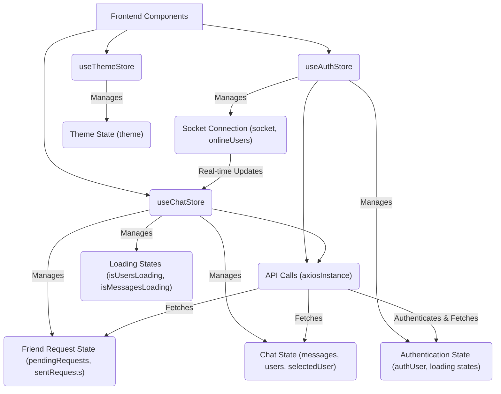

# State Management

This document outlines how application state is managed within the frontend of the Chat App MERN project. We leverage the `zustand` library for efficient and organized state management, providing a centralized approach to handling authentication, chat-related data, and theme preferences.

## Core State Stores

The application utilizes three primary `zustand` stores to manage different aspects of its state:

### `useAuthStore`

This store is responsible for managing all authentication-related state, including user information, loading states for authentication operations, and real-time socket connections.

*   **`authUser`**: Stores the currently logged-in user's data. If no user is logged in, it's `null`.
*   **`isSigningUp`**, **`isLoggingIn`**, **`isUpdatingProfile`**: Boolean flags to indicate the status of respective authentication operations, useful for displaying loading indicators.
*   **`isCheckingAuth`**: A flag to manage the initial authentication check when the application loads.
*   **`onlineUsers`**: An array storing the IDs of currently online users.
*   **`socket`**: Holds the active socket.IO client instance for real-time communication.

Key methods within `useAuthStore` include:

*   **`checkAuth()`**: Verifies the user's authentication status with the backend.
*   **`signup(data)`**: Handles the user registration process.
*   **`logout()`**: Logs the user out and cleans up resources.
*   **`login(data)`**: Handles the user login process.
*   **`updateProfile(data)`**: Allows users to update their profile information.
*   **`connectSocket()`**: Establishes a WebSocket connection to the server and sets up event listeners for online users.
*   **`disconnectSocket()`**: Closes the WebSocket connection.

```javascript
import { create } from "zustand";
import { axiosInstance } from "../lib/axios";
import toast from "react-hot-toast";
import { io } from "socket.io-client";

const BASE_URL = import.meta.env.MODE == "development" ? "http://localhost:5001": "/";

export const useAuthStore = create((set, get) => ({
    authUser: null,
    isSigningUp: false,
    isLoggingIn: false,
    isUpdatingProfile: false,
    isCheckingAuth: true,
    onlineUsers: [],
    socket: null,

    checkAuth: async () => {
        try {
            const res = await axiosInstance.get("/auth/check");
            set({ authUser: res.data });
            get().connectSocket();
        } catch (error) {
            set({ authUser: null });
            console.log("Error in checkAuth: ", error);
        } finally {
            set({ isCheckingAuth: false });
        }
    },
    // ... other methods
    connectSocket: () => {
        const { authUser } = get();
        if(!authUser || get().socket?.connected) return;

        const socket = io(BASE_URL, {
            query: {
                userId : authUser._id,
            },
        });
        socket.connect();
        set({socket: socket});

        socket.on("getOnlineUsers", (userIds) => {
            set({onlineUsers: userIds})
        });
    },
    disconnectSocket : () => {
        if(get().socket?.connected) get().socket.disconnect();
    }
}));
```

### `useChatStore`

This store manages the state related to the chat functionality, including conversations, friend lists, and pending requests.

*   **`messages`**: An array holding the messages for the currently selected conversation.
*   **`users`**: A list of the current user's friends.
*   **`pendingRequests`**: An array of incoming friend requests.
*   **`sentRequests`**: An array of outgoing friend requests.
*   **`selectedUser`**: The user object of the currently active conversation.
*   **`isUsersLoading`**, **`isMessagesLoading`**: Flags to indicate loading states for fetching users and messages.
*   **`isFriendsBoxOpen`**: A boolean to control the visibility of the friends list box.

Key methods include:

*   **`getFriends()`**: Fetches the list of the user's friends.
*   **`getPendingRequests()`**: Fetches incoming friend requests.
*   **`getSentRequests()`**: Fetches outgoing friend requests.
*   **`sendFriendRequest(identifier)`**: Sends a friend request.
*   **`acceptFriendRequest(senderId)`**: Accepts an incoming friend request.
*   **`rejectFriendRequest(senderId)`**: Rejects an incoming friend request.
*   **`removeFriend(friendId)`**: Removes a friend from the list.
*   **`getMessages(userId)`**: Fetches messages for a specific conversation.
*   **`sendMessage(messageData)`**: Sends a new message.
*   **`subscribeToMessages()`**: Sets up a socket listener for new incoming messages in the current conversation.
*   **`unsubscribeFromMessages()`**: Removes the socket listener for messages.
*   **`setSelectedUser(selectedUser)`**: Updates the currently selected user for conversation.

```javascript
import toast from "react-hot-toast";
import { create } from "zustand";
import { axiosInstance } from "../lib/axios";
import { useAuthStore } from "./useAuthStore";

export const useChatStore = create((set, get) => ({
    messages:[],
    users: [],
    pendingRequests: [],
    sentRequests: [],
    selectedUser: null,
    isUsersLoading: false,
    isMessagesLoading: false,
    isFriendsBoxOpen: false,

    toggleFriendsBox: () => set(state => ({ isFriendsBoxOpen: !state.isFriendsBoxOpen })),

    getFriends: async () => {
        set({isUsersLoading: true});
        try {
            const res = await axiosInstance.get("/friends/list");
            set({ users: res.data});
        } catch (error) {
            toast.error(error.response?.data?.message || "Failed to fetch friends");
        } finally {
            set({ isUsersLoading: false});
        }
    },
    // ... other methods
    subscribeToMessages: () => {
        const { selectedUser } = get();
        if(!selectedUser) return;
        
        const socket = useAuthStore.getState().socket;
        socket.on("newMessage", (newMessage) => {
            if(newMessage.senderId !== selectedUser._id) return
            set({
                messages: [...get().messages, newMessage]
            })
        })
    },
    unsubscribeFromMessages: () => {
        const socket = useAuthStore.getState().socket;
        socket.off("newMessage");
    },
    setSelectedUser: (selectedUser) => set({selectedUser})
}))
```

### `useThemeStore`

This store handles the application's theming preferences.

*   **`theme`**: Stores the current theme, defaulting to "dark" or the value from `localStorage`.
*   **`setTheme(theme)`**: Updates the current theme and persists it to `localStorage`.

```javascript
import { create } from "zustand";

export const useThemeStore = create((set) => ({
    theme: localStorage.getItem("chat-theme") || "dark",
    setTheme: (theme) => {
        localStorage.setItem("chat-theme", theme);
        set({theme});
    }
}))
```

## State Flow and Interactions

The state management in this application follows a clear pattern:

1.  **Initialization**: Upon application load, `useAuthStore.checkAuth()` is called to verify the user's session.
2.  **Authentication Actions**: User interactions like signup, login, and logout trigger corresponding methods in `useAuthStore`. These methods update `authUser` and manage loading states.
3.  **Chat Operations**: When a user selects a conversation, `useChatStore.getMessages()` is called. Sending messages updates the `messages` array. Friend management actions also trigger data refetches.
4.  **Real-time Updates**: Socket.IO, managed by `useAuthStore`, plays a crucial role. `subscribeToMessages()` in `useChatStore` sets up listeners that directly update the `messages` state when new messages arrive. The `onlineUsers` state is also updated via socket events.
5.  **Theme Management**: `useThemeStore` allows for easy switching and persistence of the application's visual theme.

### State Management Architecture





## Key Takeaways

*   **Zustand for Simplicity**: `zustand` provides a hook-based, lightweight solution for global state management, making it easy to access and update state from anywhere in the application.
*   **Separation of Concerns**: Distinct stores for authentication, chat, and theme ensure a clean and maintainable codebase.
*   **Real-time Integration**: Socket.IO is seamlessly integrated through `useAuthStore` to enable real-time messaging and presence updates, which then trigger updates in `useChatStore`.
*   **API Interaction**: All data fetching and manipulation involving the backend are handled through `axiosInstance` within the respective store methods.
*   **Loading and Error Handling**: Loading states and error notifications (via `react-hot-toast`) are managed within the stores to provide user feedback during asynchronous operations.